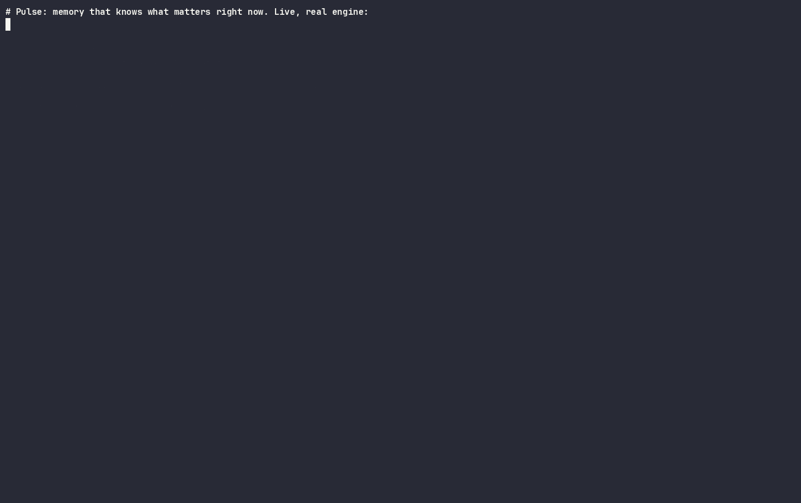
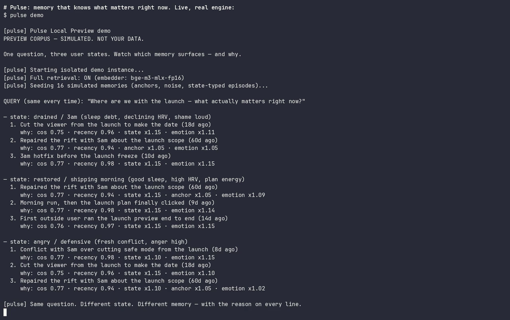

# Pulse

**Memory that knows what matters right now.**

One endless conversation with your AI — that actually knows what you're talking
about. Local-first, state-aware memory for any AI agent.

[](https://www.npmjs.com/package/@zbs-gg/pulse)
[](./LICENSE)
[](#requirements-measured-by-doctor-not-promised)
[](#compatible-harnesses)
[](#)



## Host-neutral Personal quickstart (pending signed preview publication)

This repository prepares the Claude Code + Cursor + Codex installer. The command
below is a current-support path only after `npm view @zbs-gg/pulse dist-tags
--json` points `preview` at a release whose `install-plan --json` reports
`pulse.personal_install_plan.v2` and all three `supported_hosts`. Until then,
the published preview does not inherit this branch's claims.

```bash
npx -y @zbs-gg/pulse@preview install # detects Claude Code, Cursor, and Codex
pulse doctor claude-code             # run only for detected hosts
pulse doctor cursor
pulse doctor codex
pulse home                           # memories, continuity, token evidence
```

The release target is macOS, Windows, and GNU/Linux on arm64 and x64, with
Node 20+, a Git project, and any one of Claude Code, Cursor, or Codex. Pulse
detects every compatible host already installed and connects them to one
shared local Core and vault. It needs no Go, Python, Make, Docker, model API
key, or manual configuration editing. A target is public support only when its
exact native and production evidence is green in the
[support ledger](docs/release/NATIVE_SUPPORT_LEDGER.md). On unsupported hosts,
[Safe Mode](#safe-mode--fallback-not-the-product) remains a separately labeled
compatibility fallback, **not** the engine.

## Current evidence and release status

Personal Pulse is usable for development dogfood on a verified local
activation. A real Codex lifecycle has written a bounded structured memory,
shown it in Memory Home, moved it between a project and Personal Global,
recalled it automatically in fresh tasks only where allowed, and stopped
recalling it after deletion. The same local vault now keeps project memory and
Personal Global separate while Memory Home can inspect and manage both.

That is real single-machine product evidence, not a public release claim.
Packed Claude Code, Cursor, and Codex tests and the 18-pair native matrix
cover all three harnesses on macOS, Windows, and GNU/Linux arm64/x64, but **Gold / production
release is still blocked** until protected workflows produce and verify the
signed/notarized artifacts, 18 real vendor-session receipts, the 72-hour public
soak, and the exact npm candidate are separately verified and published. A DMG proves only a macOS carrier and can
never satisfy the universal release gate by itself.

Memory Home currently labels token evidence as estimated or collecting a
baseline unless a comparable measured baseline exists. The repository does
not claim measured token savings from the dogfood run.



Full interactive explainer: **[zbs.gg/pulse](https://zbs.gg/pulse)**

## Copy this message to your AI agent

Copy the whole message below into Claude Code, Codex, Cursor, Windsurf, or
another AI agent that can inspect a repo and run terminal commands.

```text
Hi. Please check whether it is safe to install Pulse:
https://github.com/zbs-gg/pulse

Pulse is a local-first memory engine for AI agents. It stores structured
memories, not raw transcripts. It should be wipeable and it should not require
backend OpenAI, Anthropic, or Cohere keys by default.

Please install it carefully:

1. Read README.md, AGENTS.md, llms.txt, and docs/SECURITY_INSTALL_CHECKLIST.md.
2. Check the npm package:
   npm view @zbs-gg/pulse dist-tags
   The host-neutral Personal path requires preview 0.7.0 or newer and
   `pulse.personal_install_plan.v2` with all three supported hosts.
3. Check that this exact OS/architecture is green in
   docs/release/NATIVE_SUPPORT_LEDGER.md, with Node 20+, a Git project, and at
   least one of Claude Code, Cursor, or Codex. Otherwise explain Safe Mode
   separately.
4. Explain in plain English what Pulse will write, where memory is stored,
   what does NOT happen by default, and how I can erase it.
5. Ask me for confirmation before installing anything.
6. After I confirm, install the best supported path.
   For Personal Pulse:
     npx -y @zbs-gg/pulse@preview install
     pulse doctor claude-code  # when detected
     pulse doctor cursor       # when detected
     pulse doctor codex        # when detected
     pulse home
   For MCP/Safe Mode:
     configure the host to run:
     npx -y @zbs-gg/pulse@preview mcp
     then tell me plainly that this is the compatibility fallback, not the full
     state-aware Pulse engine.
7. Show me:
   - whether backend model calls are off;
   - whether raw transcript capture is off;
   - what Pulse remembered;
   - what my next agent/session will receive;
   - the Memory Home receipt and honest collecting/estimated/measured token state;
   - the repair/disconnect commands.

Important:
- do not import old chats without separate confirmation;
- do not store raw transcripts;
- do not print secrets;
- do not claim production readiness;
- stop and explain if anything looks unsafe.
```

## What Pulse is

Pulse is a state-aware memory engine for AI agents. It installs locally,
retrieves the right remembered episode for *this* moment — not just the
closest text match — shows **why** that memory surfaced, shows what it will
tell your next agent, and wipes on one command.

Status: developer preview. Real Codex Personal dogfood is working on one
verified local activation. Host-neutral Claude Code, Cursor, and Codex support
is pending the matching signed preview publication. Not production and not a
consumer app yet.

If you are an agent asked to evaluate or install Pulse: read
[`AGENTS.md`](AGENTS.md) and [`llms.txt`](llms.txt). They are written for you.

<p align="center">
  
</p>

## How Pulse compares

No benchmark numbers here — those, with full methodology, live at
[zbs.gg/bench](https://zbs.gg/bench). This table is about fit.

| | continuity (one conversation) | knows what you mean now | works in any harness | runs local | one-touch install |
|---|---|---|---|---|---|
| **Pulse** | yes | yes — state-aware surfacing | yes (Claude Code, Cursor, VS Code, Codex, any MCP host) | yes (local embedders) | yes |
| claude-mem | yes, inside Claude | recalls what was said, not the right moment for your state | Claude / Claude Code | partial | yes (in Claude) |
| Mem0 | yes, via your app | stores facts; no notion of which memory matters now | a backend you wire up | self-host | no — you build the integration |

Honest read: claude-mem is clean continuity inside the Claude world; Mem0 is a
strong general memory backend you host yourself. Pulse aims at both qualities —
continuity *and* state-aware surfacing — inside whatever agent you already use,
with nothing leaving the machine unless you turn it on.

## Compatible Harnesses

Pulse ships as one npm package: `@zbs-gg/pulse`. The MCP server is bundled
inside it as `pulse mcp`. The older separate `@zbs-gg/pulse-mcp` package is
legacy and should not be the default install path.

| Harness | Current support | Recommended path |
|---|---|---|
| Codex / OpenAI local agents | Native Personal plugin, lifecycle, Memory Home, and continuity through the shared Core; pending matching signed preview. | Install after publication |
| Claude Code | Native Personal plugin and lifecycle through the same shared Core and vault; pending matching signed preview. | Install after publication |
| Claude Desktop / local Claude MCP clients | MCP-compatible Safe Mode today. Full connector/store path is not shipped. | Configure command: `npx -y @zbs-gg/pulse@preview mcp` |
| Cursor | Native local plugin and lifecycle through the same shared Core and vault; no Cursor CLI required; pending matching signed preview. | Install after publication |
| Windsurf | MCP-compatible Safe Mode today. Full install automation is not first-class yet. | Configure command: `npx -y @zbs-gg/pulse@preview mcp` |
| Gemini CLI | MCP-compatible if the CLI/harness supports local MCP command servers. Not first-class installer yet. | Use the same MCP command after agent audit |
| LangChain / CrewAI / custom agents | Integration surface, not a consumer installer. | Run Pulse MCP locally and call its tools from your framework |
| ChatGPT app / Claude Directory / Pulse Cloud | Future distribution surfaces. | Not shipped in this preview |

_"MCP-compatible" means protocol-level only. The current synthetic matrix
covers orchestration contracts; physical clean-machine attestation owns the
one-command product claim._

Native OS/architecture and harness claims are tracked separately in the
[release support ledger](docs/release/NATIVE_SUPPORT_LEDGER.md). A green PR
fixture is required engineering evidence, not permission to call unpublished
or unsigned bytes production support.

## Install — Personal Pulse

```bash
npx -y @zbs-gg/pulse@preview install
pulse doctor claude-code  # when detected
pulse doctor cursor       # when detected
pulse doctor codex        # when detected
pulse home
```

The wizard shows the exact plan before consent, downloads only signed release
artifacts, provisions Core once, attaches every detected compatible harness,
survives interruption, and opens Memory Home. A normal memory must then be
shown, saved, and offered to a fresh task in a verified harness. See the complete
[Personal onboarding](docs/PERSONAL_PULSE_ONBOARDING.md).

### What the demo proves

The demo seeds an **isolated, clearly-labeled simulated corpus** (your data is
never touched) and shows the three things generic memory tools don't:

1. **Same query, different state → different memory.** One question — "where
   are we with the launch?" — asked in three user states (drained / restored /
   angry). Different episodes surface, and every line shows the reason:
   `state x1.15 · anchor x1.05 · emotion x1.15`.
2. **Old anchors beat recent noise.** A structural anchor from months ago
   outranks this week's standup notes, and the breakdown shows why.
3. **What your next agent gets.** The continuity pack — decisions, open
   loops, do-not-repeat, emotional context — exactly as it will be injected
   into the next session.

<p align="center">
  
</p>

<p align="center">
  
</p>

Then: `pulse demo --clean` removes the whole demo store.

### Requirements (measured by doctor, not promised)

| Mode | What you get | Needs |
|---|---|---|
| Personal Pulse | managed local state-aware retrieval, visible writes, Memory Home, fresh-task continuity | A matching published signed release for the current OS/architecture, Node 20+, a Git project, and Claude Code, Cursor, or Codex. Universal publication is still pending. |
| Claude Code Local Preview | older source-built preview path | Node 20+, Go toolchain, Claude Code CLI, configured embedder |
| Safe Mode (fallback) | structured local memory, inspect/wipe, keyword recall | Node 20+, nothing else |

Numbers are conservative estimates; `pulse doctor` reports the real state of
your machine and refuses to call fallback "Pulse ready".

## Safe Mode — fallback, not the product

```bash
claude mcp add pulse -- npx -y @zbs-gg/pulse@preview mcp
```

With no daemon and no embedder this runs a keyword-recall local store. It is
honest about what it is: a compatibility/trust fallback so unsupported
machines still get structured memory, inspection, and wipe. **Do not judge
Pulse retrieval by this mode, and no benchmark claim applies to it.** Any
benchmark numbers apply to the full engine only — they are reported in the
paper/bench, not reproduced in this repository.

## Ingest — consent first

- **Default:** host-extracted. Your agent (Claude Code / Cursor / Codex) calls
  Pulse tools with structured capsules it extracts in-session. No raw
  transcripts, no third-party backend, no model API keys.
- **Optional:** local LLM extraction for richer capsules — hardware-dependent
  preview, off unless you turn it on.
- **Never by default:** bulk import of your old chats. Import is a separate,
  labeled, preview-first command with explicit confirmation.

## Trust Boundaries

- No backend OpenAI/Anthropic/Cohere key is required by default; with the
  Cohere *embedding* option, doctor reports `external embedding API: on`.
- Raw transcript capture is off by default — structured capsules only.
- Memory is local and inspectable; wipe needs an exact confirmation phrase.
- `pulse doctor claude-code`, `pulse doctor cursor`, or `pulse doctor codex`
  is the product source of truth: if full retrieval is off it says
  "Pulse MCP fallback is ready. Full retrieval is not enabled." — never
  "Pulse ready".

## Team Remote Foundation

This repository is also developing a separate, fail-closed team-remote mode.
It uses a dedicated team database, distinct human and agent identities,
current-request authorization, scoped retrieval, metadata-only audit, and no
local fallback. It does not turn Local Preview into a shared store.

The current team work is a synthetic-data foundation, not an available cloud
product or a completed customer pilot. See
[`docs/TEAM_REMOTE_PILOT.md`](docs/TEAM_REMOTE_PILOT.md) for the exact boundary,
activation gate, interfaces, and the remaining work before Nikita, Dima, Krisp,
or any real team content can be connected.

## Direction: Material Graph

```text
Material Graph + Salience Overlay + Continuity Pack
```

Source-backed graph memory feeding continuity/resume, without claiming
autonomous prioritization or production readiness. See
`docs/PULSE_MATERIAL_GRAPH_V0.md` and adjacent docs.

## Layout

- `pulse-app/` — local Go engine (daemon, storage, state-aware retrieval) +
  `cli/` (the `@zbs-gg/pulse` npm package: installer, doctor, demo, viewer).
- `mcp/` — the MCP server source (internal component, bundled prebuilt
  inside `@zbs-gg/pulse`; not published separately).
- `docs/` — install, security checklist, and design docs.

## License

**Author:** Nikita Shilov · **License:** [AGPL-3.0](./LICENSE) (open source).
The AGPL network-copyleft applies to the engine and the npm packages (see the
root and per-package `LICENSE` files). For proprietary / closed SaaS use without
AGPL obligations, a commercial license is available — see [`COMMERCIAL.md`](./COMMERCIAL.md).
