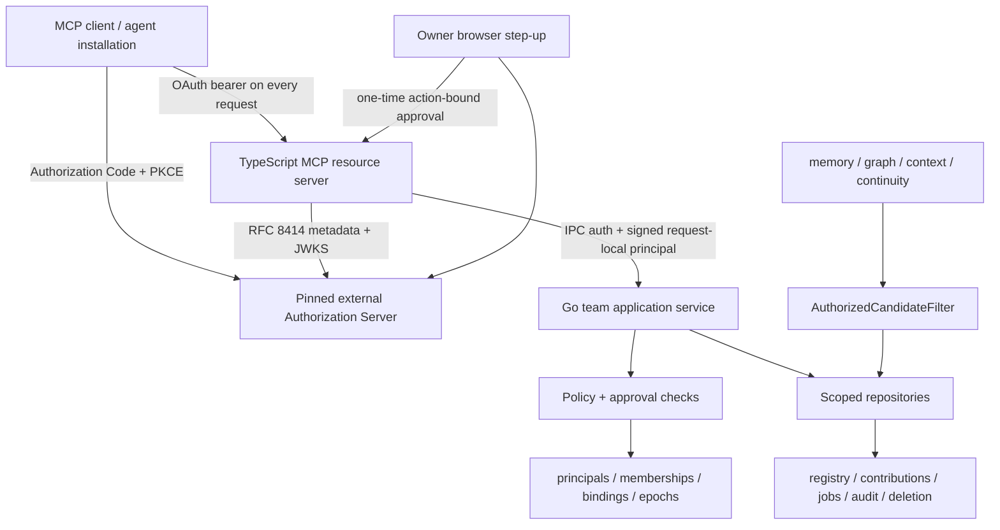
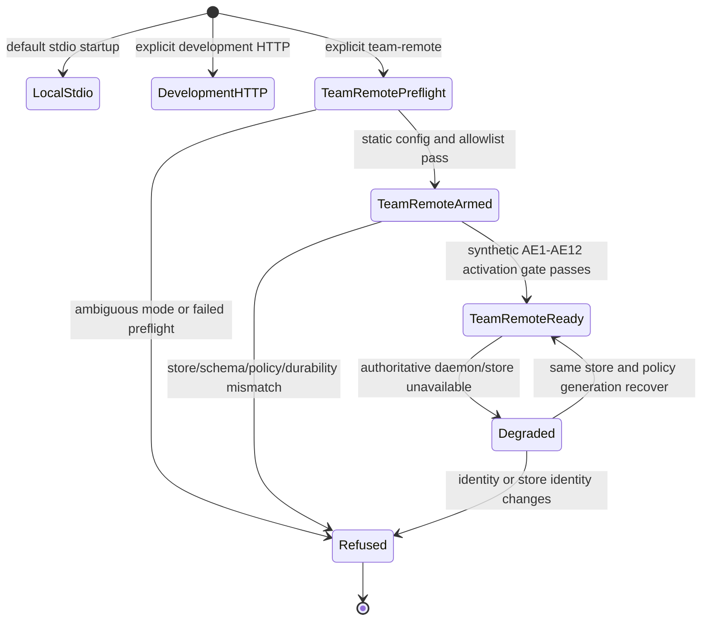
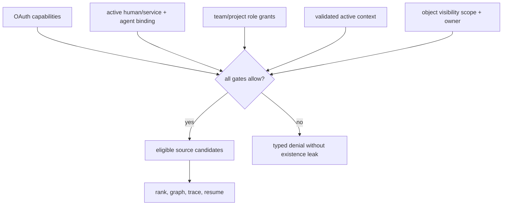
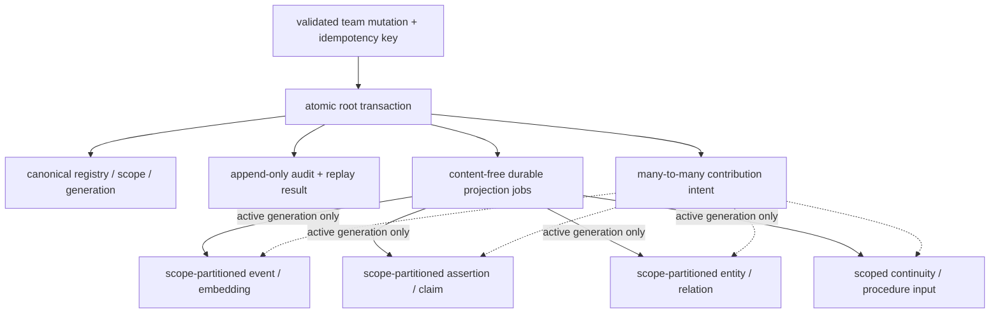
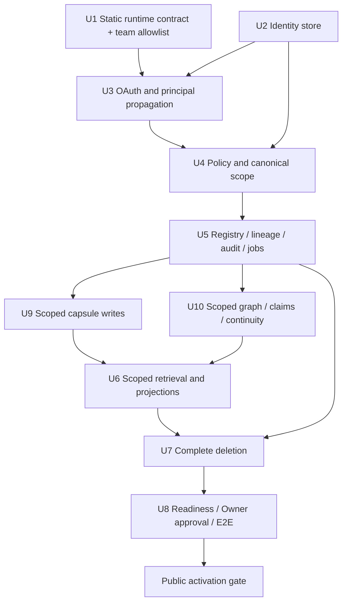

# Pulse Team Identity and Explicit Remote Mode - Plan

## Goal Capsule

- **Objective:** Add the first Pulse Team foundation: authenticated human and agent identities, canonical scopes, server-side policy, durable audit, immediate revocation, complete item deletion, and a fail-closed remote mode.
- **Authority:** The approved pilot design and repository trust rules outrank this plan; this plan outranks implementation convenience and current permissive remote behavior.
- **Execution profile:** Deep, security-sensitive, migration-bearing work implemented test-first across the TypeScript MCP gateway, Go daemon, and SQLite store.
- **Stop conditions:** Stop if implementation would trust caller-supplied identity, expose existing unscoped local data remotely, place policy after ranking, persist raw tokens or transcript content, or introduce any silent fallback or dual-write path.
- **Tail ownership:** The executor owns implementation through verified commits and review. Live deployment, real identity-provider configuration, public release, and ingestion of real team data require separate authorization.
- **Outcome boundary:** This increment creates a synthetic-data-ready foundation. It does not claim that the two-member pilot, Krisp connector, team Viewer, or production service is ready.

Product Contract preservation: the approved pilot design is unchanged. This plan implements only decomposition item 1 and the deletion/revocation contracts required to make that foundation safe.

---

## Product Contract

### Summary

Pulse gains an explicit team-remote operating mode whose callers are attributable to a human, a delegated agent installation, or a narrow service principal. Every shared read and write is constrained by server-side membership, role, object scope, and active context, while local Preview behavior remains a separate mode.

### Problem Frame

The current remote MCP path authenticates a shared bearer or development token, then forwards every call to a daemon protected by one machine-wide `X-Pulse-Key`. It cannot distinguish Nik, Dima, two agent installations, or a connector, and `PULSE_MCP_MODE=auto` may silently switch to a standalone store after a connection failure.

Current scope fields also carry incompatible meanings: capsule recall uses `scope` as retention, context query uses observation audience, and assertions use a visibility scope without a `team` value. Deletion and audit are fragmented. Adding a team UI or connector on top of these contracts would create cross-scope leakage, false attribution, and unverifiable deletion.

### Actors

- A1. Owner human — bootstraps the dedicated team store, manages membership and agent bindings, and completes destructive or administrative actions.
- A2. Member human — owns personal memory and participates in assigned projects through separately registered agent clients.
- A3. Delegated agent — an OAuth client installation linked to one human; its permissions can only narrow the human's grants.
- A4. Service principal — an unattended connector identity authenticated through client credentials and limited to declared actions, object types, and scopes.

### Key Flows

- F1. Explicit remote connection
  - **Trigger:** An MCP client connects to the team endpoint.
  - **Actors:** A1 or A2 through A3.
  - **Steps:** The gateway validates a bearer token for the pinned Pulse resource, resolves the human subject and OAuth client, verifies an active agent binding, and asks the daemon for the effective policy context.
  - **Outcome:** The client receives `team-remote`, one authoritative store ID, effective capabilities, and `fallback=false`, or a typed denial/degraded result.
- F2. Scoped mutation
  - **Trigger:** An agent remembers a capsule or submits a structured graph delta.
  - **Actors:** A3 or A4.
  - **Steps:** The server derives identity, validates the requested target scope, atomically persists the root, canonical scope, contribution intent, idempotency result, audit, and durable projection jobs, then returns object and audit IDs with projection state.
  - **Outcome:** The write is attributable and visible only inside the authorized boundary; asynchronous projections cannot attach outside the root scope or generation.
- F3. Scoped retrieval
  - **Trigger:** An agent calls recall, context query, or resume; internal retrieval executes behind those tools.
  - **Actors:** A3 or A4.
  - **Steps:** Policy produces an allowed object set before lexical/vector candidate generation, graph traversal, trace assembly, counts, and continuity projection.
  - **Outcome:** Hidden objects neither appear nor influence visible ranking, traces, counts, or graph neighbors.
- F4. Immediate revocation
  - **Trigger:** A1 revokes a membership, project grant, agent binding, or service principal.
  - **Actors:** A1, affected A3 or A4.
  - **Steps:** The authorization epoch changes and every subsequent request rechecks current state even on an existing MCP connection.
  - **Outcome:** The next read or write is denied and no store mutation occurs.
- F5. Complete item deletion
  - **Trigger:** An authorized actor requests deletion of a Pulse object.
  - **Actors:** A3 acting for A1 or A2 when deleting owned personal/project objects, plus A1 through out-of-band Owner approval for shared deletion; Reviewer-authorized shared deletion remains deferred.
  - **Steps:** The root and lineage become inaccessible atomically, cleanup removes every primary and derived representation, and the operation reports a durable state.
  - **Outcome:** `complete` is returned only after recall, context, resume, graph, index, and procedure-input surfaces are clean.
- F6. Remote outage
  - **Trigger:** The central daemon or authoritative store is unavailable at startup or during a request.
  - **Actors:** A3 or A4.
  - **Steps:** Remote mode fails closed and returns `shared_memory_unavailable` with the configured store identity when known.
  - **Outcome:** No local or standalone store is read or written, and recovery resumes against the same store.

### Requirements

#### Runtime and authentication

- R1. Pulse exposes mutually exclusive `local-stdio`, `development-http`, and `team-remote` runtime states; only the first two may use current local or development shortcuts.
- R2. `team-remote` uses Streamable HTTP at one canonical HTTPS resource URI and refuses legacy SSE, unauthenticated access, static bearer mode, development OAuth, trusted proxy bearer passthrough, and standalone fallback.
- R3. Pulse acts only as an OAuth resource server in `team-remote`; a pinned external Authorization Server supplies short-lived audience-bound access tokens.
- R4. Every protected team/MCP POST, GET, and DELETE validates the bearer token and current Pulse authorization state; public health and standards-metadata endpoints are exempt, and MCP session state is never an authorization cache.
- R5. Human subject, OAuth client/agent installation, and service subject remain distinct identities in policy and audit.
- R6. `pulse_team_status` reports runtime mode, team ID, authenticated principal, agent binding, active context, effective capabilities, authoritative store ID, degraded state, policy version, and `fallback=false` without filesystem paths or secrets.

#### Authorization and scope

- R7. OAuth scopes grant coarse capabilities, while team/project membership, role bindings, and object visibility remain server-side policy; effective permission is their intersection.
- R8. Object visibility scope, retention, privacy tier, and active request context are separate contracts and never reuse the current overloaded `scope` field.
- R9. Canonical visibility supports `personal`, `team`, `project`, `repo`, `agent`, and `session`, each with immutable IDs and an accountable owner where applicable.
- R10. Caller-supplied actor, team, owner, role, or agent IDs never establish authority; requested context and target scope can only narrow server-derived grants.
- R11. A missing write scope defaults to the authorizing human's `personal` scope for human-delegated clients; service principals must always name an allowed target, and no write defaults to `team`.
- R12. Promotion to `team` is unavailable in this increment; membership changes, agent/service revocation, shared deletion, and team-wide destructive operations require recent action-bound Owner approval after browser reauthentication and are not MCP tools.
- R13. Authorization constrains source candidates before search, ranking, graph traversal, assertion overlay, counts, traces, continuity packs, and procedure inputs.
- R14. Existing rows without canonical object scope remain local-only; team mode neither guesses ownership nor backfills them into shared access.

#### Audit, revocation, and deletion

- R15. Successful privileged mutations commit with a durable audit event or fail closed; denied remote operations are recorded when audit storage is reachable, otherwise denial remains fail-closed and emits an audit-degraded operational signal.
- R16. Audit records contain identity references, client ID, team/project, action, decision reason, target opaque ID, request correlation, policy version, mode, and timestamps, but never tokens, authorization headers, prompts, summaries, transcripts, or mutation payloads.
- R17. Membership, project grant, agent binding, and service-principal revocation take effect on the next request, including requests on an already-open MCP connection.
- R18. MCP session termination, Authorization Server grant/token revocation, Pulse membership revocation, and Pulse content deletion remain separate operations with separate results.
- R19. Item deletion synchronously tombstones the root generation and removes its lineage contributions, then purges only unsupported derivatives through a leased retryable operation; inaccessible state survives cleanup failure and restart.
- R20. Team mode exposes versioned item delete and delete-status contracts, while legacy `pulse_forget` and `pulse_wipe` remain local-only and are rejected remotely.

#### Compatibility and operations

- R21. Current Local Preview storage, Safe Mode, and stdio behavior remain behaviorally compatible; team tables and policy are dormant outside `team-remote`.
- R22. Team remote contracts are versioned rather than silently changing the meanings of current capsule, recall, context, status, forget, or wipe inputs.
- R23. An out-of-band Owner administration surface bootstraps the team, registers members and agent clients, grants projects, revokes access, inspects metadata-only audit, and checks deletion state only after browser step-up; loopback and IPC secrets authenticate channels, never the human.
- R24. Team remote requires Node 22 or newer, an explicitly bootstrapped dedicated team database using the team durability profile, loopback-only daemon IPC, a pinned issuer/resource pair, and a rotatable internal principal-signing key.
- R25. Real team content remains blocked until synthetic isolation, revocation, deletion, audit-redaction, and outage gates all pass.
- R26. Retried mutations are idempotent across response loss, concurrency, and restart; a reused key with a different body digest is rejected.
- R27. A successful write distinguishes `stored` from `fully_projected`; asynchronous projections are durable, scope-partitioned, and may attach only to the active root generation.
- R28. Team migrations are contiguous, fingerprint-checked, forward-only, and guarded by minimum reader/writer versions so a pre-team binary is never an approved rollback path.

### Acceptance Examples

- AE1. Given two valid tokens with the same human subject but different pre-registered OAuth client IDs, when each client connects, then Pulse resolves two distinct agent bindings and applies the narrower binding-specific grants.
- AE2. Given a Member-owned personal capsule and a second human's agent, when the second agent recalls matching text, then the capsule does not appear and does not alter result count, ordering, trace, graph neighbors, or resume output.
- AE3. Given any agent requesting `team` scope, when the request is evaluated in this increment, then the write is denied because scope promotion and direct team writes are unavailable until the human review surface exists.
- AE4. Given an active MCP connection, when its agent binding is revoked, then the next read and write return `principal_revoked`, create no domain mutation, and record a metadata-only denial.
- AE5. Given a shared capsule with an event, embedding, assertion, graph projection, continuity reference, and procedure-input lineage, when deletion starts, then every read surface hides it immediately and `complete` appears only after every derivative is gone.
- AE6. Given `team-remote` and an unavailable daemon, when a tool is called, then the client receives `shared_memory_unavailable` with `fallback=false` and no standalone/local database changes.
- AE7. Given an expired, wrong-issuer, wrong-audience, unsigned, or insufficient-scope token, when any MCP HTTP request arrives, then Pulse returns the correct 401 or 403 challenge without forwarding the request to the daemon.
- AE8. Given an existing local database with unscoped memories, when team mode starts against it, then startup fails with a dedicated-store migration message and exposes none of those rows.
- AE9. Given an agent with shell and IPC-key access, when it attempts an Owner operation without a recent action-bound browser approval, then the operation is denied; expired, replayed, and wrong-action approvals are also denied.
- AE10. Given a committed mutation whose response is lost, when the same principal/client retries the same idempotency key and body after restart, then Pulse returns the original object and audit IDs; a different body conflicts.
- AE11. Given two scopes that mention the same person or claim, when projections are created and one root is deleted, then no content crosses scopes and the surviving scope retains only its own contribution.
- AE12. Given a pending embedding, claim, graph, or continuity job, when its root is tombstoned before attachment, then the worker refuses the stale generation and deletion can reach `complete` without later resurrection.

### Success Criteria

- All twelve acceptance examples pass with synthetic identities and content.
- Cross-principal isolation tests show zero hidden-object influence on every retrieval and projection surface under test.
- Revocation blocks the next request without waiting for JWT expiry.
- Deletion is restart-safe and never reports completion while a derived representation remains.
- Audit fixtures contain no bearer values, JWT claims blob, raw prompt, memory summary, transcript fragment, credential, or local path.
- Existing local tests and the full repository verification gate remain green.
- Team migration fingerprints, explicit store markers, durability settings, idempotency, projection leases, and deletion completion barriers pass crash/restart and concurrency tests.

### Scope Boundaries

#### Included in this increment

- The identity, delegation, role, canonical scope, policy, audit, revocation, deletion, and runtime contracts required by the approved first decomposition item.
- A standards-based, provider-neutral JWT resource-server implementation and synthetic Authorization Server fixtures.
- An out-of-band browser-approved Owner administration surface and negative remote-mode smoke coverage.

#### Deferred to Follow-Up Work

- The two-human dogfood nucleus and black-box onboarding through real Codex, Claude, and other target clients.
- A scoped Viewer for inspect, correct, promote, audit, and delete operations.
- The private `pulse-team-pilot` operating repository, its roles/specs/evals, and deployment automation.
- Krisp selected-meeting ingest, webhook automation, Telegram, the meeting-to-offer workflow, candidate procedures, and the pilot-to-Core admission loop.
- Multi-team tenancy, self-service signup, billing, enterprise administration, and public production hardening.

#### Outside this product's identity

- Acting as the production Authorization Server or storing user passwords.
- Storing raw transcripts, source documents, OAuth tokens, cookies, credentials, or unrestricted source payloads in Pulse memory or Git.
- Inferring access from a machine, repository path, chat session, shared bearer, or caller-provided identity field.
- Deleting or claiming deletion of the original Krisp recording, transcript, or another source-system object when a Pulse derivative is deleted.

### Dependencies and Assumptions

- The pilot uses one dedicated team and one SQLite database per deployment; schema design may use team IDs but this increment does not claim multi-tenant isolation.
- The chosen Authorization Server must expose RFC 8414 metadata and JWKS, issue RFC 9068-style JWT access tokens, support Authorization Code with PKCE S256, and allow one pre-registered OAuth client per agent installation for the controlled pilot.
- The concrete issuer, resource URI, TLS endpoint, and provider are deployment configuration and do not block provider-neutral implementation.
- Pulse chooses short-lived JWT validation plus an active membership/agent-binding check on every request. Authorization Server grant revocation remains external, while Pulse revocation is immediate even before token expiry.
- The Authorization Server must support recent-auth or step-up evidence suitable for one-time action-bound Owner approvals; IPC possession alone never grants administration.
- Session-scoped objects expire after 24 hours unless the approved workflow supplies a shorter lifetime.
- Minimal audit rows and deletion tombstones remain for the life of the pilot environment; an automatic audit-retention policy is deferred until real-data deployment review.
- Membership removal revokes sessions and agent bindings immediately. Personal data becomes inaccessible pending explicit Owner export/delete, while already approved shared objects retain non-content authorship metadata.
- Team SQLite uses WAL with foreign keys and a durability setting equivalent to `synchronous=FULL`; Local Preview retains its current performance profile.
- A team database is created only by explicit bootstrap and carries immutable store/team IDs plus minimum reader/writer versions. Rollback disables the gateway or restores a verified snapshot; it never opens the database with a pre-team binary.

---

## Planning Contract

### Key Technical Decisions

- KTD1. Stay on MCP `2025-11-25` and pin the supported TypeScript SDK v1 line for this increment. The ongoing v2 package/auth split is unrelated migration risk; new code must avoid the v1 in-process Authorization Server helpers that v2 moves to legacy support.
- KTD2. Introduce an explicit runtime state machine above the current engine selector. `PULSE_MCP_MODE` may retain local behavior, but `PULSE_RUNTIME_MODE=team-remote` requires daemon-only backing, registers only the team allowlist, and cannot activate a public listener until the synthetic security gate passes.
- KTD3. Make Pulse a JWT OAuth resource server backed by one pinned external issuer. Use `jose` v6 for cached remote JWKS verification of signature, `typ`, issuer, resource audience, expiry, not-before, client ID, and subject on every HTTP request.
- KTD4. Model a human-delegated request as `(issuer, human subject, OAuth client ID -> agent binding)` and a service request as a separate service principal. Store and audit opaque internal identity references; raw external subjects and complete claims never enter audit.
- KTD5. Forward no access token to Go and keep principal context request-local. The gateway signs an Ed25519 `pulse.principal.v1` assertion with `kid`, short expiry, and single-use `jti`, bound to request ID, normalized method/path, body digest, store/team IDs, normalized issuer/subject/client identifiers, grant kind, and capabilities. The daemon resolves internal principal/binding IDs, then verifies current generation and replay state; readiness uses IPC identity without a user principal.
- KTD6. Keep dependency direction `MCP/API adapter -> team application service -> policy + repositories`. Retrieval, graph, context, and continuity consume an `AuthorizedCandidateFilter` interface backed by scoped repositories; the store never depends on retrieval.
- KTD7. Add a canonical team-object registry as the authority for identity, immutable visibility scope, lifecycle state, and generation. Team projections are scope-partitioned, and many-to-many contribution lineage prevents content-bearing entities, claims, relations, checkpoints, or embeddings from combining scopes that are not jointly readable.
- KTD8. Publish a distinct `pulse_team_*` MCP family with explicit v1 schemas. Team `tools/list` exposes only those tools; current `pulse_*` contracts and overloaded fields remain unchanged in local/development modes.
- KTD9. Defer scope promotion entirely in this increment. Object visibility never widens in place, agents cannot write directly to `team`, and membership/role/revocation/shared-delete actions require a one-time action-bound Owner approval after browser step-up. IPC possession alone grants no administration.
- KTD10. Split audit into redacted gateway security events and append-only Go domain audit. One correlation ID spans both; authenticated privileged state transitions commit with domain audit, while unidentified or store-unavailable denials remain denied and emit only the durable event or operational signal that is possible.
- KTD11. Implement deletion as `active -> tombstoned -> cleaning -> complete`, with leased `cleanup_failed` retry. Tombstoning increments the root generation and cancels pending projection jobs; cleanup removes only the deleted contribution and purges a derivative only when no active parent remains.
- KTD12. Build team routing from an allowlist, not a legacy deny-list. The daemon admits minimal health/readiness plus versioned team and Owner-approval routes; outbox, message generation, ingest, Viewer, export/import, graph administration, local retrieval, checkpoint/observe, consolidate, forget, and wipe never register in team mode.
- KTD13. Commit root, canonical registry/scope, idempotency record, audit, contribution intent, and content-free projection jobs atomically. Workers attach derivatives only for a matching active generation and report `pending`, `ready`, or `failed`; a write response means `stored`, not implicitly `fully_projected`.
- KTD14. Harden the migration chain for team stores with contiguous version and fingerprint validation. Team bootstrap sets immutable store/team IDs, minimum reader/writer versions, WAL + foreign keys + `synchronous=FULL`, and a downgrade barrier; rollback is gateway disablement, a forward fix, or a verified snapshot restore.
- KTD15. Compile authorization into indexed SQL/repository predicates and scoped cache partitions instead of materializing unbounded allowed-ID lists. Revocation epoch is persistent and rechecked inside write transactions and before read responses or side effects.

### Role and Action Matrix

| Action | Owner human | Member agent | Reviewer agent | Service principal |
|---|---:|---:|---:|---:|
| Read own personal objects | Yes | Yes | Yes | Grant only |
| Read assigned project/team objects | Yes | Yes | Yes | Grant only |
| Write personal objects | Yes | Yes | Yes | No |
| Write assigned project objects | Yes | Yes | Yes | Grant only |
| Promote or write directly to team scope | Disabled in this increment | No | No | No |
| Delete own personal/project object | Yes | Yes | Yes | No |
| Delete reviewed shared object | Action-bound Owner approval only | No | No in this increment | No |
| Inspect permitted audit metadata | Yes | Own actions only | Own actions only | No |
| Manage membership, bindings, roles, or grants | Action-bound Owner approval only | No | No | No |
| Revoke an agent/service principal | Action-bound Owner approval only | No | No | No |
| Team-wide wipe | Disabled pending dedicated approval flow | No | No | No |

The Reviewer role is stored for forward compatibility, but it grants no agent-side promotion, shared deletion, or team-audit elevation until the scoped human review surface exists.

### Team MCP Contract

| Team tool | Contract | Purpose and boundary |
|---|---|---|
| `pulse_team_status` | `pulse.team.status.v1` | Mode, principal, binding, context, capabilities, policy/store identity, projection/degraded state |
| `pulse_team_remember` | `pulse.team.memory.v1` | Idempotent structured capsule write with active context and target scope; never caller identity |
| `pulse_team_graph_delta` | `pulse.team.graph_delta.v1` | Idempotent scope-partitioned semantic delta with contribution lineage |
| `pulse_team_recall` | `pulse.team.recall.v1` | Scoped capsule recall using canonical active context and retention fields |
| `pulse_team_context_query` | `pulse.team.context.v1` | Pre-filtered state-aware context, graph, assertions, and typed trace |
| `pulse_team_resume` | `pulse.team.resume.v1` | Scoped continuity pack for the active thread/project/session |
| `pulse_team_inspect` | `pulse.team.inspect.v1` | Visible object provenance, scope, projection state, and deletion state |
| `pulse_team_audit` | `pulse.team.audit.v1` | Content-free audit for the caller's own actions; broader review is deferred |
| `pulse_team_delete` | `pulse.team.delete.v1` | Idempotent delete of an owned personal/project object; shared delete is Owner approval only |
| `pulse_team_delete_status` | `pulse.team.delete_status.v1` | State of an already visible delete operation without lineage/content disclosure |

Mutation contracts require an idempotency key and body digest binding. Team mode rejects legacy tool names before dispatch; local and development modes do not advertise the team family.

### Canonical Scope Contract

| Concern | Stored on object | Supplied by caller | Authorization meaning |
|---|---|---|---|
| Visibility scope | Type, immutable scope ID, team ID, owner principal where applicable | Requested target on writes | Determines which principals may ever see the object and never widens in place |
| Retention | Existing retention vocabulary plus expiry where applicable | Optional write policy | Controls lifecycle, never access |
| Privacy tier | `normal`, `sensitive`, or `private` | Host-extracted item metadata | Controls handling/projection, never grants access |
| Active context | Not copied into object identity; recorded in audit correlation | Team plus optional project/repo/session | Narrows the already granted read/write set |
| OAuth capability | Not stored as object scope | Token scope | Coarse permission to attempt read/write/delete/audit actions |
| Lifecycle generation | Registry state and monotonic generation | Never caller-controlled | Fences late projections, stale policy decisions, and deletion retries |

### High-Level Technical Design

#### Component topology



#### Authenticated request sequence

```mermaid
sequenceDiagram
  participant C as MCP client
  participant G as TS gateway
  participant I as Authorization Server
  participant D as Go daemon
  participant P as Policy/store
  alt readiness before public activation
    G->>D: IPC-authenticated readiness request, no user principal
    D-->>G: store/team/schema/policy/durability state
  else authenticated domain call
    C->>G: Streamable HTTP request + bearer
    G->>I: Cached metadata/JWKS refresh when required
    G->>G: Verify token and coarse capability
    G->>D: IPC auth + signed request-local principal
    D->>D: Verify signature, binding, expiry, jti, and body digest
    D->>P: Resolve current epoch and compile allowed scope predicate
    P-->>D: Policy decision or AuthorizedCandidateFilter
    D-->>G: Typed result + correlation/audit IDs
    G-->>C: MCP response; no hidden fallback
  end
```

#### Runtime mode state machine



#### Authorization intersection



#### Object and derivative data flow



#### Deletion lifecycle

```mermaid
stateDiagram-v2
  [*] --> Active
  Active --> Tombstoned: authorized delete + audit commit
  Tombstoned --> Cleaning: worker claims lease
  Cleaning --> Complete: surviving contributions rebuilt; completion barrier passes
  Cleaning --> CleanupFailed: transaction or dependency failure
  Cleaning --> Tombstoned: lease expires before finalize
  CleanupFailed --> Cleaning: retry after restart/backoff and lease claim
  Tombstoned --> Tombstoned: duplicate delete returns same operation
  Complete --> Complete: idempotent status/delete
```



#### Human Owner approval

```mermaid
sequenceDiagram
  participant O as Owner
  participant A as Owner admin client
  participant G as Team gateway
  participant I as Authorization Server
  participant D as Team application service
  A->>G: Request one-time challenge for action digest
  G-->>A: Nonce, expiry, expected action/store/team
  A->>I: Browser step-up with PKCE and recent-auth requirement
  O->>I: Complete browser authentication
  I-->>A: Short-lived Owner-scoped token
  A->>G: Token + challenge + exact action
  G->>D: Signed Owner principal + single-use approval assertion
  D-->>G: Atomic action + audit or denial
  G-->>A: Result; nonce consumed
```

### Error Contract

| Layer and code | Transport meaning | Disclosure rule |
|---|---|---|
| Pre-MCP `unauthenticated` | HTTP 401 with RFC 9728 resource metadata | No principal or target detail |
| Pre-MCP `insufficient_scope` | HTTP 403 with only the required OAuth capability | No broader scope list |
| Domain `forbidden` | Structured MCP error for valid principal lacking a policy grant | No protected-object existence detail |
| Domain `principal_revoked` | Structured MCP error after membership/binding/service revocation | Principal type and remediation only |
| Domain `concealed_not_found` | Uniform MCP result for absent or inaccessible IDs | Same shape and status for both cases |
| Domain `shared_memory_unavailable` | Structured degraded result | Includes `fallback=false` and store ID only when already known |
| Domain `deletion_in_progress` | Structured result with operation ID | No deleted content or contribution detail |
| Domain `idempotency_conflict` | Structured mutation rejection | Reveals no prior body or target |

### Sequencing



### Alternative Approaches Considered

- **Keep one shared bearer and add actor IDs to tool arguments:** Rejected because callers could impersonate each other and revocation could not target an installation.
- **Authorize only in the TypeScript gateway:** Rejected because daemon APIs, retrieval internals, graph traversal, and future surfaces could bypass or diverge from gateway filtering.
- **Post-filter final retrieval results:** Rejected because hidden content could still affect ranking, counts, traces, timing, graph neighbors, and procedure candidates.
- **Backfill current local rows into team scope:** Rejected because ownership and consent are unknowable; a dedicated remote database is safer and preserves local/remote separation.
- **Embed a production Authorization Server in Pulse:** Rejected because Pulse is the protected resource, and the current development OAuth helper has no durable identity or administration model.
- **Migrate to MCP SDK v2 while adding auth:** Rejected because v2 remains pre-release and changes package/auth boundaries; the security increment should not absorb an unrelated platform migration.
- **Use token introspection for every request:** Deferred because the pilot can get immediate Pulse revocation from active membership/binding checks while using short-lived audience-bound JWTs. Introspection becomes a valid alternative if the selected IdP or later compliance policy requires centralized token revocation.

### Implementation Constraints

- Do not log, persist, hash into diagnostics, or forward raw access/refresh tokens or the SDK's full auth object.
- Do not trust `X-Forwarded-*`, caller-supplied principal headers, or current proxy bearer passthrough in team mode.
- Bind the Go daemon to loopback in team mode and require both IPC authentication and a valid signed principal assertion on team-domain routes; neither IPC nor loopback proves human presence.
- Keep public `/health` output minimal; principal, team, store, and policy details belong only in authenticated status.
- Treat root/scope/idempotency/audit/contribution-intent/job writes as one transaction; network embedding and other projections run only from durable generation-fenced jobs.
- Use existing SQLite migrations, WAL, foreign keys, and repository test conventions, with the stronger team durability profile; do not introduce another database technology.
- No team binary may infer a team store from emptiness or schema version alone, and no pre-team binary is an approved way to open or roll back a team database.
- Every content-bearing projection is scope-partitioned. Shared same-scope derivatives carry contribution-level provenance and are rebuilt rather than blindly cascaded.
- Keep real data out of fixtures and documentation. Synthetic names, opaque IDs, and redacted summaries are sufficient for every gate.

---

## System-Wide Impact

- **Interfaces:** Local v1 tools remain stable. Team mode has a separate tool registry, request schemas, structured MCP domain errors, and internal `/team/v1/*` API adapters; Owner actions remain outside MCP.
- **Deployment:** The runnable boundary includes a public gateway, loopback daemon, external issuer, explicit team database, IPC credential, Ed25519 assertion keys, replay cache, projection/deletion workers, and browser approval channel.
- **Data:** Migrations are additive but never assign legacy ownership. Team objects use a canonical registry, scope partitions, contribution lineage, idempotency records, durable jobs, append-only audit, and generation-fenced tombstones.
- **Runtime:** IdP/JWKS failure, daemon/store degradation, signing-key rotation, authorization-epoch invalidation, job-lease expiry, cache invalidation, and recovery must all preserve the same store/team identity and fail closed.
- **Retrieval performance:** Policy compiles into indexed scope predicates and cache partitions. It must not materialize an unbounded authorized-ID set or run hidden candidates before filtering.
- **Agent parity:** Every allowed team memory action has an MCP contract over the same Go application/policy service. Human approval, membership administration, team promotion, and shared deletion have no agent completion path.
- **Rollout:** Public activation and real data remain disabled until migrations, route/tool allowlists, AE1-AE12, negative smoke, worker health, secret scans, and full regression gates pass.
- **Operations:** Metrics/logs distinguish OAuth failure, policy denial, audit degradation, shared-store outage, assertion replay, projection failure, and deletion cleanup failure without recording credentials or content.

---

## Implementation Units

| Unit | One-line outcome | Primary files | Depends on |
|---|---|---|---|
| U1 | Static runtime contract and team-only tool allowlist | `mcp/src/runtime-mode.ts`, `mcp/src/index.ts` | None |
| U2 | Team store marker, migration/durability guard, identities, and audit foundation | `pulse-app/internal/store/schema.go`, `pulse-app/internal/store/team_identity.go` | None |
| U3 | OAuth/JWT validation and request-local signed principal propagation | `mcp/src/oauth-resource.ts`, `pulse-app/internal/server/principal_context.go` | U1, U2 |
| U4 | Canonical policy, revocation epoch, scoped route allowlist, and readiness | `pulse-app/internal/teamauth/policy.go`, `pulse-app/internal/server/team_router.go` | U2, U3 |
| U5 | Object registry, contribution lineage, idempotency, audit, and projection jobs | `pulse-app/internal/store/team_objects.go`, `pulse-app/internal/store/projection_jobs.go` | U4 |
| U9 | Scoped capsule writes and event/embedding projection | `pulse-app/internal/store/memory_capsule.go`, `pulse-app/internal/server/memory.go` | U5 |
| U10 | Scoped semantic graph, claims, and continuity writes | `pulse-app/internal/store/semantic_delta.go`, `pulse-app/internal/store/claim_resolver.go` | U5 |
| U6 | Pre-retrieval authorization across every read/cache surface | `pulse-app/internal/retrieve/`, `pulse-app/internal/contextquery/` | U9, U10 |
| U7 | Leased, generation-fenced, contribution-aware deletion | `pulse-app/internal/store/team_deletion.go`, `pulse-app/internal/teamjobs/deletion.go` | U5, U6 |
| U8 | Browser-approved Owner operations, readiness activation, E2E, smoke, and docs | `mcp/src/team-remote.e2e.test.ts`, `pulse-app/cli/src/cli.js` | U7 |

### U1. Static Runtime Contract and Team Tool Allowlist

- **Goal:** Make runtime selection explicit and ensure an incomplete team build can never expose legacy tools or fallback storage.
- **Requirements:** R1, R2, R21, R24; F1, F6.
- **Dependencies:** None.
- **Files:**
  - Create: `mcp/src/runtime-mode.ts`
  - Create: `mcp/src/runtime-mode.test.ts`
  - Create: `mcp/src/team-contracts.ts`
  - Create: `mcp/src/team-contracts.test.ts`
  - Modify: `mcp/src/index.ts`
  - Modify: `mcp/src/http.test.ts`
  - Modify: `mcp/package.json`
  - Modify: `mcp/package-lock.json`
- **Approach:** Separate runtime mode from engine selection. Preserve local stdio and development HTTP, while team mode requires Node 22+, daemon-only backing, HTTPS resource/issuer configuration, and public activation off by default. Register stable `pulse_team_*` descriptors/stubs only; never construct `StandaloneStore` or advertise legacy tools in team mode.
- **Execution note:** Start with a table-driven failing test for every allowed and refused static mode/configuration combination.
- **Patterns to follow:** `parseEngineMode`, `createPulseMcpServer`, `ListToolsRequestSchema`, and startup refusal tests in `mcp/src/index.ts` and `mcp/src/http.test.ts`.
- **Test scenarios:**
  1. Default stdio and explicit development HTTP preserve current local tool and engine behavior.
  2. Team mode refuses `auto`/standalone backing, static bearer, development OAuth, proxy trust, unauthenticated access, non-HTTPS resource/issuer, public daemon address, and Node below 22.
  3. Team `tools/list` exposes exactly the Team MCP Contract and no local, maintenance, Owner-admin, forget, or wipe tools.
  4. Before public activation, team calls return a stable not-ready result and the process does not bind a public listener.
  5. Team modules load remote-only JWT dependencies lazily so local startup retains its supported runtime behavior.
- **Verification:** Runtime parsing is deterministic, local tests remain green, and static analysis/tests prove no team branch constructs fallback storage or registers a legacy tool.

### U2. Team Store Identity, Migration Guard, Durability, and Principals

- **Goal:** Create a verifiable team database and durable identity/audit foundation without assigning ownership to legacy data.
- **Requirements:** R5, R7, R14-R17, R24, R28; A1-A4; AE1, AE4, AE8.
- **Dependencies:** None.
- **Files:**
  - Create: `pulse-app/internal/store/migrations/033_team_identity.sql`
  - Create: `pulse-app/internal/teamauth/model.go`
  - Create: `pulse-app/internal/store/team_identity.go`
  - Create: `pulse-app/internal/store/team_identity_test.go`
  - Modify: `pulse-app/internal/store/schema.go`
  - Modify: `pulse-app/internal/store/store.go`
  - Modify: `pulse-app/internal/store/store_test.go`
  - Modify: `pulse-app/internal/config/config.go`
  - Modify: `pulse-app/internal/config/config_test.go`
- **Approach:** Validate a contiguous fingerprinted migration manifest, then add explicit team-store metadata, minimum reader/writer versions, principals, memberships, projects, agent bindings, service principals, persistent authorization epochs, and append-only audit/security-event tables. Team bootstrap is separate from additive migration and selects the `FULL` durability profile; an empty unmarked database is not a team store.
- **Execution note:** Implement fresh/latest/failure-restart migration fixtures and schema invariants before HTTP wiring.
- **Patterns to follow:** Embedded ordered migrations in `pulse-app/internal/store/schema.go`, WAL/foreign-key setup in `pulse-app/internal/store/store.go`, and table-driven store tests.
- **Test scenarios:**
  1. Fresh and latest-local databases validate contiguous unique versions; missing, duplicate, reordered, or fingerprint-drifted migrations are refused.
  2. Failure inside migration 033 rolls back cleanly and restart applies it once; applied migration fingerprints remain immutable.
  3. Explicit bootstrap creates immutable store/team IDs, one Owner, minimum reader/writer versions, and `FULL` durability without credentials or domain content.
  4. An empty unmarked database, local database with unscoped rows, config/store identity mismatch, or unsupported reader/writer version fails team readiness.
  5. Covers AE1. Two OAuth client IDs under one human subject create distinct bindings; duplicate tuples replay safely and conflicting reassignment fails.
  6. Service principals use a separate namespace, project grants require active team membership, and the last active Owner cannot be revoked.
  7. Revocation state, dependent-binding invalidation, epoch increment, and audit commit atomically; a failed transaction changes none.
  8. Existing local rows receive no team registry/scope, and a pre-team binary is documented/tested as an invalid rollback target.
- **Verification:** The store can prove its kind, identity, schema compatibility, durability, principals, and current epoch before team routes activate; migration rollback is snapshot/forward-fix only.

### U3. OAuth Resource Server and Request-Local Principal Propagation

- **Goal:** Validate every remote request and deliver a replay-resistant principal context to Go without forwarding credentials or sharing process-global identity state.
- **Requirements:** R2-R6, R10, R16, R18, R24; F1; AE1, AE7.
- **Dependencies:** U1, U2.
- **Files:**
  - Create: `mcp/src/oauth-resource.ts`
  - Create: `mcp/src/oauth-resource.test.ts`
  - Create: `mcp/src/principal-context.ts`
  - Create: `mcp/src/principal-context.test.ts`
  - Modify: `mcp/src/index.ts`
  - Modify: `mcp/src/http.test.ts`
  - Create: `pulse-app/internal/server/principal_context.go`
  - Create: `pulse-app/internal/server/principal_context_test.go`
  - Create: `pulse-app/internal/server/security_event.go`
  - Create: `pulse-app/internal/server/security_event_test.go`
  - Modify: `pulse-app/internal/server/server.go`
  - Modify: `pulse-app/cmd/pulse/main.go`
- **Approach:** Expose exact RFC 9728 metadata and validate RFC 9068-style JWT access tokens against pinned RFC 8414/JWKS metadata using `jose` v6. Normalize human-delegated and service identities, then sign request-local Ed25519 principal assertions with rotation and replay protection. Invalid/unidentified requests create a redacted correlated security event when IPC audit is reachable, or an audit-degraded signal otherwise.
- **Execution note:** Use a deterministic in-process Authorization Server fixture and concurrent fake-daemon requests; never use real tokens.
- **Patterns to follow:** Existing metadata/challenge tests, constant-time IPC authentication, and secret-file permission handling.
- **Test scenarios:**
  1. Metadata publishes the exact resource, one issuer, safe baseline capabilities, and no development authorization endpoints.
  2. Covers AE7. Missing, malformed, unsigned, expired, not-yet-valid, wrong-issuer/audience/resource, or incomplete JWTs fail before daemon dispatch.
  3. A valid token lacking a tool capability returns only the minimum `insufficient_scope` challenge.
  4. Human subject and client ID resolve separately; client credentials resolve only a service principal.
  5. Every protected team/MCP POST, GET, and DELETE revalidates the token; public health and standards metadata remain minimal exceptions, and MCP session state never authorizes a later request.
  6. Altered, expired, replayed, wrong-body/path/store/team, unknown-`kid`, or stale-generation principal assertions fail in Go.
  7. Two simultaneous principals produce different assertions and policy contexts with no module-global crossover; the fake daemon receives IPC identity plus assertion but no bearer.
  8. Metadata issuer mismatch, missing JWKS/PKCE S256, untrusted host/redirect, unknown key during outage, or SSRF-sensitive discovery fails closed; a still-valid cached trusted key follows the bounded cache policy.
  9. Logs, errors, security events, and snapshots contain no bearer, full claims blob, external subject, authorization header, private key, prompt, or content.
- **Verification:** Gateway and daemon agree on one immutable per-request principal; all negative auth/assertion cases fail before domain access and credentials never cross IPC.

### U4. Canonical Policy, Revocation Epoch, Team Router, and Readiness

- **Goal:** Establish one indexed policy decision and a fail-closed team route boundary before any domain implementation is reachable.
- **Requirements:** R7-R14, R17, R21-R25; F1-F4; AE2-AE4, AE8.
- **Dependencies:** U2, U3.
- **Files:**
  - Create: `pulse-app/internal/store/migrations/034_team_object_policy.sql`
  - Create: `pulse-app/internal/teamauth/policy.go`
  - Create: `pulse-app/internal/teamauth/policy_test.go`
  - Create: `pulse-app/internal/store/team_policy.go`
  - Create: `pulse-app/internal/store/team_policy_test.go`
  - Create: `pulse-app/internal/server/team_router.go`
  - Create: `pulse-app/internal/server/team_router_test.go`
  - Create: `pulse-app/internal/server/team_errors.go`
  - Modify: `pulse-app/internal/server/server.go`
  - Modify: `pulse-app/internal/server/health.go`
  - Modify: `pulse-app/cmd/pulse/main.go`
- **Approach:** Add the canonical object registry, immutable scope/generation fields, contribution lineage constraints, idempotency/projection-job tables, and indexes required for policy predicates. Policy intersects capability, active principal/binding/epoch, role, context, ownership, scope, and lifecycle. Team daemon registers only minimal health/readiness and `/team/v1/*`; startup/backfill/background writers are disabled until routed through team contracts.
- **Execution note:** Write the role/action/scope matrix and daemon-route allowlist as executable tests before adding team handlers.
- **Patterns to follow:** Assertion scope normalization, claim visibility boundaries, typed context contracts, and chi router registration in `pulse-app/internal/server/server.go`.
- **Test scenarios:**
  1. Owner, Member, non-elevated Reviewer agent, and service principal receive exactly the declared matrix permissions.
  2. Caller context only narrows grants; spoofed team/project/repo/session/owner/role/agent IDs never widen them.
  3. Missing human write target resolves to personal; service writes require an explicit allowed target; every agent team write/promotion fails.
  4. Privacy/retention never widen access, and visibility is immutable after object creation.
  5. Absent/inaccessible objects have one concealed result; policy compiles indexed predicates rather than unbounded ID sets.
  6. Covers AE4. Epoch is rechecked inside writes and before read response/side effects; revoke-between-authorize-and-commit/response fails closed, including after restart.
  7. Canonical registry rejects missing scope, orphan/cross-team/duplicate/cyclic contribution edges, and derivatives without registry identity.
  8. Team router admits only minimal health/readiness and versioned team routes; every legacy route is absent, while local router behavior remains unchanged.
  9. Covers AE8. Readiness refuses an unmarked/mismatched/unsupported store, unscoped rows, wrong durability settings, active legacy writer, or policy/schema mismatch.
- **Verification:** One Go policy/filter interface controls all team actions, revocation wins every tested race, and no legacy route or writer can create remotely reachable unscoped data.

### U5. Atomic Object Spine, Audit, Idempotency, and Projection Jobs

- **Goal:** Provide transaction primitives that make team mutations attributable, replay-safe, contribution-aware, and projection-recoverable.
- **Requirements:** R8-R16, R19, R26-R28; F2, F5; AE10-AE12.
- **Dependencies:** U4.
- **Files:**
  - Create: `pulse-app/internal/store/team_objects.go`
  - Create: `pulse-app/internal/store/team_objects_test.go`
  - Create: `pulse-app/internal/store/team_audit.go`
  - Create: `pulse-app/internal/store/team_audit_test.go`
  - Create: `pulse-app/internal/store/projection_jobs.go`
  - Create: `pulse-app/internal/store/projection_jobs_test.go`
  - Modify: `pulse-app/internal/store/store.go`
- **Approach:** Atomically commit root registry/scope/generation, append-only audit, idempotency identity/result, many-to-many contribution intent, and content-free projection jobs. Same key/digest replays IDs; conflicting bodies fail. Lease-based workers may attach a scope-partitioned derivative only while the root generation is active, and report projection state without embedding content in jobs.
- **Execution note:** Start with failure injection at every transaction boundary and crash/restart job-claim tests.
- **Patterns to follow:** Existing outbox lease/retry/idempotency patterns, capsule transactions, and migration-backed store tests; do not reuse the text-bearing outbox table.
- **Test scenarios:**
  1. Root, registry, scope, audit, idempotency result, contribution intent, and projection jobs either commit together or roll back together.
  2. Covers AE10. Lost-response and concurrent same-key/same-digest retries before and after restart return original IDs/audit; different digest conflicts.
  3. Audit rows are append-only, ordered, content-free, survive principal/object deletion, and do not duplicate on replay.
  4. Projection jobs claim atomically, expire leases, retry idempotently, recover after restart, and retain only object IDs/state/error class.
  5. Covers AE12. A worker cannot attach to a tombstoned or generation-mismatched root; tombstone cancels pending work atomically.
  6. Multiple active parents may contribute to one same-scope derivative, but cross-scope contributions are rejected.
  7. A successful response is `stored` with `projection_state`; only the worker/completion path may report `ready`.
- **Verification:** Transaction and lease invariants survive injected failure, concurrency, and restart without duplicate content, audit, jobs, or stale-generation attachments.

### U9. Scoped Capsule Writes and Event Projection

- **Goal:** Implement `pulse_team_remember` on the object spine without changing local capsule v1 behavior.
- **Requirements:** R8-R16, R21, R22, R26, R27; F2; AE3, AE10, AE12.
- **Dependencies:** U5.
- **Files:**
  - Modify: `pulse-app/internal/store/memory_capsule.go`
  - Modify: `pulse-app/internal/store/memory_capsule_test.go`
  - Modify: `pulse-app/internal/store/capsule_events_test.go`
  - Modify: `pulse-app/internal/server/memory.go`
  - Modify: `pulse-app/internal/server/memory_capsule_test.go`
  - Modify: `mcp/src/team-contracts.ts`
  - Modify: `mcp/src/team-contracts.test.ts`
  - Modify: `mcp/src/index.ts`
- **Approach:** Validate the team envelope in both gateway and Go, derive identity server-side, and commit each capsule root plus scope/audit/idempotency/projection intent through U5. Event/embedding work is a generation-fenced job; U9 stores projection state for U6's `pulse_team_inspect` implementation to expose. Current `pulse.memory_capsule.v1` remains local-only.
- **Execution note:** Add HTTP MCP integration tests and rollback tests before adapting the current capsule path.
- **Patterns to follow:** Capsule content guards, capsule-to-event projection, and negative MCP validation tests; do not route team validation through standalone-only `mcp/src/validation.ts`.
- **Test scenarios:**
  1. Human-delegated write with no target creates personal ownership and separate agent attribution; service write without target fails.
  2. Project write succeeds only in active membership and records root/event contribution intent under the same immutable scope.
  3. Covers AE3. Member, Reviewer-agent, and Owner-linked agent team writes fail with no domain/audit mutation beyond the denial event.
  4. Spoofed identity/role/owner/team fields are rejected; unsafe transcript/secret/path guards remain active at gateway and Go boundaries.
  5. Event/embedding failure leaves a visible `failed` projection state but never an unscoped or partially attached derivative; retry may reach `ready`.
  6. Covers AE10. Retried mutation returns original capsule/audit IDs and projection job.
  7. Team contract sent to a local tool or local v1 contract sent to a team tool fails with a typed contract error; local v1 behavior stays green.
- **Verification:** Every team capsule is canonical, idempotent, auditable, and projection-fenced, while local capsule/export/import behavior remains unchanged.

### U10. Scoped Semantic Graph, Claims, and Continuity Writes

- **Goal:** Implement `pulse_team_graph_delta` with scope-partitioned projections and transactional contribution intent across current post-commit write paths.
- **Requirements:** R7-R16, R19, R22, R26, R27; F2; AE3, AE11, AE12.
- **Dependencies:** U5.
- **Files:**
  - Modify: `pulse-app/internal/store/semantic_delta.go`
  - Modify: `pulse-app/internal/store/semantic_delta_test.go`
  - Modify: `pulse-app/internal/store/assertions.go`
  - Modify: `pulse-app/internal/store/assertions_test.go`
  - Modify: `pulse-app/internal/store/claim_resolver.go`
  - Modify: `pulse-app/internal/store/claim_resolver_store_test.go`
  - Modify: `pulse-app/internal/store/continuity.go`
  - Modify: `pulse-app/internal/store/continuity_test.go`
  - Modify: `pulse-app/internal/server/semantic_delta.go`
  - Modify: `pulse-app/internal/server/semantic_delta_test.go`
  - Modify: `mcp/src/team-contracts.ts`
  - Modify: `mcp/src/team-contracts.test.ts`
- **Approach:** Replace team-mode post-commit/best-effort graph, claim, and continuity writes with U5 root/contribution intents and jobs. Scope partitions are part of uniqueness for every content-bearing entity, relation, fact, assertion, checkpoint, and derived score; no content-bearing global entity shell is allowed. Remaining local semantic-delta behavior stays separate.
- **Execution note:** Characterize existing post-commit claim/continuity behavior, then add same-identity/different-scope tests before refactoring the team path.
- **Patterns to follow:** Assertion scope uniqueness, claim resolver visibility checks, semantic-delta transaction tests, and continuity fixtures.
- **Test scenarios:**
  1. Covers AE11. Identical entities/claims from personal and project scopes produce isolated content-bearing projections and cannot corroborate/supersede across scope.
  2. Two active roots in one scope may support one derivative through distinct contributions; deleting either leaves a recomputable survivor.
  3. Graph/claim/continuity projection failure or crash after root commit recovers through durable jobs without duplicate rows.
  4. Covers AE12. A late claim, graph, or continuity job refuses a tombstoned/stale generation.
  5. Team semantic writes cannot widen visibility, attach unscoped descendants, or run current local claim/backfill/consolidation paths outside the object spine.
  6. Audit and idempotency results survive response loss and contain no fact/entity/assertion content.
  7. Local graph-delta, claim-resolution, and continuity tests remain green and do not see team rows.
- **Verification:** Scope-partitioned graph/claim/continuity writes are contribution-complete and restart-safe; no mixed-scope content can exist or be inferred.

### U6. Pre-Retrieval Authorization Across Memory, Graph, Context, and Resume

- **Goal:** Prevent inaccessible or tombstoned objects from entering candidates, expansion, ranking, trace, cache, graph, count, or continuity computation.
- **Requirements:** R6-R14, R17, R21, R22; F3, F4; AE2, AE4, AE11.
- **Dependencies:** U9, U10.
- **Files:**
  - Modify: `pulse-app/internal/store/memory_capsule.go`
  - Modify: `pulse-app/internal/store/memory_capsule_test.go`
  - Modify: `pulse-app/internal/retrieve/hybrid.go`
  - Modify: `pulse-app/internal/retrieve/hybrid_test.go`
  - Modify: `pulse-app/internal/retrieve/bm25.go`
  - Modify: `pulse-app/internal/retrieve/bm25_test.go`
  - Modify: `pulse-app/internal/retrieve/graph_retrieve.go`
  - Modify: `pulse-app/internal/retrieve/graph_retrieve_test.go`
  - Modify: `pulse-app/internal/retrieve/assertion_overlay_test.go`
  - Modify: `pulse-app/internal/contextquery/service.go`
  - Modify: `pulse-app/internal/contextquery/service_test.go`
  - Modify: `pulse-app/internal/contextquery/types.go`
  - Modify: `pulse-app/internal/store/continuity.go`
  - Modify: `pulse-app/internal/store/continuity_test.go`
  - Modify: `pulse-app/internal/store/harness_digest_test.go`
  - Modify: `pulse-app/internal/server/continuity.go`
  - Modify: `pulse-app/internal/server/continuity_test.go`
  - Modify: `pulse-app/internal/server/handlers.go`
  - Modify: `pulse-app/cmd/pulse/main.go`
  - Modify: `mcp/src/index.ts`
  - Modify: `mcp/src/http.test.ts`
- **Approach:** Compile policy into scoped SQL, FTS, vector-cache, graph, assertion, and continuity partitions before computation. Query expansion and surfaceability repair see only authorized terms/anchors. Capture the policy epoch before candidate generation and recheck it before access-count side effects and response. Team status/inspect/audit use the same application service.
- **Execution note:** Use text-identical hidden/visible fixtures and a revocation race so post-filter leakage cannot hide behind different scores.
- **Patterns to follow:** Hybrid parity, BM25/FTS tests, graph-mode tests, context-query typed traces, and continuity/harness-digest fixtures.
- **Test scenarios:**
  1. Covers AE2. Hidden objects never enter lexical/vector candidates, query expansion, surfaceability repair, assertion overlay, graph anchors/neighbors, caches, counts, traces, or resume.
  2. Two principals with different projects receive different candidate partitions from the same database and query.
  3. Personal + team + active-project visibility works only for the owner; changing active project narrows and never unions contexts.
  4. Covers AE4. Revoke-between-candidate-and-response returns `principal_revoked`, increments no access counter, and leaks no stale result.
  5. Empty authorized results match the shape/timing bucket of no semantic matches and reveal no hidden counts/IDs.
  6. Scope-partitioned same-identity projections never merge in graph or assertion ranking.
  7. Status, inspect, and own-audit responses redact local paths/external subjects and expose only permitted provenance/state.
- **Verification:** Every read surface consumes `AuthorizedCandidateFilter` before work and rechecks epoch before response/side effects; hidden data has zero visible influence.

### U7. Generation-Fenced Complete Deletion

- **Goal:** Make item deletion contribution-aware, idempotent, lease-based, restart-safe, and complete across database and live caches.
- **Requirements:** R15-R20, R26, R27; F5; AE5, AE11, AE12.
- **Dependencies:** U5, U6.
- **Files:**
  - Create: `pulse-app/internal/store/migrations/035_team_deletion.sql`
  - Create: `pulse-app/internal/store/team_deletion.go`
  - Create: `pulse-app/internal/store/team_deletion_test.go`
  - Create: `pulse-app/internal/teamjobs/deletion.go`
  - Create: `pulse-app/internal/teamjobs/deletion_test.go`
  - Create: `pulse-app/internal/server/team_deletion.go`
  - Create: `pulse-app/internal/server/team_deletion_test.go`
  - Modify: `pulse-app/internal/store/memory_capsule.go`
  - Modify: `pulse-app/internal/store/capsule_events_test.go`
  - Modify: `pulse-app/internal/store/continuity.go`
  - Modify: `pulse-app/internal/retrieve/hybrid.go`
  - Modify: `pulse-app/internal/retrieve/hybrid_test.go`
  - Modify: `pulse-app/cmd/pulse/main.go`
  - Modify: `mcp/src/team-contracts.ts`
  - Modify: `mcp/src/team-contracts.test.ts`
- **Approach:** `pulse_team_delete` atomically authorizes, records/replays idempotency, increments generation, tombstones the root, cancels pending projections, and appends audit. A leased worker removes only that root's contributions, rebuilds shared same-scope derivatives from active parents, evicts FTS/vector/graph/in-memory cache generations, and commits `complete` with terminal audit only after the barrier passes. Existing legacy erasure remains a characterized reference, not the team deletion engine.
- **Execution note:** Add crash/restart, competing-worker, shared-parent, and live-cache tests before implementing cleanup.
- **Patterns to follow:** Existing outbox lease/reaper, capsule-event cascade, memory wipe cleanup, and erasure transaction tests.
- **Test scenarios:**
  1. Delete hides the root synchronously and fences late embedding/claim/graph/continuity jobs before cleanup starts.
  2. Covers AE5. `complete` requires no live contributions, pending jobs, SQLite/FTS/vector rows, procedure inputs, or in-memory retrieval/graph cache reference.
  3. Covers AE11. Deleting one of two supporting roots removes only its contribution and rebuilds the derivative; deleting the final root purges it.
  4. Process death at every state, expired lease, competing cleaners, exhausted retries, and restart from `cleanup_failed` remain idempotent and inaccessible.
  5. Duplicate delete before/after completion returns the original operation/audit result; conflicting body/key fails.
  6. Absent and unauthorized IDs are indistinguishable and reveal no deletion state.
  7. Member agents delete only owned personal/project objects; shared objects require the out-of-band Owner action, and Reviewer agents gain no exception.
  8. MCP transport DELETE, external token revocation, Pulse revocation, and content deletion prove distinct effects.
  9. `include_trace` queries before tombstone, during cleanup, immediately after completion, and after restart never surface deleted IDs or influence.
- **Verification:** Deletion generation fences every writer, survives failure/restart, preserves supported derivatives, and reaches `complete` only after database, queue, index, and live-cache absence.

### U8. Owner Approval, Readiness Activation, End-to-End Proof, and Documentation

- **Goal:** Make the synthetic foundation operable while preventing IPC possession, unsafe deployment, or documentation drift from being mistaken for team readiness.
- **Requirements:** R6, R12, R16, R20, R23-R28; F1, F4-F6; AE6-AE12.
- **Dependencies:** U7.
- **Files:**
  - Create: `mcp/src/owner-approval.ts`
  - Create: `mcp/src/owner-approval.test.ts`
  - Create: `mcp/src/team-remote.e2e.test.ts`
  - Create: `pulse-app/internal/server/team_admin.go`
  - Create: `pulse-app/internal/server/team_admin_test.go`
  - Modify: `pulse-app/internal/server/server.go`
  - Modify: `pulse-app/cli/src/cli.js`
  - Modify: `pulse-app/cli/src/cli.test.js`
  - Create: `mcp/scripts/team-remote-negative-smoke.mjs`
  - Modify: `mcp/package.json`
  - Modify: `Makefile`
  - Create: `docs/TEAM_REMOTE_PILOT.md`
  - Modify: `README.md`
  - Modify: `mcp/README.md`
  - Modify: `pulse-app/README.md`
  - Modify: `pulse-app/cli/README.md`
  - Modify: `CHANGELOG.md`
- **Approach:** Add a non-MCP Owner flow that binds a one-time nonce to the exact action/store/team, requires recent browser step-up, and consumes the approval atomically. The CLI uses this HTTPS approval flow and never sends `X-Pulse-Key` to a configurable remote base. Add daemon/store readiness, explicit public activation, positive AE1-AE12 E2E, and negative smoke. Document the result as an internal synthetic-data foundation only.
- **Execution note:** Prefer black-box startup/request proof and fail the activation gate unless every security prerequisite reports ready.
- **Patterns to follow:** CLI doctor/connector smoke, OAuth PKCE fixtures, negative Safe Mode smoke, and honest Preview/deferred changelog language.
- **Test scenarios:**
  1. Covers AE9. IPC access without recent Owner browser approval cannot bootstrap, grant, revoke, delete shared data, or inspect team audit; expired/replayed/wrong-action/store/team approvals fail.
  2. Owner bootstrap, membership/binding/project grants, revocation, metadata-only audit, and deletion status consume one-time approval and obey last-Owner/append-only-audit invariants.
  3. CLI refuses non-loopback IPC administration, never attaches `X-Pulse-Key` to `PULSE_BASE_URL=https://...`, and prints no tokens, keys, external subjects, or secret paths.
  4. Team readiness checks activation flag, issuer/resource, daemon identity, store marker/schema/durability, route/tool allowlists, policy version, no unscoped rows/writers, and worker/cache health.
  5. Covers AE1-AE12. `mcp/src/team-remote.e2e.test.ts` runs concurrent principals, scoped writes/reads, idempotent retry, mid-session revoke, shared-contribution delete, late projection race, outage/recovery, and no fallback against a temporary database.
  6. Negative smoke covers every legacy auth/fallback/route/tool setting, invalid JWT/assertion/approval, daemon/store mismatch, migration drift, unscoped writer, secret/log leak, and disabled activation.
  7. `make verify` includes CLI tests and both local and team negative smoke without reading or changing the user's `~/.pulse` data.
  8. Documentation states that real client onboarding, Viewer/review, pilot repo, connectors, deployment, and production readiness remain deferred.
- **Verification:** Public activation is impossible before every synthetic gate passes; Owner identity is stronger than channel possession, AE1-AE12 pass, and docs preserve the shipped/deferred boundary.

---

## Verification Contract

| Gate | Command or method | Applies to | Done signal |
|---|---|---|---|
| Migration/store integrity | Focused `pulse-app/internal/store` migration-manifest, team-marker, durability, idempotency, job, and deletion tests | U2, U4, U5, U7 | Fresh/latest/failure-restart fixtures pass; fingerprints and active SQLite settings match the team contract |
| Go identity/policy tests | `go test ./internal/teamauth ./internal/store ./internal/server -count=1` from `pulse-app/` | U2-U5, U8 | Identity, policy, audit, epoch, approval, readiness, and route contracts pass |
| Go retrieval/context tests | `go test ./internal/retrieve ./internal/contextquery ./internal/store ./internal/server ./internal/teamjobs -count=1` from `pulse-app/` | U6, U7, U9, U10 | Hidden influence, scope partition, projection, and deletion fixtures pass |
| Go race pass | `go test -race ./internal/teamauth ./internal/store ./internal/server ./internal/retrieve ./internal/contextquery ./internal/teamjobs -count=1` from `pulse-app/` | U2-U10 | No race in epochs, request context, cache partitions, job leases, or deletion completion |
| MCP auth/mode tests | `npm test` from `mcp/` | U1, U3, U6-U10 | Runtime, JWT, metadata, assertion, team schema, approval, E2E, and negative cases pass |
| MCP build | `npm run build` from `mcp/` | U1, U3, U6-U10 | TypeScript compiles with pinned SDK and lazy remote-only JWT verifier |
| Team negative smoke | `npm run smoke:team-remote-negative` from `mcp/` | U1, U3-U8 | Every insecure config, fallback, route/tool, spoofing, migration, approval, and activation case is rejected |
| CLI tests | `npm test` from `pulse-app/cli/` | U8 | Owner commands and secret-redaction behavior pass |
| Repository gate | `make verify` | All | Existing Go/MCP/local gates plus CLI tests and team negative smoke finish green |
| Synthetic end-to-end | `mcp/src/team-remote.e2e.test.ts` with in-process issuer, gateway, daemon, workers, and temporary team database | U1-U10 | AE1-AE12 pass without external network or user data |
| Failure/restart barrier | Fault injection at migration, mutation, projection, revoke, delete-lease, cache-eviction, and response-loss boundaries | U2, U4-U7, U9, U10 | Retry/restart preserves one result, current epoch, inaccessible tombstones, and no stale derivative |
| Security review | Diff-scoped review of auth, approval, scope, audit, routing, workers, deletion, logs, docs, and migrations | All | No caller-derived authority, post-filter authorization, credential/content persistence, raw capture, mixed scope, or silent fallback remains |

Verification must use temporary directories and synthetic fixtures. No gate may read, mutate, export, or wipe the user's real `~/.pulse` store.

Real Codex, Claude, and other host interoperability is the acceptance boundary of the next two-member nucleus increment. SDK tests and the synthetic client prove this foundation's contracts but do not substitute for that dogfood.

---

## Definition of Done

### Global

- R1-R28 and AE1-AE12 are implemented or enforced by tests at the declared boundary.
- Team mode has one authenticated Streamable HTTP resource, one authoritative marked store, one policy/application service, one allowlisted tool/route family, and no route to standalone/local fallback.
- Human, agent-client, and service attribution are distinct from request input through audit output.
- Canonical registry/scope constrains every team write, contribution, projection job, cache partition, and source candidate before work.
- Same semantic identity across two scopes never creates mixed content, while same-scope shared derivatives retain contribution-level provenance.
- Mutation retry is idempotent across response loss/restart, and `stored` never masquerades as `fully_projected`.
- Revocation wins every tested policy/commit/response race; tombstoning fences late projections; deletion completes only after database, queue, FTS/vector, and live-cache barriers pass.
- Owner administration requires recent browser step-up and action-bound single-use approval; IPC or agent identity alone is insufficient.
- Migration fingerprints, explicit store marker, minimum binary versions, and `FULL` team durability are verified before activation.
- Audit and logs contain no credentials, raw prompts, stored summaries, transcript text, source payloads, or local paths.
- Existing Local Preview and Safe Mode behavior remains green and is not relabeled as the team product.
- Documentation distinguishes implemented foundation, deferred dogfood, and non-goals without production-readiness claims.
- Full verification and security review pass on a clean checkout using synthetic data.
- Abandoned experiments, unused compatibility branches, debug token output, and dead migration/test fixtures are removed from the final diff.

### Per Unit

| Unit | Completion criterion |
|---|---|
| U1 | Static runtime truth table and exact team tool allowlist pass; team mode cannot activate, construct fallback, or expose legacy tools |
| U2 | Migration manifest, team marker/durability, identity/binding/epoch, and audit foundations pass without implicit ownership |
| U3 | Every HTTP request validates token and request-local signed principal; concurrent identities do not cross and no credential reaches Go/logs |
| U4 | One policy/filter and team router enforce scope, epoch, route allowlist, and readiness before domain work |
| U5 | Registry, contribution, idempotency, audit, and durable projection-job transactions survive failure/restart |
| U9 | Team capsules write through the object spine and report generation-fenced event/embedding state while local v1 remains unchanged |
| U10 | Semantic graph, claims, and continuity are scope-partitioned, contribution-complete, and restart-safe |
| U6 | Recall, retrieval, graph, context, traces, counts, and resume exclude hidden influence before computation |
| U7 | Leased deletion preserves shared contributions, rejects late projections, evicts live caches, and passes the full completion barrier |
| U8 | Browser-approved Owner controls, readiness/public activation, AE1-AE12, negative smoke, and honest docs are complete |

---

## Risks and Mitigations

| Risk | Impact | Mitigation |
|---|---|---|
| Registry/scope is omitted from a root or derivative | Hidden data can leak through graph, trace, ranking, or deletion | Canonical object spine, foreign-key/edge constraints, transactional contribution intent, and fail-closed readiness |
| One derivative combines personal/project/team contributions | Cross-scope content leaks or becomes undeletable | Scope-partitioned uniqueness and content; contribution sharing only inside one jointly readable scope |
| OAuth client ID is mistaken for the human subject | Wrong attribution and revocation boundary | Normalize subject and client separately; require an active server-side agent binding |
| Long-lived JWT remains cryptographically valid after Pulse revocation | Revoked agent can keep using the team store | Check current membership/binding epoch on every request and keep tokens short-lived |
| Existing local data is accidentally served in team mode | Severe privacy breach | Dedicated database preflight; reject any unscoped active domain rows; no ownership backfill |
| Gateway and daemon policy drift | Alternate API path bypasses MCP authorization | Gateway handles protocol auth only; Go policy is authoritative for every domain route |
| Audit captures secrets or content | Credential or private-data exposure | Fixed metadata schema, no generic payload serialization, redaction tests, and log capture assertions |
| Projection runs after revoke/delete or response loss retries a mutation | Deleted influence resurrects or duplicate memory/audit appears | Persistent epoch/generation fences, durable idempotency, content-free jobs, and late-worker tests |
| Deletion cleanup partially fails or removes a shared descendant | Deleted material resurfaces or valid data is destroyed | Synchronous tombstone, leased contribution-aware rebuild/purge, restart tests, and multi-layer completion barrier |
| Migration gap/drift or `synchronous=NORMAL` weakens acknowledged durability | Team store may skip schema or lose audit/revocation/tombstone on power loss | Contiguous fingerprints, explicit store marker/min versions, `FULL` profile, snapshot/forward-only rollback |
| SDK/spec churn during implementation | Auth behavior changes mid-increment | Pin supported SDK v1; defer v2 migration; test against MCP 2025-11-25 contracts |
| IPC/loopback is mistaken for a human Owner | A local agent can administer the team | Browser step-up, action-bound nonce, recent-auth check, one-time consumption, and no MCP admin tools |
| A pre-team binary opens the post-team database | Legacy routes ignore canonical policy | Dedicated deployment path, minimum reader/writer marker, activation/rollback guard, and explicit prohibition on binary downgrade |

---

## Documentation and Operational Notes

- `docs/TEAM_REMOTE_PILOT.md` must document the three runtime modes, required remote configuration, external IdP/step-up contract, client preregistration, explicit team bootstrap, capability/status output, projection states, revocation/deletion semantics, activation gate, negative smoke, and rollback.
- Configuration examples use placeholders and secret-file references only. They must not include real issuer subjects, tokens, keys, paths from a developer machine, or Pulse data exports.
- The remote process terminates TLS behind deployment infrastructure or binds directly to an approved HTTPS frontend; in both cases Pulse validates the bearer itself and does not trust proxy identity headers.
- Rollback disables the public team gateway and preserves or restores the dedicated database with a compatible binary. It does not down-migrate in place, start a pre-team binary, redirect clients to Local Preview, or copy team rows into local stores.
- Real sensitive data remains prohibited until the next increment proves two-member onboarding and inspect/correct/delete behavior through actual target clients.

---

## Sources and Research

### Local grounding

- `docs/superpowers/specs/2026-07-10-pulse-team-pilot-design.md` — approved product and trust boundary.
- `mcp/src/index.ts` and `mcp/src/http.test.ts` — current shared bearer, development OAuth, Streamable HTTP, and engine fallback behavior.
- `pulse-app/internal/server/server.go` — current daemon-wide IPC key and route surface.
- `pulse-app/internal/store/schema.go` and `pulse-app/internal/store/store.go` — current max-version migrator and WAL `synchronous=NORMAL` profile that team mode must strengthen.
- `pulse-app/internal/store/memory_capsule.go`, `pulse-app/internal/store/semantic_delta.go`, `pulse-app/internal/store/assertions.go`, and `pulse-app/internal/store/continuity.go` — current multi-transaction write, scope, projection, and delete boundaries.
- `pulse-app/internal/retrieve/`, `pulse-app/internal/contextquery/`, and `pulse-app/internal/store/material_graph.go` — candidate generation and derived retrieval surfaces that require pre-filter authorization.
- `pulse-app/internal/outbox/outbox.go` — existing lease/retry/idempotency pattern; team projection/deletion jobs reuse the pattern but not its text-bearing table.
- `pulse-app/internal/erase/erase.go` and `pulse-app/internal/store/migrations/003_observations.sql` — existing but separate erasure audit semantics, retained as a reference rather than broadened into team deletion.

### External contracts

- [MCP Authorization 2025-11-25](https://modelcontextprotocol.io/specification/2025-11-25/basic/authorization) — OAuth resource-server behavior, protected-resource metadata, per-request bearer use, and scope challenges.
- [MCP Transports 2025-11-25](https://modelcontextprotocol.io/specification/2025-11-25/basic/transports) — Streamable HTTP and session termination semantics.
- [MCP OAuth Client Credentials extension](https://modelcontextprotocol.io/extensions/auth/oauth-client-credentials) — unattended service-principal flow.
- [TypeScript SDK v1 branch](https://github.com/modelcontextprotocol/typescript-sdk/tree/v1.x) and [v2 migration guide](https://ts.sdk.modelcontextprotocol.io/v2/migration/upgrade-to-v2) — supported baseline and Authorization Server helper split.
- [RFC 8414](https://www.rfc-editor.org/rfc/rfc8414.html), [RFC 9068](https://www.rfc-editor.org/rfc/rfc9068.html), [RFC 9700](https://www.rfc-editor.org/rfc/rfc9700.html), [RFC 9728](https://www.rfc-editor.org/rfc/rfc9728.html), and [RFC 7009](https://www.rfc-editor.org/rfc/rfc7009.html) — metadata, JWT access-token profile, OAuth security, resource discovery, and token revocation boundaries.
- [panva/jose](https://github.com/panva/jose) — maintained ESM JWT/JWKS validation for Node 22.
- [Node.js release schedule](https://github.com/nodejs/release) — Node 22 support window for remote mode.
