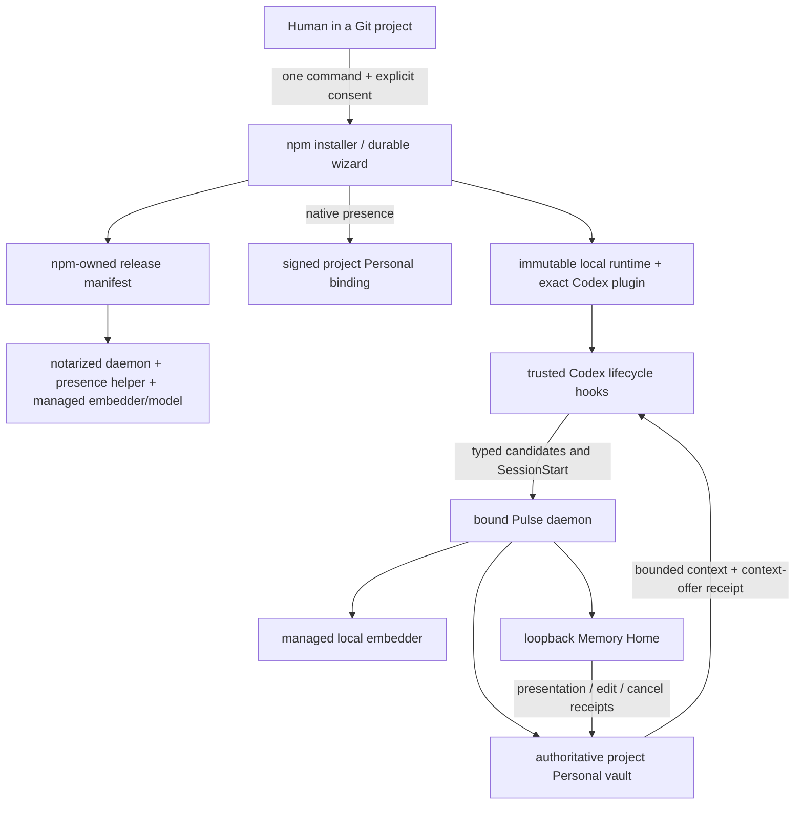
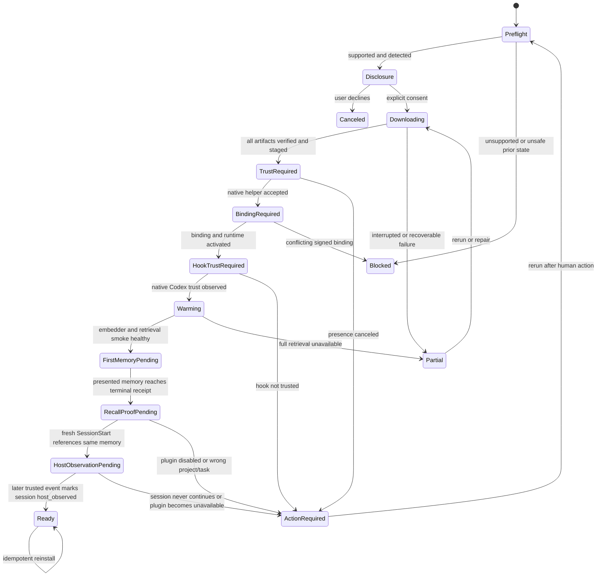
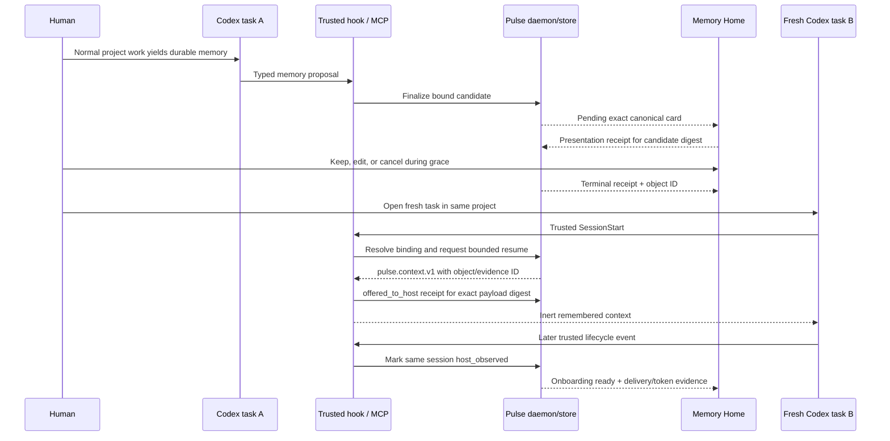
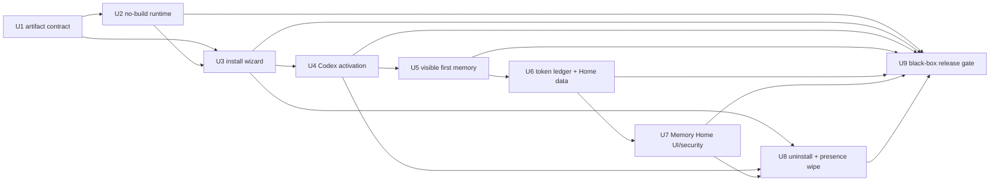

# Personal Pulse One-Command Onboarding - Plan

## Goal Capsule

- **Objective:** Make Personal Pulse installable on a clean Apple Silicon Mac from a project repository with one command, then prove that one real, user-visible memory is offered through the production `SessionStart` path and observed by a fresh Codex task.
- **Authority:** The user-approved Stage 1 contract in this planning session outranks the older broad Personal + Team roadmap. Existing signed workspace isolation, visible-before-commit memory control, and honest readiness rules remain mandatory.
- **Execution profile:** Deep, privacy-sensitive work across the npm installer, signed macOS artifacts, Codex lifecycle integration, Go store/server, and the local Memory Home. Implement red-first and release-gate the packed product rather than only the source checkout.
- **Stop conditions:** Stop if the implementation requires a user-installed Go or Python toolchain, an embedding API key, manual config editing, a global unbound vault, unseen auto-commits, a floating plugin/runtime version, a secret in a browser URL, or a fabricated token-savings number.
- **Tail ownership:** The executor owns implementation, tests, local product dogfood, simplification, code review, and commits. Publishing a new npm preview, uploading release artifacts, notarization submission, or distributing the build to colleagues requires fresh authorization.
- **Outcome boundary:** Stage 1 is a working project-bound Personal product for macOS arm64 + Codex. Team sharing, Dreaming, the full Ocean visualization, old-chat import, cloud sync, and other operating systems stay out of this increment.

The governing release test is deliberately simple: on a clean supported Mac, a person runs `npx -y @zbs-gg/pulse@preview install`, completes only the native human security approvals, creates one normal project memory through Codex, and sees that exact memory arrive automatically in a later fresh Codex task and in Memory Home.

---

## Product Contract

### Summary

Personal Pulse becomes a complete installable product rather than a collection of working subsystems. A PostHog-style terminal wizard detects the environment, discloses every local and network effect, downloads a verified no-build runtime, creates or reuses one signed project-bound Personal vault, installs the exact matching Codex plugin and lifecycle hooks, and opens a local Memory Home.

Installation is not considered complete when a daemon merely answers health checks. The product reaches `ready` only after full local retrieval is healthy, a real Codex turn produces a candidate the user actually saw, that candidate reaches a terminal receipt, a subsequent fresh Codex `SessionStart` offers a bounded context containing the same object reference, and a later trusted lifecycle event confirms that same Codex session continued.

Memory Home makes the result legible: current project and readiness, active memory count, the latest canonical memories and receipts, the exact Pulse context offered to Codex and whether that session was later observed, an honest token-economy state, and the bounded context the next task will receive.

### Problem Frame

Most of the hard engine work already exists, but the user experience still exposes repository internals:

- Codex installation is a manual sequence of trust installation, principal/binding creation, `pulse connect codex`, and native hook approval.
- The public npm path builds the Go daemon on the user's machine.
- Full retrieval needs manually provisioned Python, helper, model paths, or Cohere.
- The current packed Codex test prebuilds Go, uses synthetic authority, and injects a fake embedder, so it does not prove a colleague can install the real product.
- The macOS presence-helper contract is internally inconsistent (`29` self-test vectors in Swift versus `13` accepted by the CLI), and the current helper is not ready for normal Gatekeeper distribution.
- The local Viewer contains valuable continuity and Memory Tray surfaces, but its first screen does not lead with readiness, active memory count, latest canonical memories, or a defensible token ledger.
- The current token-economy headline derives a baseline by multiplying resume tokens by eight. That may be a research heuristic; it is not a user-facing measurement.
- A pending Memory Tray row can auto-commit after its timer even when no trusted surface proved that the user saw the card. That does not satisfy the accepted visible-before-save contract.

The missing layer is therefore not another demo. It is product assembly, signed distribution, truthful instrumentation, and a black-box acceptance gate.

### Actor

- A1. Individual developer — works in one Git repository on a supported Apple Silicon Mac, uses Codex as the active harness, owns the local Personal vault, and is the only authority for installation consent, workspace binding, memory presentation/correction/cancellation, uninstall, and wipe.

The model and installer are not additional actors with authority. They may propose content or guide the flow, but they cannot approve a workspace binding, claim that a card was presented, widen the destination, trust hooks, or authorize deletion.

### Key Flows

- F1. One-command install
  - **Trigger:** A1 runs `npx -y @zbs-gg/pulse@preview install` from a Git worktree.
  - **Steps:** The wizard detects platform, Node, Codex, canonical repository identity, prior Pulse state, free disk, and ports; shows local paths, downloads, expected size/RAM, hooks/config changes, data policy, network policy, and removal commands; obtains explicit consent; verifies and stages the version-bound runtime; requests native macOS presence; creates or reuses the signed Personal binding; registers the exact packaged Codex plugin/runtime; starts daemon and local embedder; and waits for native hook trust.
  - **Outcome:** The product reaches a truthful intermediate or terminal state: `warming`, `action_required`, `partial`, `blocked`, or `ready`. No fallback is relabeled as full Pulse.
- F2. Interrupted install and repair
  - **Trigger:** The process, network, machine, or Codex approval flow stops before completion, or an existing install is inconsistent.
  - **Steps:** A durable content-free install journal identifies completed steps, staged artifacts, active versions, binding identity, and required human gates. Re-running the same command resumes safe work; `pulse repair` performs the same detection without adopting data or replacing a binding silently.
  - **Outcome:** Pulse either resumes the exact transaction, restores the verified previous runtime, or reports one concrete action. Existing vault contents survive.
- F3. First real memory
  - **Trigger:** After hooks are trusted, A1 uses Codex normally in the bound project and expresses a durable decision, fact, preference, or open loop.
  - **Steps:** Codex proposes typed structured content; Pulse rejects unsafe content before SQLite/WAL, or renders the exact redacted candidate in authenticated Memory Home; Home writes a presentation receipt only after the card is visible; only then does the grace timer start; A1 can edit or cancel; a terminal write receipt records the result. A future Codex-native surface may also acknowledge presentation only if the host exposes a trustworthy human-visible callback.
  - **Outcome:** Only a receipt-backed `created`, `updated`, or `deduplicated` object becomes an active memory. System install events and simulated corpora do not count.
- F4. Fresh-task continuity proof
  - **Trigger:** A1 opens a later fresh Codex task in the same canonical repository.
  - **Steps:** The trusted `SessionStart` path resolves the signed binding, builds a bounded `pulse.context.v1`, records `offered_to_host` for the exact final payload digest and evidence IDs at the Codex serialization boundary, and returns inert evidence to Codex. A later trusted lifecycle event for the same session upgrades the receipt to `host_observed`.
  - **Outcome:** Onboarding reaches `ready` only when the `host_observed` receipt references the first terminal memory. Doctor, terminal receipt, and Memory Home agree. Pulse never labels an unacknowledged hook return as provider-consumed input.
- F5. Daily memory control
  - **Trigger:** A later Codex turn proposes another memory.
  - **Steps:** Every candidate repeats the presentation → grace/edit/cancel → terminal receipt path. Pending, rejected, canceled, and failed attempts remain inspectable but never enter recall.
  - **Outcome:** The user can always answer what Pulse proposed, whether it was seen, what happened to it, where it lives, and which later context used it.
- F6. Memory Home
  - **Trigger:** The wizard opens Home, A1 runs `pulse home`, or A1 follows an inspect link from a receipt.
  - **Steps:** `pulse home` starts a one-shot random loopback bootstrap with no URL credential, establishes a short-lived rotated Home session under strict local security policy, closes the bootstrap, and loads one bounded server-side snapshot for the current binding.
  - **Outcome:** The first viewport shows product readiness, project/privacy boundary, active memories, token economy, latest memories/receipts, and next-task context. Pending Tray items are prominent. Loading, warming, disconnected, and failed states are explicit.
- F7. Upgrade, disconnect, uninstall, and wipe
  - **Trigger:** A1 reruns a newer preview or removes Pulse.
  - **Steps:** Upgrade verifies compatibility and atomically activates version-matched components without re-binding the vault. Disconnect/uninstall removes integration and runtime while preserving data. Wipe remains a separate OS-presence-backed destructive flow.
  - **Outcome:** Runtime lifecycle and memory lifecycle are never conflated.

### Requirements

#### Install and distribution

- R1. Stage 1 supports macOS Apple Silicon, Node 20 or newer, Codex, and a canonical Git repository/worktree. The installer checks these prerequisites before product mutation and reports unsupported states without claiming success.
- R2. The single public entry point is `npx -y @zbs-gg/pulse@preview install`; after installation, `pulse install` is idempotent and `pulse repair` reuses the same state machine. The only additional user actions are explicit in-wizard consent, native macOS presence, native Codex hook trust, and normal Codex task use — never additional setup commands or config editing.
- R3. Before mutation, the wizard shows exact data/runtime locations, canonical project identity, files/integrations it will change, artifact and model download sizes, expected disk/RAM, network destinations, raw-transcript policy, backend-call policy, inspection commands, disconnect/uninstall behavior, and wipe boundary. Canceling at this screen performs no Pulse product mutation.
- R4. A supported install requires no system Go, system Python, Make, Docker, model API key, or manual environment variables. The product downloads verified prebuilt arm64 artifacts and a private managed local embedding runtime/model.
- R5. The npm version owns a canonically serialized, release-key-signed artifact manifest for daemon, presence helper, Codex plugin/runtime, embedding runtime, and model. A pinned release public key verifies the manifest; every artifact has an exact compatibility version, epoch, expiry, platform, architecture, minimum OS, byte size, SHA-256 digest, allowlisted download origin, and signing/notarization expectation. Activation rejects missing, expired, wrong-version, wrong-architecture, tampered, non-notarized, cross-origin-redirected, or incompatible components.
- R6. Artifact download is resumable and bounded; extraction rejects path traversal, links, archive bombs, unexpected files, and executable/custom model code; activation is staged and atomic; the installer retains one verified previous runtime for rollback. A content-free exclusive install journal makes repeated and interrupted runs deterministic and prevents concurrent installers. Persisted minimum manifest/runtime epochs prevent rollback; an explicit downgrade requires fresh OS presence and preserves the vault.
- R7. The macOS presence helper and every downloaded executable used by the product pass codesign, notarization, Gatekeeper, and self-test checks on a clean machine. The helper's producer and consumer use one shared versioned self-test contract.

#### Identity, privacy, and lifecycle

- R8. The installer creates one stable device-local Personal principal only when absent, then creates or reuses the existing signed binding for the canonical repository. It never auto-adopts a legacy/unbound database, replaces a different binding, merges projects, or exposes a global vault.
- R9. The installed Codex plugin, hooks, MCP launcher, daemon, and embedder are pinned to the same release manifest. Doctor verifies component versions and digests, not merely that a plugin with the expected name is enabled.
- R10. Hook trust and workspace binding remain human-only gates. The wizard may detect, explain, and wait for them, but may not bypass native trust, simulate presence in production, or treat agent output as approval.
- R11. Raw prompts/transcripts, secrets, credentials, and path-like content remain outside the Personal store. Dangerous content is rejected before SQLite or WAL; raw old-chat import, cloud sync, and backend model calls are off.
- R12. Full product readiness requires a healthy managed local embedder and one successful local retrieval smoke. While the model downloads or warms, the product says `warming`; if full retrieval cannot start, it reports `action_required`, `partial`, or `blocked`, never `ready` and never a renamed fallback.

#### Visible memory and continuity proof

- R13. Every private memory candidate needs a durable presentation receipt for the exact canonical candidate digest from an active authenticated Memory Home session. A Codex-native receipt is legal only if the host exposes a trustworthy callback that proves the card was rendered to the human; model text, MCP/tool output, and hook execution alone never qualify. The grace timer cannot start, and auto-commit cannot occur, before that receipt exists.
- R14. The user can edit or cancel a presented candidate during the configured grace window. Edit creates a new canonical digest and therefore requires presentation of the edited version before commit. Pending, canceled, rejected, and failed candidates are never retrievable.
- R15. Every save outcome has an immutable receipt ID and, only for `created`, `updated`, or `deduplicated`, a canonical object ID. The first-memory milestone requires one of those terminal statuses; install/system events do not count.
- R16. The onboarding proof uses one normal Codex memory from the bound project, followed by a fresh Codex task whose real `SessionStart` context-offer receipt references that object/evidence ID and whose later trusted lifecycle event marks the same session `host_observed`. Simulated corpora, direct hook invocation, synthetic bindings, fake embedders, and same-process reads cannot satisfy the release proof.
- R17. Doctor and Home consume one versioned `ReadinessSnapshot` derived from verified live artifacts/binding plus immutable lifecycle, terminal first-memory, presentation, context-offer, and host-observed receipts. They cannot persist separate derived readiness state or independently guess readiness.

#### Memory Home and token economy

- R18. Memory Home's first viewport shows current canonical project, local/private boundary, one readiness state with the next action, active canonical memory count, Pulse context offered to the current/last task and its acknowledgement state, token-economy state, latest active memories with terminal receipts, pending Tray cards, and the bounded next-task preview.
- R19. Active count includes canonical active Personal objects only. Latest memories are a bounded server-side projection of active objects with kind, redacted summary, provenance, timestamp, object ID, and receipt ID; pending/rejected/canceled/failed attempts appear in a separate receipt stream.
- R20. Every continuity return writes a content-free immutable delivery receipt at the final Codex serialization boundary containing project/binding references, host/session reference, payload digest, evidence/object IDs, tokenizer/method version, rendered payload bytes, locally counted Pulse tokens, acknowledgement state (`offered_to_host` or `host_observed`), optional provider-actual input tokens with source, and baseline coverage metadata. It stores no raw prompt or full injected text and never calls `offered_to_host` provider-consumed input.
- R21. Token economy has explicit `collecting_baseline`, `estimated`, `measured`, and `unavailable` states. Home may show the locally counted offered Pulse context immediately. It may show estimated avoided tokens only after at least one valid receipt-linked source-equivalent/host-observed pair, together with method and coverage; a percentage/trend requires at least three comparable pairs. `measured` is reserved for provider evidence or a controlled comparison. The current `resume × 8` calculation is removed from user-facing and API contracts.
- R22. Home authentication never prints or retains the persistent viewer/IPC secret or a reusable bearer in stdout, logs, browser history, referrers, or served page markup. `pulse home` uses a one-shot random loopback bootstrap listener with no URL credential to establish a short-lived, rotated Home session, then closes the bootstrap. Home enforces exact Host/Origin, no CORS, bounded absolute/idle expiry, logout/revocation, CSRF on every mutation, no GET mutation, `Cache-Control: no-store`, `Referrer-Policy: no-referrer`, and CSP including `frame-ancestors 'none'`.
- R23. Home is an operator/read model over the authoritative store, not a second memory authority. Corrections, cancellation, delete, and wipe reuse existing governed store operations and receipts.

#### Operations and removal

- R24. Installer outcomes are `ready`, `warming`, `action_required`, `partial`, and `blocked`, each with a stable reason code, completed-step receipt, and exactly one next action. An already healthy install returns `ready/already_installed`; an interrupted compatible install returns `resumed`; an incompatible install preserves data and returns `action_required`.
- R25. `pulse uninstall` and harness disconnect remove only recognized Pulse runtime/plugin/hook state and preserve the signed binding and vault. Whole-vault wipe remains separate, destructive, exact-targeted, and protected by fresh OS-backed user presence.
- R26. Stage 1 emits no product telemetry by default. Artifact/model downloads are the only required network effects after npm fetch, and the disclosure names their destinations before consent.
- R27. Presentation acknowledgement uses a Home-only authorization path that explicitly rejects `X-Pulse-Key`, `Authorization`, MCP/tool callers, configured CORS origins, and ambient localhost authority. A single-use capability binds the authenticated Home session, CSRF token, binding, candidate ID, exact candidate digest, and short expiry; replay, edit/stale digest, prefetch/iframe, and cross-binding use fail closed.
- R28. Uninstall deletes only exact manifest-owned regular files without following links and keeps shared runtime/plugin components while any healthy Codex/Claude or second-project activation references them. Modified/unowned files produce an inspectable refusal rather than deletion.
- R29. Product wipe uses a server nonce and a fresh signed presence assertion bound to `vault.wipe`, binding/store ID, exact target digest, issued/expiry time, and single use. It removes every memory representation owned by the target vault — SQLite content plus WAL/SHM, vectors/indexes, projections, caches, and staged memory artifacts — while preserving the trust binding/runtime, and writes an immutable content-free wipe receipt. The UI describes this as application-level deletion, not forensic disk erasure.

### Acceptance Examples

- AE1. Given a clean supported Mac with Node 20+ and Codex but no Go or Python in `PATH`, when A1 runs the one command and completes human gates, then the no-build daemon and managed local embedder start and doctor does not report a fallback.
- AE2. Given the disclosure screen, when A1 cancels, then no Pulse runtime, binding, plugin, hook, daemon, model, vault, or install journal is created; the unavoidable prior npm cache fetch is described as outside the product mutation boundary.
- AE3. Given the current helper producer/consumer mismatch or an unstapled helper, when install verifies it, then activation stops before trust installation with a stable incompatible-artifact reason.
- AE4. Given an interrupted model download, when the same command is run again, then it resumes verified ranges or restarts only that artifact, preserves the vault/binding, and never activates partial bytes.
- AE5. Given a manifest with a wrong architecture, incompatible component version, digest mismatch, or altered plugin snapshot, when install or doctor checks it, then the component is rejected and the previous verified runtime remains active.
- AE6. Given a canceled Touch ID/admin-presence or untrusted Codex hook, when the wizard evaluates state, then it reports `action_required` with one human step and does not claim automatic memory is ready.
- AE7. Given no existing Personal principal/binding, when A1 approves the project, then one stable local principal and signed canonical workspace binding are created. Re-running install reuses them; a different repository cannot read the first vault.
- AE8. Given a candidate containing a secret, raw transcript, credential, or unsafe path-like content, when it reaches finalization, then Pulse creates a visible rejection receipt and the content is absent from SQLite, WAL, logs, install journal, and continuity-delivery receipts.
- AE9. Given a safe candidate that has not produced a presentation receipt, when its grace duration elapses, then it remains pending and cannot be retrieved. Given a trusted presentation receipt followed by cancel, it reaches `canceled` and never commits.
- AE10. Given a presented candidate that A1 edits, when the original timer expires, then neither original nor edited content commits until the edited canonical digest is presented and its own grace window completes.
- AE11. Given the first real Codex memory reaches `created`, `updated`, or `deduplicated`, when A1 opens a fresh task in the same repository, then the real `SessionStart` context offer references the same object/evidence ID; when a later trusted event confirms that same session, the receipt becomes `host_observed` and onboarding reaches `ready`.
- AE12. Given the same fresh task in a different repository or an invalid binding, when `SessionStart` runs, then the first project's memory neither appears nor influences retrieval, counts, trace, or next-task preview.
- AE13. Given a new empty vault, when Home opens, then it shows zero active memories, `collecting_baseline`, the project/privacy boundary, and the exact next action — not fake savings or demo content. After AE11, it shows one active memory and the latest terminal receipt.
- AE14. Given one `offered_to_host` context without a comparable baseline, when Home renders token economy, then it shows local Pulse context tokens and `collecting_baseline`. Given one valid host-observed comparable pair, it may show a labeled estimate and coverage `1`; it does not show a trend/percentage until coverage reaches `3`.
- AE15. Given the daemon, embedder, or lifecycle plugin becomes unavailable after installation, when Home and doctor refresh, then both show the same non-ready reason; latest durable memories remain inspectable and no standalone store is created.
- AE16. Given a healthy install, when A1 reruns the installer, then it returns `already_installed` without changing the binding. Given uninstall, runtime/hooks are removed but memory remains. Wipe still requires its separate OS-presence approval.
- AE17. Given an agent with the daemon IPC key or an MCP connection, hostile localhost origin, replayed Home request, stale/edit digest, iframe/prefetch, or another project session, when it calls presentation acknowledgement, then no presentation receipt or grace deadline is created.
- AE18. Given two bound projects and both Codex and Claude references to a shared runtime, when one project uninstalls, then only that activation's exact owned integration state is removed; shared components and both vaults survive. Symlink swaps and modified files fail closed.
- AE19. Given a server-issued wipe nonce and a fresh correct presence assertion, when wipe runs and the daemon crashes/restarts during cleanup, then the operation resumes idempotently and reaches complete only after every application-level representation is gone. Wrong-target, expired, replayed, terminal-only, hook, IPC-key-only, and phrase-only attempts are denied.

### Success Criteria

- A clean-machine black-box run proves AE1 through AE19 against the packed release candidate, with no system Go/Python and no fake embedder or synthetic workspace authority.
- The only installation command a colleague must type is `npx -y @zbs-gg/pulse@preview install`; every unavoidable security interaction is explained inside the same durable wizard/onboarding flow.
- Full local retrieval is ready, not keyword fallback, before the product says `ready`.
- One real user-approved memory survives process restart and appears automatically in a fresh Codex task through the production lifecycle path.
- Every committed private memory has a prior exact-digest presentation receipt plus a terminal write receipt; unseen candidates cannot auto-commit.
- Memory Home makes active memory count, latest memories, receipts, context-offer/host-observed state, and token methodology inspectable without exposing a persistent credential.
- No user-facing surface or API derives savings from the current `×8` heuristic.
- Reinstall, interruption, repair, upgrade, disconnect, uninstall, and outage preserve the Personal vault and project boundary.
- Existing Codex and Claude product paths, store/server tests, MCP tests, and repository release gates remain green.

### Scope Boundaries

#### Included

- macOS Apple Silicon + Codex Personal Pulse.
- One-command audit/disclosure/install/repair state machine.
- Signed and notarized no-build daemon, presence helper, plugin/runtime, and managed bge-m3-compatible local embedding bundle.
- Stable Personal principal and signed repository/worktree binding.
- Real Codex lifecycle activation, presentation receipts, first real memory, and fresh-task recall proof.
- Honest token-economy ledger and a focused secure local Memory Home.
- Uninstall-preserves-data and separately authorized wipe behavior.

#### Deferred

- Team identities, Desk/Commons, Airlock, roles, mandatory team practices, and remote service deployment.
- Dreaming loops for a person or team and principle/experiment compilation.
- Full Ocean graph visualization and deep memory exploration.
- Old-chat, Krisp, Telegram, email, or bulk document import.
- Claude Code as an equal one-command onboarding target; its existing product path must not regress.
- Intel macOS, Linux, Windows, hosted/cloud storage, multi-device sync, mobile, and enterprise administration.
- Automatic Node or Codex installation; `npx` and an installed Codex are prerequisites to this command.

#### Outside the product contract

- Demo-only simulated memory as evidence that the product works.
- Raw transcript capture, invisible background writes, agent-selected vaults, global cross-project Personal memory, backend LLM calls, or Cohere as the default path.
- Claims such as “Claude never forgets,” production readiness, or measured savings without corresponding evidence.

### Dependencies and Assumptions

- Stage 1 intentionally assumes a supported Apple Silicon Mac, Node 20+, installed Codex, a Git repository/worktree, enough free disk for the managed local model/runtime, and interactive access to macOS presence plus Codex hook trust.
- The current bge-m3-compatible local retrieval path remains the quality baseline. The release may change packaging, but changing the model requires passing the existing retrieval quality and state-aware ranking gates; installer work cannot silently trade quality for a smaller download.
- GitHub Release assets (or an equivalent immutable public asset host already owned by the project) may serve versioned binaries/models. The npm package contains the integrity manifest; no new always-on backend is introduced.
- Codex native hook trust cannot be programmatically approved. “One command” means one command-driven, resumable wizard with explicit human gates, not bypassing the host's security UI.
- Npm necessarily downloads the package before its code can show the disclosure. The wizard distinguishes that package-manager effect from later Pulse runtime/model/vault mutations.

---

## Planning Contract

### Key Technical Decisions

- KTD1. **Build the Personal product before Team Preview.** `session-settled: user-directed` — the rejected alternative is another broad Personal + Team + Dreaming implementation wave or a demo-first surface. Stage 1 ends at one installed Personal memory working across real Codex tasks.
- KTD2. **Keep the existing signed project-bound vault as the isolation primitive.** `session-settled: user-approved` — the rejected alternative is a global Personal store with agent-selected routing. One device may have many projects and later many teams; the host binding, not the model, selects the vault.
- KTD3. **One command may contain human approvals, but no extra setup commands.** macOS presence and Codex hook trust stay explicit and detectable. The wizard is durable across process/task restarts and reports the exact pending gate.
- KTD4. **Ship no-build, version-bound release assets rather than compiling the repository on user machines.** The npm package carries a canonically serialized manifest signed by a release key pinned in the audited installer; persisted epochs prevent downgrade after first trust. A staged downloader supplies a notarized daemon, presence helper, immutable Codex plugin/runtime snapshot, and a private managed arm64 embedding runtime plus data-only pinned bge-m3-compatible model. Npm package integrity remains an explicit first-install trust root; provenance and protected publication controls mitigate, but cannot cryptographically undo, execution of a malicious first-run npm package.
- KTD5. **Use a private managed embedding runtime, not a system Python dependency.** Preserve the existing JSON-line embedder protocol and retrieval semantics, but install the interpreter/libraries/helper/model under versioned Pulse-owned paths. The user supplies no Python, Go, environment variables, or API key.
- KTD6. **Separate installer transaction state from product readiness.** The content-free install journal is authoritative only for artifact/trust/binding/runtime transaction and rollback steps. Immutable vault receipts remain authoritative for memory, presentation, lifecycle, and context offers. A pure versioned `ReadinessSnapshot` combines verified live state with those receipts; `install`, `repair`, doctor, and Home consume that same projection and never persist a second derived onboarding state.
- KTD7. **Add presentation receipts as a hard precondition for grace and commit.** A pending database row, model text, or MCP/tool result is not proof that the user saw it. Authenticated Memory Home is the Stage 1 guaranteeing surface for the exact canonical digest; a Codex-native path remains disabled unless the host later supplies a trustworthy human-visible callback. Edits invalidate prior presentation.
- KTD8. **Prove the product with two real Codex tasks.** The first post-install task creates a terminal user memory; a later fresh task receives it through production `SessionStart`. Direct hook execution remains a lower-level test, not release evidence.
- KTD9. **Replace token theater with an immutable delivery ledger at the Codex serialization boundary.** Count the exact final Pulse payload using a named versioned local tokenizer/method and retain payload digest plus evidence IDs. Record `offered_to_host` first, promote to `host_observed` only through a later trusted event, and reserve provider-consumed claims for provider evidence. Avoided tokens remain a labeled counterfactual estimate with coverage.
- KTD10. **Keep Memory Home server-rendered and store-backed.** Reuse the current Go Viewer and Memory Tray rather than adding a frontend framework or a second database. Add one bounded Home snapshot/read model and move import/graph detail below the Stage 1 hierarchy.
- KTD11. **Bootstrap Home through a one-shot random loopback listener with no URL bearer.** Persistent viewer/IPC credentials and reusable session tokens never appear in terminal output, browser URLs, history, or served markup. Home has its own exact Host/Origin, no-CORS, CSRF, expiry, no-store, no-frame security policy; presentation acknowledgement additionally rejects ordinary daemon/MCP authority.
- KTD12. **Treat remove-runtime and delete-memory as different product actions.** Manifest-owned reference-counted uninstall preserves every signed vault and shared harness runtime still in use. Whole-vault application-level wipe remains an exact-target, server-nonce, fresh-presence, replay-safe operation with its own receipt.

### Prior-Art Decisions

- [`thedotmack/claude-mem`](https://github.com/thedotmack/claude-mem) demonstrates that a local memory product can use one `npx` installer, automatically provision private runtimes, register a complete Codex lifecycle, expose a live memory feed, provide `repair`, and verify a clean-room package. Pulse adopts those install-reliability patterns. It does not copy email capture, default-on telemetry, invisible feed failures, or the marketing interpretation of work-minus-read tokens. Relevant primary sources: [installer](https://github.com/thedotmack/claude-mem/blob/main/src/npx-cli/commands/install.ts), [runtime setup](https://github.com/thedotmack/claude-mem/blob/main/src/npx-cli/install/setup-runtime.ts), [Codex integration](https://github.com/thedotmack/claude-mem/blob/main/src/services/integrations/CodexCliInstaller.ts), [viewer](https://github.com/thedotmack/claude-mem/blob/main/src/ui/viewer/App.tsx), and [token calculation](https://github.com/thedotmack/claude-mem/blob/main/src/services/context/TokenCalculator.ts).
- [`PostHog/wizard`](https://github.com/PostHog/wizard) demonstrates a strong terminal state machine: detect before asking, disclose privacy early, ask only unresolved questions, keep the terminal as the source of truth through browser/native detours, distinguish healthy/degraded/blocked outcomes, and exercise screens through a real PTY harness. Pulse adopts that interaction grammar without giving an agent permission to rewrite a user's project or expanding Stage 1 into optional integrations. Relevant primary sources: [steps](https://github.com/PostHog/wizard/blob/main/src/lib/programs/posthog-integration/steps.ts), [intro/privacy](https://github.com/PostHog/wizard/blob/main/src/ui/tui/screens/PostHogIntegrationIntroScreen.tsx), [health](https://github.com/PostHog/wizard/blob/main/src/ui/tui/screens/health/HealthCheckScreen.tsx), [run](https://github.com/PostHog/wizard/blob/main/src/ui/tui/screens/RunScreen.tsx), [outro](https://github.com/PostHog/wizard/blob/main/src/ui/tui/screens/OutroScreen.tsx), and [E2E architecture](https://github.com/PostHog/wizard/blob/main/e2e-harness/ARCHITECTURE.md).

### Existing Contracts to Preserve

- [`docs/PULSE_CODEX_TEAM_DAY0_CONTRACT.md`](../../docs/PULSE_CODEX_TEAM_DAY0_CONTRACT.md) remains authoritative for host-owned binding, forbidden authority fields, write receipts, inert `pulse.context.v1`, and human-only destructive operations.
- [`docs/one_store_multiharness_capture.md`](../../docs/one_store_multiharness_capture.md) remains authoritative for one signed bound vault shared only by explicitly bound harnesses, automatic lifecycle, raw-transcript exclusion, and no fallback readiness.
- Existing Codex plugin/runtime code under `plugins/pulse/` plus `pulse-app/cli/src/codex-install.js`, `codex-runtime.js`, and `codex-hooks.js` remains the product edge; this plan packages and orchestrates it rather than replacing it.
- Existing Memory Tray semantics in `pulse-app/internal/store/memory_tray.go`, migration `041_memory_tray_receipts.sql`, and `pulse-app/internal/server/turn_finalize.go` remain the write-control core; this plan closes the unseen-presentation gap.

### Technical Design

#### Component and trust topology

The manifest and signed workspace binding close different trust questions. The manifest proves which executable components belong to this package version. The binding proves which local vault belongs to this canonical repository. Neither may substitute for the other.

#### Installer/onboarding state machine

`warming` may allow inspection and safe candidate preparation, but it is not full product readiness. `partial` means Pulse changed some recognized product state and can resume/repair. `blocked` means the state is unsupported or unsafe to mutate automatically.

#### Real first-memory and fresh-task proof

Memory Home is the Stage 1 presentation authority and must bind its receipt to the exact canonical digest and authenticated surface instance. Codex may deep-link to the card. It may become an additional presentation authority only when a host-native human-visible callback exists; ordinary model/tool output cannot mint the receipt.

#### Token-economy contract

| Field | Meaning | Headline allowed? |
|---|---|---:|
| `rendered_bytes` | Exact bytes of the serialized Pulse context | Yes, factual detail |
| `pulse_tokens` | Local count under named tokenizer/method version for that exact offered digest | Yes, labeled as local Pulse context offered to Codex until host-observed |
| `provider_actual_input_tokens` | Provider-reported input usage with source, when exposed | Yes, labeled provider actual |
| `source_equivalent_tokens` | Ephemeral host-side count of the context/work that would otherwise need rediscovery; content itself is not stored | Only with method and coverage |
| `estimated_avoided_tokens` | `source_equivalent_tokens - pulse_tokens`, floored at zero, for matched pairs | Yes, explicitly estimated |
| `measured_avoided_tokens` | Controlled comparison or provider evidence with reproducible source | Only when that evidence exists |

The aggregate Home API returns sums only over comparable methods and exposes pair count, time window, tokenizer/method versions, and coverage. Mixed or stale methods render `unavailable` rather than a blended number.

### System-Wide Impact

- **Callers:** `pulse install`, `pulse repair`, `pulse doctor codex`, `pulse home`, Codex plugin hooks, the Memory Home, and release scripts all consume one install/readiness contract.
- **Callees:** CLI orchestration calls artifact verification, native presence, workspace binding, runtime/plugin installation, supervisor, daemon health, Memory Tray, continuity, and browser launch.
- **Data changes:** Three append-only migrations add presentation receipts, content-free continuity-delivery/token receipts, and content-free vault-wipe receipts. No migration rewrites existing memory content or backfills guessed baselines.
- **API changes:** Add bounded local endpoints for Home-only presentation acknowledgement, Home snapshot, versioned `ReadinessSnapshot`, continuity-offer acknowledgement, one-shot Home bootstrap/session, and presence-bound wipe. Existing memory/status and continuity routes remain compatible or delegate to the new read model.
- **Failure propagation:** Artifact, trust, binding, embedder, lifecycle, memory, and context-offer/observation failures map to stable installer reason codes and the same Home/doctor state. No layer converts a failed dependency to `ready`.
- **Lifecycle hazards:** Concurrent installers, interrupted downloads, model warmup, task restart, daemon crash, stale browser sessions, candidate edits, and plugin upgrades are explicitly fenced by journals, locks, digests, and idempotency keys.
- **Observability:** Logs and receipts may include stable reason codes, component versions/digests, opaque object/receipt IDs, byte/token counts, and durations. They must exclude secrets, raw prompts/transcripts, full candidate text, persistent browser credentials, and local sensitive paths beyond the user-approved install summary.

### Implementation Units

#### U1. Close macOS artifact and compatibility release blockers

- **Goal:** Establish one testable release contract before building the wizard on top of artifacts that a colleague's Mac will reject.
- **Requirements:** R1, R5-R7, R9; AE3-AE5.
- **Files:**
  - Modify `pulse-app/native/pulse-presence-helper/main.swift`
  - Modify `pulse-app/cli/src/trust-helper.js`
  - Modify `pulse-app/cli/src/trust-helper.test.js`
  - Modify `pulse-app/cli/src/presence-helper-native.test.js`
  - Modify `pulse-app/cli/scripts/build-presence-helper.mjs`
  - Modify `pulse-app/cli/scripts/prepare-preview-vendor.mjs`
  - Modify `pulse-app/cli/package.json`
  - Create `pulse-app/cli/src/release-manifest.js`
  - Create `pulse-app/cli/src/release-manifest.test.js`
  - Create `pulse-app/cli/release/personal-preview-manifest.schema.json`
  - Create `pulse-app/cli/release/pulse-release-root.pem`
- **Approach:**
  1. Write failing contract tests that build/run the native helper when available and require its versioned self-test response to match the CLI verifier; remove the duplicated magic vector count.
  2. Define canonical manifest bytes, release signature/key ID, epoch/expiry/rotation, persisted minimum accepted epoch, and the compatibility set for package, daemon, helper, plugin/runtime, embedder runtime, and model. Include size/digest/platform/origin/signing fields and reject unknown or missing authority-bearing fields.
  3. Align the documented and enforced Node floor at 20 for the Stage 1 package.
  4. Make the release builder codesign, submit/notarize, staple, and verify every executable artifact; sign the canonical manifest with the protected release key; test mode may use fixtures, but production packaging must reject unsigned/unnotarized assets.
  5. Keep the signed manifest deterministic and npm-distributed while the public verification key is pinned in the audited installer and documented out of band. Generated release assets do not enter the source tree as opaque binaries.
- **Test scenarios:** Matching helper passes; old `13`/new `29` drift fails; wrong schema/version/architecture/digest/signing expectation fails; unknown/expired key and invalid signature fail; a valid older manifest is rejected after epoch advancement unless a fresh-presence downgrade is approved; an exact component set passes; Node 18 reports unsupported without mutation.
- **Verification:** CLI unit tests plus a release-manifest fixture test and a clean Gatekeeper verification receipt on the release candidate.
- **Done when:** No production install path can start trust/binding work with a mismatched, floating, or non-notarized component.

#### U2. Deliver a resumable no-build Personal runtime

- **Goal:** Replace source compilation and manual embedding configuration with verified, Pulse-owned runtime provisioning.
- **Requirements:** R4-R7, R12; AE1, AE4, AE5.
- **Files:**
  - Create `pulse-app/cli/src/artifact-installer.js`
  - Create `pulse-app/cli/src/artifact-installer.test.js`
  - Create `pulse-app/cli/src/install-journal.js`
  - Create `pulse-app/cli/src/install-journal.test.js`
  - Modify `pulse-app/cli/src/local-supervisor.js`
  - Modify `pulse-app/cli/src/local-supervisor.test.js`
  - Modify `pulse-app/cli/src/cli.js`
  - Modify `pulse-app/cli/scripts/prepare-preview-vendor.mjs`
  - Modify `pulse-app/cli/scripts/codex-product-e2e.mjs`
  - Modify `pulse-app/cmd/pulse/main.go`
  - Modify `pulse-app/internal/embed/local.go`
- **Approach:**
  1. Write red tests for absent Go/Python, interrupted/ranged download, checksum failure, wrong architecture, concurrent install, atomic activation, and rollback.
  2. Download only from allowlisted origins into content-addressed staging paths; reject cross-host redirects, traversal, symlinks/hardlinks, archive bombs, and unexpected files; verify size/digest/signature/notarization; fsync the journal and artifact; then atomically switch the versioned `current` pointer. Never execute from partial download paths.
  3. Replace `ensureProductDaemonBinary()` source-build behavior in production with the manifest-provided arm64 daemon. Preserve an explicit developer-only source path outside product readiness.
  4. Provision a private versioned embedding runtime and pinned data-only bge-m3-compatible model under Pulse-owned paths. Disable remote/custom model code and validate the allowed file set before load. The supervisor supplies internal paths to the existing JSON-line helper protocol; it never reads system Python or requires public environment variables.
  5. Require embedder start, model load, index/query smoke, and daemon identity checks before full retrieval readiness.
- **Test scenarios:** Clean PATH without `go`/`python`; interrupted and resumed model download; corrupt model; cross-host redirect; traversal/link/archive bomb/unexpected file; model custom-code attempt; insufficient disk; port collision; daemon crash during activation; previous version recovery; managed embedder returns a real vector with expected dimension and retrieval smoke passes.
- **Verification:** Artifact/unit tests and the packed Codex E2E running with no system toolchain and a real managed embedder bundle.
- **Done when:** A clean supported Mac can reach healthy full local retrieval from packaged assets without compilers, API keys, or manual configuration.

#### U3. Build the one-command install/repair wizard

- **Goal:** Orchestrate existing trust, binding, runtime, plugin, and supervisor pieces as one durable PostHog-style flow.
- **Requirements:** R1-R4, R6, R8-R12, R24-R26; AE2, AE6, AE7, AE15, AE16.
- **Files:**
  - Create `pulse-app/cli/src/personal-install.js`
  - Create `pulse-app/cli/src/personal-install.test.js`
  - Create `pulse-app/cli/src/install-plan.js`
  - Create `pulse-app/cli/src/install-plan.test.js`
  - Create `pulse-app/cli/src/personal-principal.js`
  - Create `pulse-app/cli/src/personal-principal.test.js`
  - Modify `pulse-app/cli/src/cli.js`
  - Modify `pulse-app/cli/src/binding-admin.js`
  - Modify `pulse-app/cli/src/binding-admin.test.js`
  - Modify `pulse-app/cli/src/workspace-binding.js`
  - Modify `pulse-app/cli/src/cli-idempotency.js`
  - Modify `pulse-app/cli/src/cli-idempotency.test.js`
- **Approach:**
  1. Extract command orchestration from the monolithic CLI into a pure detector/plan and a journaled executor with stable step and reason codes.
  2. Detect supported platform, canonical Git identity/worktree, Node/Codex, disk/RAM/ports, current package/runtime, existing principal/binding/vault, daemon, embedder, plugin, hook trust, and onboarding milestones before asking questions.
  3. Render one disclosure/consent screen from the exact plan. Do not create Pulse state before consent; clearly separate prior npm caching from product mutations.
  4. Create a stable device-local principal once; create/reuse only an exact signed Personal binding. Conflicting, corrupt, legacy, or unbound state stops for explicit repair/migration rather than silent adoption.
  5. Execute verified staging of the complete compatibility set → install verified presence helper → create/reuse principal and signed binding → atomically activate runtime/plugin → supervisor → health as resumable steps. No trust or binding mutation occurs before every required artifact is staged and verified. A process restart resumes from verified facts, not optimistic journal flags.
  6. Expose `install`, `repair`, `install-plan --json`, and `home`, and route `uninstall`/wipe to U8's separately governed operations. `--yes` may accept non-security prompts only; it cannot approve disclosure, presence, binding replacement, hook trust, downgrade, or wipe.
  7. End every run with a short durable receipt: outcome, completed steps, current project, preserved data, and one next action.
- **Test scenarios:** Cancel before mutation; new install; already ready; interrupted resume; incompatible prior version; corrupt journal; two installers; Git worktree and symlink; no Git repo; Codex missing/logged out; presence cancel; existing conflicting binding; uninstall preserves vault.
- **Verification:** Node tests plus a real PTY snapshot harness that drives every state and proves terminal output remains useful through native/browser detours.
- **Done when:** A supported user needs one setup command and no undocumented recovery choreography.

#### U4. Pin and prove native Codex activation

- **Goal:** Turn the existing Codex product edge into a version-matched, observable lifecycle rather than a loosely connected plugin.
- **Requirements:** R9, R10, R12, R17, R24; AE5, AE6, AE15.
- **Files:**
  - Modify `pulse-app/cli/src/codex-install.js`
  - Modify `pulse-app/cli/src/codex-install.test.js`
  - Modify `pulse-app/cli/src/codex-runtime.js`
  - Modify `pulse-app/cli/src/codex-runtime.test.js`
  - Modify `pulse-app/cli/src/codex-hooks.js`
  - Modify `pulse-app/cli/src/codex-hooks.test.js`
  - Modify `plugins/pulse/.codex-plugin/plugin.json`
  - Modify `plugins/pulse/.mcp.json`
  - Modify `plugins/pulse/hooks/hooks.json`
  - Modify `plugins/pulse/hooks/pulse-hook.mjs`
  - Modify `plugins/pulse/runtime-locator.mjs`
  - Modify `plugins/pulse/mcp/server.mjs`
  - Modify `pulse-app/cli/src/cli.test.js`
- **Approach:**
  1. Install the exact plugin snapshot owned by the package/manifest from an immutable local marketplace/runtime source; eliminate the floating remote-source mismatch.
  2. Bind plugin, MCP launcher, hook definition, daemon, and runtime digests to the same compatibility set and verify them in doctor.
  3. Preserve Codex native hook review. The wizard detects the exact trusted hook-definition hash, shows one native action when absent, and continues from the journal after task/process restart.
  4. Record content-free lifecycle milestones for trusted `SessionStart`, prompt/turn, proposal/finalize, and stop paths. Production doctor requires real trusted milestones, not direct script invocation.
  5. Keep Claude Code's existing shared runtime behavior compatible and keep plugin-owned MCP authority fields unavailable to the model.
- **Test scenarios:** Exact plugin passes; floating/wrong version fails; hook changed after trust becomes action-required; plugin disabled; nested worktree resolves same binding; direct MCP launch cannot manufacture session/workspace/binding; Claude product path remains green.
- **Verification:** Plugin/runtime/hook unit tests, Codex product E2E, Claude product E2E, and a manual native hook-trust receipt on the clean release machine.
- **Done when:** Doctor can prove which exact product edge ran for the bound project and cannot be fooled by plugin name or synthetic environment alone.

#### U5. Enforce visible-before-save and the real first-memory proof

- **Goal:** Make the accepted “show every write” promise true at the storage boundary and use it to finish onboarding with real memory continuity.
- **Requirements:** R11, R13-R17, R23, R27; AE8-AE12, AE17.
- **Files:**
  - Create `pulse-app/internal/store/migrations/045_memory_presentation_receipts.sql`
  - Modify `pulse-app/internal/store/schema_manifest_test.go`
  - Modify `pulse-app/internal/store/memory_tray.go`
  - Modify `pulse-app/internal/store/memory_tray_test.go`
  - Modify `pulse-app/internal/server/turn_finalize.go`
  - Modify `pulse-app/internal/server/turn_finalize_test.go`
  - Create `pulse-app/internal/server/memory_presentation.go`
  - Create `pulse-app/internal/server/memory_presentation_test.go`
  - Modify `pulse-app/cli/src/codex-hooks.js`
  - Modify `pulse-app/cli/src/codex-hooks.test.js`
  - Modify `pulse-app/cli/scripts/codex-product-e2e.mjs`
- **Approach:**
  1. Add append-only presentation receipts keyed by candidate ID, canonical digest, trusted surface kind/instance, timestamp, and binding. Store no extra content.
  2. Change the commit invariant: unpresented pending candidates have no running commit deadline. A trusted presentation atomically sets the grace deadline; cancel/edit races resolve under the existing transaction/receipt model.
  3. Invalidate presentation on edit because the digest changes. Require the exact edited card to be presented before its timer starts.
  4. Define a Home-presentation capability that binds browser session, CSRF value, signed workspace binding, candidate ID, exact digest, and short expiry. The service rejects ordinary `X-Pulse-Key`, `Authorization`, MCP/tool, CORS, hook, model, and ambient localhost authority. U5 does not register this path under the current global daemon middleware; U7 exposes it only inside the Home-only route group.
  5. Replace `ViewerFirstMemory()`/install-event proof with a terminal memory milestone and later `offered_to_host` plus `host_observed` milestones for the same object/evidence ID.
  6. Add the memory/presentation/lifecycle inputs consumed by the pure `ReadinessSnapshot`; do not persist a separate onboarding state. The wizard can exit/restart because doctor/Home recompute from immutable receipts plus verified live state.
- **Test scenarios:** Unseen candidate never auto-commits; a valid presentation capability starts grace and commits; cancel wins; edit invalidates old receipt/timer; concurrent presentations are idempotent; IPC key, Authorization, MCP/tool, replay, stale/edit digest, prefetch/iframe, and cross-binding capabilities are rejected; rejected unsafe candidate never reaches SQLite/WAL content; readiness fixtures require terminal object plus later matching `offered_to_host`/`host_observed`; wrong project/task does not.
- **Verification:** Store race tests, server service/capability tests, hook unit tests, and readiness golden fixtures. U7 owns production Home route integration; U9 owns the packed two-task product proof.
- **Done when:** The store/service layer makes exact-digest presentation a necessary precondition for every active private memory and exposes the immutable facts needed by readiness; no global daemon/MCP route can mint presentation. End-to-end Home presentation and cross-task proof close in U7 and U9.

#### U6. Add the honest continuity/token ledger and Home snapshot

- **Goal:** Produce one authoritative data contract for the Memory Home and remove the fabricated `×8` savings path.
- **Requirements:** R18-R21, R23; AE13-AE15.
- **Files:**
  - Create `pulse-app/internal/store/migrations/046_continuity_delivery_receipts.sql`
  - Modify `pulse-app/internal/store/schema_manifest_test.go`
  - Create `pulse-app/internal/store/continuity_receipts.go`
  - Create `pulse-app/internal/store/continuity_receipts_test.go`
  - Create `pulse-app/internal/store/memory_home.go`
  - Create `pulse-app/internal/store/memory_home_test.go`
  - Modify `pulse-app/internal/store/continuity.go`
  - Modify `pulse-app/internal/store/continuity_test.go`
  - Modify `pulse-app/internal/store/memory_tray.go`
  - Modify `pulse-app/internal/server/continuity.go`
  - Modify `pulse-app/internal/server/continuity_test.go`
  - Create `pulse-app/internal/server/continuity_delivery.go`
  - Create `pulse-app/internal/server/continuity_delivery_test.go`
  - Modify `pulse-app/cli/src/codex-hooks.js`
  - Modify `pulse-app/cli/src/codex-hooks.test.js`
  - Modify `plugins/pulse/hooks/pulse-hook.mjs`
  - Modify `mcp/src/lifecycle-contracts.ts`
  - Modify `mcp/src/lifecycle-contracts.test.ts`
- **Approach:**
  1. Write red migration/store tests for immutable idempotent delivery receipts, acknowledgement transitions, method/version validation, provider-actual source requirements, and content/path/secret exclusion.
  2. At the real `codex-hooks.js` final serialization/return boundary, compute the exact payload digest, object/evidence IDs, local tokenizer/method, bytes/tokens, and comparison coverage, then call an authenticated idempotent daemon endpoint to record `offered_to_host`. A later trusted event for the same host/session may transition it once to `host_observed`; only provider evidence may add provider actual.
  3. Remove `estimated_raw_tokens = resume_tokens * 8` and any UI/API “saved” output that depends on it. Do not backfill estimates into old sessions.
  4. Add a bounded `MemoryHomeData` read model and pure versioned `ReadinessSnapshot`: shared readiness reason, active count, latest canonical memories, latest terminal/pending receipts, last/current context offer and acknowledgement, aggregate economy state, and next-session preview.
  5. Compute estimates only from method-compatible matched pairs. One pair unlocks a labeled estimate; three unlock trend/percentage. Mixed/insufficient evidence maps to collecting/unavailable.
  6. Keep summaries bounded/redacted and query active canonical objects directly rather than treating graph/import feed rows as “latest memories.”
- **Test scenarios:** Empty vault; one memory/no context offer; offered/no host observation; host-observed/no baseline; one comparable pair; three comparable pairs; mixed methods; provider actual missing source rejected; duplicate SessionStart idempotent; wrong-session observation rejected; object deletion/correction updates Home; daemon outage retains last durable receipt state without false ready.
- **Verification:** Go store/server tests, MCP schema parity tests, race tests, and golden JSON fixtures for all Home/economy states.
- **Done when:** The API can explain every displayed number from immutable receipts and no headline relies on an unlabelled heuristic.

#### U7. Rebuild the first viewport of secure Memory Home

- **Goal:** Give the user an immediate, legible proof that Personal Pulse is working, what it remembers, what context it offered to Codex, and whether that session was later observed.
- **Requirements:** R18-R23, R27; AE13-AE15, AE17.
- **Files:**
  - Create `pulse-app/internal/server/memory_home.go`
  - Create `pulse-app/internal/server/memory_home_test.go`
  - Create `pulse-app/internal/server/viewer_session.go`
  - Create `pulse-app/internal/server/viewer_session_test.go`
  - Create `pulse-app/internal/server/home_routes.go`
  - Create `pulse-app/internal/server/home_routes_test.go`
  - Modify `pulse-app/internal/server/continuity.go`
  - Modify `pulse-app/internal/server/continuity_test.go`
  - Modify `pulse-app/internal/server/handlers.go`
  - Modify `pulse-app/internal/server/server.go`
  - Modify `pulse-app/cli/src/cli.js`
  - Modify `pulse-app/cli/src/cli.test.js`
- **Approach:**
  1. Add the credential-free one-shot random loopback bootstrap invoked by `pulse home`. It creates a bounded rotated Home session without putting a bearer in URL/history/served markup, closes after first successful bootstrap or timeout, and keeps persistent daemon/viewer credentials server-side.
  2. Recompose the existing server-rendered Home without a new frontend framework. First attention: readiness + one action; second: active memories + context/token proof; third: latest memories/receipts and next-task preview.
  3. Show Memory Tray pending cards ahead of historical activity. Split canonical memories from attempt receipts. Each card includes inspectable opaque IDs and correction/cancel/delete actions permitted by its state.
  4. Register a separate Home-only route group with exact Host/Origin validation, no CORS, absolute/idle expiry, logout/revocation, CSRF on every mutation, no GET mutations, no-store/no-referrer/CSP/frame denial, and explicit rejection of global `X-Pulse-Key`, Authorization, and MCP authority. Register presentation acknowledgement only here using U5's capability contract.
  5. Render explicit empty, downloading/warming, first-memory-pending, recall-proof-pending, ready, disconnected, stale, partial, and blocked states. No infinite spinner; every non-ready state has a reason and recovery action.
  6. Move import, graph depth, and future Ocean affordances below the Stage 1 surface or hide them from first-run navigation without deleting their existing implementation.
  7. Make `pulse home` and install completion open only the credential-free bootstrap URL; terminal output never contains a credential.
- **Test scenarios:** Bootstrap race/replay/expiry; no secret in stdout/history/HTML; DNS rebinding; hostile/duplicate Host or Origin; configured localhost CORS; cookie/session replay after expiry; CSRF; iframe/prefetch; cross-binding session; no GET mutations; empty first run; pending card; active latest memory; collecting/estimated/measured states; daemon disconnect/reconnect; keyboard/focus and narrow-window readability for the essential flow.
- **Verification:** Server security/render tests plus browser QA of all named states using fixtures backed by the actual Home snapshot contract.
- **Done when:** A colleague can open Home and answer “is it working, what does it remember, what did it offer, was that Codex session observed, and how do I control it?” from the first viewport.

#### U8. Make uninstall ownership-safe and complete the presence-bound wipe

- **Goal:** Deliver honest removal without deleting another project/harness runtime and complete the currently fail-closed product wipe with OS-backed authority.
- **Requirements:** R25, R28, R29; AE16, AE18, AE19.
- **Files:**
  - Create `pulse-app/cli/src/product-uninstall.js`
  - Create `pulse-app/cli/src/product-uninstall.test.js`
  - Create `pulse-app/cli/src/wipe-client.js`
  - Create `pulse-app/cli/src/wipe-client.test.js`
  - Modify `pulse-app/cli/src/cli.js`
  - Modify `pulse-app/cli/src/codex-install.js`
  - Modify `pulse-app/cli/src/claude-hooks.js`
  - Modify `pulse-app/cli/src/trust-helper.js`
  - Modify `pulse-app/native/pulse-presence-helper/main.swift`
  - Create `pulse-app/internal/store/migrations/047_vault_wipe_receipts.sql`
  - Create `pulse-app/internal/store/vault_wipe.go`
  - Create `pulse-app/internal/store/vault_wipe_test.go`
  - Modify `pulse-app/internal/store/memory_tray.go`
  - Modify `pulse-app/internal/store/schema_manifest_test.go`
  - Modify `pulse-app/internal/server/memory.go`
  - Modify `pulse-app/internal/server/memory_capsule_test.go`
  - Create `pulse-app/internal/server/vault_wipe.go`
  - Create `pulse-app/internal/server/vault_wipe_test.go`
- **Approach:**
  1. Build an install-ownership/reference projection from verified manifest/journal/runtime facts. Uninstall removes only exact owned regular files and recognized hook/plugin entries, refuses modified/unowned paths, does not follow links, and retains components referenced by another project or harness.
  2. Make uninstall journaled and restart-safe. Disconnect the selected activation first, stop a daemon only when no healthy activation references it, remove unused runtime assets, and always preserve bindings/vaults unless the separate wipe flow succeeds.
  3. Add a server-issued single-use wipe nonce and require the native helper to sign an assertion bound to action `vault.wipe`, binding/store ID, exact target digest, nonce, issue/expiry, and protocol version. Terminal confirmation, IPC key, hook, MCP, or stale/replayed assertions are insufficient.
  4. Tombstone/fence the target vault first, then idempotently remove canonical memory, Tray/presentation/continuity/wipe receipts except the minimal terminal wipe receipt, SQLite content and WAL/SHM, vectors/indexes, projections, caches, and staged memory artifacts. Readiness and recall remain unavailable throughout cleanup and after completion until new memory is created.
  5. Preserve the trust helper, signed binding, and installed runtime after wipe so the exact empty vault can be re-opened. Document application-level deletion and avoid forensic-erasure claims on SSD/APFS snapshots/backups.
- **Test scenarios:** Two projects; Codex+Claude shared runtime; modified/unowned file; symlink/hardlink swap; interrupted uninstall and reinstall; wrong target/binding/action; expired/replayed nonce/assertion; daemon crash mid-wipe; concurrent recall/finalize; post-restart zero recall/context/graph/index/caches; terminal content-free wipe receipt remains.
- **Verification:** CLI ownership tests, native assertion golden tests, store/server race and restart tests, both harness product E2Es, and manual OS-presence wipe on the clean release machine.
- **Done when:** “Uninstall” reliably removes only this activation and “wipe” truthfully removes this vault's application-level memory only after fresh human presence.

#### U9. Add black-box product and release gates, then rewrite onboarding docs

- **Goal:** Prevent source-checkout success from being mistaken for a shippable colleague install.
- **Requirements:** All; AE1-AE19.
- **Files:**
  - Create `pulse-app/cli/scripts/personal-preview-clean-room.mjs`
  - Create `pulse-app/cli/scripts/personal-preview-interruption-e2e.mjs`
  - Create `pulse-app/cli/scripts/personal-preview-release-attestation.mjs`
  - Modify `pulse-app/cli/scripts/codex-product-e2e.mjs`
  - Modify `pulse-app/cli/scripts/claude-product-e2e.mjs`
  - Modify `pulse-app/cli/src/release-gates.test.js`
  - Modify `pulse-app/cli/package.json`
  - Modify `Makefile`
  - Modify `README.md`
  - Modify `AGENTS.md`
  - Modify `docs/INSTALL_WITH_AGENT.md`
  - Modify `docs/SECURITY_INSTALL_CHECKLIST.md`
  - Create `docs/PERSONAL_PULSE_ONBOARDING.md`
- **Approach:**
  1. Preserve existing lower-level synthetic security/integration tests, but stop treating them as the product proof.
  2. Add a packed-package clean HOME test whose PATH intentionally contains Node/npm/Codex fixtures but not Go/Python; use production artifact verification and managed embedder paths, production binding authority contracts, and the real install journal.
  3. Add interruption/repair, wrong-artifact and malicious-archive/redirect, manifest rollback, reinstall, outage, multi-project/harness uninstall, and presence-bound wipe runs.
  4. Add a mandatory release attestation on a clean physical Apple Silicon Mac for codesign/notarization/Gatekeeper, real native presence, exact Codex hook trust, a normal first memory, a real fresh task, and Home evidence. Keep the attestation content-free and do not publish/upload it without approval.
  5. Wire deterministic tests into `make verify` and artifact/signing/clean-room gates into `make release-verify`; keep live physical-Mac attestation as an explicit release blocker when automation cannot exercise native UI truthfully.
  6. Rewrite onboarding docs around the single command, honest states, visible memory control, Home, repair/uninstall, data location, model download, and exact product limits. Move the fallback away from the primary Personal product story.
- **Test scenarios:** Full matrix from AE1-AE19, plus no credential/raw text in captured logs and no changes to unrelated Codex/Claude configuration.
- **Verification:** `npm test`, both harness product E2Es, Go store/server tests, MCP tests/build, `make verify`, `make release-verify`, and the content-free physical-Mac release attestation.
- **Done when:** A preview cannot be published as Stage 1 unless the exact colleague journey succeeds outside the development checkout.

### Dependency Graph

Execution is intentionally serial through U7 because each unit establishes an authority or truth contract consumed by the next. U8 can start after installer, lifecycle, and Home authority exist. Tests and documentation inside U9 may be prepared incrementally, but U9 cannot pass until every predecessor is complete.

### Verification Contract

#### Red-first unit gates

- Each unit begins with its named failing unit/integration scenario before production code.
- Store and lifecycle changes run race/concurrency coverage where a timer, receipt, task, journal, or activation pointer can conflict.
- Golden cross-runtime fixtures cover manifest digests, receipt schemas, binding identity, and token measurement kinds.
- No existing migration is edited; new schema changes are forward-only and fingerprinted.

#### Required repository gates

- `cd pulse-app/cli && npm test`
- `cd pulse-app/cli && npm run test:codex-product`
- `cd pulse-app/cli && npm run test:claude-product`
- `cd pulse-app && go test ./internal/store ./internal/server ./cmd/pulse -count=1`
- `cd pulse-app && go test -race ./internal/store ./internal/server ./cmd/pulse -count=1`
- `cd mcp && npm test && npm run build`
- `make verify`
- `make release-verify`

#### Product black-box gate

- Start from a clean macOS arm64 user/home with supported Node and Codex and no Go/Python/API keys/product environment variables.
- Install the packed/published release candidate with exactly the one public command.
- Exercise real artifact download/integrity, Gatekeeper, native presence, signed project binding, exact plugin/hook trust, daemon/embedder startup, and readiness.
- Produce one ordinary user memory through Codex, observe the exact candidate before its timer begins, receive the terminal object receipt, open a fresh real Codex task, verify the same object/evidence ID in the `SessionStart` `offered_to_host` receipt, and observe a later trusted event upgrade that session to `host_observed`.
- Open Home through the credential-free bootstrap and verify project boundary, count, latest memory/receipt, offered/observed state, and token state.
- Re-run install, interrupt/repair an install, uninstall one activation while preserving shared runtimes and all vaults, then complete a separately nonce/presence-bound application-level wipe and verify zero recall after restart.

#### Planning boundary

This plan authorizes documentation and code planning only. It does not authorize npm publication, GitHub Release upload, Apple notarization submission, external messages, colleague installs, or real-memory import. The executor must ask before those external mutations.

### Definition of Done

- [ ] `npx -y @zbs-gg/pulse@preview install` is the only setup command on a supported clean Mac.
- [ ] No supported product path compiles Go, reads system Python, asks for a model API key, or requires manual config/environment variables.
- [ ] All executable artifacts are version-matched, integrity-checked, signed/notarized as applicable, and atomically activated with resumable repair.
- [ ] The existing presence-helper contract mismatch is eliminated and covered by producer/consumer tests.
- [ ] One stable Personal principal and one signed canonical project binding isolate memory across repositories.
- [ ] Codex plugin/runtime/hooks are exact-version pinned and doctor proves real native lifecycle milestones.
- [ ] Unpresented candidates cannot begin grace or commit; edit/cancel and terminal receipts work under races/restarts.
- [ ] One real first memory is offered through the production `SessionStart` path, the fresh Codex session is later host-observed, and the same evidence/object ID appears across receipts.
- [ ] Full local embedder health is required for `ready`; warming/failure/fallback states are honest.
- [ ] Home first viewport shows readiness, active memories, exact context offer/observation state, honest economy state, latest memories/receipts, pending items, and next-task preview.
- [ ] Persistent browser/viewer credentials never appear in terminal output or URLs.
- [ ] `×8` token savings is absent from user-facing/API results; every remaining number carries method, coverage, and measurement class.
- [ ] Home-only presentation auth rejects IPC/MCP/ambient-local authority; bootstrap, Host/Origin, CSRF, expiry, no-store, no-frame, and replay gates pass.
- [ ] Manifest signature/epoch/origin/extraction gates, clean-room, interruption, reinstall, outage, reference-safe uninstall, presence-bound wipe, existing Claude path, Go/MCP, race, and release gates pass.
- [ ] User-facing docs describe the one-command path and its honest privacy/readiness/removal contract.

### Risks and Mitigations

| Risk | Consequence | Mitigation / release gate |
|---|---|---|
| Managed bge-m3 bundle is large or slow to warm | The “fast install” promise feels broken | Show exact size/time/disk before consent; resumable content-addressed download; progress and warm state; preserve quality gate rather than silently switching to fallback |
| Apple signing/notarization infrastructure is unavailable | Colleagues hit Gatekeeper or cannot install helper/runtime | U1 blocks wizard release; production packaging fails closed; clean physical-Mac attestation is required |
| A malicious first-run npm package can execute before Pulse verifies its own release manifest | Artifact signatures alone cannot recover the first-install trust boundary | Treat npm package integrity/audit as explicit trust root; protect publication with provenance, 2FA/limited maintainers, immutable tag/release reconciliation, and clean-room source-to-package review; manifest signatures and epochs protect artifact-host compromise and downgrade, not arbitrary malicious installer code |
| Artifact archive/model contains executable or filesystem tricks | Installer compromise or writes outside Pulse-owned paths | Allowlisted origins, no cross-host redirects, canonical signed manifest, data-only model formats, remote/custom code disabled, bounded extraction, regular-file allowlist, link/traversal/archive-bomb negative tests |
| Codex hook trust requires a task restart/native UI | Installer cannot finish in one uninterrupted terminal process | Durable state journal and Home status survive restart; show exactly one human action; resume from observed hook hash, never bypass trust |
| Presentation receipts add friction or candidates remain pending | Memory capture appears stalled | Home opens automatically/deep-links to the exact pending card and exposes one action; Codex output alone cannot acknowledge; never trade UX convenience for unseen commit |
| Global loopback middleware or another localhost service can reach Home mutations | An agent could mint “seen” receipts or mutate memory without the human | Separate Home-only route group; exact Host/Origin/no-CORS; one-shot credential-free bootstrap; CSRF/expiry/no-frame/no-store; reject IPC/MCP/Authorization authority; DNS-rebinding and hostile-localhost gates |
| Local tokenizer differs from provider accounting | User mistakes a local count for billing usage | Name tokenizer/method; separate local Pulse tokens from provider actual; reserve measured savings for evidence; expose coverage |
| First proof requires two real tasks | Onboarding completion takes longer than a daemon health demo | Explain the reason in the wizard; recompute progress from immutable receipts; Home shows first-memory, context-offered, and host-observed milestones separately |
| Existing users have legacy/unbound data | Automatic adoption could leak or corrupt memory | Inspect/preserve; refuse silent binding; explicit future migration/import outside Stage 1 |
| Plugin/npm/runtime versions drift | Trusted hooks execute different code than doctor expects | Package-owned local plugin snapshot, manifest compatibility set, digest verification on every readiness check |
| Uninstall or wipe crosses a project/harness boundary | Another project loses runtime or private memory | Manifest-owned regular-file deletion, activation references, no link following, exact-target presence assertion, tombstone/restart tests, application-level deletion receipt |
| New migrations affect Team branch work | Schema collisions or incompatible readers | Append-only 045-047 migrations, manifest tests, minimum reader checks, full Team/local store suite; renumber only if branch integration introduces a newer migration before implementation |
| Server-rendered Home remains visually dense | User cannot see the four product truths quickly | Actor-first hierarchy, fixture-driven browser QA, import/graph detail below fold, no new framework |

### Documentation and Operator Notes

- README opens with the Personal Codex product path and the single command, then names prerequisites and download size rather than burying them.
- `AGENTS.md` retains audit-before-install behavior: an agent may inspect and explain, but the product wizard still obtains the user's explicit consent.
- `docs/PERSONAL_PULSE_ONBOARDING.md` documents every wizard state, exact filesystem/network effects, repair/reinstall/uninstall, and the two-task continuity proof.
- `docs/SECURITY_INSTALL_CHECKLIST.md` changes from the Claude-oriented source-build preview to the signed Personal Codex product contract.
- Fallback MCP remains documented as fallback and never shares the Stage 1 readiness or benchmark language.

### Open Questions

No product-scope question blocks implementation. The following implementation details are bounded by the decisions above:

- The exact immutable artifact host may be GitHub Releases or another already-owned public asset host; it must satisfy R5-R7 and cannot introduce an account/backend dependency.
- The concrete managed runtime packaging method may be an embedded signed runtime or a verified private bootstrap. It must remain invisible as a system prerequisite and pass the same no-Go/no-Python clean-room gate.
- If Codex exposes a trustworthy provider usage receipt during implementation, it may populate `provider_actual_input_tokens`; its absence leaves the state local/estimated and does not block Stage 1.
