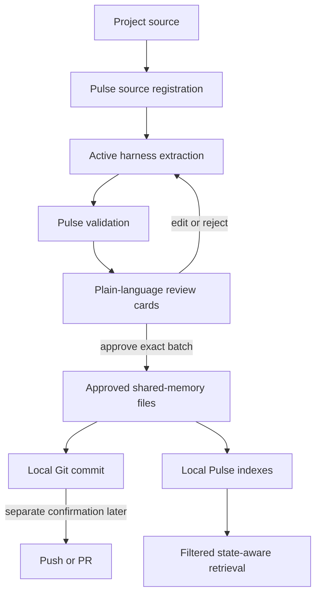
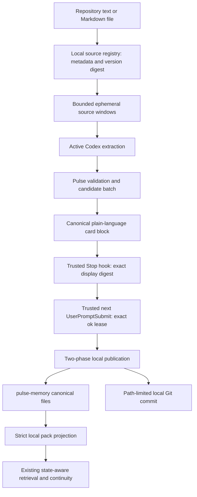
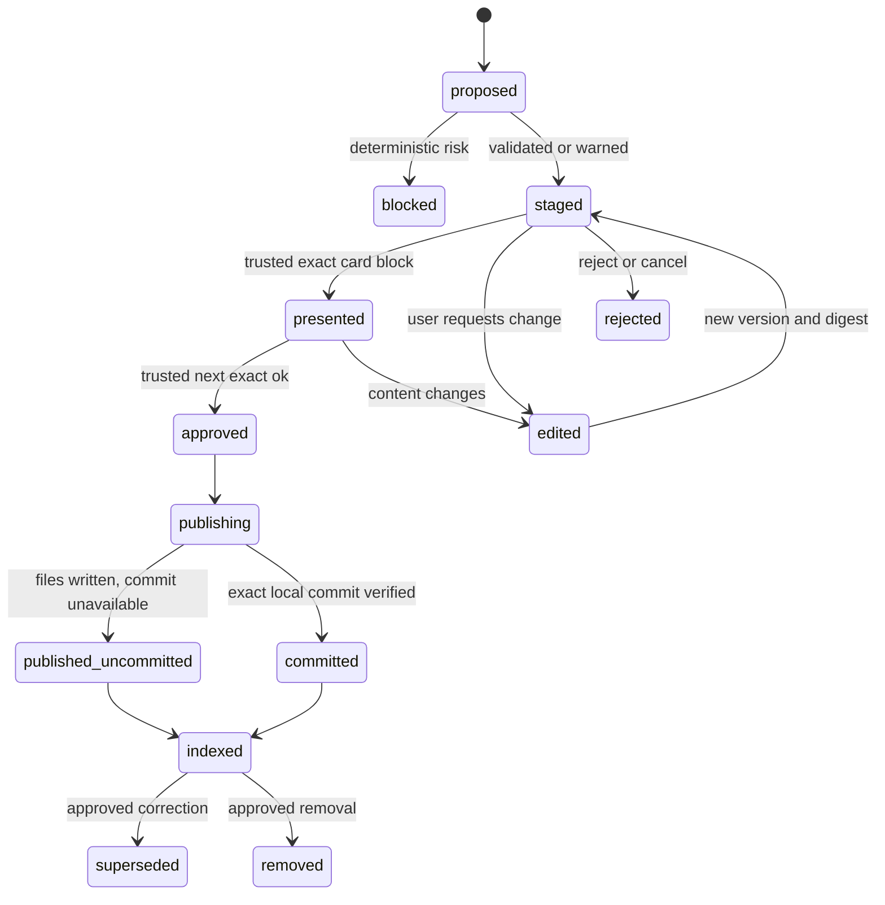

# Pulse Personal and Git-Backed Team Memory Reset - Plan

## Goal Capsule

- **Objective:** Ship Pulse as a one-command, state-aware memory product for one person and as an approval-gated shared-memory product for a small team using the project's Git repository.
- **Product authority:** This plan governs the immediate Pulse product path where it conflicts with the older Personal onboarding and Team Remote plans. Existing implementation remains evidence and a parts inventory, not an automatic requirement for the critical path.
- **First proof:** In Codex, one person saves and later receives a real Personal memory; a reviewed project source produces shared-memory cards; approval creates a local Git commit; a second checkout retrieves the approved memory through Pulse.
- **Open blockers:** None. Independent clones require a portable project namespace in the shared pack, and Codex approval requires a trusted content-free hook bridge; both are resolved in the Planning Contract.
- **Delivery constraint:** Each implementation slice must produce a user-verifiable result in one working day. New infrastructure or more than two review rounds triggers a scope review instead of silently expanding the slice.
- **Execution profile:** U1-U4 form the active vertical slice. Use one implementation worker and one independent reviewer, commit each unit separately, and stop after U4's real linked-worktree receipt before beginning release or Home expansion.
- **Tail ownership:** The executor owns tests, simplification, review fixes, scoped commits, and the local dogfood proof. Npm publication, Git push/PR, Apple notarization submission, colleague installation, and real private-source import require separate approval.

---

## Product Contract

### Summary

Pulse will keep Personal memory local and publish only human-approved shared memories as inspectable files in the project Git repository. The active AI harness extracts candidates from project sources; Pulse owns source identity, validation, approval, storage, retrieval, provenance, and receipts.

### Problem Frame

Pulse has working retrieval, memory, continuity, review, and security primitives, but it is not yet an installable product for a colleague. Personal work reached Memory Home before the clean-machine release proof, while Team work became a large synthetic security foundation before two people could share one real memory.

The immediate product needs a fixed, understandable answer to two questions: where private memory lives and where team memory lives. It must also accept growing project sources without turning full transcripts and documents into injected context or requiring a new extraction model inside Pulse.

### Key Decisions

- **Active-harness extraction.** (session-settled: user-directed — chosen over a Pulse-embedded extraction model: Codex, Claude Code, Cursor, or the active compatible harness already has the model and source-reading capability.) Pulse supplies one extraction contract and does not require its own LLM provider, model key, or agent runtime.
- **Git-backed approved Team Memory.** (session-settled: user-directed — chosen over making remote Commons the first team release: small teams need a visible canonical location and existing synchronization before enterprise infrastructure.) Git stores approved shared-memory objects; each member's local Pulse indexes them and remains the only retrieval engine.
- **Source and memory remain distinct.** Project transcripts and files may live in the same private repository when the team placed them there intentionally. Shared memory contains compact conclusions and stable source references, not copied raw source content.
- **Chat-first approval with a durable Home history.** (session-settled: user-directed — chosen over Git diff review: the primary users are non-technical.) The active harness presents plain-language cards; Memory Home preserves the same immutable cards, warnings, decisions, and publication receipts.
- **Local commit without external delivery.** (session-settled: user-approved — chosen over automatic push or PR: approval of memory content is not approval to send externally.) Approval may create a local commit; push, PR, or any external publication requires a separate explicit confirmation.
- **Remote Commons becomes optional hardening.** Existing Team identity, authorization, revocation, audit, and deletion work may be reused later when teams need real-time synchronization or finer access control. It cannot block Personal or Git-backed Team Memory.

### Actors

- A1. **Member:** Uses an AI harness, reviews candidates, and controls whether anything becomes shared memory.
- A2. **Active harness:** Reads permitted source content, extracts bounded candidates, explains uncertainty, and presents review cards.
- A3. **Pulse:** Resolves the project, registers source versions, validates candidates, binds approval, writes memory, indexes it, retrieves it, and records receipts.
- A4. **Git repository:** Canonically stores project sources chosen by the team and approved shared-memory files; it supplies history and synchronization.
- A5. **Teammate:** Pulls the project and receives relevant approved memory through their own local Pulse.

### Requirements

**Personal product**

- R1. A supported user installs Personal Pulse with one public command and no system Go, Python, Make, Docker, model API key, or manual configuration editing.
- R2. Codex is the first release-gated harness; another harness must reuse the same local memory and extraction contracts rather than create a second engine.
- R3. Personal memory remains in a project-bound local vault and never enters Git through capture, extraction, review, or synchronization without human approval for the exact shared candidate.
- R4. A normal Personal memory must surface automatically in a later fresh harness task with provenance, retrieval reasons, and a delivery receipt.
- R5. Memory Home must show readiness, recent Personal memories, offered context, acknowledgement state, and honest token-economy evidence without fabricated savings.

**Sources and extraction**

- R6. Pulse must accept a project source through a command, API, or MCP surface and bind it to a canonical project plus a stable version identity.
- R7. The first source type is a repository-local text or Markdown file; later adapters must map Google Drive, Krisp, and other systems into the same source contract.
- R8. Pulse must expose bounded source material to the active harness so extraction does not require injecting or rereading the whole source by default.
- R9. The active harness must return typed candidate memories with a compact statement, proposed project audience, confidence, and source references to the registered version.
- R10. Pulse must not make backend model calls for extraction; all model-based extraction and advisory risk comments come from the active harness.
- R11. A repeated review must process only new or changed source versions and unresolved candidates unless the user explicitly requests a full review.

**Risk review and approval**

- R12. Pulse must deterministically block secrets, credentials, unsafe local paths, unapproved Personal content, and attempts to publish raw source text as a shared-memory object.
- R13. The active harness may flag confidentiality, weak evidence, over-broad claims, contradictions, or unclear scope, but those comments cannot override a deterministic Pulse block.
- R14. The user must see the exact canonical content, source summary, project destination, and warnings for every candidate before approval.
- R15. A short chat response such as `ok` is valid only for one exact pending batch in the current task and project whose immutable card digests were just presented.
- R16. Editing a candidate invalidates its prior presentation and approval; the revised card must be shown again.
- R17. Rejected, canceled, blocked, and unreviewed candidates must never enter shared retrieval.

**Git-backed Team Memory**

- R18. Each approved shared memory must be stored as a human-readable, independently reviewable project file with stable identity, kind, approver, approval time, source references, and content.
- R19. Approved shared-memory files live under one conventional project-owned directory, while raw sources, generated indexes, secrets, private memory, and the live Pulse database remain outside it.
- R20. Approval writes the exact displayed objects and may create a local Git commit containing only those publication changes.
- R21. Pulse must never push, create a PR, send a message, or otherwise publish externally without a new explicit confirmation naming that action.
- R22. After Git synchronization, each member's local Pulse must incrementally index added, corrected, superseded, or removed shared-memory files without a second shared retrieval engine.
- R23. Visibility filtering must occur before state-aware ranking; Personal memory is never a candidate for another member's retrieval.
- R24. Shared retrieval must identify the memory as team/project context and expose its source references, approval history, commit provenance when available, and why it surfaced.

**History and operations**

- R25. Memory Home must retain the lifecycle of every shared candidate: proposed, warned, edited, rejected, approved, published, corrected, superseded, or removed.
- R26. Every publication outcome must have a content-bound receipt connecting the displayed batch, approver, resulting memory IDs, file identities, and local commit when created.
- R27. A manual review command must show pending new or changed candidates; an optional scheduled evening trigger may invoke the same review without gaining approval or publication authority.
- R28. A correction must preserve history and stop superseded content from entering future context after local reindexing.

### Key Flows

- F1. Personal continuity
  - **Trigger:** A1 completes normal work in Codex.
  - **Actors:** A1, A2, A3
  - **Steps:** A2 proposes durable Personal memory; A3 validates and presents it; A1 accepts or edits it; a later task receives a compact relevant context pack.
  - **Outcome:** One real memory survives across tasks with visible provenance and token accounting.
  - **Covered by:** R1-R5

- F2. Source extraction
  - **Trigger:** A1 asks Pulse to process a project text or Markdown source.
  - **Actors:** A1, A2, A3
  - **Steps:** A3 registers the source version and supplies bounded material; A2 extracts typed candidates and advisory warnings; A3 validates and stages safe candidates.
  - **Outcome:** The source remains separate while reviewable structured memories are ready.
  - **Covered by:** R6-R13

- F3. Chat approval and local publication
  - **Trigger:** A2 presents one exact pending batch and asks whether to share it with the project.
  - **Actors:** A1, A2, A3, A4
  - **Steps:** A1 approves or edits; A3 binds the response to displayed digests; approved objects are written; A3 creates a local commit and returns a receipt.
  - **Outcome:** Team memory exists in Git, but nothing has been pushed externally.
  - **Covered by:** R14-R21, R25-R26

- F4. Team consumption
  - **Trigger:** A5 receives approved-memory changes through normal Git synchronization.
  - **Actors:** A3, A4, A5
  - **Steps:** A3 incrementally indexes the changed shared-memory objects, filters them by project visibility, and ranks relevant items for the current state and task.
  - **Outcome:** A5's fresh harness task receives the approved memory with reasons and provenance.
  - **Covered by:** R22-R24, R28

- F5. Incremental review
  - **Trigger:** A1 runs review manually or an evening trigger detects unresolved changes.
  - **Actors:** A1, A2, A3
  - **Steps:** A3 supplies only changed sources and pending candidates; A2 prepares cards and warnings; A1 decides in chat or later through Memory Home.
  - **Outcome:** Review cost scales with new material, and scheduling never grants approval authority.
  - **Covered by:** R11, R25, R27

### Product Flow

### Acceptance Examples

- AE1. **Covers R1-R5.** Given a clean supported Mac with Codex and Node but no Go or Python, when A1 installs Pulse, saves one normal memory, and starts a fresh task, then that task receives the same memory and Home shows its receipt and honest token state.
- AE2. **Covers R6-R11.** Given a repository text transcript, when A1 asks Codex to ingest it, then Pulse binds a stable source version and Codex returns bounded typed candidates without Pulse calling an extraction model.
- AE3. **Covers R12-R17.** Given a candidate containing a credential and another containing a weakly supported conclusion, when review runs, then Pulse blocks the credential candidate and the harness comments on the evidence risk of the other.
- AE4. **Covers R14-R21.** Given two displayed safe cards and one pending batch, when A1 replies `ok`, then only those two objects are written and committed locally, a receipt is returned, and no push or PR occurs.
- AE5. **Covers R15-R17.** Given a displayed card that is edited after presentation, when A1 says `ok` without seeing the edited card, then publication is refused until the revised content is presented.
- AE6. **Covers R22-R24.** Given a second checkout that receives the local publication commit, when a relevant fresh task starts there, then its local Pulse surfaces the shared memory with project visibility, source and commit provenance, and ranking reasons.
- AE7. **Covers R11, R27.** Given no source changes since the previous review, when an evening trigger runs, then it reports no new candidates without reprocessing the whole project or asking for publication approval.
- AE8. **Covers R25-R28.** Given an approved memory later corrected, when the correction is committed and reindexed, then Home preserves both versions while future retrieval excludes the superseded statement.

### Success Criteria

- The Personal clean-machine Codex proof passes without user-installed compilers or model keys.
- One repository source reaches approved shared memory through chat cards in the active harness.
- A local commit is created after approval and zero external Git actions occur without a second confirmation.
- A second checkout retrieves the approved memory through the existing Pulse ranking and continuity path.
- Review cost is bounded to new or changed material and every surfaced shared item has inspectable provenance.

### Scope Boundaries

**Deferred for later**

- First-class Cursor activation after the Codex product gate proves the shared harness contract.
- Google Drive, Krisp, and other source adapters.
- GitHub push, branch, PR, and scheduled delivery integrations.
- Remote Commons for real-time synchronization, per-member server ACLs, revocation, and teams that cannot use one private repository.
- Rich interactive Home cards beyond the durable history required by this contract.

**Outside this product's identity**

- A built-in extraction LLM or a second general agent runtime.
- Automatic promotion from Personal to Team memory.
- Using Git as the Personal vault, live database, generated index, or secret store.
- Replacing source systems or copying all source content into shared memories.
- Skill factories, practice compilation, or team workflow governance owned by `takt`.

### Dependencies and Assumptions

- The project repository is private when its sources or shared memories are not public, and repository membership matches the intended human audience.
- The team intentionally controls which raw or redacted source files enter the repository; Pulse does not expand repository access or silently copy external sources into it.
- The active harness can read the selected source under its normal permissions and can call the Pulse MCP contract.
- Git is installed for team publication and synchronization; Personal memory remains useful without a Git remote.
- Existing Personal candidate, presentation receipt, provenance, reviewed import, retrieval, continuity, and Home primitives are reusable, but the Git publication and shared-pack index path are new work.

### Delivery Guardrails

- Build in vertical slices whose acceptance example can be exercised by a user the same day.
- Use at most one implementation worker and one independent reviewer for a slice.
- Stop after two review rounds; unresolved non-blocking findings move to a labeled release-hardening backlog.
- Classify every finding as current user-outcome blocker, public-release blocker, or backlog before changing scope.
- Stop and re-scope when requirements grow materially, new infrastructure appears, or four hours pass without a runnable intermediate result.
- Do not begin a later slice until the current slice has a real dogfood receipt on its target surface.

### Sources and Research

- `docs/plans/2026-07-15-001-feat-personal-pulse-one-command-onboarding-plan.md` documents the current Personal product contract and the missing clean-machine proof.
- `docs/TEAM_REMOTE_PILOT.md` defines the existing Team work as a synthetic foundation rather than a completed two-person product.
- `docs/PULSE_MATERIAL_GRAPH_CURRENT_STATE.md` inventories reusable memory capsules, source references, reviewed import, continuity, and retrieval primitives.
- `docs/superpowers/specs/2026-07-10-pulse-team-pilot-design.md` supplies the durable separation between project operating artifacts, structured memory, and raw sources; this reset replaces its central-service-first critical path for Team v0.
- [Claude-Mem installation](https://docs.claude-mem.ai/installation) and [architecture](https://docs.claude-mem.ai/architecture/overview) demonstrate a one-command local worker, hooks, SQLite, and multi-harness installation model.
- [Mem0 REST API](https://docs.mem0.ai/open-source/features/rest-api) and [Zep multi-tenancy](https://help.getzep.com/faq) provide external reference points for identity-scoped memory and explicit shared context.

---

## Planning Contract

The Product Contract above is preserved without changing its R, A, F, or AE IDs. The units below implement that contract in daily vertical slices and do not revive the Remote Commons critical path.

### Key Technical Decisions

- KTD1. **Use a metadata-only local source registry with a bound host filesystem adapter.** The trusted CLI/runtime resolves and reads the repository-relative regular file under the signed workspace binding, computes the version digest, and returns bounded ephemeral windows. The daemon persists only the portable project namespace, locator, source kind, byte count, version digest, timestamps, cursors, and processing state. It never persists source bytes, raw transcript windows, prompt-injection text, or unsafe spans.
- KTD2. **Mirror Memory Tray governance without its Personal grace-period commit.** Reuse closed schemas, canonical digests, versioned edits, immutable presentation receipts, idempotency, audit, deterministic blocks, and terminal receipts. Git Team candidates use a separate explicit-approval state machine with no timer-based or background publication.
- KTD3. **Trust Codex lifecycle events, not an agent's claim that approval happened.** The existing trusted `Stop` hook verifies that the exact canonical card block for one batch occurred in `last_assistant_message` and stores only its digest. The following trusted `UserPromptSubmit` hook may mint a short content-free approval lease only when the normalized user message is exactly `ok`, one matching batch is pending in the same project and task, and no card version changed. Raw assistant or user content is never persisted. Hosts without equivalent trusted events must use an authenticated human surface and cannot downgrade to agent-mediated approval. (session-settled: user-directed — chosen over letting the agent decide whether a reply was approval: privacy and publication authority must not depend on model judgment.)
- KTD4. **Use atomic tools plus one safety-critical publication workflow.** Source status/register/read, candidate stage/edit/reject, card inspect, receipt inspect, and context query stay atomic. Publication is one workflow-level operation because approval consumption, exact-byte writes, local commit isolation, receipt finalization, and recovery must succeed or fail as one governed sequence.
- KTD5. **Store approved memory as canonical JSON under `pulse-memory/`.** `pulse-memory/project.json` carries a random portable project namespace that survives independent clones. `pulse-memory/memories/<memory_id>.json` carries one readable versioned memory, approval and source references. `pulse-memory/publications/<batch_id>.json` binds the ordered object digests and approval without attempting to embed its own Git commit hash. Generated indexes, pending cards, private receipts, raw sources, secrets, machine-local repository IDs, binding digests, and databases stay outside this directory. Canonical JSON avoids a new YAML dependency and makes byte-for-byte approval verification deterministic.
- KTD6. **Separate portable project identity from local binding identity.** The signed workspace binding and inode-derived repository ID remain local authority. The Git-tracked random project namespace identifies shared objects across clones; Pulse verifies the local binding owns the checkout before mapping that namespace into the local vault.
- KTD7. **Use a recoverable two-phase Git publication.** Pulse consumes the approval lease and returns exact canonical file bytes plus digests under a `publishing` receipt. The CLI writes only new regular non-symlink files atomically, constructs the commit from an isolated temporary Git index, advances the current local `HEAD` only with a compare-and-swap from the expected parent, verifies the resulting tree, then finalizes the receipt with file identities and the commit hash. A crash or commit failure converges idempotently to `published_uncommitted`, `committed`, or a visible failure; it never duplicates objects or commits.
- KTD8. **Never borrow the caller's Git index, hooks, or external authority.** Publication refuses overlapping target edits, ignored target paths, links, path escape, concurrent `HEAD` movement, or ambiguous identity. Unrelated working-tree and staged changes remain untouched. The isolated commit path does not run repository hooks and never invokes remote, fetch, pull, push, branch publication, PR, or message operations.
- KTD9. **Project only an authorized Git snapshot into the existing local state-aware corpus.** On synchronized checkouts, the strict pack indexer reads committed canonical objects from the current `HEAD` tree, validates portable identity, schema, digest, approval manifest, status, supersession, and project visibility, then materializes active objects into the local project corpus. A locally `published_uncommitted` object is eligible only when the same bound vault holds its exact content-bound publication receipt. Arbitrary working-tree edits never enter retrieval. The normal retrieval, graph, continuity, reason breakdown, and delivery receipts remain authoritative; Remote Team retrieval and Commons projections are not used. Cross-member authenticity is the repository's write/merge policy in Git v0, while Pulse remains authoritative for its own exact-card publication path.
- KTD10. **Classify work by user outcome before expanding it.** U1-U4 are one runnable Team Memory slice; U5 is the one-command Personal release slice; U6 is shared lifecycle/Home completion. A finding can block only the current user outcome or public release. OAuth, WebAuthn, remote synchronization, rich dashboards, and new source adapters remain backlog unless evidence invalidates the chosen architecture.

### High-Level Technical Design

The source reader treats source text as inert data, never as instructions. The harness owns extraction judgment, while Pulse owns every durable transition and side effect.

### System-Wide Impact

- **Host lifecycle:** `UserPromptSubmit` and `Stop` gain content-free shared-review lease handling alongside current turn and memory leases. No raw prompt or assistant response enters receipts, logs, or SQLite.
- **MCP surface:** Codex receives closed tools for source registration/windows, candidate staging/review, and exact-batch publication. Existing recall, context, resume, status, and Tray tools remain the retrieval path.
- **Local daemon/store:** A forward-only Personal/Desk migration adds source versions, batches, candidates, presentation/approval decisions, publication recovery, shared-index metadata, and receipts. Existing migrations and private Memory Tray tables remain immutable.
- **Filesystem/Git:** The published CLI owns safe canonical file materialization and local commit verification. The Git pack is portable; private operational state remains under the bound local Pulse data directory.
- **Retrieval:** Only validated active objects for the current portable project namespace enter candidate generation. Personal objects remain local to each member's bound vault; shared items are labeled with project, source, approval, file, and commit provenance after retrieval.
- **Home:** The current store-backed Home snapshot later joins shared lifecycle and publication receipts. It does not become a second approval engine or a second database.
- **Packaging:** New CLI modules must enter the npm `files` allowlist and vendored Codex runtime. Clean-room tests run against the packed artifact, not imports from the source checkout.

### Risks and Dependencies

| Risk | Consequence | Mitigation / gate |
|---|---|---|
| Hook output is unavailable or differs from the expected Codex event contract | Chat cannot prove the exact cards were shown | U2 fails closed and keeps Home as the only trusted fallback; no agent-mediated approval claim |
| Source contains prompt injection, secrets, paths, or transcript-shaped text | Unsafe text influences extraction or enters shared memory | Treat windows as inert data, withhold deterministic unsafe spans, validate canonical candidates independently, and persist no source bytes |
| Independent clones receive different local repository IDs | Shared memories cannot map to one project | Git-tracked random project namespace is canonical across clones; local binding remains local authority only |
| Dirty index, ignored path, symlink, hook, or concurrent writer alters publication | Wrong files enter a commit or approved bytes drift | Exact path allowlist, exclusive publication lock, atomic no-follow writes, isolated temporary index, hook-free commit construction, compare-and-swap `HEAD`, tree rehash, and fail-closed overlap checks |
| Crash occurs between approval, file write, commit, and indexing | Duplicate or half-published memory | Durable two-phase receipt, idempotency keys, recovery checkpoints, and terminal `published_uncommitted`/`committed` states |
| Pack import bypasses Personal review or pollutes another project | Privacy leak or incorrect ranking | Only strict approved pack schema is eligible; project visibility and current/superseded status are filtered before materialization |
| An agent or compromised teammate writes a plausible pack file outside Pulse | Unapproved context reaches another member | Ignore arbitrary working-tree files; index committed `HEAD` objects only; rely explicitly on repository write/merge policy for cross-member trust; label Git v0 as repository-trusted rather than cryptographically writer-attested |
| Team work delays the still-missing clean install proof | Product remains developer-only | U5 is a separate public-release blocker; U1-U4 stop after a real local dogfood receipt and cannot expand into release infrastructure |
| Existing U8 work overlaps from another dirty worktree | User changes are overwritten or mixed | Do not touch `.worktrees/pulse-codex-team-memory`; implement from this reset worktree and port only reviewed committed patterns |

### Sequencing

U1-U4 are the active slice and must be completed in order because each unit supplies authority consumed by the next. U5 can begin only after the Team slice produces a real second-worktree receipt. U6 follows the durable lifecycle contracts so Home renders authoritative state rather than inventing it.

---

## Implementation Units

### U1. Add the metadata-only source and shared-review domain

- **Goal:** Give Pulse a durable local contract for versioned project sources and explicit shared candidate batches without storing raw source bytes or publishing anything.
- **Requirements:** R3, R6-R13, R17; F2; AE2-AE3.
- **Files:**
  - Create `pulse-app/internal/store/migrations/048_git_team_memory_review.sql`
  - Create `pulse-app/internal/store/project_source.go`
  - Create `pulse-app/internal/store/project_source_test.go`
  - Create `pulse-app/internal/store/git_team_memory_review.go`
  - Create `pulse-app/internal/store/git_team_memory_review_test.go`
  - Create `pulse-app/internal/server/project_source.go`
  - Create `pulse-app/internal/server/project_source_test.go`
  - Create `pulse-app/internal/server/git_team_memory_review.go`
  - Create `pulse-app/internal/server/git_team_memory_review_test.go`
  - Modify `pulse-app/internal/store/schema.go`
  - Modify `pulse-app/internal/store/schema_manifest_test.go`
  - Modify `pulse-app/internal/store/team_policy_test.go`
  - Modify `pulse-app/internal/server/server.go`
- **Approach:** Add Personal/Desk-only metadata tables and migration applicability policy for portable project namespace mapping, source locators and versions, batches, typed candidates, card generations, decisions, publication recovery, index state, immutable receipts, and audit. Reuse Memory Tray's canonicalization and all-or-nothing unsafe-batch behavior while defining separate explicit shared states. The daemon accepts only host-attested source metadata and enforces version/idempotency transitions; U2 supplies the signed-binding filesystem adapter that computes the digest and bounded windows without sending raw bytes into durable storage.
- **Test scenarios:** Valid relative source and repeated unchanged registration; changed version; absolute path; traversal; symlink escape; oversized/binary source; secret/path/transcript spans; unknown candidate fields; unsafe candidate mixed into a batch; source version changes before staging; candidate edit invalidates the prior digest; rejected/blocked candidates never enter publication state; SQLite/WAL contains none of the source fixture's raw sentinel text.
- **Verification:** `cd pulse-app && go test ./internal/store ./internal/server -count=1` passes, including migration applicability and raw-sentinel scans.
- **Done when:** One local file version can produce a safe pending batch with stable source references and immutable candidate digests, while no API can approve, write Git files, or call a model.

### U2. Bind Codex cards and exact `ok` to trusted host events

- **Goal:** Make chat-first approval truthful without granting the agent publication authority.
- **Requirements:** R2, R8-R17; F2-F3; AE3-AE5.
- **Dependencies:** U1.
- **Files:**
  - Modify `pulse-app/cli/src/host-adapter.js`
  - Modify `pulse-app/cli/src/codex-hooks.js`
  - Modify `pulse-app/cli/src/codex-hooks.test.js`
  - Modify `pulse-app/cli/src/codex-runtime.js`
  - Modify `pulse-app/cli/src/codex-runtime.test.js`
  - Create `pulse-app/cli/src/project-source.js`
  - Create `pulse-app/cli/src/project-source.test.js`
  - Modify `pulse-app/cli/package.json`
  - Modify `mcp/src/index.ts`
  - Create `mcp/src/git-team-memory.test.ts`
  - Modify `plugins/pulse/hooks/hooks.json` only if the existing event payload contract requires a matcher change
- **Approach:** Add the bound filesystem adapter and closed MCP tools for source status/register/window, candidate stage/edit/reject, and card/receipt inspection. The adapter canonicalizes the signed checkout, rejects traversal and links, reads bounded regular text/Markdown bytes, computes the version digest, withholds deterministic unsafe spans, and sends only metadata to the daemon. Render one canonical human card block with a batch ID and ordered card digests. Extend trusted `Stop` handling to verify that exact block in the actual assistant message and persist only a content-free presentation receipt. Extend trusted `UserPromptSubmit` handling to inspect but never persist the raw prompt and mint one short approval lease only for exact normalized `ok` after one matching presentation. Publication tool calls must consume that lease and recheck project, session, turn, batch generation, ordered digests, source version, and candidate states.
- **Test scenarios:** Exact card block then exact `ok`; generic continue; `ok` embedded in a longer message; prompt-injected approval text in the source; card omitted or altered by the agent; edit after presentation; wrong task/project; expired lease; two pending batches; replay; raw prompt/assistant sentinel absent from files, DB, receipts, and logs.
- **Verification:** `cd pulse-app/cli && npm test` and `cd mcp && npm test && npm run build` pass with the new host-attestation fixtures.
- **Done when:** Codex can show the exact cards and obtain a publishable approval lease only from the user's next exact `ok`; an ordinary MCP/model call cannot mint it.

### U3. Publish exact approved objects to a local Git commit

- **Goal:** Turn one approved batch into portable human-readable files and one verified local commit without touching unrelated work or any remote.
- **Requirements:** R18-R21, R26; F3; AE4-AE5.
- **Dependencies:** U2.
- **Files:**
  - Create `pulse-app/cli/src/git-team-memory.js`
  - Create `pulse-app/cli/src/git-team-memory.test.js`
  - Modify `pulse-app/cli/src/codex-runtime.js`
  - Modify `pulse-app/cli/src/codex-runtime.test.js`
  - Modify `pulse-app/cli/src/cli.js`
  - Modify `pulse-app/cli/package.json`
  - Modify `pulse-app/cli/scripts/prepare-preview-vendor.mjs`
  - Modify `mcp/src/index.ts`
  - Modify `mcp/src/git-team-memory.test.ts`
  - Modify `pulse-app/internal/store/git_team_memory_review.go`
  - Modify `pulse-app/internal/store/git_team_memory_review_test.go`
  - Modify `pulse-app/internal/server/git_team_memory_review.go`
  - Modify `pulse-app/internal/server/git_team_memory_review_test.go`
- **Approach:** Implement the two-phase publication contract. The daemon transitions an approved batch to `publishing` and returns canonical bytes for `pulse-memory/project.json`, memory objects, and the batch manifest. The CLI locks the pack, refuses links/overlaps/ignored targets, writes exact bytes atomically, builds the exact tree with a temporary index, creates a hook-free commit object, compare-and-swaps local `HEAD` from the expected parent, verifies committed tree digests, and finalizes the content-bound receipt. The project-visible approver label is shown on the cards and stored in the files; it is never inferred silently from a private Pulse identifier or email. When identity or `HEAD` movement prevents a commit after safe writes, report `published_uncommitted` and never stage unrelated paths. No code path may invoke a Git remote or network action.
- **Test scenarios:** Clean repo; unrelated modified and staged files; target overlap; ignored directory; symlink/hardlink/path escape; absent or undisplayed approver label; missing Git identity; detached worktree; repository hooks are not run; concurrent `HEAD` advance; crash after first file and after commit; retry; stale approval; two concurrent publishers; spy Git executable proves no remote/fetch/pull/push/PR command.
- **Verification:** `cd pulse-app/cli && npm test` plus focused Go and MCP tests pass; the fixture commit contains only the exact `pulse-memory/` paths and every resulting digest matches the approved batch.
- **Done when:** A real exact `ok` yields readable approved files, one local commit or an honest recoverable `published_uncommitted` receipt, and zero external action.

### U4. Index the shared pack through the existing state-aware engine

- **Goal:** Prove that a second checkout receives and retrieves the approved memory without Commons or a second retrieval engine.
- **Requirements:** R22-R24, R28; F4; AE6, plus the active-object part of AE8.
- **Dependencies:** U3.
- **Files:**
  - Create `pulse-app/internal/store/git_team_memory_index.go`
  - Create `pulse-app/internal/store/git_team_memory_index_test.go`
  - Modify `pulse-app/internal/store/memory_capsule.go`
  - Modify `pulse-app/internal/retrieve/hybrid.go`
  - Create `pulse-app/internal/retrieve/git_team_memory_test.go`
  - Create `pulse-app/internal/server/git_team_memory_index.go`
  - Create `pulse-app/internal/server/git_team_memory_index_test.go`
  - Modify `pulse-app/internal/server/server.go`
  - Modify `pulse-app/cli/src/codex-hooks.js`
  - Modify `pulse-app/cli/src/codex-hooks.test.js`
  - Create `pulse-app/cli/scripts/git-team-memory-e2e.mjs`
  - Modify `pulse-app/cli/package.json`
  - Modify `Makefile`
- **Approach:** On trusted session start and manual sync, read only committed `pulse-memory/project.json`, batch manifests, and memory objects from the current `HEAD` tree. Strictly validate schema, canonical bytes, identity, digest, approval, status, and supersession before atomically reconciling the local shared projection. Admit a local uncommitted object only when its exact receipt exists in the same bound vault. Materialize only active objects for this portable project namespace into the authorized local corpus before ranking; preserve a local provenance map for team labels, source refs, file/version, approval, and commit when available. Do not call Team Remote or create another ranker.
- **Test scenarios:** Linked worktree at the publication commit; independent local clone fixture sharing the portable namespace; invalid/non-canonical/manual committed file; arbitrary uncommitted file ignored; wrong project ID; corrected/superseded/removed object; deletion between scans; idempotent unchanged scan; Personal object absent from a teammate vault; same state-aware query surfaces the shared item with reasons and provenance; no raw source content enters the index.
- **Verification:** `cd pulse-app && go test ./internal/store ./internal/server ./internal/retrieve ./cmd/pulse -count=1`, the corresponding race gate, `cd pulse-app/cli && npm run test:git-team-memory`, and `make verify` pass.
- **Done when:** The black-box local E2E creates a source, cards, trusted approval, local commit, second checkout, incremental index receipt, and fresh-task retrieval receipt through the existing engine.

### U5. Finish the one-command Personal clean-room release proof

- **Goal:** Turn the already implemented Personal path through Memory Home into a colleague-installable packed product rather than a source-checkout success.
- **Requirements:** R1-R5; F1; AE1.
- **Dependencies:** U4's architecture and pack modules must be included in the packaged runtime, but Team adapters do not expand the install ceremony.
- **Files:**
  - Create `pulse-app/cli/scripts/personal-preview-clean-room.mjs`
  - Create `pulse-app/cli/scripts/personal-preview-interruption-e2e.mjs`
  - Create `pulse-app/cli/scripts/personal-preview-release-attestation.mjs`
  - Modify `pulse-app/cli/scripts/codex-product-e2e.mjs`
  - Modify `pulse-app/cli/src/release-gates.test.js`
  - Modify `pulse-app/cli/package.json`
  - Modify `Makefile`
  - Modify `README.md`
  - Modify `AGENTS.md`
  - Modify `docs/INSTALL_WITH_AGENT.md`
  - Create `docs/PERSONAL_PULSE_ONBOARDING.md`
- **Approach:** Resume the unfinished clean-room/release unit from the prior Personal plan. Test a packed package with Node and Codex but no system Go/Python/API key; use production artifact verification, managed embedding runtime, signed binding, actual hooks, first presented memory, a fresh task, Home evidence, interruption/repair, and uninstall/wipe honesty. Keep publication, release upload, notarization submission, and colleague install outside automatic execution authority.
- **Test scenarios:** Clean install; no compilers/interpreters; canceled consent; interrupted artifact/model download; reinstall/repair; missing or invalid signed manifest; full retrieval unavailable; one real memory and fresh task; Home receipt and honest measured/estimated/collecting token state; packed runtime includes Git Team modules without enabling remote side effects.
- **Verification:** `cd pulse-app/cli && npm run test:codex-product`, the three clean-room scripts against `npm pack`, `make verify`, `make release-verify`, and a content-free physical Apple Silicon release attestation pass before public preview publication.
- **Done when:** The one public command installs the packed release and proves Personal continuity on a clean supported Mac without user-installed build tools or model keys.

### U6. Add shared lifecycle, corrections, and publication history to Home

- **Goal:** Let a non-technical member understand what was proposed, blocked, approved, transferred, corrected, superseded, or removed without reading Git diffs.
- **Requirements:** R11, R25-R28; F5; AE7-AE8.
- **Dependencies:** U4.
- **Files:**
  - Modify `pulse-app/internal/store/memory_home.go`
  - Modify `pulse-app/internal/store/memory_home_test.go`
  - Create `pulse-app/internal/store/memory_home_shared_query.go`
  - Modify `pulse-app/internal/server/memory_home.go`
  - Modify `pulse-app/internal/server/memory_home_test.go`
  - Modify `pulse-app/internal/server/home_routes.go`
  - Modify `pulse-app/internal/server/home_routes_test.go`
  - Modify `pulse-app/internal/store/git_team_memory_review.go`
  - Modify `pulse-app/internal/store/git_team_memory_index.go`
  - Modify `pulse-app/cli/src/cli.js`
- **Approach:** Extend the existing server-rendered Home snapshot with bounded shared review batches, deterministic blocks and harness warnings, exact card versions, decisions, publication/index receipts, commit provenance, and correction/supersession/removal history. Add manual changed-source review; an optional scheduler may enqueue detection only. Correction creates a new displayed version and approval cycle, while local reconciliation excludes the superseded version before retrieval.
- **Test scenarios:** Empty state; proposed/warned/blocked batch; edit and re-presentation; rejected/canceled batch; committed and published-uncommitted outcomes; indexing failure/retry; correction/supersession/removal; unchanged evening run; narrow and keyboard-readable essential flow; raw source/private content absent from rendered HTML and snapshot JSON.
- **Verification:** Focused store/server tests and browser QA against real Home fixtures pass, followed by `make verify`.
- **Done when:** Home and chat show the same canonical cards and digests, Home preserves the complete lifecycle, and future context excludes superseded or removed Team Memory.

---

## Verification Contract

### Required gates

| Gate | Applies to | Observable pass condition |
|---|---|---|
| `cd pulse-app && go test ./internal/store ./internal/server ./internal/retrieve ./cmd/pulse -count=1` | U1, U3, U4, U6 | Store, server, visibility, retrieval, migration, and receipt tests pass |
| `cd pulse-app && go test -race ./internal/store ./internal/server ./internal/retrieve ./cmd/pulse -count=1` | U1, U3, U4, U6 | Publication, sync, receipt, and projection races pass |
| `cd mcp && npm test && npm run build` | U2-U4 | Closed tool schemas, host binding, approval lease, and daemon routing pass |
| `cd pulse-app/cli && npm test` | U2-U3, U5-U6 | Hook, Git safety, packaging, install, and Home client contracts pass |
| `cd pulse-app/cli && npm run test:git-team-memory` | U4 | File-to-cards-to-commit-to-second-checkout retrieval passes without network Git actions |
| `cd pulse-app/cli && npm run test:codex-product` | U2, U5 | Trusted Codex lifecycle, Personal continuity, and packed runtime pass |
| `make verify` | U4-U6 | Normal repository gate passes with Team remote regressions unchanged |
| `make release-verify` | U5 | Release artifacts, real local retrieval, race suites, and deployment-template checks pass |

### Behavioral release gates

- **Current user-outcome gate:** A repository-local source reaches exact Codex cards, the next exact user `ok` creates only a local commit, and a second linked worktree retrieves the approved memory with source, approval, commit, and ranking reasons.
- **Privacy gate:** Absolute/escaping paths, raw transcript shapes, secrets, Personal payloads, stale cards, injected approval language, wrong tasks/projects, and invalid pack objects produce zero Git files and zero shared retrieval candidates.
- **Git isolation gate:** Unrelated working-tree and staged changes are byte-identical before and after publication; no remote Git or network publication command occurs.
- **Personal product gate:** The packed one-command install succeeds on a clean supported Mac with no Go, Python, Make, Docker, or API key and proves one fresh-task Personal recall with honest token evidence.
- **Regression budget:** One worker and one reviewer, maximum two review rounds. P0/P1 current-outcome defects block the slice; public-release blockers stay in U5; all other findings enter backlog.

### Planning boundary

Implementation may create local code commits and the synthetic/local dogfood commit required by AE4-AE6. It may not push a branch, open a PR, publish npm or GitHub releases, submit notarization, install on a colleague's machine, import real private sources, or send external messages without a new explicit confirmation.

---

## Definition of Done

- [ ] U1 records source identity/version and candidate lifecycle metadata without retaining raw source bytes.
- [ ] U2 proves exact cards and the next exact user `ok` through trusted Codex lifecycle events; the agent cannot mint approval.
- [ ] U3 writes only canonical `pulse-memory/` objects and creates one verified local commit or an honest recoverable uncommitted receipt.
- [ ] U4 retrieves the approved object in a second checkout through the existing state-aware engine with project, source, approval, commit, and ranking provenance.
- [ ] U5 proves the packed one-command Personal journey on a clean supported Mac without compilers, system Python, model keys, or manual configuration.
- [ ] U6 makes every shared candidate and publication lifecycle visible in chat/Home and excludes corrected, superseded, removed, blocked, rejected, and pending objects from future context.
- [ ] Personal memory never enters `pulse-memory/` or another member's local corpus without a separately displayed exact shared candidate and trusted approval.
- [ ] No source text, prompt/assistant content, secret, unsafe path, private binding identity, generated index, live database, or Personal receipt is committed to Git.
- [ ] No automatic action pushes, opens a PR, sends a message, changes repository access, or activates Remote Commons.
- [ ] Each unit has its named red-first tests, relevant race coverage, a scoped commit, and no abandoned experimental path left in the diff.
- [ ] U1-U4 produce one real local dogfood receipt before U5 or U6 begins; four hours without a runnable intermediate result triggers re-scoping instead of more architecture.
