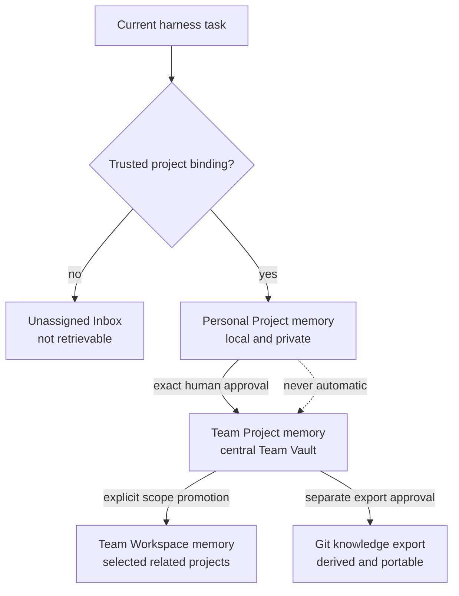
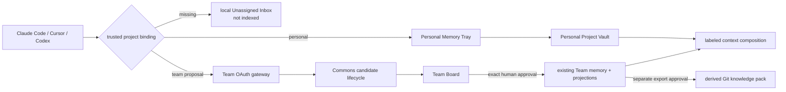

# Pulse Personal and Team Memory Product Architecture - Plan

## Goal Capsule

- **Objective:** Ship Pulse as a lightweight project memory for one person and as a governed central memory product for a team.
- **Product authority:** This contract supersedes the Git-first Team Memory product direction in the previous revision of this file and the central-service-first scope of the older synthetic Team plan where either conflicts with the product split below.
- **Personal proof:** A colleague installs Pulse with one command on a Mac that has Claude Code, Cursor, or Codex; a memory survives into a fresh task inside the same project; another project receives none of it; Home shows the continuity and token evidence.
- **Team proof:** Two named members use one central Team Vault and Board for one project; one exact candidate is approved; both members receive it with provenance; a member without project access cannot retrieve or influence ranking with it.
- **Open blockers:** None for local implementation. Public npm publication and U13's controlled two-person deployment require fresh external-mutation approval; the plan distinguishes code-complete, artifact-ready, publicly available, and controlled-Team proof.

---

## Product Contract

### Summary

Pulse will have two product modes on one memory model. Personal is a lightweight local product whose memory follows one person across supported harnesses inside a bound project. Team is a separate central Team Vault and Board where members govern project memory together; Git is an optional approved export, not the Team database.

### Problem Frame

Pulse has accumulated a capable local retrieval engine, a secure Personal review surface, a Git publication path, and a large synthetic Team security foundation. Those parts do not yet add up to a product that a colleague can install quickly or a team can understand and operate together.

The earlier product direction also blurred three different jobs. A single user needs continuity and lower context cost without administering infrastructure. A team needs one shared control surface, isolation, roles, review, correction, and deletion. A repository needs durable operating artifacts and portable exports, but it should not silently become the authorization system or live database for corporate memory.

Memory scope is the trust boundary joining those jobs. Cross-session and cross-harness continuity inside one project is useful. Unrequested cross-project recall is usually noise and can leak client or personal context. Pulse therefore needs a deterministic project boundary before it needs broader ingestion or richer extraction.

### Key Decisions

- **Two products on one memory model.** (session-settled: user-directed — chosen over one equally heavy product for individuals and teams: an individual needs simple continuity, while team governance is the paid infrastructure problem.) Personal and Team share memory semantics and retrieval quality without sharing deployment or administration requirements.
- **Project-first memory.** (session-settled: user-directed — chosen over global memory by default: continuity across tasks and harnesses is valuable inside a project, while cross-project context is usually unnecessary and unsafe.) Every retrievable memory has both an ownership boundary and a project destination.
- **Trusted routing, not agent discretion.** (session-settled: user-approved — chosen over letting the active model decide where a conversation belongs: models can misclassify context and cannot be the security boundary.) Pulse derives the current project from a trusted workspace binding; ambiguous work stays unassigned.
- **Central Team Vault and Board.** (session-settled: user-directed — chosen over Git as the canonical Team database: teams need a common state, membership, revocation, approvals, audit, and deletion.) Team memory lives in an isolated shared store and is managed in one visible place.
- **Exact human approval for sharing.** (session-settled: user-directed — chosen over automatic Personal-to-Team promotion: one mistaken promotion can expose private or client context.) The system may recommend a destination, but only an authorized human can approve the exact content and scope.
- **Git as derived publication.** (session-settled: user-approved — chosen over discarding the implemented Git path or keeping it as Team authority: approved knowledge still benefits from portable, inspectable export.) Git may carry approved snapshots, rules, practices, or decisions after Team Vault approval; it does not grant memory access or replace the live Team record.
- **Host-extracted capsules.** (session-settled: user-directed — chosen over a required Pulse extraction model: the active harness already has the model and source-reading capability.) Pulse owns validation, scope, storage, retrieval, and receipts; the active harness proposes compact structured memories.

### Actors

- A1. **Personal user:** Uses one or more supported harnesses and owns local private memory.
- A2. **Team member:** Uses Pulse inside projects granted by the team and may propose or consume shared memories.
- A3. **Reviewer or owner:** Approves exact Team content, promotes scope, corrects records, manages access, and performs destructive actions permitted by role.
- A4. **Active harness:** Claude Code, Cursor, Codex, or another compatible host that reads permitted source material and proposes structured capsules.
- A5. **Pulse Personal Core:** Resolves trusted project identity, stores local memory, retrieves only visible candidates, and records continuity and token receipts.
- A6. **Pulse Team Vault:** Holds authoritative shared memories, project membership, provenance, lifecycle, audit, and deletion state.
- A7. **Team Board:** Presents candidates, scopes, warnings, decisions, corrections, access, and history in a non-technical control surface.
- A8. **Source system:** Holds the original call, transcript, chat, Drive document, or repository file from which a capsule may be extracted.
- A9. **Git repository:** Optionally stores approved derived knowledge and source references after a separate publication decision.

### Requirements

**Personal product**

- R1. A supported user must install the complete Personal product with one public command and no system Go, Python, Make, Docker, model API key, or manual configuration editing.
- R2. Claude Code, Cursor, and Codex must be equal bootstrap hosts; any one is sufficient, and several installed hosts share one Personal Core and vault.
- R3. Personal memory must survive across sessions and supported harnesses only inside its authorized project boundary unless the user explicitly assigns a broader destination supported by this contract.
- R4. Personal Memory Home must remain lightweight and show readiness, recent memories, the context offered to the next task, acknowledgement state, controls, and honest token-economy evidence.
- R5. Personal must remain useful with no Team account, Team server, Git remote, or browser dashboard administration.

**Project identity and isolation**

- R6. Every memory must carry an ownership boundary and a stable project identity before it becomes eligible for retrieval.
- R7. Pulse must derive the current project from a trusted, inspectable workspace or repository binding rather than model inference, prompt text, a folder-name guess, or a caller-supplied project label.
- R8. When Pulse cannot prove a current project, proposed memories must enter a local Unassigned Inbox and remain ineligible for automatic retrieval until the user assigns them.
- R9. Project visibility must filter candidates before lexical search, vector search, graph traversal, state-aware ranking, continuity assembly, counts, and explanations.
- R10. A memory from one project must not appear in or influence another project's results, traces, counts, graph neighbors, token metrics, or continuity packs.
- R11. A Team workspace may group related projects, but movement from project scope to workspace-wide scope requires an exact human-reviewed promotion; no automatic parent-scope inheritance may broaden visibility.

**Capture, extraction, and sources**

- R12. The active harness may propose short typed capsules from conversations, calls, documents, and repository files through one host-neutral contract.
- R13. Pulse must not require a built-in extraction LLM or backend model call for Personal capture; model-based extraction happens in the active harness.
- R14. A capsule must retain bounded provenance to its permitted source without copying a raw transcript, full document, secret, credential, or unsafe local path into memory.
- R15. Original recordings, transcripts, chats, and documents remain in their source systems or an explicitly chosen project archive; Pulse stores only approved structured memory and safe references.
- R16. Reprocessing the same source version must be idempotent, and changed-source review must avoid rereading or re-proposing already resolved material by default.

**Team Vault and Board**

- R17. Team memory must use one isolated central Team Vault as its live source of truth; Personal vaults and unrelated teams must remain outside its storage and authorization boundary.
- R18. The Team Board must show the lifecycle of every shared candidate and memory, including proposed, warned, edited, rejected, approved, materializing, active, materialization-failed, corrected, superseded, removal-pending, removed, and blocked states. Before activation, candidate content is visible only to its proposer and currently authorized reviewers or owners; ordinary project members receive content only after approval and activation. Git export has separate exporting, exported, and export-failed states.
- R19. Team membership, project grants, and roles must be server-authoritative and rechecked before every shared read or write; caller-supplied actor, role, team, or project fields may only narrow authority.
- R20. A Team candidate must show its exact canonical content, destination, source summary, warnings, and visibility before approval.
- R21. Approval must bind to the exact displayed candidate generation and scope; any edit, destination change, newer registered source digest, or changed warning invalidates the prior presentation and approval. Source freshness is explicitly `current_as_of_registered_version` or `unverified`; project policy must block approval when independent source-system reverification is required.
- R22. The active harness may recommend whether a candidate belongs in Personal, Team Project, or Team Workspace memory, but it must never grant promotion or override a deterministic block.
- R23. Every Team mutation must produce a durable content-bound receipt and metadata-only audit event identifying the actor, action, target, project, result, and policy generation without storing raw prompts, transcript fragments, tokens, secrets, or local paths.
- R24. Corrections and supersession must preserve history while removing stale content from every future retrieval surface.
- R25. Revoking membership or a project grant must block the next request without waiting for a new agent session or silently falling back to Personal memory.
- R26. Deletion must hide the target immediately and report completion only after content-bearing review generations, retrieval indexes, graph projections, continuity, caches, and controlled backup retention can no longer disclose it. Metadata-only audit and tombstone history may remain.
- R27. Board, API, MCP, and harness-native cards must project the same authoritative lifecycle and receipts rather than becoming independent approval engines.

**Retrieval and delivery**

- R28. Relevant Team Project memory may be combined with the member's local Personal Project memory only after both stores independently authorize the active person and project.
- R29. Retrieved context must identify whether each item is Personal Project, Team Project, or Team Workspace memory and explain why it surfaced.
- R30. Pulse must record the exact bounded context offered to a host and distinguish local token estimates from host-observed or provider-measured usage.
- R31. A Team outage must be visible and fail closed for Team memory; it must not read or write a local substitute while claiming shared continuity.

**Git publication and portability**

- R32. Git export must operate only on exact Team content already approved for the named repository destination and must never export Personal memory automatically.
- R33. Exported files must remain human-readable, versioned, source-referenced, and independently inspectable without becoming the authorization source for Team retrieval.
- R34. Approval of Team memory must not imply permission to push, open a pull request, send a message, or perform another external action; each external effect requires separate confirmation.
- R35. Existing Git review, exact-card, publication, receipt, and pack-index work may be reused for export and offline portability only where it preserves the central Team Vault authority.

### Key Flows

- F1. **Personal continuity inside one project**
  - **Trigger:** A1 works in a bound project through A4.
  - **Actors:** A1, A4, A5
  - **Steps:** A4 proposes a compact memory; A5 validates project and content, shows it, stores it after Personal review, and offers relevant context to a later task in the same project.
  - **Outcome:** The memory survives sessions and harnesses without becoming visible in another project.
  - **Covered by:** R1-R10, R12-R16, R29-R30

- F2. **Unassigned work**
  - **Trigger:** A4 cannot prove which project owns the current conversation or source.
  - **Actors:** A1, A4, A5
  - **Steps:** A5 stages the candidate in the Unassigned Inbox; it is excluded from automatic context; A1 assigns or deletes it through a visible action.
  - **Outcome:** Ambiguity creates review work, not global memory or leakage.
  - **Covered by:** R6-R10

- F3. **Project memory promoted to Team**
  - **Trigger:** A2 or A4 proposes that a conclusion should help the project team.
  - **Actors:** A2, A3, A4, A6, A7
  - **Steps:** A7 shows exact cards, destination, provenance, and warnings; A3 approves, edits, or rejects; A6 stores only the exact approved generation and records receipts.
  - **Outcome:** The Team Project receives an attributable memory without exposing unrelated Personal context.
  - **Covered by:** R17-R24, R27

- F4. **Team retrieval**
  - **Trigger:** A2 starts a task inside an authorized Team Project.
  - **Actors:** A2, A4, A5, A6
  - **Steps:** Personal and Team stores independently authorize the member and project; hidden candidates are removed before ranking; A4 receives one labeled context pack with provenance and reasons.
  - **Outcome:** Relevant private and shared context can cooperate without merging their authority or storage.
  - **Covered by:** R19, R25, R28-R31

- F5. **Workspace-wide promotion**
  - **Trigger:** A3 decides a memory should apply to several related projects.
  - **Actors:** A3, A6, A7
  - **Steps:** A7 shows the exact parent workspace and affected projects; A3 approves the new scope; A6 records a new scoped generation and preserves the project history.
  - **Outcome:** Cross-project context exists only by explicit, reviewable promotion.
  - **Covered by:** R11, R20-R24, R29

- F6. **Approved Git export**
  - **Trigger:** A3 asks to publish selected approved knowledge into a repository.
  - **Actors:** A3, A6, A7, A9
  - **Steps:** A7 presents the exact export set and destination; A3 approves the export; Pulse writes portable files and returns a receipt; push or pull-request creation remains a separate action.
  - **Outcome:** Durable project artifacts can travel through Git without turning Git into the live Team database.
  - **Covered by:** R32-R35

### Product Boundaries

The arrows are authority changes, not data-copy defaults. A higher scope receives a new approved generation and provenance; hidden lower-scope content is never made visible merely because two scopes share a project name.

### Acceptance Examples

- AE1. **Covers R1-R5.** Given a clean supported Mac with only one of Claude Code, Cursor, or Codex and no compilers, Docker, or model key, when A1 runs the public install command, then Personal reaches honest readiness and no absent host is required or invoked.
- AE2. **Covers R3, R6-R10, R28-R30.** Given one memory in Project Alpha, when A1 starts a fresh task in Project Alpha and then Project Beta through another supported harness, then Alpha receives the memory with provenance and Beta receives no result, count, trace, or ranking influence from it.
- AE3. **Covers R7-R8.** Given a conversation with no trusted workspace binding, when A4 proposes a memory, then it appears in Unassigned Inbox and cannot enter a later context pack until A1 assigns a project.
- AE4. **Covers R17-R24, R27-R29.** Given Nik and Dima have access to one Team Project, when Nik approves one exact candidate in the Board, then both members can retrieve that generation with actor, source, scope, and reason while a third ungranted member cannot observe it.
- AE5. **Covers R20-R22.** Given a displayed Team card is edited or moved from project to workspace scope, when A3 attempts to reuse the earlier approval, then Pulse refuses until the new exact card and destination are shown and approved.
- AE6. **Covers R11, R29.** Given two projects share a workspace, when A3 promotes one project memory to the workspace, then only the selected related projects receive the new generation and unrelated projects remain unaffected.
- AE7. **Covers R25, R31.** Given Dima has an active agent session, when his project grant is revoked or Team Vault becomes unavailable, then the next Team request is denied or visibly degraded with no Personal fallback presented as shared memory.
- AE8. **Covers R24, R26.** Given a shared memory has retrieval, graph, and continuity projections, when A3 removes it, then it disappears immediately from reads and reaches complete only after all derived surfaces are clean.
- AE9. **Covers R12-R16.** Given a selected call transcript, when A4 extracts candidates, then Pulse stores only approved capsules and safe source references; the raw transcript, credentials, and local paths are absent from memory and receipts.
- AE10. **Covers R32-R35.** Given an approved Team memory, when A3 approves its Git export, then the exact portable file is created with a receipt while no push, pull request, or other external delivery happens automatically.

### Success Criteria

- A non-technical colleague completes Personal installation and proves same-project continuity without developer tooling or manual configuration.
- Personal Home shows a real memory, a real fresh-task offer, and honest measured, estimated, or collecting token state.
- Automated isolation tests demonstrate zero cross-project and cross-member influence before ranking on every retrieval surface under test.
- Nik and Dima complete one real Team Project flow from candidate through Board approval to retrieval on separate installations.
- Every shared item visible to a member has inspectable source, scope, lifecycle, actor, and reason.
- Team access revocation affects the next request, deletion is derivation-complete, and Team outage never masquerades as shared continuity.

### Scope Boundaries

**Deferred for later**

- Google Drive, Krisp webhook, Telegram, and bulk historical source adapters beyond the common selected-source contract.
- Automatic scheduled review and notification delivery after the manual Board flow works for two people.
- Personal cross-project or global memory; evidence must show a stable need before a broader private scope is introduced.
- Enterprise billing, SSO, compliance claims, high availability, and multi-region deployment.
- Automatic publication of approved memory into Git, skills, procedures, or external systems.

**Outside this product's identity**

- A global memory pool searched across unrelated projects by default.
- An agent or LLM deciding authorization, membership, final project destination, or Team promotion.
- Git as the Personal vault, live Team database, generated retrieval index, secret store, or substitute for revocation.
- Raw transcript or unrestricted document storage inside Pulse memory.
- Automatic Personal-to-Team promotion or automatic workspace-wide visibility.
- A skill marketplace or general workflow/skill factory; those belong to adjacent products built on approved Pulse memories.

### Dependencies and Assumptions

- The active harness exposes a trustworthy workspace or repository identity that Pulse can bind and verify; planning must define the honest unsupported behavior for hosts that cannot.
- Personal and Team may share schemas and retrieval semantics, but their credentials, storage, readiness, and failure modes remain separate.
- The existing Personal Core, Memory Home, host adapters, Git publication path, and Remote Team authorization foundation are reusable evidence, not mandatory critical-path complexity.
- The first Team proof may use one controlled deployment and one team, but its contracts must not claim multi-team production isolation until verified.
- Source-system access remains separately authorized; a Team role does not automatically grant access to the underlying call, transcript, document, or repository.

### Sources and Research

- `docs/plans/2026-07-15-001-feat-personal-pulse-one-command-onboarding-plan.md` records the Personal install, consent, readiness, continuity, and token-evidence contracts.
- `docs/plans/2026-07-17-001-feat-host-neutral-one-command-install-plan.md` records equal Claude Code, Cursor, and Codex bootstrap and one shared Personal Core.
- `docs/TEAM_REMOTE_PILOT.md` inventories the existing synthetic Team identity, authorization, audit, revocation, deletion, and Airlock foundation and its unverified deployment gaps.
- `docs/superpowers/specs/2026-07-10-pulse-team-pilot-design.md` supplies the central Team store, Viewer, source separation, and two-person pilot intent that this contract narrows into a product split.
- [Mem0 self-hosted setup](https://docs.mem0.ai/open-source/setup) shows a server dashboard for memories, entities, keys, and request logs, while [Mem0 Organizations and Projects](https://docs.mem0.ai/api-reference/organizations-projects) places team isolation, membership, and project management in the managed Platform.
- [Mem0 OSS-to-Platform migration](https://docs.mem0.ai/migration/oss-to-platform) explicitly identifies organizations and multi-tenancy as Platform-only capabilities, reinforcing the distinction between a memory server and a governed Team product.

---

## Planning Contract

### Execution profile

- **Shape:** Deliver vertical product proofs in dependency order. Personal proof closes before Team UI work expands.
- **Reuse rule:** Extend the existing Personal Core, Memory Home, Team Store, Team gateway, and Git review/export seams. A new service, database technology, auth system, or model runtime requires contradiction evidence against those seams.
- **Batch limit:** One active implementation unit at a time. Each feature-bearing unit ends with a runnable user flow and focused regression evidence before the next begins.
- **Authoritative sequence:** U7 -> U8 -> U14 -> U9 -> U10 -> U16 -> U11 -> U18 -> U13 -> U15 -> U12 -> U17. `Depends on` fields below override numeric or document order.
- **Anti-loop checkpoint:** If a unit cannot produce its named observable proof after one bounded implementation pass, stop that unit, record the exact missing contract, and re-plan only the blocked seam. Do not compensate by adding infrastructure or parallel product surfaces.
- **Truth rule:** Synthetic tests prove contracts. Only a packed clean-room install proves Personal onboarding, and only two distinct authenticated principals against one controlled Team deployment prove the Team loop.
- **External-mutation boundary:** Local code, tests, fixtures, and commits are authorized. npm publication, release upload, deployment, colleague enrollment, private-source import, push, pull request, and external messages require separate confirmation.

### Milestones

- **M1 — Personal usable and releaseable:** U7, U8, and U14. Close only when a packed one-command install proves same-project continuity, zero cross-project influence, safe Unassigned assignment, Memory Home receipts, and honest token evidence. Public npm publication remains a separately approved action.
- **M2 — Team Project nucleus:** U9, U10, U16, U11, U18, and U13. Close only when two distinct humans use one controlled Team Project, approve one exact candidate, retrieve the same governed memory with provenance, and prove revocation/deletion and Personal separation. Deployment and participant enrollment remain separately approved actions.
- **M3 — Bounded expansion:** U15, U12, and U17. Generalize selected-source ingestion, explicit workspace promotion, and separately approved Git export only after M2 closes; none of them may delay the first Personal or Team Project proof.
- **Milestone rule:** Run the focused and repository baselines named in the Verification Contract before closing each milestone. `ce-work` finishes M1 before beginning M2 and finishes M2 before beginning M3.

### Current implementation status

The previous revision of this artifact used U1-U6 for the Git-first path. U1-U5 are present in history as the implemented Git review, exact-card, local publication, index, and Personal clean-room foundations. U6 is superseded by the central Team Board direction and remains reserved; its ID is not reused. New work therefore starts at U7.

Three residuals block a truthful Personal claim today; the first two are the recorded P1 review findings:

- The host-neutral install still duplicates part of the legacy Codex Core activation transaction (`docs/residual-review-findings/821ce8b.md`, issue 45).
- The packed public-install and daemon-backed cross-host recall flow has not received physical clean-room attestation (`docs/residual-review-findings/821ce8b.md`, issue 46).
- The checkout is version `0.7.0`, while the public npm `preview` tag is still `0.6.7`; public availability therefore trails the code and cannot be used as evidence for the current product.

Two parity defects belong in the same bounded repair instead of becoming new architecture:

- `pulse-app/internal/store/continuity_receipts.go` accepts Codex and Claude Code delivery hosts but not Cursor, although the compositor emits Cursor continuity events.
- The local product advertises the Git Team tool set to every product host even though its exact-approval hook is Codex-specific; those tools must leave the default Personal surface and return later only as governed export operations.

The Team backend is further ahead than the product surface: project grants, roles, request-bound principals, pre-retrieval authorization, audit, revocation, deletion, projection workers, and a publication Airlock exist. The missing nucleus is a central candidate lifecycle and Team Board; the current Team remember route writes authorized capsules directly.

## Key Technical Decisions

### KTD1. Keep Personal and Team operationally separate

`session-settled:` Personal continues to use one local project-bound vault shared by installed harnesses. Team continues to use its dedicated Commons store and remote gateway. They may compose labeled context after independent authorization, but neither store adopts or silently falls back to the other. This preserves R1-R5, R17, R28, and R31 without forcing Team administration onto an individual.

### KTD2. Treat the trusted workspace binding as the project identity

`session-settled:` The existing signed binding registry and canonical Git workspace identity remain authoritative. Project visibility is applied before all local and Team candidate discovery. A host or model may not submit an alternate project label. This reuses `pulse-app/cli/src/workspace-binding.js`, the product runtime boundary, and Team `active_context`/grant checks for R6-R10.

### KTD3. Make Unassigned a staging queue, never a retrieval scope

An unbound harness may submit a bounded candidate to a device-local supervisor-owned Inbox, but no retrieval engine opens or indexes that queue. Assignment requires a currently trusted binding and creates a new project-bound candidate generation with a receipt; deletion removes the staged payload. This is smaller and safer than adding a global Personal scope and directly realizes R8.

### KTD4. Add review before the existing Team memory write

The Commons store receives bounded candidate batches, append-only lifecycle generations, presentations, decisions, and content-bound receipts. Approval calls the existing authorized Team memory write/projection path only for the exact displayed generation. Existing active Team memory remains the canonical retrieval object; review rows are workflow state, not a second retrieval corpus. Content is immutable during ordinary transitions but may be erased by the governed deletion worker, which leaves a metadata-only tombstone. This closes R18-R24 and R26 without replacing the authorization or projection substrate.

### KTD5. Give the Board its own browser-principal contract

Memory Home remains a local, OS-presence-bound Personal surface. Team Board gets a dedicated public OIDC client and browser session that bind issuer, subject, client, and requested `pulse:read` or `pulse:write` capability to the existing server-side Team principal. Every signed daemon request rechecks current membership, role, binding, and project grant. The publication Airlock contributes HTTPS host checks, bounded session, CSRF, CSP, admission, and step-up patterns; its owner-only `pulse:owner` identity is not reused as everyday Board identity. Candidate approval is available only to a browser-authenticated reviewer or owner with current project authority. The harness cannot mint the browser decision.

### KTD6. Preserve host parity through domain operations

Claude Code, Cursor, and Codex expose the same host-neutral proposal, inspect, receipt, and retrieval operations. Browser-only human actions return receipts that the harness can inspect afterward. No host-specific hook owns memory semantics; adapters translate lifecycle events into the same MCP and daemon contracts.

### KTD7. Demote Git publication to an explicit export

The implemented Git review/publication/index code is retained, but its entry point accepts only an already-approved Team object plus a separate repository export approval. Git output is derived, human-readable, and local-only until another explicit external action. It is excluded from Team authorization and live retrieval authority.

### KTD8. Source evidence never inherits from Team membership

A candidate carries a safe source summary, immutable source-version digest, and bounded freshness state, but Team membership does not grant access to the original source. Pulse can prove only `current_as_of_registered_version` or `unverified`, never that an external source has not changed. A reviewer may approve only when project policy says the bounded evidence is sufficient or when the reviewer separately reverified the source through an authorized harness. Registering a newer digest invalidates the prior presentation; Pulse does not proxy source credentials through the Board.

## High-Level Technical Design

The central invariant is ordering: determine the authoritative boundary, authorize visibility, then search and rank. Review candidates and Unassigned items never participate in retrieval. Materializing an approved Team candidate is a state transition into the existing memory root/projection machinery, not a copy into a parallel index.

## System-Wide Impact

- **Personal CLI and installer:** One orchestration owner replaces the duplicated legacy activation path. Detection, resume, rollback, and harness registration remain idempotent across one or several installed hosts.
- **Workspace binding:** The signed registry remains the only source of project identity. Unbound capture gets a distinct non-retrieval queue and an explicit assignment transition.
- **Local Go server and Home:** Home projects Personal readiness, recent memories, continuity, token economy, pending Personal cards, and Unassigned counts/actions without becoming a Team authorization surface.
- **Team Go store and server:** New candidate workflow tables and routes reuse current principal verification, mutation permits, writer leases, project grants, audit conventions, and projection completion.
- **Node gateway and MCP:** The gateway adds a Board route and exact browser decisions; MCP adds host-neutral proposal/inspection/receipt operations and preserves labeled Personal/Team context composition.
- **Git path:** Existing `git_team_memory_*` code becomes an export adapter. Its local commit and index behavior cannot be invoked by Team approval alone.
- **Failure propagation:** Missing binding stages locally or refuses retrieval; Team outage is visible and closed; stale presentation returns conflict; revoked access fails the next request; failed projection keeps approval durable but memory unavailable until retry completes.
- **Data integrity:** Every edit, scope move, correction, and supersession creates a new generation. Content-bearing rows remain immutable during normal lifecycle transitions; governed deletion erases their payload and appends a metadata-only tombstone. Audit and receipts remain metadata-only and bounded.
- **Information hierarchy:** Home orders readiness blockers, pending Personal/Unassigned decisions, next-task context, token evidence, and history. Board lands on the current project and orders pending exact decisions and blocked recovery work before active memory and history; project switcher and role-aware navigation never reveal unauthorized project names.
- **Accessibility:** Home and Board use semantic landmarks/headings, full keyboard operation, visible/restored focus, programmatic content/scope/warning labels, live async announcements, non-color lifecycle cues, minimum touch targets, and a single-column narrow-screen path for exact review.

## Implementation Units

### U7. Repair the Personal install transaction and host parity

- **Goal:** Resolve the duplicated activation transaction and known three-host parity defects without changing the product architecture.
- **Depends on:** None.
- **Requirements:** R1-R5; F1; AE1.
- **Files:**
  - Modify `pulse-app/cli/src/cli.js`
  - Modify `pulse-app/cli/src/personal-install-command.js`
  - Modify `pulse-app/cli/src/personal-install.js`
  - Modify `pulse-app/internal/store/continuity_receipts.go`
  - Modify corresponding focused tests under `pulse-app/cli/src/`
  - Modify `pulse-app/cli/scripts/personal-preview-multiharness-e2e.mjs`
- **Approach:** Collapse the public installer and reviewed legacy Codex connect path onto the resumable host-neutral Core transaction; keep the Codex host mutation as a thin rollback-safe adapter. The older Claude external-MCP compatibility command is not an installation or readiness authority and may be removed only after U14 proves its native replacement. Accept Cursor as a continuity delivery host while keeping measured provider usage unavailable until trustworthy Cursor usage evidence exists. Personal remember remains a proposal to the existing Memory Tray: every host receives candidate/version/digest/receipt, while Home owns edit, cancel, visible delay, and final save.
- **Test scenarios:** One-host install plan; several-host shared Core; identical Tray proposal semantics; Cursor offer/ack without fabricated provider measurement; interruption and resume; reinstall without duplicate runtime; absent harness ignored; explicit non-ready verdict when prerequisites are missing.
- **Observable proof:** Focused tests show one public Personal Core activation transaction plus a thin legacy Codex adapter, equivalent proposal/receipt behavior for all three hosts, and no duplicate runtime after interruption or reinstall.

### U8. Add trusted project isolation and the Unassigned Inbox

- **Goal:** Make project assignment explicit before retrieval and give ambiguous capture a safe visible destination.
- **Depends on:** U7.
- **Requirements:** R6-R10; F1-F2; AE2-AE3.
- **Files:**
  - Modify `pulse-app/cli/src/workspace-binding.js`
  - Add `pulse-app/cli/src/unassigned-inbox.js` and focused tests
  - Modify `pulse-app/cli/src/codex-runtime.js`
  - Modify `pulse-app/internal/server/home_routes.go`
  - Modify `pulse-app/internal/server/memory_home.go`
  - Modify focused Home and multiharness product tests
- **Approach:** Keep the bound vault as the only retrievable Personal store. When resolution returns an allowed unbound state, stage only validated structured candidates in a supervisor-owned local queue. Home shows explicit empty, unavailable, assigning, binding-changed, validation-rejected, moved-to-Tray, delete-confirmation, delete-complete, and retry states. The original card remains until a successful move/delete receipt is visible; assignment binds the exact staged digest to the current trusted project and then enters the ordinary Personal Tray. Retrieval, counts, graph, continuity, and token economy never read the Inbox.
- **Test scenarios:** Installer-created human-approved binding; primary checkout and worktree identity; moved checkout; changed trust registry; cloned repository creates a distinct local identity; non-Git folder stages only to Inbox; Alpha memory invisible from Beta across two hosts; empty and unavailable Inbox; assignment loading and success; binding-changed conflict retains card; validation rejection; Inbox item has zero recall/count/trace influence; assignment to Alpha creates a new project-bound receipt and visible Tray handoff; delete confirmation/completion; secrets, transcript-like text, and path-like data are rejected before staging.
- **Observable proof:** A user can see an unassigned card, assign it to the current project, and retrieve it later only there; the cross-project negative test observes no influence.

### U14. Prove the packed Personal artifact and public release gate

- **Goal:** Produce the physical evidence that distinguishes artifact-ready Personal from a publicly available preview.
- **Depends on:** U7 and U8.
- **Requirements:** R1-R10; F1-F2; AE1-AE3.
- **Files:**
  - Modify `pulse-app/cli/scripts/personal-preview-multiharness-e2e.mjs`
  - Add or modify the physical acceptance harness under `pulse-app/cli/scripts/`
  - Modify `pulse-app/cli/src/release-gates.test.js`
  - Modify `docs/PERSONAL_PULSE_ONBOARDING.md` only after evidence exists
- **Approach:** Test the packed tarball, bundled runtime, real daemon, one-command entry point, one installed supported host, actual Tray save, fresh-task delivery, Home readiness, token state, trusted project isolation, and Unassigned assignment on a supported clean machine. When multiple hosts exist, additionally prove they use the same bound project Core. Publication is a separate human-approved release action after this artifact gate passes; until then the checkout may be artifact-ready while npm `preview` remains older.
- **Test scenarios:** Only Claude Code; only Cursor; only Codex; several hosts; no compiler/model key; real daemon retrieval; clean uninstall; Alpha memory survives a fresh Alpha task; Beta observes zero Alpha result/count/trace influence; an unbound candidate enters Inbox and is retrievable only after exact assignment; Home save/assignment/continuity receipts; physical prerequisite failure; packed digest versus checkout and public dist-tag mismatch.
- **Observable proof:** A local release evidence bundle binds the exact tarball digest and proves the packed `0.7.0` artifact, same-project continuity, zero Beta influence, successful Inbox assignment, and honest Home/token receipts. A separate release receipt is required before documentation says the public npm command installs that version.

### U15. Finish the host-neutral selected-source contract

- **Goal:** Make calls, documents, and repository files enter the same bounded extraction path without expanding U8 into a connector project.
- **Depends on:** U13.
- **Requirements:** R12-R16; F1, F3; AE9.
- **Files:**
  - Modify the source registration and window contracts in `mcp/src/index.ts`
  - Refactor source metadata from `pulse-app/internal/store/git_team_memory_review.go` into a host-neutral source domain
  - Add focused source-version and safety tests in Go and MCP
  - Modify supported-host adapter tests under `pulse-app/cli/src/`
- **Approach:** Register only source kind, safe locator, version digest, byte count, and processing state. The active harness reads a separately authorized bounded window and proposes structured candidates; Pulse never persists the raw window. Replaying the same digest is idempotent. A changed digest opens a new review generation and suppresses already resolved material unless the harness explicitly supplies new evidence.
- **Test scenarios:** Same version replay; changed version; stale review; already resolved candidate; bounded window; inaccessible source; unsafe locator; raw transcript and secret sentinels; equal Claude Code, Cursor, and Codex contracts.
- **Observable proof:** The same selected text fixture yields one review batch across repeated processing, a changed version yields a new attributable generation, and no source bytes enter memory or receipts.

### U9. Introduce the first Commons candidate lifecycle

- **Goal:** Replace direct product writes with propose, inspect, edit, reject, present, approve, and active-memory materialization in the central Team Vault.
- **Depends on:** U14.
- **Requirements:** R17-R23, R27; F3; AE4-AE5.
- **Files:**
  - Add the next migration under `pulse-app/internal/store/migrations/`
  - Add `pulse-app/internal/store/team_memory_review.go` and focused tests
  - Add `pulse-app/internal/server/team_memory_review.go` and focused tests
  - Modify `pulse-app/internal/server/team_router.go`
  - Modify `pulse-app/internal/server/team_memory.go`
  - Modify `pulse-app/internal/teamauth/` only where a distinct review action is required
- **Approach:** Port the proven immutable generation, warning, presentation, decision, and receipt patterns from `git_team_memory_*` into Commons-owned tables keyed by authoritative team/project/principal facts. Enforce field and aggregate byte limits, candidate-count limits, per-principal and per-project admission limits, and bounded idempotency retention before durable writes. The product route stages first. Approval rechecks the presenter, candidate generation, scope, source digest, current role/grant, policy epoch, and writer lease in the mutation transaction before calling the existing memory materialization path.
- **Test scenarios:** Stage and idempotent replay; edit invalidates presentation; scope change invalidates approval; reviewer versus member permissions; revoked grant between presentation and approval; newer registered source digest invalidates presentation; unverified freshness obeys project policy; unsafe content; per-field, batch, principal, and project limits reject before writes; bounded idempotency cleanup; duplicate decision; materialization failure and retry.
- **Observable proof:** One authenticated member proposes a candidate, a reviewer approves the exact displayed generation, and only then does an active Team memory object appear with linked receipt and audit identifiers.

### U10. Ship the read-only non-technical Team Board

- **Goal:** Give members and reviewers one central place to understand authoritative shared-memory state before adding mutations.
- **Depends on:** U9.
- **Requirements:** R18-R27; F3, F5; AE4-AE5, AE8.
- **Files:**
  - Add `mcp/src/team-board-gateway.ts` and focused tests
  - Modify shared browser security utilities currently used by `mcp/src/airlock-browser-gateway.ts`
  - Modify `mcp/src/oauth-resource.ts`, `mcp/src/principal-context.ts`, and gateway composition in `mcp/src/index.ts`
  - Add read-only Board routes under `pulse-app/internal/server/`
  - Add Board projection queries under `pulse-app/internal/store/`
  - Modify deployment allowlists and packaging contracts under `deploy/team/` and `mcp/`
- **Approach:** Before freezing the Board session contract, run a content-free provider-conformance fixture for Authorization Code plus PKCE and the exact issuer, subject, client, capability, nonce, and redirect mapping. Then implement KTD5's dedicated Board OIDC client, browser-principal session, signed daemon request, and current principal/grant recheck while reusing the publication Airlock's defensive browser patterns. The Board renders authoritative candidate/memory states and recovery states such as `materializing`, `materialization_failed`, `removal_pending`, and `blocked`; it does not cache content as a second authority. Pending content is projected only to the proposer and current reviewers or owners. Owner administration remains separate.
- **Test scenarios:** Authorization Code plus PKCE provider-conformance claims; loading, empty, partial, error, and success states; member sees only active project memory; proposer and reviewer see permitted pending cards; owner sees access/history; ordinary member cannot observe pending content; unauthorized project is concealed; OAuth subject/client mismatch and revoked binding fail; pagination is stable; content-free errors do not leak candidate existence; failed materialization and deletion show the responsible recovery action.
- **Observable proof:** Two browser identities with different project grants receive different server-authorized Board projections and can inspect the lifecycle without any Board mutation authority.

### U16. Add exact reviewer decisions to the Team Board

- **Goal:** Complete the Board loop with digest-bound edit, reject, approve, correction, supersession, and removal actions.
- **Depends on:** U9 and U10.
- **Requirements:** R18-R27; F3; AE4-AE5, AE8.
- **Files:**
  - Modify `mcp/src/team-board-gateway.ts`
  - Modify shared browser security utilities factored in U10
  - Add Board mutation routes under `pulse-app/internal/server/`
  - Modify candidate lifecycle files introduced in U9
  - Modify deployment allowlists and packaging contracts
- **Approach:** Add CSRF-protected browser actions that sign the authenticated human's exact candidate generation, project/scope, warnings, and decision. The daemon rechecks role, grant, policy epoch, source evidence policy, candidate generation, and writer lease. Edit or scope change invalidates presentation. The gateway never becomes an approval database. Every action has visible idle, dirty, confirmation, submitting, success, stale-conflict, forbidden, source-unavailable, retryable-failure, and terminal states; the exact card remains visible until success and the resulting receipt appears in its timeline.
- **Test scenarios:** Reviewer versus member; exact approve; edit/reject; keyboard-only confirmation; stale generation returns to the changed card; source evidence inaccessible under policy; newer registered digest invalidates approval; unverified freshness obeys project policy; revoked grant between render and post; CSRF/session replay; cross-origin post; materialization failure and idempotent retry; correction, supersession, and removal pending; focus restoration and live status announcements.
- **Observable proof:** An authorized reviewer approves exactly what the Board displayed; the same request from MCP, a stale page, an ordinary member, or a revoked reviewer is rejected.

### U11. Compose approved Team context with Personal context

- **Goal:** Deliver labeled private and shared memory through the same harness-native context flow without merging authority.
- **Depends on:** U16.
- **Requirements:** R25-R31; F4; AE4, AE7-AE8.
- **Files:**
  - Modify `pulse-app/internal/store/team_read_repository.go`
  - Modify `pulse-app/internal/server/team_read.go`
  - Modify `mcp/src/team-contracts.ts`
  - Modify `mcp/src/index.ts`
  - Modify `pulse-app/cli/src/codex-runtime.js`
  - Modify shared Claude Code, Cursor, and Codex adapter tests
- **Approach:** Preserve pre-retrieval project authorization in each store, then compose bounded results with explicit `personal_project`, `team_project`, or `team_workspace` provenance and existing ranking reasons. Receipts record the exact offered pack and token method without mixing incomparable Personal and Team savings baselines. Remove Git Team tools from the default product list; the only agent-side Team mutation is candidate proposal into the non-retrievable queue. Team failure remains visible and cannot be substituted with local data under a shared label.
- **Test scenarios:** Personal plus Team result in one authorized project; Team-only and Personal-only results; ungranted member has zero result/count/trace influence; revocation affects the next request; Team outage is explicit; correction/deletion disappears from context and continuity; all three harnesses expose equivalent tools and labels.
- **Observable proof:** An in-process two-principal acceptance fixture receives the same approved Team generation in separate harness contexts while their Personal memories remain different and private. Real-human evidence is reserved for U13.

### U12. Add explicit Team Workspace promotion

- **Goal:** Support selected cross-project Team knowledge without broadening visibility by default.
- **Depends on:** U13 and U16.
- **Requirements:** R11, R20-R24, R29; F5; AE6.
- **Files:**
  - Modify Team review/store/server files introduced in U9
  - Modify Team Board files introduced in U10
  - Modify Team context composition files from U11
- **Approach:** Scope promotion creates a new approved workspace generation naming the exact included projects and preserves the project generation as history. Retrieval expands only to the explicit project set stored on that generation; there is no parent-scope inheritance.
- **Test scenarios:** Project-to-workspace promotion; unrelated project excluded; partial project set; changed project set invalidates approval; stale project membership blocks read; correction and removal of promoted generation.
- **Observable proof:** One approved Team rule becomes visible in exactly two selected projects while a third project in the same team observes no result, count, trace, or graph influence.

### U17. Export approved Team knowledge to local Git

- **Goal:** Reuse the existing Git path as a separately approved portable export.
- **Depends on:** U13 and U16.
- **Requirements:** R32-R35; F6; AE10.
- **Files:**
  - Refactor `pulse-app/internal/store/git_team_memory_*` as export-domain adapters
  - Modify `pulse-app/cli/src/codex-hooks.js` and `pulse-app/cli/src/codex-runtime.js`
  - Modify `mcp/src/index.ts` and Git export tests
  - Modify Team Board history from U10/U16
- **Approach:** A selected device with a current trusted binding requests exact approved Team object bytes from the gateway, presents the target repository and resulting file digest, and receives a short-lived export lease after a separate browser decision. The local adapter verifies repository identity, writes only approved paths, creates the local commit, and reconciles the content-bound receipt back into Team history. No push or pull request follows.
- **Test scenarios:** Team approval does not authorize export; export from a different device or repository fails; changed bytes/destination invalidate approval; Personal object rejected; local commit touches only allowed paths; offline/final-receipt retry is idempotent; no remote mutation.
- **Observable proof:** An approved Team object becomes an inspectable local Git artifact on the named bound device, and the Team Board shows the matching export receipt without treating Git as live memory.

### U18. Activate the controlled Team deployment path

- **Goal:** Replace synthetic-only deployment tripwires with a fail-closed, reversible path capable of running the already-tested Team product contracts.
- **Depends on:** U10, U16, and U11.
- **Requirements:** R17-R31; F3-F4; AE4, AE7-AE8.
- **Files:**
  - Modify runtime composition in `pulse-app/cmd/pulse/main.go`
  - Modify gateway composition in `mcp/src/index.ts`
  - Modify `deploy/team/` service, Caddy, environment, validation, and rollback contracts
  - Modify issuer and resource verification under `mcp/src/oauth-resource.ts`
  - Modify Team readiness and activation tests in Go, MCP, and deployment validation
- **Approach:** Add explicit non-synthetic activation bound to one configured store/team, external HTTPS origin, live issuer/resource metadata, Board gateway, Team read/write routes, protected enrollment registry, writer lease, embedder readiness, credential references, and rollback generation. Startup remains closed unless every exact identity, origin, key reference, schema, projection, and acceptance-gate digest matches. This unit prepares deployment code; running it on shared infrastructure still requires fresh approval.
- **Test scenarios:** External-origin mismatch; issuer/resource mismatch; missing or rotated credential; enrollment registry unavailable; embedder unavailable; stale writer lease; Board route disabled; real-content gate absent; rollback to previous generation; no Personal or synthetic fallback; secrets absent from config artifacts and logs.
- **Observable proof:** Deployment validation can start a temporary externally addressed Team stack with labeled synthetic identities and then tear it down cleanly; no real person or private content is enrolled yet.

### U13. Prove the gated two-person product nucleus

- **Goal:** Replace synthetic-only confidence with one controlled real product flow while preserving honest preview claims.
- **Depends on:** U18 and fresh deployment/participant approval.
- **Requirements:** R17-R31; F3-F4; AE4, AE7-AE9.
- **Files:**
  - Modify `mcp/scripts/team-remote-real-acceptance.mjs`
  - Modify `deploy/team/` validation and runbook files
  - Modify `docs/TEAM_REMOTE_PILOT.md`
  - Modify product packaging and release-gate tests only where required by the real flow
- **Approach:** After fresh deployment and colleague-participation approval, exercise a temporary controlled deployment with two distinct authenticated human principals and separate device bindings, one granted project, one ungranted project, one approved candidate, one revoked grant, one deletion, and one outage. Use labeled non-private content. Record evidence artifacts without tokens, raw prompts, local paths, or source text. Without that approval, implementation may prepare and validate the acceptance harness but must leave this unit blocked rather than substituting synthetic evidence.
- **Test scenarios:** Fresh enrollment; project grant; separate clients; proposal and Board approval; cross-member retrieval; ungranted concealment; immediate revocation; derivation-complete deletion; outage fail-closed; reinstall/reconnect; evidence redaction.
- **Observable proof:** The Team proof in the Goal Capsule succeeds for two distinct members. Documentation still says controlled preview until a separately authorized deployment and release decision are made.

## Verification Contract

- **V1 Baseline gate:** The repository-wide verification suite is green before new feature work is credited; failures are classified as pre-existing or introduced with evidence.
- **V2 Unit gate:** Each implementation unit's focused store, server, CLI, MCP, browser, and negative tests pass before wider suites run.
- **V3 Personal package gate:** Tests execute against the packed npm artifact, the bundled runtime, and real supported-host configuration rather than source-tree shims.
- **V4 Personal physical gate:** A supported clean machine with only one supported harness proves install, one memory, fresh-task delivery, Home readiness, honest token state, zero cross-project influence, and safe Unassigned assignment. Multi-harness parity is additionally proven where more than one host is present. This makes the artifact releaseable; a separate publication receipt makes the public npm command current.
- **V5 Isolation gate:** Automated sentinels assert zero cross-project and unauthorized cross-member influence in rows, candidate sets, graph traversal, traces, counts, continuity, and token metrics.
- **V6 Team lifecycle gate:** Candidate generation, exact presentation, approval, materialization, correction, supersession, revocation, deletion, audit, and outage behavior pass with distinct principals and current grants.
- **V7 Agent parity gate:** Claude Code, Cursor, and Codex can discover and perform equivalent non-authoritative operations; browser-only decisions cannot be replayed or fabricated from MCP/tool calls.
- **V8 Privacy gate:** Fixtures and evidence contain no raw transcripts, private project content, credentials, authorization material, unsafe paths, or hidden prompts. Content-bearing audit rows are rejected.
- **V9 Release gate:** `make verify` and the repository release verification suite pass after focused gates. A failed physical or two-person gate blocks readiness claims even when all synthetic tests pass.
- **V10 Accessibility gate:** Automated checks plus manual keyboard and narrow-screen passes prove Home and Board focus order, labels, live status, non-color state, and exact-card review remain operable without a pointer.

## Risks and Mitigations

- **Installer regression:** Removing duplicate activation can break recovery states. Preserve the existing journal schema, characterize every old entry state first, and keep the reviewed legacy Codex entry point as an adapter until packed interruption tests pass.
- **Review/data split:** Candidate workflow state can diverge from materialized Team memory. Link approval and root creation in one transaction boundary or a durable resumable intent whose incomplete state is visible and idempotent.
- **Authorization drift:** A role or grant can change between display and decision. Recheck principal, membership, grant, policy epoch, candidate generation, and writer lease immediately before mutation.
- **Board as shadow authority:** Browser caches or gateway sessions could outlive store truth. Render from server read models, use short sessions and no-store responses, and treat all client fields as narrowing hints only.
- **Cross-project side channels:** Filtering after ranking can leak through counts and traces. Keep scope in the earliest store query and include negative influence tests for every derived surface.
- **Scope explosion:** Connectors, enterprise identity, billing, and general skill extraction can consume the release. They stay outside U7-U18; evidence of need creates a later plan.
- **False completion:** Synthetic activation currently looks more mature than the product. V4 and V6 are named blockers and documentation must distinguish packed, physical, controlled, and production evidence.

## Resolved During Planning

- The next code batch starts with U7 because the two Personal P1s block the fastest real user value and have narrower seams than the Team Board.
- The Team backend is extended, not replaced. Its existing authorization, projection, revocation, deletion, and deployment templates remain the substrate.
- Team review is inserted before active-memory materialization rather than added as a cosmetic Board over direct writes.
- Unassigned is a non-retrieval staging queue, not a global memory scope.
- Git remains implemented but moves after central Team approval as an optional export.

## Deferred Decisions

- The commercial hosting provider, domain, and billing path for a persistent Team service require a separately authorized deployment decision after U13's controlled proof.
- The exact source connector order begins only after the selected-source contract and two-person Board loop are stable.
- Personal cross-project memory remains intentionally absent until measured usage demonstrates a recurring need that cannot be met by explicit Team Workspace promotion.

## Definition of Done

- U7-U18 satisfy their named observable proofs in dependency order; no unit is credited by documentation or mocks alone.
- The packed Personal artifact installs through its one-command entry point with any single supported harness and no compiler, Docker, manual configuration, or model key. Public npm availability is credited only after separately approved publication and dist-tag verification.
- Personal memory survives a fresh task and supported-harness switch inside one project, appears in Home with receipts and honest token economy, and has zero influence in another project.
- Unbound proposals stay visible but unretrievable until exact assignment to a trusted project.
- The central Team Vault owns candidate lifecycle and active shared memory; the Team Board shows exact content, scope, warnings, actor, decision, correction, and history.
- U13 is an explicit external-authority gate: two distinct authorized members retrieve one exact approved Team memory only after deployment and participation approval; an ungranted or revoked member cannot observe or influence it.
- Deletion removes every retrieval derivative before reporting completion, and Team outage never masquerades as shared continuity.
- Git export requires its own exact approval and performs no remote action automatically.
- Repository verification, Personal physical proof, Team two-person proof, agent parity, and privacy gates pass.
- No npm publication, release upload, deployment, colleague enrollment, push, pull request, private-source import, or external message occurs without fresh explicit confirmation.
