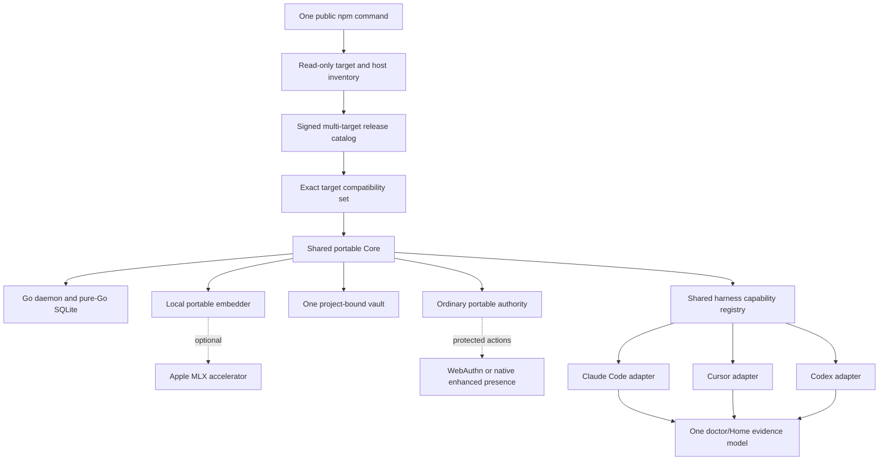
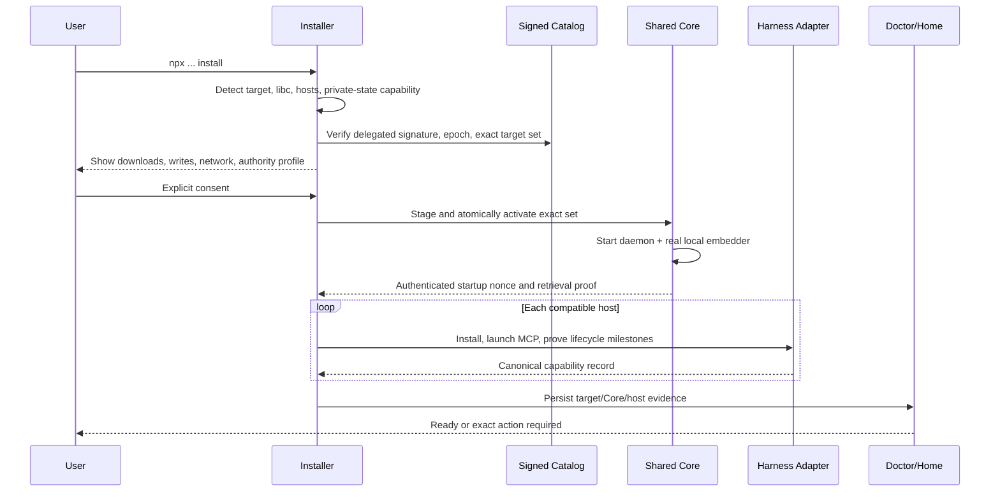

# Universal Desktop One-Command Install - Plan

## Goal Capsule

- **Objective:** Make `npx -y @zbs-gg/pulse@preview install` provision the same project-bound Pulse Personal product on macOS, Windows, and Linux when the machine has Claude Code, Cursor, or Codex, with no separately installed Go, Python, Make, Docker, model, or API key.
- **Authority:** This updates the existing Host-Neutral plan in place. The user-approved universal-desktop direction supersedes its Apple-Silicon-only actor and its deferral of Windows, Linux, and Intel macOS. The already-landed shared-Core and three-harness work remains the foundation and must not be forked by platform.
- **Execution profile:** Test-first extension of the published Node CLI, Go daemon, managed embedder protocol, signed release contract, Personal authority boundary, packed clean-room proof, and GitHub Actions. Team Memory, cross-machine synchronization, and new source connectors stay out of scope.
- **Supported targets:** `darwin-arm64`, `darwin-x64`, `win32-arm64`, `win32-x64`, `linux-arm64-gnu`, and `linux-x64-gnu`. A target is product-supported only after its exact packed install and full-retrieval proof passes on a native runner; unsupported libc/OS variants stop before mutation with a stable reason.
- **Stop conditions:** Stop rather than claim readiness if the signed target is unavailable, native private-state guarantees cannot be established, the portable embedder fails the quality gate, no supported harness can prove lifecycle readiness, or an OS/harness pair lacks native clean-room evidence.
- **Tail owner:** This change owns implementation, simplification, review, native browser/product testing, PR creation, CI, and the credential-gated release workflow that proves published bytes before promotion. Invoking production signing, uploading release assets, or moving an npm dist-tag remains an explicit post-merge release action.

---

## Product Contract

### Summary

Pulse Personal is one local product with platform adapters, not three OS products. The public npm command selects one signed target variant, provisions one portable Go/SQLite Core and one project-bound vault, starts one real local embedder, and attaches every compatible Claude Code, Cursor, and Codex installation through native harness adapters. The terminal, JSON output, doctor, and Memory Home report the exact target, security profile, host lifecycle state, shared store identity, and full-retrieval proof.

### Problem Frame

The current branch solved the harness problem but not the platform problem. The shared Core, host registry, binding, and vault already exist, yet the preflight requires `darwin/arm64`; the release envelope describes one Apple-only DMG set; the managed embedder is a Python/MLX bundle; presence is a mandatory Swift/root helper; Windows cannot compile several Go POSIX primitives; and the Node installer assumes Unix permissions, paths, locks, process inspection, signals, archives, and host locations.

Removing the two platform checks would therefore create a dangerous false claim. Universal support requires one versioned desktop target contract and narrow OS adapters beneath the existing domain/Core boundary. Retrieval, storage, object IDs, project isolation, consent, receipts, and harness semantics remain common.

### Actors

- A1. A non-technical person in a Git project on a supported macOS, Windows, or Linux desktop with Node 20+ and at least one supported harness installed.
- A2. Claude Code, Cursor, or Codex acting as an equal Pulse host.
- A3. Pulse Personal Core: one local Go daemon, pure-Go SQLite store, project binding, managed embedder, Memory Home, and shared locator.
- A4. A platform adapter that proves target compatibility, private local state, process lifecycle, artifact trust, host discovery, and interactive human authority without changing memory semantics.

### Requirements

#### One command and one product

- R1. The public entry point remains `npx -y @zbs-gg/pulse@preview install`; it must not ask the user to install Go, Python, Make, Docker, a model, an embedding API key, or a second harness.
- R2. Installation selects exactly one supported desktop target from the signed release authority before disclosure or download. Unsupported OS, architecture, libc, or missing target artifacts stop with stable reasons and zero Pulse mutation.
- R3. Every target provisions the same Personal Core contract, one signed project binding, one shared locator, one daemon, and one vault. Platform and harness adapters must not create stores, sync copies, or alternate retrieval engines.
- R4. Claude Code, Cursor, and Codex remain equal bootstrap hosts. At least one compatible host is required; absent hosts are informational; a failed secondary host degrades parity without replacing a healthy Core.

#### Signed target catalog and portable runtime

- R5. A canonical Ed25519-signed release catalog covers the complete target matrix. Target selection, artifact digests, artifact trees, formats, signing policy, release epoch, anti-rollback floor, and optional capabilities are inside the signed payload.
- R6. Each selected target provides a complete atomic compatibility set. Common model/plugin artifacts may be reused by digest; daemon, embedder runtime, and optional native authority artifacts are target variants. Activation commits all selected artifacts together and retains last-known-good rollback.
- R7. The Go daemon builds with `CGO_ENABLED=0` for every declared target. Secure-file and process primitives use small OS-specific implementations rather than scattered fail-open conditionals.
- R8. The Node installer uses portable, fail-closed adapters for private state, atomic replace, locks, archive extraction, target version/libc detection, trusted executable discovery, port availability, process identity/liveness/termination, and open/reload behavior. Windows ACL semantics must never be inferred from POSIX mode bits.

#### Real local retrieval

- R9. Full retrieval is the product on every supported target. The default portable managed embedder runs locally, loads only verified local artifacts, disables remote model loading, and preserves the current `bge-m3`, 1024-dimensional, CLS-pooled, normalized JSON-line protocol unless an explicit migration/reindex contract says otherwise.
- R10. The portable baseline is built from `BAAI/bge-m3` revision `5617a9f61b028005a4858fdac845db406aefb181` as an opset-17 dense encoder with dynamic INT8 weights, executed by `@huggingface/transformers@4.2.0` and its locked `onnxruntime-node@1.24.3` runtime. Release generation records the immutable source/export/toolchain digests, tokenizer/support assets, licenses, and target-specific native runtime tree. Remote model loading is disabled. The public npm package need not contain all native/model bytes; the signed selected artifact set downloads only the current target.
- R11. MLX remains an optional Apple accelerator behind the same runner protocol. Doctor reports the active engine. MLX cannot be required for readiness and cannot change object IDs, vector dimensions, normalization, or release quality claims.
- R12. Portable and accelerated embedders must pass the same multilingual fixture, retrieval/ranking parity, no-network, crash/restart, and real-query quality gates. The portable release budget is: selected transfer at most 900 MiB, installed runtime/model tree at most 2 GiB, peak embedder RSS at most 4 GiB, cold engine start at most 30 seconds, warm daemon-plus-embedder readiness at most 10 seconds, and warm single-query p95 at most 2 seconds on the documented four-core native reference runner. Quality requires top-1 parity of `1.0`, NDCG@10 delta at most `0.01`, minimum cosine against the FP32 reference of `0.985`, 1024 dimensions, CLS pooling, and normalized vectors. A target missing any measurement is not release-ready; missing or synthetic embeddings may not produce a Pulse-ready verdict.

#### Human authority and privacy

- R13. Ordinary Personal install consent, visible-before-save, read, recall, and Memory Home use a portable authority profile. Protected binding replacement and wipe stay absent from product MCP tools and require a fresh, content-bound assertion from an enhanced user-presence adapter whose verification factor is unavailable to ordinary agent subprocesses. Loopback, CSRF, session binding, expiry, and receipts are transport/audit controls, not proof of a human. Noninteractive `--yes`, shell wrappers, and agent processes cannot authorize protected actions; when no enhanced adapter is available, those actions remain unavailable rather than weakening the boundary.
- R14. The cross-platform enhanced adapter uses WebAuthn with `userVerification: required` and a platform authenticator or user-held security key; the signed macOS native-presence helper remains an alternative adapter. Its challenge binds the action, project, binding/vault identity, affected data, nonce, and expiry. Doctor and Memory Home always show the active profile and exactly which protected actions it can authorize.
- R15. Raw transcript capture, old-chat import, backend model calls, cross-project retrieval, and automatic Git/team publication remain off by default on every OS. Existing shared-publication paths are disabled and untouched in this Personal milestone. Receipts never expose credentials, raw subprocess output, or private filesystem paths.

#### Agent and harness parity

- R16. Every supported OS/harness pair exposes the same semantic capability floor: project binding, session continuity, turn capture lease, `pulse_remember`, corroborated write receipt, bounded finalization, context/recall/resume/status/tray, doctor evidence, disconnect, and repair.
- R17. Static plugin installation and automatic lifecycle readiness are distinct facts. The shared host capability record includes at least `detected`, `compatible`, `installed`, `mcp_ready`, `lifecycle_ready`, `reload_required`, `reason_code`, and proven semantic milestones; terminal, JSON, doctor, and Memory Home consume the same record.
- R18. Host discovery uses bounded target-specific vendor locations, supports Windows `.exe`/`.cmd`, Linux application paths, macOS apps, `path.delimiter`, spaces and non-ASCII, and revalidates exact executable identity after consent.
- R19. The three launchers expose identical Personal MCP tool names/schemas and stable domain results. The bound launcher fixes source host; the model cannot claim another host. Destructive tools remain absent.

#### Evidence and release truth

- R20. A declared target is supported only after native CI installs the exact npm tarball through `npm exec --yes --package=<exact-tarball> -- pulse install`, then proves daemon start, real local embedding, doctor, visible save receipt, restart, same-object recall, repair, disconnect, and protected-action denial. The public `npx -y @zbs-gg/pulse@preview install` command is release evidence only after those exact package bytes are published and attested.
- R21. CI covers all six targets on native runners: GitHub-hosted where available to this repository and explicitly provisioned native self-hosted runners otherwise. It proves every vendor-supported OS/harness pair, at least one lifecycle-ready singleton host on each target, and at least one two-host shared-vault scenario per OS family where two hosts are vendor-supported. Cross-build or fixture-only evidence is not product support.
- R22. PR verification uses unsigned fixture artifacts bound to the same schemas. Production release verification separately enforces Apple notarization, Windows Authenticode, Linux signed-manifest policy, real model quality, exact artifact attestation, and authorized publication credentials.
- R23. Team Memory, remote shared storage, cross-machine synchronization, connectors, and role-based team retrieval do not enter this milestone.
- R24. Installer progress is one canonical state model shared by terminal, JSON, doctor, and Memory Home: `preflight`, `awaiting_consent`, `downloading` with byte progress, `verifying`, `activating`, `starting_retrieval`, `attaching_host`, `reload_required`, `paused_offline`, `cancelled`, `resumed`, `rolled_back`, `repair_required`, and `ready`. Every nonterminal state says whether cancellation is safe, what remains active, and the one next action.
- R25. A fresh Memory Home leads with continuity readiness and the one next action, says plainly that no memories exist, and transitions from a real user-approved save card to a receipt and fresh-session recall. A labeled simulated proof is secondary and opt-in. From `ready`, the native acceptance flow must reach one visible approved memory recalled in a fresh harness session within 60 seconds and one human confirmation. Host repair sits below the primary state; target/artifact/engine/security details are inspectable. Only Core/retrieval failure, unsafe private state, or a required authority failure interrupts the top hierarchy.
- R26. Each continuity delivery records source-context tokens and delivered-memory tokens using a pinned estimator, plus host-reported usage when available. Memory Home labels results `measured`, `estimated`, or `collecting`; it never shows a savings percentage when either side is missing and never treats simulated evidence as user savings.
- R27. The npm bootstrap is an explicit first-install trust root. Publication uses npm trusted publishing through GitHub OIDC with provenance bound to the reviewed commit/workflow, no long-lived publication token, and an immutable package digest in release evidence. An offline root keyring delegates bounded, short-lived channel catalog keys; custody, audit, rotation, revocation, and compromise recovery are tested without disabling anti-rollback.

### Key Flows

- F1. **Universal singleton install**
  - A1 runs the public npm command in a project on any supported target with one harness.
  - Read-only preflight resolves the exact target and host, verifies the signed catalog, and shows downloads, local writes, network destinations, privacy defaults, and active authority profile.
  - After explicit consent, Pulse reports canonical byte/stage progress, activates one Core set, starts full retrieval, attaches the host, and opens/links Memory Home. Cancellation or interruption leaves either the previous set or a resumable staged set, never a half-active Core.
  - The result is ready only after a daemon-backed retrieval query and host lifecycle proof. Fresh Home says there are no memories yet and makes continuing in the current harness the primary next action; the first real extracted capsule is shown before save, then appears with its receipt and fresh-session recall proof.
- F2. **Cross-harness continuity**
  - A1 saves an approved memory through host A, closes it, and opens host B in the same project.
  - Host B resolves the same signed binding and store, receives the same object ID and provenance, and does not import, copy, or synchronize another store.
- F3. **Target-safe upgrade and repair**
  - A signed catalog selects a newer complete target set.
  - Pulse downloads to private staging, validates every tree and platform signature, atomically switches the complete set, then proves health.
  - The new active pointer and anti-rollback floor commit in one durable transaction only after post-switch health succeeds. Until then, an explicitly authorized prior-set recovery record remains valid.
  - Failure restores the previous set, including a floor-raising failed upgrade. Repair re-inspects live facts and retries only incomplete target/host work.
- F4. **Protected Personal action**
  - Memory Home shows the exact binding/vault/data affected and issues a short-lived, content-bound WebAuthn/native-presence challenge.
  - Only a direct completion with required user verification can authorize the operation. Agent/MCP/noninteractive attempts return a stable action-required receipt; a machine without an enhanced adapter shows the action as unavailable.
- F5. **Published preview promotion**
  - After merge and explicit release authorization, the workflow signs and uploads one production artifact set, publishes the exact npm package digest to a temporary candidate dist-tag, and runs the full native registry-command matrix.
  - The workflow verifies commit, provenance, catalog, assets, package digest, real-model quality, and target attestations, then promotes those unchanged package bytes to `preview`. A failure leaves `preview` untouched.

### Acceptance Examples

- AE1. On macOS arm64 or x64 with only Codex, the public command selects the exact signed Mac target, reaches real full retrieval, and never requires MLX; when MLX is available and selected, doctor labels it as acceleration.
- AE2. On Windows x64 or arm64 with only Cursor, the command uses Windows paths and ACL/process adapters, installs the native Pulse integration, starts one daemon/embedder, and recalls the same saved object after restart without WSL, Go, or Python.
- AE3. On Linux x64 or arm64 GNU with only Claude Code, the command uses the Linux target, passes full retrieval, and never invokes macOS or Windows tools.
- AE4. Given Claude Code and Codex on one machine, both attach concurrently to one daemon/store; exactly one Core activation wins and both report the same binding/store identity.
- AE5. Given a signed catalog without the current target, preflight returns `release_target_unavailable`, names the actual target, downloads nothing, and creates no Pulse state.
- AE6. Given a Windows private-state ACL that grants another user write access, Pulse fails closed with `private_state_acl_unsafe`; it does not reinterpret meaningless mode bits as safe.
- AE7. Given the portable embedder is missing, remote-enabled, synthetic, wrong-dimension, or fails a real query, doctor says full retrieval is unavailable and never reports Pulse ready.
- AE8. Given a protected wipe is attempted from MCP, a shell wrapper, or `--yes`, Pulse refuses and returns the exact Memory Home action required; a human completion records a receipt without exposing the challenge secret.
- AE9. Given one detected secondary host is reload-required, the product remains usable through a lifecycle-ready host while parity is degraded and repair targets only the incomplete host.
- AE10. Given any supported native CI runner, `npm pack` plus `npm exec --yes --package=<exact-tarball> -- pulse install` proves install, save, restart, recall of the same object ID, and cleanup using only dependencies declared by the package and signed target set.
- AE11. Given no enhanced authenticator is available, ordinary install/read/save/recall remains ready while protected binding replacement and wipe are visibly unavailable; loopback access alone never upgrades authority.
- AE12. Given an upgrade raises the rollback floor and its health proof fails, the previous set starts successfully and the old committed floor remains authoritative.
- AE13. Given a fresh project, Home shows `0 memories`, one clear next action, then the real approved card, receipt, and fresh-session same-object recall; token savings remain `collecting` until both counts exist.
- AE14. Given production candidate bytes differ from the reviewed npm digest or any signed asset, promotion to `preview` is refused and the prior public tag remains unchanged.

### Success Criteria

- All six Go targets cross-build; all six native runners execute their target contract and the portable embedder protocol.
- Native macOS, Windows, and Linux packed clean rooms prove the exact public install command, full retrieval, one vault, and truthful host lifecycle state.
- The existing three-harness shared-Core behavior remains green and gains daemon-backed same-object cross-host recall.
- The release catalog cannot be substituted, downgraded, target-confused, partially activated, or used to weaken signing/private-state policy.
- First-value, resource, latency, retrieval-quality, and token-evidence thresholds are machine-readable release gates rather than prose-only claims.
- `make verify` remains green on its supported shell, while GitHub Actions becomes the required cross-platform PR gate.

### Scope Boundaries

#### Included

- macOS, Windows, and GNU/Linux Personal install/runtime support on x64 and arm64.
- One signed target catalog, one portable local embedder baseline, optional MLX acceleration, portable ordinary authority plus enhanced protected-action adapters, OS-specific security/process/filesystem adapters, host discovery, lifecycle parity, packed native proofs, GitHub Actions, and a credential-gated candidate-to-preview release workflow.
- Existing terminal, JSON, doctor, and Memory Home surfaces required to explain target, downloads, memory, token/continuity evidence, hosts, and security profile.

#### Deferred

- musl/Alpine, BSD, mobile OSes, containers as the primary desktop product, auto-attachment of a later-installed harness, GPU accelerators other than MLX, and OS-native enhanced presence beyond macOS.
- Actual npm publication, production certificate use, and release upload until the PR is merged and the explicit release ceremony is authorized; the release workflow and its refusal paths are included.

#### Outside This Product Contract

- A separate GUI/DMG/MSIX as the required installer, a hosted embedding default, keyword fallback presented as Pulse, per-OS or per-harness memory stores, Team infrastructure, cross-project recall, or silent source ingestion.

### Sources and Research

- Repository evidence: `pulse-app/cli/src/install-plan.js`, `release-manifest.js`, `artifact-installer.js`, `local-supervisor.js`, `supported-hosts.js`, `personal-install.js`, `workspace-binding.js`, `pulse-app/internal/embed/local.go`, `pulse-app/internal/userpresence/`, and the Windows cross-build failures in POSIX syscall call sites.
- ONNX Runtime officially publishes Node CPU binaries for Windows, Linux, and macOS on x64 and arm64: <https://onnxruntime.ai/docs/get-started/with-javascript/node.html>.
- Transformers.js supports server-side Node inference, local model paths, configurable cache, and disabling remote model loading: <https://huggingface.co/docs/transformers.js/en/tutorials/node>.
- GitHub-hosted public runners cover Linux, Windows, and macOS on x64/arm64, enabling native target proof: <https://docs.github.com/en/actions/reference/runners/github-hosted-runners>.
- GitHub Actions matrix jobs provide deterministic OS/target fan-out: <https://docs.github.com/en/actions/reference/workflows-and-actions/workflow-syntax#jobsjob_idstrategymatrix>.
- Microsoft SignTool provides Windows executable signing, verification, and timestamping: <https://learn.microsoft.com/en-us/windows/win32/seccrypto/signtool>.
- Claude Code documents macOS, Linux, native Windows with Git Bash, and WSL support; Pulse treats native and WSL as different target authorities rather than mixing stores: <https://docs.anthropic.com/en/docs/claude-code/getting-started>.

---

## Planning Contract

### Key Technical Decisions

- KTD1. **Universal desktop is the product target.** (session-settled: user-approved — rejected Apple-Silicon-only release: colleagues must install the same Personal memory regardless of desktop OS.) Support is release-evidence-backed for macOS, Windows, and GNU/Linux, not inferred by removing preflight checks.
- KTD2. **One shared project-bound Personal Core serves Claude Code, Cursor, and Codex.** (session-settled: user-directed — rejected per-harness runtimes/stores: continuity must cross sessions and harnesses without synchronization or duplication.) Existing shared-Core U1-U4 work is preserved.
- KTD3. **One npm command owns prerequisites.** (session-settled: user-directed — rejected DMG/source builds/Make/Docker/manual models/API keys/per-harness setup: non-technical onboarding must be competitive with other memory products.) Target artifacts may download after disclosure and consent.
- KTD4. **Local full retrieval is the baseline.** (session-settled: user-directed — rejected hosted embeddings and keyword fallback marketed as the product: privacy and state-aware retrieval are core value.) The portable embedder is verified, local-only, and real-query gated.
- KTD5. **MLX and enhanced user presence are adapters, not Core prerequisites.** (session-settled: user-approved — rejected making Apple acceleration and Touch ID the universal contract: platform hardening may improve a target but cannot define the shared product.) Ordinary memory works without either adapter; protected actions require WebAuthn/native user verification and remain unavailable when no such factor exists.
- KTD6. **Team remains after the Personal wedge.** (session-settled: user-directed — rejected resuming remote Team infrastructure before universal Personal works: one person must be able to install and use memory now.) No Team schema or transport work belongs in U5-U11.
- KTD7. **Use a signed multi-target catalog rather than unsigned runtime selection.** One envelope binds target choice and the entire artifact set, preserving anti-rollback and atomic activation.
- KTD8. **Centralize portable security/process primitives.** Go build-tag files and a small Node platform service own OS differences; domain, retrieval, binding, vault, and harness code consume stable contracts.
- KTD9. **Use an engine-neutral embedder runner contract.** Exact executable, bounded arguments, verified model tree, protocol, and identity replace Python-specific config. Portable ONNX is the baseline and MLX is a conforming alternative.
- KTD10. **Define harness parity by semantic milestones.** Static plugin bytes do not equal automatic memory. One canonical capability record drives install, repair, doctor, JSON, and Memory Home.
- KTD11. **Bind daemon identity through a startup nonce and authenticated health proof.** This replaces brittle `/bin/ps` command-line parsing and prevents PID-reuse confusion on every OS.
- KTD12. **Separate PR truth from release ceremony.** Native fixture builds and packed product flows block PRs; private production signing/notarization/model inputs and npm publication run only through an authorized release job.
- KTD13. **Test exact bytes twice, then promote unchanged.** PRs install the exact local npm tarball; the authorized release publishes the same attested digest to a candidate tag, tests the real registry/assets path natively, and only then moves `preview` without rebuilding.

### Assumptions

- Node 20+ is available because the requested distribution surface is `npx`; Pulse does not install or manage Node itself.
- GNU/Linux is the first Linux contract. musl is explicitly detected and unsupported rather than accidentally running incompatible native libraries.
- The current BGE-M3 1024/CLS/normalized contract remains stable. If the portable export cannot pass quality and resource gates, the plan stops rather than silently changing the model.
- Vendor lifecycle events differ, but each declared host can either prove the semantic floor or remain explicitly unsupported/action-required on that target.
- Evidence that invalidates a session-settled decision must stop execution and be reported; it must not be hidden by narrowing acceptance tests.

### High-Level Technical Design

### System-Wide Impact

- **Trust:** The release root, target choice, artifact trees, model, and platform signing policy remain signed and anti-rollback protected. OS adapters strengthen local-state proof without weakening shared validation.
- **State:** Personal databases and object schemas do not fork. Install/activation/authority receipts gain target and capability identities; legacy v1 evidence is read only as historical context and revalidated live.
- **Process model:** One daemon owns one embedder helper and exposes a startup nonce through authenticated loopback health. Concurrent harness activation shares a portable single-writer install/runtime lock.
- **Packaging:** The npm package carries CLI/MCP logic and a signed catalog. Large/native model/runtime bytes remain exact target artifacts selected after consent.
- **Operations:** GitHub Actions becomes the native OS/architecture support ledger. A release cannot claim a target absent its attestation.
- **UX:** The command stays one line. Progress never looks hung: every installer state carries bytes/stage, cancellation safety, and the next action. Home leads with continuity/readiness and first memory value; platform details stay inspectable unless they block ordinary memory.

### Risks and Mitigations

- **Scope explosion:** Preserve U1-U4 and keep platform code behind bounded interfaces. Do not rewrite retrieval, storage, Team, or host domain behavior.
- **Windows trust regression:** Never reuse POSIX uid/mode checks on Windows. Test unsafe DACLs, junction escapes, path case, locked files, and PID reuse on native Windows.
- **Model size/startup:** Download only the selected target/model tree, support resumable verified downloads, enforce R12's byte/RSS/start/latency/quality thresholds, and stop rather than silently ship a weaker model.
- **Embedding drift:** Bind vector contract and model revision in receipts; compare portable/MLX retrieval outcomes to the reference gate before release; require reindex for incompatible future changes.
- **Host vendor drift:** Keep target-specific discovery bounded and capability/version tested. One broken adapter cannot mutate Core or lower readiness claims.
- **Archive/signature confusion:** Use one portable safe archive library, normalized paths and tree manifests, plus platform-specific signature verification before activation.
- **False CI confidence:** Use native runners and the packed artifact/public command. Synthetic fixtures validate failure branches but cannot establish product support.
- **Human-presence confusion:** Treat loopback, cookies, and CSRF only as request integrity. Protected actions require content-bound WebAuthn/native user verification and fail unavailable when that factor cannot be produced.
- **Supply-chain compromise:** Treat npm as the bootstrap trust root, use OIDC trusted publishing and provenance, delegate channel signing from an offline root, and test rotation/revocation plus candidate-to-preview promotion of unchanged bytes.

### Sequencing

The landed U1-U4 foundation stays intact. U5 defines target/release authority. U6 makes Core primitives compile and behave safely across OSes. U7 replaces the Apple-only embedder prerequisite. U8 separates ordinary authority from enhanced protected-action presence. U9 builds and activates real target artifacts. U10 finishes host/lifecycle parity and first-value/product evidence. U11 makes PR and candidate-to-preview flows mandatory release truth. Dependencies are strict: U5 -> U6 -> U7/U8 -> U9 -> U10 -> U11.

---

## Landed Foundation (U1-U4, Preserve)

- U1. Supported-host inventory replaced Codex-gated preflight.
- U2. Shared Core bootstrap and native adapter registry attach Claude Code, Cursor, and Codex to one product edge/store.
- U3. Host-neutral install receipts, repair, readiness, and lifecycle evidence replaced the Codex-only checkpoint.
- U4. Packed singleton/multiharness fixture coverage exists, but its own evidence correctly says it is not yet public-command, daemon-backed, cross-platform production proof. U10 replaces that limitation rather than relabeling it.

## Implementation Units

### U5. Introduce the signed desktop target catalog

- **Goal:** Put universal target selection and exact compatibility sets inside signed release authority.
- **Requirements:** R2, R5-R6, R22; AE5; KTD7, KTD12.
- **Files:**
  - Create `pulse-app/cli/src/desktop-target.js`
  - Create `pulse-app/cli/src/desktop-target.test.js`
  - Modify `pulse-app/cli/src/release-manifest.js`
  - Modify `pulse-app/cli/src/release-manifest.test.js`
  - Modify `pulse-app/cli/release/personal-preview-manifest.schema.json`
  - Modify `pulse-app/cli/src/personal-runtime-installer.js`
  - Modify `pulse-app/cli/src/personal-runtime-installer.test.js`
  - Modify `pulse-app/cli/src/install-plan.js`
  - Modify `pulse-app/cli/src/install-plan.test.js`
- **Approach:** Version the payload to a canonical target catalog with common artifacts plus exact target variants/capabilities. Normalize six target IDs, include libc/minimum-runtime policy, choose one target before disclosure, and project a v1-compatible verified selected set into existing activation code. Make enhanced-presence helpers optional target capabilities. Pin an offline-root keyring in the npm bootstrap; channel catalogs use bounded delegated keys with explicit epoch ranges, expiry, revocation, and rotation metadata. Preserve signature verification, release epoch, anti-rollback, origin allowlist, exact digests, model data-only policy, and atomic set identity.
- **Test scenarios:** all six targets select exactly; wrong arch/platform/libc/minimum OS fail closed; missing target zero mutation; target-confusion signature tamper fails; common artifact digest reuse is canonical; optional capability cannot become required outside signed policy; expired/revoked/out-of-range delegated keys fail; compromise recovery rejects a revoked key's higher-epoch catalog without lowering anti-rollback; v1 Mac envelope reads for repair context but never authorizes a universal-ready claim.
- **Verification:** `cd pulse-app/cli && node --test src/desktop-target.test.js src/release-manifest.test.js src/personal-runtime-installer.test.js src/install-plan.test.js`.
- **Done when:** One signed envelope deterministically yields one complete target set and the disclosure names only its exact downloads/capabilities.

### U6. Add portable Core security and process primitives

- **Goal:** Compile and run the unchanged Personal Core safely on every declared target.
- **Requirements:** R3, R7-R8, R15; AE6; KTD2, KTD8, KTD11.
- **Dependencies:** U5.
- **Files:**
  - Create OS-specific files under `pulse-app/internal/platform/`
  - Modify POSIX syscall call sites in `pulse-app/internal/config/`, `internal/unassigned/`, `internal/server/`, and `cmd/pulse/`
  - Create `pulse-app/cli/src/platform-services.js` plus OS-specific implementations/tests
  - Modify `pulse-app/cli/src/install-journal.js`
  - Modify `pulse-app/cli/src/artifact-installer.js`
  - Modify `pulse-app/cli/src/local-supervisor.js`
  - Modify Personal-path callers in `workspace-binding.js`, `personal-principal.js`, `personal-install.js`, `codex-runtime.js`, `cursor-hooks.js`, and `unassigned-inbox.js`
- **Approach:** Replace raw Go POSIX syscalls with build-tagged secure-open/stat/liveness primitives. In Node, centralize private directories/files, DACL-or-mode proof, atomic durable replace, portable lock, Git/executable discovery, port probe, OS/libc version, and process lifecycle. Bind runtime receipt to a random startup nonce returned by authenticated `/health`; use exact executable digest plus nonce instead of `/bin/ps` command parsing. Leave Team-only clients untouched unless a shared primitive is directly reused.
- **Test scenarios:** six-target Go cross-build; POSIX symlink/hardlink/mode attacks; Windows permissive DACL/junction/case attacks; concurrent lock contention; PID reuse/stale nonce; path with spaces/non-ASCII; interrupted atomic replace; daemon stop/restart/rollback; no shell/system utility prerequisite.
- **Verification:** Go native tests plus `GOOS/GOARCH` cross-build matrix, affected CLI unit tests, and native Windows/Linux/macOS platform-service tests.
- **Done when:** Windows builds, every target can safely persist private state and supervise one daemon, and no Personal path assumes `/usr/bin`, `/bin/ps`, Unix signals, uid, or mode bits outside the platform layer.

### U7. Ship a universal local managed embedder

- **Goal:** Make real local BGE-M3 retrieval available without Python/MLX or a backend key.
- **Requirements:** R1, R9-R12; AE7; KTD4, KTD5, KTD9.
- **Dependencies:** U6.
- **Files:**
  - Modify `pulse-app/internal/embed/local.go` and tests
  - Modify `pulse-app/cli/src/local-supervisor.js` and tests
  - Create a portable helper/runtime under `pulse-app/cli/runtime/embedder-portable/`
  - Create `pulse-app/cli/scripts/build-portable-embedder-runtime.mjs`
  - Modify `pulse-app/cli/src/managed-embedder-release.js` and tests
  - Modify model artifact/tree handling in `personal-runtime-installer.js` and `artifact-installer.js`
  - Extend `pulse-app/cli/runtime/embedder/quality_gate.py` or add an engine-neutral equivalent
- **Approach:** Generalize managed config to exact runner executable + bounded args + verified model/support tree + protocol identity. Build from `BAAI/bge-m3@5617a9f61b028005a4858fdac845db406aefb181` as an opset-17 dense encoder with dynamic INT8 weights; the helper performs CLS pooling and L2 normalization. Lock `@huggingface/transformers@4.2.0` and `onnxruntime-node@1.24.3`. Each signed target tree contains the helper, lockfile-derived target runtime, `model_int8.onnx`, `tokenizer.json`, tokenizer/config/special-token files, `pulse-model-contract.json`, licenses, and source/export/toolchain provenance; no remote model lookup is possible. Keep the daemon JSON-line protocol stable. Register MLX as an optional conforming accelerator. Bind model/runtime revision and vector contract into activation/readiness receipts.
- **Test scenarios:** portable startup/embedding on all native target runners; no network after artifact download; wrong runner/model/tree/dimension/pooling/normalization fails; helper crash/restart; multilingual fixture; retrieval/ranking comparison to FP32 reference and MLX; resumable large download; warm restart; exact R12 byte/RSS/start/latency/quality budget failures; incompatible vector contract requires reindex.
- **Verification:** embedder protocol tests, portable real-model quality gate, existing MLX gate as optional accelerator proof, and one real daemon retrieval query per native target.
- **Done when:** every supported target reports `full_retrieval=true` with a real local query and no Python, MLX, model/API configuration, or hidden network dependency.

### U8. Separate ordinary Personal authority from enhanced user presence

- **Goal:** Remove the mandatory Mac helper while keeping protected actions behind a factor unavailable to ordinary agent subprocesses.
- **Requirements:** R13-R15; AE8; KTD5.
- **Dependencies:** U6.
- **Files:**
  - Create a versioned authority profile in Go and CLI modules
  - Modify `pulse-app/cli/src/personal-install.js`, `cli.js`, `workspace-binding.js`, and `trust-helper.js`
  - Modify `pulse-app/internal/userpresence/` and Memory Home authorization routes/UI
  - Modify doctor/readiness receipt projections and tests
- **Approach:** Replace unconditional `presence_ready` with a versioned capability profile. The portable profile supports initial consent and ordinary Personal operations. Binding replacement and wipe require a WebAuthn assertion with `userVerification: required` or the signed macOS helper; the challenge binds exact action/project/binding/vault/data/nonce/expiry. Loopback, CSRF, and session binding protect transport only. MCP and noninteractive CLI never receive the protected capability. Shared publication remains disabled and untouched. U8 tests the authority behavior against a fixture Core; U10 owns real install/read/save integration.
- **Test scenarios:** fixture-backed install/read/save authorization on all targets without native helper; MCP/`--yes`/loopback-only/replayed/expired/wrong-project protected challenges denied; direct WebAuthn or Mac enhanced assertion succeeds once; missing enhanced adapter does not block ordinary readiness but makes protected actions unavailable; receipt contains no secret. Browser coverage includes keyboard-only completion, deterministic focus entry/restoration, semantic affected-data labels, non-color warnings, screen-reader announcements for expiry/error/success, accessible countdown behavior, narrow widths, and zoom.
- **Verification:** Go user-presence/Home tests, CLI authority/doctor tests, and browser tests for the challenge/card/history flow.
- **Done when:** the authority profile behaves consistently against the fixture Core, ordinary operations need no native helper, and protected actions cannot be authorized through agent-accessible loopback/session material alone.

### U9. Build, verify, and atomically activate cross-platform artifacts

- **Goal:** Produce installable target sets with portable extraction and platform-appropriate release policy.
- **Requirements:** R5-R8, R22; F3; KTD7, KTD12.
- **Dependencies:** U5-U8.
- **Files:**
  - Finish the deferred Windows bootstrap in `pulse-app/cli/src/platform-services.js` and make supervised executable paths target-aware in `local-supervisor.js`
  - Version the release/model contract in `release-manifest.js` and `personal-preview-manifest.schema.json` so the portable ONNX model/support tree replaces the legacy one-file safetensors carrier
  - Refactor `pulse-app/cli/scripts/build-personal-release.mjs` into shared and target builders
  - Modify `pulse-app/cli/src/artifact-installer.js` and tests
  - Modify `pulse-app/cli/src/managed-embedder-release.js`
  - Modify `pulse-app/cli/scripts/prepare-preview-vendor.mjs`
  - Modify `pulse-app/cli/scripts/personal-preview-release-attestation.mjs`
  - Modify `pulse-app/cli/package.json` and lockfile for the portable safe archive dependency
- **Approach:** First close the Windows bootstrap gap with a bundled npm bootstrap adapter, because secure artifact staging cannot depend on an adapter that must itself be downloaded as an artifact; resolve `pulse.exe` and other executable paths from the selected target. Then replace the legacy one-file safetensors release contract with one normalized archive containing the exact `model_int8.onnx`, model contract, tokenizer/config/support, license, and provenance tree required by U7. Use a pinned streaming archive implementation with canonical tree manifests and no required system `tar`/DMG materializer; reject traversal, duplicate paths, links, special files, undeclared entries, and size/depth bombs before activation. Build static Go daemon variants and portable embedder variants. Enforce Apple Developer ID/notarization for production Mac artifacts, Authenticode+timestamp+publisher identity for Windows executables, and signed-catalog/tree policy for Linux. Keep production credentials outside PR builds; fixture builds exercise the same descriptors and extraction code but can never satisfy production signing policy. Stage and health-prove a complete set without advancing authority; then one durable generation transaction advances the complete active set and anti-rollback floor together while retaining the prior authorized generation for recovery. Per-artifact pointers become derived caches rather than release authority.
- **Test scenarios:** native Windows bootstrap private-state/lock/process proof before download; target-aware executable names; traversal/symlink/hardlink/special-file/duplicate/undeclared archives; wrong signature/target/publisher/timestamp; partial set; interrupted download/activation; last-known-good generation rollback; failed floor-raising upgrade restores the prior set and floor; Windows locked file; duplicate/common artifacts; exact selected download disclosure; production policy refuses unsigned Mac/Windows inputs.
- **Verification:** target fixture builds on all native runners, artifact installer security suite, release schema tests, and authorized platform attestation scripts in dry-run/fixture mode.
- **Done when:** each target runner builds and installs its own exact fixture set with no external archive/build utility, while production gates remain impossible to bypass.

### U10. Finish OS-aware host parity and first-value product evidence

- **Goal:** Prove the same usable memory through every vendor-supported Claude Code, Cursor, and Codex target, then show the non-technical user that continuity works and what it saved.
- **Requirements:** R4, R16-R21, R24-R26; F1-F2; AE1-AE4, AE9-AE10, AE13; KTD2, KTD3, KTD10.
- **Dependencies:** U9.
- **Files:**
  - Modify `pulse-app/cli/src/supported-hosts.js` and tests
  - Modify `pulse-app/cli/src/personal-host-adapters.js`, `cli.js`, readiness/doctor/Home projections
  - Modify native plugin launchers/manifests/hooks under `plugins/pulse/`
  - Fix exact Claude `pulse-product` tool matcher and bind source host in `mcp/src/index.ts`
  - Replace synthetic limits in `personal-preview-multiharness-e2e.mjs`
  - Add native packed product scripts/fixtures for macOS, Windows, and Linux
- **Approach:** Add bounded per-target host candidates and config locations; preserve post-consent digest revalidation. Make host capability aggregation lifecycle-aware. Use one canonical MCP schema/policy renderer and exact launcher-bound host identity. Define the shared installer state machine and Home hierarchy once. Fresh Home leads with continuity/readiness, then one next action and the real first memory card/receipt/fresh-session recall; host repair follows, while target/artifact/engine/security details are inspectable. Record deterministic estimated token counts and host-reported counts when available, with explicit evidence status. Run the exact packed-tarball command against native fixtures, start the real daemon/embedder, save through host A, restart, recall the same object ID through host B, and exercise concurrent first launch/repair.
- **Test scenarios:** every vendor-supported singleton host pair and one two-host flow per OS family; absent/incompatible/reload-required/partial repair; every canonical progress/recovery state and next action; fresh empty Home to first real card/receipt/fresh-session recall within the R25 budget; measured/estimated/collecting token labels and no unsupported percentage; exact tool-name/schema parity; same object ID/receipt semantics; source host cannot be forged; two-host concurrent activation; revoked/wrong-project binding; spaces/non-ASCII/case/junction/symlink paths; no destructive MCP tools.
- **Verification:** MCP/adapter unit tests plus native packed install/doctor/save/restart/cross-host-recall/repair scripts.
- **Done when:** every vendor-supported OS/harness pair has calibrated native evidence for the semantic floor, each target has one ready singleton proof, each OS family has a supported two-host shared-store proof, and Home visibly proves first continuity value without sync/copy or invented savings.

### U11. Make native universal proof a required GitHub gate

- **Goal:** Prevent a green Mac build or synthetic fixture from being labeled universal product support.
- **Requirements:** R20-R23, R27; F5; AE10, AE14; KTD12-KTD13.
- **Dependencies:** U10.
- **Files:**
  - Create `.github/workflows/verify.yml`
  - Create reusable target-matrix scripts/config under `pulse-app/cli/scripts/`
  - Modify `Makefile`, `pulse-app/cli/package.json`, `README.md`, `docs/INSTALL_WITH_AGENT.md`, `AGENTS.md`, and release docs
- **Approach:** Add a six-target native matrix using GitHub-hosted runners where this repository has them and labeled native self-hosted runners otherwise. Run Go build/tests, Node CLI/MCP tests, fixture target build, `npm pack`, `npm exec --yes --package=<exact-tarball> -- pulse install`, full retrieval, calibrated real-harness conformance, host scenarios, and uploaded evidence summaries. Add a protected release workflow that uses npm OIDC trusted publishing/provenance, production signing/model attestations, immutable digests, a temporary candidate tag, the same native registry-command matrix, and atomic promotion of unchanged package bytes to `preview`. Document only target/harness pairs whose required evidence is green.
- **Test scenarios:** matrix fan-out includes all six native targets with no allowed failure; each fixture is version-calibrated against a real supported vendor harness installation per OS family; packed exact tarball is installed; evidence binds commit/package/target/catalog/artifacts/store/host milestones and performance/first-value/token proof; one failed target blocks the check; release refuses long-lived npm tokens, missing OIDC provenance, key revocation/rotation recovery, credentials, attestations, digest drift, or candidate smoke; docs cannot claim a target absent the support ledger.
- **Verification:** workflow syntax validation, local matrix-script contract tests, and a green PR check suite on all six native runners.
- **Done when:** GitHub exposes one required universal PR gate and one protected candidate-to-preview workflow; no target claim or public tag can advance without evidence for the exact package and production artifact bytes.

---

## Verification Contract

| Gate | Applies to | Observable pass condition |
|---|---|---|
| Go six-target build/test matrix | U6-U11 | Every declared target compiles; native jobs run security/process tests |
| `cd pulse-app/cli && npm test` | U5-U10 | Target, release, platform, authority, runtime, adapter, receipt, and CLI regressions pass |
| Portable real-model quality gate | U7-U11 | Pinned local-only BGE-M3 export satisfies R12 quality and resource thresholds |
| Packed native product matrix | U9-U11 | Exact npm tarball command installs one target set and proves daemon-backed full retrieval |
| Cross-host continuity matrix | U10-U11 | Host B recalls host A's same object ID/store after restart without import/copy |
| Authority/browser suite | U8-U11 | Ordinary cards work; protected action requires content-bound enhanced user verification; loopback/replay/agent attempts fail |
| Artifact/release security suite | U5, U9, U11 | Target confusion, tamper, downgrade, traversal, partial set, and unsigned production inputs fail closed |
| First-value and savings suite | U10-U11 | Fresh Home reaches one real recalled memory inside budget and labels token evidence without invented savings |
| `make verify` | all | Existing repository Go/MCP/CLI/Team regression gates remain green on the canonical POSIX development path |
| Required GitHub universal check | U11 | All six native jobs and evidence aggregation are green with no allowed failure |
| Candidate-to-preview release gate | U11 | OIDC-published candidate, signed production assets, provenance, native registry smoke, and unchanged digest promotion pass |

Support truth is target- and harness-specific. A platform build, copied plugin, keyword fallback, synthetic embedder, or fixture-only retrieval is never sufficient evidence for `Pulse Local Preview ready.`

---

## Definition of Done

- [ ] One npm command installs the same project-bound Pulse Personal contract on supported macOS, Windows, and GNU/Linux x64/arm64 targets.
- [ ] No supported path requires user-installed Go, Python, Make, Docker, model, embedding API key, MLX, DMG, or another harness.
- [ ] The signed catalog selects and atomically activates one exact target set with anti-rollback and last-known-good recovery.
- [ ] Windows, Linux, and both Mac architectures compile and pass native private-state/process/runtime tests without weakened trust checks.
- [ ] Every supported target passes a real local BGE-M3 retrieval query; MLX is optional and visibly labeled as acceleration.
- [ ] Ordinary Personal use works under the portable authority profile; binding replacement and wipe require content-bound enhanced user verification or remain unavailable. Shared publication is untouched and disabled.
- [ ] Every vendor-supported Claude Code, Cursor, and Codex target exposes one semantic memory floor, one MCP/domain result contract, and one shared store; lifecycle readiness is proven separately from plugin installation.
- [ ] Native packed clean rooms prove install, save, restart, same-object recall, repair, and cleanup through the exact npm tarball command.
- [ ] Fresh Memory Home shows readiness, `0 memories`, one next action, the first real approved memory/receipt/fresh-session recall, and measured/estimated/collecting token evidence without unsupported savings claims.
- [ ] GitHub Actions blocks merge on any missing target/product proof and provides a protected OIDC candidate-to-preview workflow that promotes only unchanged, natively proven package bytes.
- [ ] Team Memory, cross-machine sync, connectors, and per-host/per-OS stores have not entered the diff.
- [ ] The implementation is simplified, reviewed, browser-tested, committed, pushed, and opened as a PR; invoking the production release workflow remains a separate explicit post-merge action.
