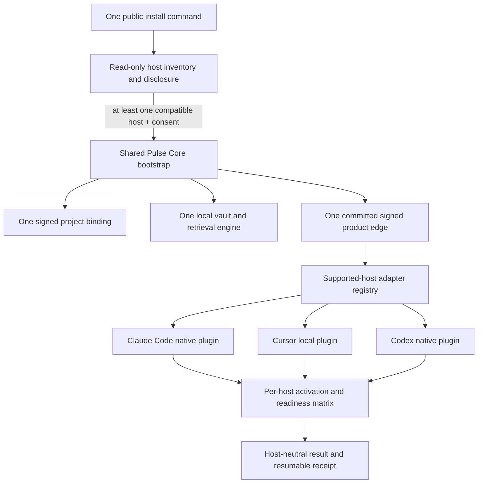
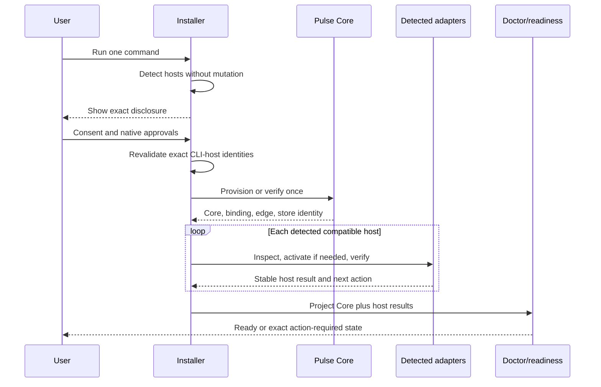
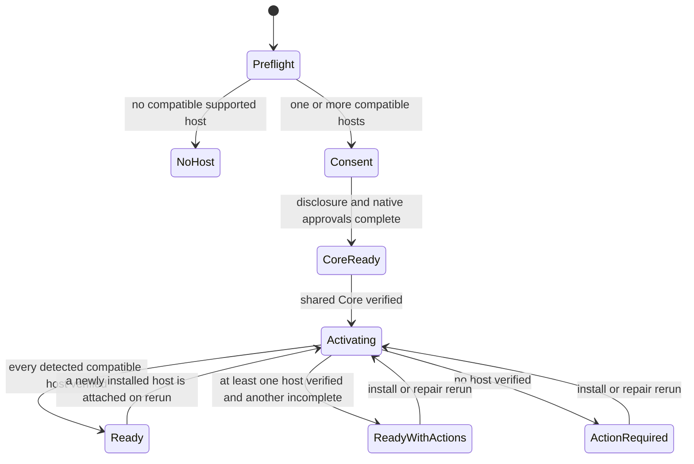

# Host-Neutral One-Command Install - Plan

## Goal Capsule

- **Objective:** Make the public Pulse Personal install command bootstrap the complete local product when a Mac has only Claude Code, only Cursor, or only Codex, while preserving one shared Core and one bound local vault when several harnesses are present.
- **Authority:** This plan narrows the Personal install slice in `docs/plans/2026-07-15-001-feat-personal-pulse-one-command-onboarding-plan.md` and the multiharness decision in `docs/plans/2026-07-16-001-feat-personal-git-team-memory-reset-plan.md`; the user's current host-parity direction overrides the older Codex-only onboarding boundary.
- **Execution profile:** Test-first changes in the published Node CLI and its packed clean-room acceptance scripts. No new daemon, database, cloud service, model, or per-harness memory store.
- **Stop conditions:** Stop rather than claim product readiness if no compatible supported harness exists, Core/full retrieval is unhealthy, or no detected compatible harness can be verified. A failed secondary harness remains visible as degraded host parity without blocking healthy memory use through a verified host.
- **Tail owner:** This change owns implementation, CLI and clean-room verification, review, PR creation, and CI. npm publication and release-asset upload remain outside automatic authority.

---

## Product Contract

### Summary

Pulse will use one public install command to provision its local Core once and attach every supported harness detected on the Mac through that harness's native plugin surface. Claude Code, Cursor, and Codex are equal bootstrap hosts: any one is sufficient, absent hosts are informational, and multiple hosts share the same signed project binding and vault.

### Problem Frame

The product already contains native plugin code for Claude Code, Cursor, and Codex, but the Personal installer still treats Codex as the mandatory bootstrap path. `install-plan.js` blocks on `codex_missing`, `personal-install.js` exposes a `codex_activated` checkpoint, and `personalInstallDependencies()` verifies and calls Codex before it can prove the shared runtime. A user with only Claude Code or only Cursor therefore cannot install Pulse even though the required adapters exist.

This is an orchestration defect, not a request for another distribution format or a second memory engine. The install experience must stay one command, local-first, inspectable, resumable, and honest about host-owned trust or reload actions.

### Actors

- A1. A person in a Git project on a supported Apple Silicon Mac with Node 20+ and at least one supported harness installed.
- A2. A detected supported harness: Claude Code, Cursor, or Codex.
- A3. Pulse Core: the signed runtime, daemon, managed embedder, project binding, shared locator, and bound local vault.

### Requirements

#### Detection and disclosure

- R1. Preflight detects Claude Code, Cursor, and Codex independently and reports a bounded per-host state that distinguishes absent, detected-compatible, and detected-incompatible hosts.
- R2. Installation is eligible when at least one supported harness is detected and compatible; an absent harness never adds a blocking reason.
- R3. A machine with no supported harness stops before consent with `supported_harness_missing`; a machine with supported harnesses detected but none compatible stops with `supported_harness_incompatible`. Both states name the per-host evidence and create no Pulse state.
- R4. Pre-consent detection remains read-only and does not execute a project-local binary; CLI-host executable identity is rechecked after consent before mutation, while Cursor may be detected from its trusted application/plugin-home surface without requiring a Cursor CLI.

#### Shared product and native activation

- R5. The public entry point remains `npx -y @zbs-gg/pulse@preview install`; the command provisions one signed Core, one project binding, one shared `~/.pulse/product-locators.json`, and one vault regardless of host count.
- R6. Core provisioning has no dependency on any specific harness executable and completes before host adapter activation.
- R7. The installer activates every detected compatible harness through its native adapter without invoking or requiring an absent harness.
- R8. Claude Code, Cursor, and Codex adapters consume the same committed signed product edge, binding, locator, daemon, and vault; the locator is discovery-only, and every adapter authenticates through the existing signed project binding and client credential before validating project, store, and product-edge identity. Credential or identity mismatch fails closed, and adapters never create per-host stores or copy memory between stores.
- R9. A detected harness that fails activation or verification remains explicit and action-required in the host matrix. Product readiness requires healthy Core plus at least one verified host; all-detected-host parity is a separate degraded/complete status so an unused broken secondary host cannot block usable memory.

#### Resume, readiness, and user control

- R10. The durable install result and receipt expose one host-neutral activation checkpoint plus a deterministic per-host result matrix, and repair retries only unfinished hosts without reprovisioning or replacing a healthy Core or vault. Receipts persist stable reason codes and object IDs, never raw subprocess output, credentials, or private filesystem paths.
- R11. Legacy Codex-first v1 install receipts remain readable as prior evidence, but current readiness is always reconstructed from live Core and adapter inspection before a new host-neutral receipt is written.
- R12. Static install completion and automatic lifecycle readiness remain distinct: native trust/reload actions are shown as host-specific next actions, while doctor is the authoritative proof that automatic continuity actually ran.
- R13. The final human and JSON output names the shared Core/vault once, then reports each detected host as activated, action-required, or incompatible with a stable reason.

### Key Flows

- F1. **Singleton install**
  - **Trigger:** A1 runs the public command with exactly one supported harness installed.
  - **Actors:** A1, A2, A3.
  - **Steps:** Preflight detects the single harness; consent gates product mutation; Pulse provisions Core once; the matching native adapter activates and verifies; the result reports only that host plus the shared vault.
  - **Outcome:** Claude-only, Cursor-only, and Codex-only machines each reach the same product-level readiness contract without another harness installed.
- F2. **Multiharness install**
  - **Trigger:** A1 runs the command with two or three supported harnesses installed.
  - **Actors:** A1, A2, A3.
  - **Steps:** Core is provisioned once; adapters activate in deterministic host order; each verification result is retained; all adapters point at the same locator and store identity.
- **Outcome:** One memory created through one harness can be offered through another without synchronization or duplication, proven by the second harness retrieving the same object ID from the shared store.
- F3. **Partial activation and repair**
  - **Trigger:** One detected harness fails activation after Core and another adapter succeeded.
  - **Actors:** A1, A2, A3.
  - **Steps:** Pulse writes an action-required receipt with the successful and failed host results; the next `pulse repair` verifies Core, skips healthy adapters, and retries the failed host.
  - **Outcome:** The vault and successful adapters remain intact; Pulse is usable through a verified host while host parity is visibly degraded until repair succeeds.

### Acceptance Examples

- AE1. Given only Claude Code is installed, when A1 completes the one-command wizard, then Pulse provisions full local retrieval, installs/verifies the native Claude plugin, never invokes Codex or Cursor, and reports the bound shared vault.
- AE2. Given only Cursor.app is installed, when A1 completes the wizard, then Pulse provisions full local retrieval, installs/verifies the local Cursor plugin without requiring a Cursor CLI, never invokes Claude or Codex, and reports reload as a host-owned action when needed.
- AE3. Given only Codex is installed, when A1 completes the wizard, then the existing exact-executable and native plugin trust path remains green with no Claude or Cursor requirement.
- AE4. Given all three harnesses are compatible, when installation completes, then all three adapters are verified against the same product-edge digest, binding ID, locator, and store ID.
- AE5. Given no supported harness is installed, when preflight runs, then no Pulse state is created and the result is action-required with `supported_harness_missing`.
- AE6. Given Cursor activation fails after Claude activation succeeds, when A1 reruns `pulse repair`, then Core and Claude are inspected but not replaced, only Cursor is retried, and the final receipt contains both verified host results.
- AE7. Given a legacy ready v1 Codex-first receipt exists, when the new installer runs, then it does not trust the old `codex_activated` step as current proof; it re-inspects live Core and adapters and emits the host-neutral receipt.
- AE8. Given a structured memory is accepted through one verified harness, when A1 opens a second verified harness in the same bound project, then its normal continuity or recall surface retrieves the same object ID from the shared store without copying or re-ingestion.

### Success Criteria

- The packed CLI passes isolated Claude-only, Cursor-only, and Codex-only clean-room installs with forbidden stubs proving absent harnesses were not invoked.
- The all-host case proves a single binding, locator, runtime, product-edge digest, and store identity, then proves one behavioral cross-host recall.
- No-host and one-host-failure cases stop honestly and leave content-free resumable evidence.
- `npm test`, the affected clean-room/interruption suites, and `make verify` pass.

### Scope Boundaries

#### Included

- Host-neutral preflight, Core bootstrap, adapter activation, install receipts, readiness projection, terminal/JSON output, and clean-room parity for Claude Code, Cursor, and Codex.
- Attaching a newly installed second harness when the user reruns `pulse install` or `pulse repair`.
- Preservation of the existing local-only privacy, signed binding, visible-before-save, and full-retrieval honesty contracts.

#### Deferred to Follow-Up Work

- Background discovery and automatic attachment of a harness installed after Pulse without a user rerun.
- Linux, Windows, Intel macOS, hosted Core, remote synchronization, Team Memory transport, and new source adapters.
- Cross-host UI polish beyond the current terminal, doctor, and Memory Home surfaces.

#### Outside This Product Contract

- Per-harness Core processes, stores, vaults, or memory replication.
- Requiring Codex as a hidden installer dependency or using one harness CLI to install another harness.
- Bypassing native user trust, macOS presence, or Cursor reload gates.
- Treating successful plugin file copy as proof that automatic lifecycle delivery has run.

### Sources and Research

- `pulse-app/cli/src/install-plan.js` contains the Codex-only preflight and disclosure coupling.
- `pulse-app/cli/src/personal-install.js` contains the resumable transaction and Codex-named activation checkpoint.
- `pulse-app/cli/src/cli.js` contains shared runtime provisioning plus existing Claude Code, Cursor, and Codex activation paths.
- `pulse-app/cli/src/claude-plugin-install.js`, `pulse-app/cli/src/cursor-install.js`, and `pulse-app/cli/src/codex-install.js` are the native adapter seams to preserve.
- `docs/plans/2026-07-15-001-feat-personal-pulse-one-command-onboarding-plan.md` supplies the one-command, consent, signed-release, and honest-readiness contract; its Codex-only scope is superseded only for host parity.
- `docs/plans/2026-07-16-001-feat-personal-git-team-memory-reset-plan.md` supplies the active-harness extraction and one shared memory direction.

---

## Planning Contract

### Key Technical Decisions

- KTD1. **Provision one host-neutral Core before activating adapters.** (session-settled: user-directed — chosen over per-harness Core/store installation: continuity must cross harnesses through one inspectable local memory.) Core owns release verification, runtime installation, daemon/embedder startup, binding, locator, and vault health; adapters only attach host lifecycle surfaces.
- KTD2. **Support Claude Code, Cursor, and Codex as the minimum equal host set.** (session-settled: user-directed — chosen over a Codex-only minimum: the product must work in the team's actual harnesses.) No adapter may make another adapter's executable a prerequisite.
- KTD3. **Keep installation plugin-like and one-command.** (session-settled: user-directed — chosen over DMG, source build, Make, and per-harness setup commands: non-technical colleagues need a best-in-class memory install experience.) Native human approvals remain visible inside the resumable wizard.
- KTD4. **Allow any one supported host to bootstrap.** (session-settled: user-directed — chosen over requiring Codex even when only Claude Code or Cursor is installed: the latest product boundary defines hosts as peers.) Eligibility is host-set cardinality, not one preferred host.
- KTD5. **Use a shared adapter registry and per-host results.** Detection, inspection, activation, verification, and next-action mapping use one bounded host contract; host-specific command/file mechanics remain in their existing modules.
- KTD6. **Separate product readiness from all-host parity.** Healthy Core plus one verified host makes memory usable; every failed detected host remains explicit in a degraded parity matrix and repair targets only incomplete adapters. This honors the any-one-host product promise without silently dropping secondary activation failures.
- KTD7. **Version the host-neutral receipt while reading legacy v1 evidence.** A new receipt records `harnesses_activated` and per-host results. Legacy `codex_activated` remains readable for migration/resume context but never replaces live inspection.
- KTD8. **Separate adapter activation from lifecycle attestation.** Exact plugin bytes and Core health can complete the transaction; native trust/reload/lifecycle evidence can remain action-required and is surfaced per host. Doctor owns the final automatic-continuity verdict.

### Assumptions

- Claude Code CLI identity can be detected from a bounded trusted candidate set and revalidated after consent without executing inherited project-local `PATH` entries.
- Cursor app presence plus its user plugin home is sufficient for installation; Cursor CLI availability is optional.
- The current signed product edge contains the plugin/runtime bytes required by all three adapters, so no new release artifact kind is needed.
- Existing adapter-specific doctors can be projected into one install-health matrix without changing daemon or storage schemas.

### High-Level Technical Design

The diagrams are directional: they fix trust and ownership boundaries while leaving function-level extraction and rollback details to implementation against the existing transaction code.

### System-Wide Impact

- **Trust:** Pre-consent detection remains non-mutating; exact executable identity checks stay limited to CLI hosts. No adapter receives vault-selection authority.
- **Authorization:** Host locators discover the Core but confer no access. The existing signed binding and client credential authenticate each adapter request, and project/store/edge identity must match before memory is exposed.
- **State:** Core/vault identity remains global to the bound project. The install receipt changes shape, but memory/store schemas do not.
- **Lifecycle parity:** Each adapter must expose the same capability floor—session context delivery, turn capture, write receipts, and finalize/pre-compact handling—even when native event names differ.
- **Operations:** Doctor and install output gain a per-host matrix. Existing host-specific doctor commands remain available for detailed repair.
- **Packaging:** Any new shared detection/adapter module must be included in `pulse-app/cli/package.json` and the packed-package contract.

### Risks and Mitigations

- **Core extraction regression:** Codex and Claude connect paths currently duplicate runtime transaction and rollback logic. Start with a thin registry over existing seams and extract only the smallest Core step required by failing singleton-host tests; retain adapter-specific snapshots/rollback and do not rewrite unrelated lifecycle behavior.
- **Unsafe executable discovery:** Reusing inherited `PATH` before consent could execute a repository-local shim. Use bounded absolute candidates and post-consent identity revalidation for CLI hosts.
- **Cursor false positive:** App presence may not imply it will reload a newly installed plugin. Treat exact plugin installation as static activation and surface reload/lifecycle as a host-owned next action until doctor observes it.
- **Receipt ambiguity:** Old and new step names can be confused during resume. Parse schemas explicitly, re-inspect live state, and write only the new canonical shape.
- **Partial multihost activation:** A later adapter may fail after an earlier one succeeds. Preserve successful adapters and Core, write the complete matrix, and let repair retry only failed hosts.

### Sequencing

U1 defines the host inventory contract. U2 makes Core bootstrap host-neutral and exposes the adapter registry. U3 consumes both to produce resumable activation/readiness results. U4 proves the product across singleton and multihost clean rooms. U1 must land before U2; U2 before U3; U4 depends on all prior units.

---

## Implementation Units

### U1. Replace Codex-gated preflight with a supported-host inventory

- **Goal:** Make install eligibility depend on at least one compatible supported host and disclose every host independently.
- **Requirements:** R1-R4, R13; AE3, AE5; KTD2-KTD4.
- **Files:**
  - Create `pulse-app/cli/src/supported-hosts.js`
  - Create `pulse-app/cli/src/supported-hosts.test.js`
  - Modify `pulse-app/cli/src/install-plan.js`
  - Modify `pulse-app/cli/src/install-plan.test.js`
  - Modify `pulse-app/cli/package.json`
- **Approach:** Extract bounded, injectable host detectors. Preserve Codex exact identity behavior, add equivalent safe Claude CLI identity, detect Cursor without a CLI requirement, and return a stable ordered host inventory. Replace `target_host: codex` and `codex_missing` gating with the inventory and one no-host reason. Update disclosure, local writes, approvals, network effects, and rollback descriptions so they name only applicable detected hosts while keeping the full supported set visible.
- **Test scenarios:** Claude-only eligible; Cursor-only eligible without CLI; Codex-only eligible; all three eligible in stable order; no-host action-required; incompatible-only action-required with `supported_harness_incompatible`; incompatible Claude plus healthy Cursor eligible with explicit Claude state; project-local `PATH` shim never executed; detection produces no files.
- **Verification:** `cd pulse-app/cli && node --test src/supported-hosts.test.js src/install-plan.test.js`.
- **Done when:** The immutable plan is ready to install for each singleton host and no longer contains a hidden Codex prerequisite.

### U2. Extract host-neutral Core bootstrap and native adapter operations

- **Goal:** Provision and verify the signed runtime, daemon, embedder, locator, binding, and vault once, then let native adapters attach independently.
- **Requirements:** R5-R9; AE1-AE4; KTD1-KTD5.
- **Dependencies:** U1.
- **Files:**
  - Create `pulse-app/cli/src/personal-host-adapters.js`
  - Create `pulse-app/cli/src/personal-host-adapters.test.js`
  - Modify `pulse-app/cli/src/cli.js`
  - Modify `pulse-app/cli/src/cli.test.js`
  - Modify `pulse-app/cli/package.json`
- **Approach:** Build a thin fixed registry that wraps the existing Claude Code, Cursor, and Codex activation seams. Immediately after consent, revalidate every detected CLI-host path, owner/type, symlink resolution, digest, and compatibility before Core mutation; a mismatch exits with zero product writes. Extract only the Core bootstrap work that `personalInstallDependencies()` must run without Codex, returning a verified context with the committed edge, authenticated binding/client, runtime/store identity, and rollback handle. Adapter inspection treats the locator as discovery-only, authenticates against Core, and validates project/store/edge identity. Modify host-specific installer modules only if a failing singleton test proves their current seam cannot consume that context. Cursor activation must work from app/plugin-home detection alone.
- **Test scenarios:** Core provisions once for each singleton host; post-consent CLI identity drift causes zero mutation; no absent adapter command runs; all-host activation consumes one authenticated edge and store; locator-only or mismatched binding/client identity fails closed; repeat activation is idempotent; second host attaches later without changing store/binding; Core failure invokes no adapter; adapter rollback cannot remove Core or another healthy adapter.
- **Verification:** `cd pulse-app/cli && node --test src/personal-host-adapters.test.js src/claude-plugin-install.test.js src/cursor-install.test.js src/codex-install.test.js src/cli.test.js`.
- **Done when:** None of the three adapter paths needs another harness to start or locate the shared product.

### U3. Make install receipts and readiness host-neutral and resumable

- **Goal:** Replace the Codex-only checkpoint and health projection with one shared-Core plus per-host activation contract.
- **Requirements:** R9-R13; F1-F3; AE6-AE7; KTD6-KTD8.
- **Dependencies:** U2.
- **Files:**
  - Modify `pulse-app/cli/src/personal-install.js`
  - Modify `pulse-app/cli/src/personal-install.test.js`
  - Modify `pulse-app/cli/src/personal-install-command.js`
  - Modify `pulse-app/cli/src/personal-install-command.test.js`
  - Modify `pulse-app/cli/src/personal-live-readiness.js`
  - Modify `pulse-app/cli/src/personal-live-readiness.test.js`
  - Modify `pulse-app/cli/src/cursor-hooks.js`
  - Modify `pulse-app/cli/src/cursor-hooks.test.js`
  - Modify `pulse-app/cli/src/cli.js`
- **Approach:** Rename the transaction checkpoint to `harnesses_activated`, persist an ordered bounded host result matrix, and introduce an explicit receipt version with legacy v1 read compatibility. Update dependency injection from `inspectActivation/activateCodex` to host-neutral Core and adapter operations. Aggregate Core health with each detected host; one verified host yields product readiness, while incomplete secondary hosts yield degraded parity and host-qualified next actions. Project Cursor's existing session-start, turn-context, trusted receipt, and finalization hooks into a bounded lifecycle-readiness receipt so doctor can distinguish exact plugin installation from observed automatic continuity. Repair re-inspects everything and skips verified Core/adapters rather than trusting prior step labels.
- **Test scenarios:** Full singleton success for each host; all-host success; detected secondary adapter failure leaves product ready with degraded parity; no verified adapter remains action-required; repair retries only failed host; old v1 receipt is revalidated and upgraded; malformed/unknown host result fails closed; static activation with pending Cursor reload or Codex trust is reported without claiming automatic continuity; one fixture-controlled Cursor lifecycle writes and verifies readiness; JSON and human output agree; receipts exclude subprocess output, credentials, and private paths.
- **Verification:** `cd pulse-app/cli && node --test src/personal-install.test.js src/personal-install-command.test.js src/personal-live-readiness.test.js src/cli.test.js`.
- **Done when:** Install/repair and doctor tell the same truthful story for Core and every detected host, with no Codex-named product checkpoint.

### U4. Prove one-command installation in singleton and multihost clean rooms

- **Goal:** Turn host parity into release evidence against the packed CLI rather than mocks alone.
- **Requirements:** R1-R13; F1-F3; AE1-AE8; KTD1-KTD8.
- **Dependencies:** U1-U3.
- **Files:**
  - Modify `pulse-app/cli/scripts/personal-preview-clean-room.mjs`
  - Modify `pulse-app/cli/scripts/personal-preview-interruption-e2e.mjs`
  - Create `pulse-app/cli/scripts/personal-preview-multiharness-e2e.mjs`
  - Modify `pulse-app/cli/package.json`
  - Modify `Makefile`
  - Modify `README.md`
  - Modify `docs/INSTALL_WITH_AGENT.md`
  - Modify `AGENTS.md`
- **Approach:** Run the packed package in isolated homes with explicit host fixtures and forbidden executables for absent hosts. Cover each singleton, all three, no-host, incompatible-only, partial failure/repair, second-host attachment, and shared store identity. Exercise one real fixture-controlled lifecycle per host, then accept a memory through one harness and retrieve the same object ID through another. Keep native human trust/reload as explicit fixture-controlled gates. Update public instructions only after the packed evidence passes and retain the audit-before-install contract.
- **Test scenarios:** Claude-only packed install and doctor; Cursor-only packed install without CLI plus observed lifecycle receipt; Codex-only regression; all-host shared locator/store and behavioral cross-host recall; no-host and incompatible-only zero mutation; one secondary-host failure with usable primary and degraded parity; interruption between adapters and successful repair; later second-host attachment; absence of Go/Python/Make/API key requirements; fallback retrieval never labeled ready.
- **Verification:** `cd pulse-app/cli && npm test && npm run test:personal-clean-room && npm run test:personal-interruption && npm run test:personal-multiharness`, followed by `make verify`.
- **Done when:** A colleague can install Pulse with one command on any of the three singleton-host machines and the packed evidence proves one shared product rather than three integrations.

---

## Verification Contract

| Gate | Applies to | Observable pass condition |
|---|---|---|
| `cd pulse-app/cli && npm test` | U1-U3 | Host inventory, Core extraction, adapter, receipt, readiness, and CLI regression tests pass |
| `cd pulse-app/cli && npm run test:personal-clean-room` | U4 | Packed singleton install reaches full local retrieval without build tools or model keys |
| `cd pulse-app/cli && npm run test:personal-interruption` | U3-U4 | Interrupted Core/adapter work resumes from live facts without replacing the vault |
| `cd pulse-app/cli && npm run test:personal-multiharness` | U2-U4 | Claude-only, Cursor-only, Codex-only, all-host, no-host, incompatible-only, degraded parity/repair, second-host attachment, and behavioral cross-host recall cases pass |
| `cd pulse-app/cli && npm run test:claude-product && npm run test:codex-product` | U2-U4 | Existing lifecycle products remain green against the shared Core |
| `make verify` | U1-U4 | Repository-wide Go, MCP, CLI, packaging, deployment, and honesty gates pass |

Behavioral release evidence must include the exact detected host set, one shared binding/store identity, adapter results, full-retrieval status, and proof that absent harness executables were forbidden. Benchmark or token-savings claims are outside this change; the existing ledger must not regress.

---

## Definition of Done

- [ ] `npx -y @zbs-gg/pulse@preview install` has no preferred bootstrap host and requires only one of Claude Code, Cursor, or Codex.
- [ ] Claude-only, Cursor-only, and Codex-only packed clean rooms pass with full local retrieval and no absent-host invocation.
- [ ] Multiple detected harnesses attach to one binding, locator, product edge, daemon, and store.
- [ ] No-host, incompatible-only, and zero-verified-host states stop honestly; a failed secondary host produces usable product readiness plus explicit degraded parity.
- [ ] Install receipts, repair, doctor, terminal output, and JSON use the host-neutral Core-plus-host-matrix contract and safely read legacy v1 receipts.
- [ ] Existing Claude Code and Codex product E2Es remain green; Cursor lifecycle/plugin coverage reaches the same capability floor.
- [ ] User-facing install docs name the one command, supported singleton hosts, local writes, network effects, human gates, removal boundary, and honest readiness distinction.
- [ ] `make verify` passes and abandoned compatibility branches, duplicate Core paths, debug output, and dead experimental code are removed from the diff.
- [ ] The implementation is committed, pushed, reviewed in a PR, and CI is green; npm publication remains a separate explicit action.
