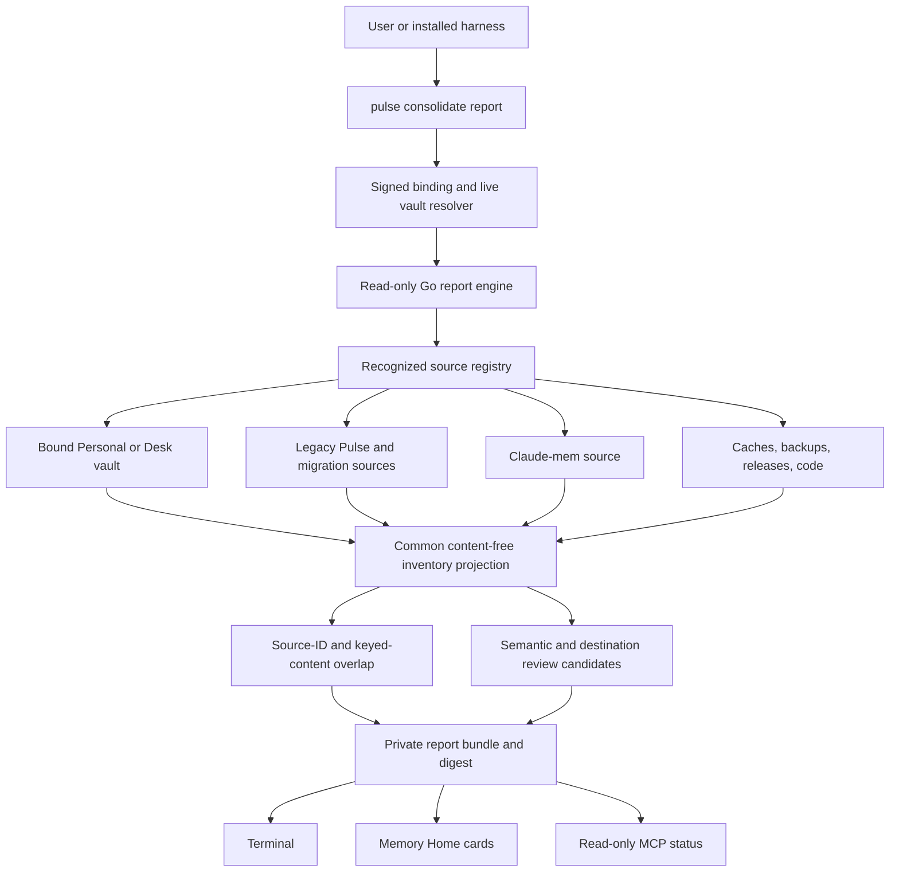
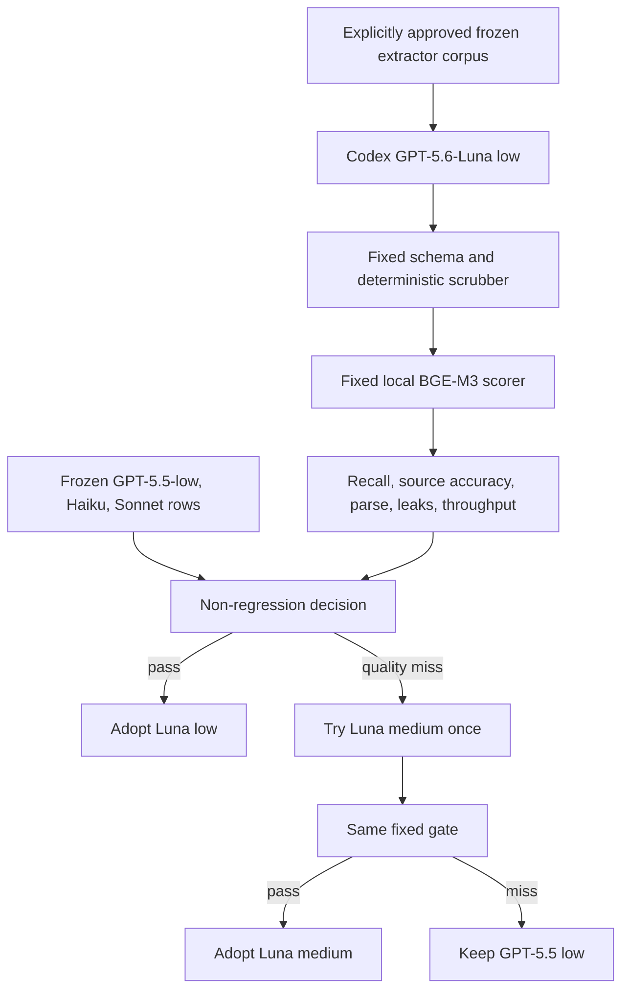
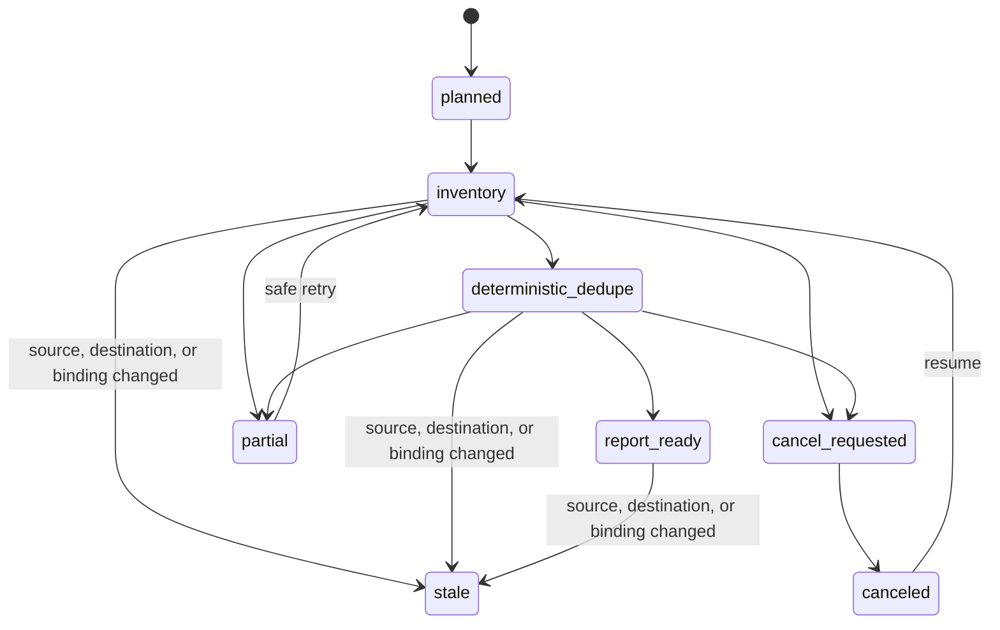

# Personal Memory Consolidation Report and Luna Gate - Plan

## Goal Capsule

- **Objective:** Ship a read-only Consolidation Report that tells a person which Pulse store is authoritative for the current signed project binding, what other Pulse and Claude-mem stores exist, what is already represented, what is unique or ambiguous, and what may be cleaned later without importing, merging, deleting, rebinding, or publishing anything.
- **Authority:** The signed workspace binding and live vault identity outrank directory names, modification times, database size, old scripts, and MCP aliases. Existing Personal/Desk Memory Tray and receipt rules remain the only path to canonical memory.
- **Execution profile:** Extend the existing `pulse consolidate` surface with one report-first flow, read-only source adapters, one bounded Home projection, read-only agent parity, a GPT-5.6-Luna extraction benchmark, and packed release verification.
- **Stop conditions:** Stop the release claim if the active daemon, signed binding, store identity, packaged runtime, or MCP target conflicts. A stale, locked, malformed, or unsupported legacy source produces a partial report and never triggers adoption or mutation.
- **Tail owner:** This work owns implementation, tests, documentation, clean-room packaging, a private current-machine acceptance run, and release-candidate evidence. Import, dedupe application, source cleanup, MCP removal, npm publication, and Team publication each require later explicit authority.

---

## Product Contract

### Summary

Pulse will turn the current filesystem mess into one trustworthy, private report without touching the memories it inspects. The report derives the current project destination from the signed binding, inventories every registry-recognized or explicitly selected local memory source, separates raw rows from usable receipted memory, calculates deterministic overlap, and exposes uncertain semantic pairs as review cards. GPT-5.6-Luna at low effort is evaluated as the next Codex extractor while BGE-M3 remains the fixed retrieval scorer.

### Problem Frame

The machine contains several directories and databases with similar names, different generations, active and inactive processes, caches, backups, migration workspaces, and two visible MCP registrations. Directory size and recency do not reveal which store is authoritative, which data is unique, or which artifacts are safe to remove.

The live Pulse status compounds the confusion by showing only the small set of canonical receipted objects while older databases contain tens of thousands of observations, facts, entities, and continuity rows. A row count is not a count of usable memory, and a successful historical ingest is not proof that the item became project-bound, approved, retrievable memory.

Direct import is unsafe at this point. The existing archive migration path collapses an export into a bounded semantic delta, `/memory/import` is intentionally forbidden for Personal/Desk stores, and the existing capsule consolidation heuristic cannot distinguish negation or numeric drift. The next honest product step is therefore an inventory and dedupe report whose output can later bind an exact, separately approved import manifest.

### Actors

- A1. A person who wants to understand and later consolidate local Personal memory without reading SQLite, Git diffs, or raw transcripts.
- A2. Claude Code, Cursor, or Codex requesting the same read-only report and status through the installed Pulse product.
- A3. The bound Pulse Personal or Desk vault selected by signed workspace authority for the current project.
- A4. A recognized legacy source such as an old Pulse database, a Pulse migration workspace, a Claude-mem database, a cache, a backup, or a release artifact directory.
- A5. A release operator running private real-machine acceptance and public synthetic package gates.

### Requirements

#### Report safety and authority

- R1. `pulse consolidate report` must be read-only with respect to every source database, the destination vault, project binding, MCP configuration, daemon configuration, caches, and filesystem artifact being inspected. It may write only an explicitly identified private report/checkpoint bundle with owner-only permissions.
- R2. The report must derive the authoritative destination from the current signed workspace binding, store kind, store ID, binding digest, repository boundary, and live daemon proof. It must never select a destination from a directory name, modification time, size, process count, or agent-provided store ID.
- R3. A legacy or unbound store is always an import source. It cannot become canonical, change a binding, or enter retrieval because it was discovered by the report.
- R4. Every source adapter must use one explicit read transaction over one no-follow open file identity, disable schema migrations and extraction jobs, bound lock/wait and resource use, and verify the database, WAL, schema/data version, and open-object identity before transaction close. Default discovery is limited to a versioned registry of fixed roots and patterns; it never recursively scans the home directory, follows symlinks, crosses mounts, opens archives, devices, sockets, or FIFOs. An adapter that cannot inspect safely returns `partial` with a stable reason.
- R5. Portable JSON, default terminal output, Home cards, MCP results, logs, tests, and release evidence must omit raw memory bodies, prompts, transcripts, secrets, credentials, unredacted local paths, and reversible raw-content hashes. An owner-local terminal/Home action may resolve a safe alias to its canonical home-relative location from the owner-only sidecar after an explicit reveal; that location never enters portable output, MCP, exports, logs, or release artifacts.

#### Inventory and deduplication truth

- R6. The report must classify each recognized source as `canonical_vault`, `legacy_pulse_db`, `pulse_export`, `migration_workspace`, `claude_mem`, `cache`, `backup`, `release_artifact`, `code_checkout`, or `unknown`, and show why the classification was chosen.
- R7. Counts must be separated by lifecycle: source rows, pending extraction, structured candidates, approved canonical objects, retrieval-visible objects, continuity records, graph projections, embeddings, and excluded material. No combined “memories” count may mix these layers.
- R8. Deterministic overlap must be reported in distinct classes: same stable source item, same normalized content, same source identity with changed content, project-destination ambiguity, unsupported material, and unique material.
- R9. Existing lexical/Jaccard capsule consolidation may contribute a `possible_semantic_duplicate` signal only after deterministic project/kind/time blocking. Candidate generation is capped per item and per report; a cap produces `semantic_review_truncated` rather than an all-pairs scan. Negation, numeric drift, conflicting claims, uncertain cross-source matches, and any model-proposed match must be `review_required`; the report cannot apply `merged_into`, supersession, deletion, or canonical writes.
- R10. Claude-mem inspection must use a versioned adapter manifest. For the observed supported schema, stable keys are `claude-mem:obs:<observation_id>` and `claude-mem:summary:<summary_id>` and are compared to Pulse `source_id` provenance; `user_prompts`, Chroma/FTS indexes, logs, caches, backups, and raw transcript duplicates are excluded from proposed import counts. Missing required tables/columns or an unknown schema version yields `partial:unsupported_schema`, never a best-effort count.
- R11. A report must be reproducible for unchanged inputs. Its report digest binds adapter versions, source fingerprints, project binding, destination state, normalization policy, dedupe policy, scrubber version, fingerprint-key version, and included source aliases; a changed source or destination marks the report stale. Only the Go daemon derives versioned HMAC-SHA-256 fingerprints from the local vault secret and binding digest; missing authority fails closed and key rotation makes prior reports stale.
- R12. Cleanup readiness is advisory only. The report may show potentially reclaimable bytes and active dependencies, but it must never label a data source removable until a later import receipt, recall parity proof, verified backup/restore rehearsal, and separate cleanup approval exist.

#### Product surfaces and agent parity

- R13. Terminal output must lead with two plain answers: “Where memory for this project is written” and “Which sources were inspected.” The first screen then shows report health, already-represented/unique/ambiguous totals, active blockers, and one next action. Sources are grouped as canonical, import candidates, and non-memory artifacts; healthy detail and technical fingerprints stay collapsed or in JSON, and semantic previews are capped with a total and drill-down.
- R14. Memory Home must render the same report model as accessible, progressively disclosed cards without inflating its existing canonical `active_count`. Consolidation inventory is a separate section until approved items receive canonical Memory Tray and terminal receipts; status is never color-only and the narrow layout remains single-column and keyboard-operable.
- R15. Claude Code, Cursor, and Codex must expose the same signed-binding-scoped report lifecycle contract and receive the same source aliases, counts, classifications, and report digest. Every operation requires the existing local authenticated vault identity plus `report:read`; Personal inventory must reject Team/remote routing, missing/stale/mismatched credentials, caller-supplied destination IDs, and cross-vault requests. No harness or model may approve a destination, semantic merge, import, binding change, cleanup, provider egress, or release.
- R16. The Go daemon is the single lifecycle authority for start, status, latest, explain, cancel, and resume. It uses one single-writer lease per report-input digest, immutable checksummed checkpoint generations, atomic owner-only writes, and crash-safe recovery. Long scans publish content-free progress, current phase, completed source count, last checkpoint, cancellation, partial failure, stale-input status, and resource-limit status; retries resume only the latest fully committed matching generation.

#### Luna and retrieval model policy

- R17. GPT-5.6-Luna must be evaluated first at low effort through the Codex subscription on the frozen real extractor corpus and prompt. Medium effort is tried only if low misses the quality gate; no production default changes merely because Luna is newer. Any adoption decision is scoped to the Codex extractor policy; Claude Code and Cursor keep their existing native-harness policies until separately benchmarked.
- R18. The Luna run must keep the output schema, deterministic scrubber, BGE-M3 embeddings, retrieval/ranking configuration, corpus, expected probes, and metric definitions fixed against the recorded GPT-5.5-low baseline. Haiku and Sonnet remain frozen comparison rows unless the prompt or corpus changes.
- R19. The model card must state that subscription extraction still sends the selected private corpus to that model provider, name the exact model slug and effort, and require explicit human corpus-egress approval before a real private benchmark.
- R20. BGE-M3 remains the local embedder/scorer for this release. Replacing it with FTS-only, Luna reranking, or another embedder requires a separate measured retrieval and installation-footprint gate.

#### Release truth

- R21. Dormant legacy directories, backups, code checkouts, and caches do not block npm release by themselves. An active conflicting daemon, binding, installed runtime, or MCP target—and any partial source associated with unresolved active evidence—is a blocker and must be named distinctly from cleanup candidates. The publication workflow must rerun this fail-closed preflight immediately before publishing.
- R22. Public synthetic package gates must contain no private corpus, local path, user-specific fixture, private report, provider output, or report sidecar. The real-machine acceptance run records only content-free counts, digests, classifications, and pass/fail receipts.
- R23. This plan produces two independently completable outputs: a packaged report release candidate and a Codex-only Luna decision. The report candidate does not wait for private-corpus approval or Luna availability. Neither output claims old memory imported, duplicates merged, directories removed, aliases repaired, Team memory published, or npm bytes released.

### Key Flows

- F1. **Read-only local consolidation report**
  - **Trigger:** A1 or an installed harness requests the report in a project.
  - **Actors:** A1, A2, A3, A4
  - **Steps:** Pulse resolves the signed current binding, inventories recognized sources through read-only adapters, fingerprints each source, computes deterministic overlap, scrubs output, stores or prints a private report, and shows the one next action.
  - **Outcome:** The person can distinguish canonical memory, unique legacy material, already represented Claude-mem records, ambiguous review candidates, caches, and potential cleanup without changing any source or destination.
  - **Covered by:** R1-R16
- F2. **Partial or stale report**
  - **Trigger:** A source is locked, changes during the scan, has an unsupported schema, disappears, or the destination binding changes.
  - **Actors:** A1, A2, A3, A4
  - **Steps:** The affected adapter stops, preserves completed content-free checkpoints, marks the report partial or stale, and names the exact source alias and reason. Other safe sources may finish.
  - **Outcome:** No mutation or false completeness claim occurs; a retry resumes only after fingerprints and binding authority are refreshed.
  - **Covered by:** R4, R11, R16
- F3. **Human review in Memory Home**
  - **Trigger:** A1 opens the latest report from `pulse home`.
  - **Actors:** A1, A3
  - **Steps:** Home renders the canonical-boundary card, source cards, dedupe classes, Claude-mem delta, exclusions, and release blockers from the same bounded report model used by CLI and agents.
  - **Outcome:** The user can inspect evidence without seeing raw transcripts or accidentally authorizing import, merge, cleanup, or publication.
  - **Covered by:** R5, R7-R15
- F4. **Luna extractor gate**
  - **Trigger:** A5 explicitly approves the private corpus provider run.
  - **Actors:** A1, A5
  - **Steps:** The evaluator runs `gpt-5.6-luna` at low effort with the frozen prompt/schema/scrubber/corpus and fixed BGE scorer, compares content-free aggregates to GPT-5.5-low, and escalates only to Luna medium if low misses the gate.
  - **Outcome:** The repo records an evidence-backed `adopt_luna_low`, `adopt_luna_medium`, or `keep_gpt_5_5_low` decision without adding a backend model call to the Pulse daemon.
  - **Covered by:** R17-R20
- F5. **Release-candidate verification**
  - **Trigger:** Implementation and focused tests pass.
  - **Actors:** A5
  - **Steps:** Synthetic clean homes prove report safety and host parity across supported targets; the current Mac proves real discovery and content-free counts; existing full product release gates run unchanged.
  - **Outcome:** A report release candidate is ready for a separately authorized publication ceremony, or the exact known/unresolved active-runtime conflict is reported as a blocker.
  - **Covered by:** R21-R23

### Acceptance Examples

- AE1. Given a project with a valid Personal binding, when the report runs, then the destination card names the bound store ID and repository boundary even if an older and larger root Pulse database has a newer modification time.
- AE2. Given two identical source scans, when the report runs twice without input changes, then the inventories, classifications, duplicate classes, and report-input digest match while no source or destination bytes, mtimes, WAL state, extraction jobs, or receipts change.
- AE3. Given an active SQLite writer and WAL, when the adapter cannot take a provably read-only consistent view, then that source is `partial` rather than copied, migrated, checkpointed, or silently read from an inconsistent file pair.
- AE4. Given the dated 2026-07-21 Claude-mem/Pulse acceptance fingerprints, when the report compares stable IDs, then it shows 18,185 observations and 979 summaries in Claude-mem, 10,191 observations and 677 summaries already represented in Pulse, 7,994 observations and 302 summaries missing, and 252,342 prompts excluded. If either live fingerprint has changed, the run records new totals and does not fail against stale counts.
- AE5. Given exact duplicate content under two source identities, then the report distinguishes `same_content` from `same_source_item`; given the same source ID with changed content, it reports a revision conflict rather than a duplicate.
- AE6. Given “target 5M” versus “target 10M” or “enabled” versus “disabled,” when lexical or embedding similarity is high, then the pair remains `review_required` and nothing is merged.
- AE7. Given a source containing a raw path, token-shaped string, prompt, or transcript excerpt, then no portable report, log, Home page, MCP result, test snapshot, or release artifact contains it.
- AE8. Given a report finishes while a source or the signed binding changes, then the report becomes stale and cannot later serve as import or cleanup authority.
- AE9. Given Codex, Claude Code, and Cursor request the report for the same binding, then all receive the same report digest and content-free counts; none receives an approval or destructive tool.
- AE10. Given Luna-low meets the fixed extraction, source-reference, parse, contradiction-preservation, scrubber, and throughput gates, then the decision record adopts `codex:gpt-5.6-luna:low`; otherwise Luna-medium is tried once and `codex:gpt-5.5:low` remains the Codex default if the gate still fails. Claude Code and Cursor policies are unchanged.
- AE11. Given only dormant old directories remain, release verification does not fail; given two active Pulse runtimes, a mismatched signed binding, or conflicting installed MCP target, it fails with a specific runtime-conflict reason.
- AE12. Given a clean packed install on any supported target, report discovery uses portable filesystem and SQLite code, creates only owner-private report output, and leaves the synthetic sources byte-identical.

### Success Criteria

- One command produces a truthful report on the current machine without manual SQLite inspection and without modifying any inspected source or destination.
- The report explains the difference between source rows, pending extraction, structured candidates, canonical objects, and retrieval-visible memory.
- The Claude-mem stable-ID delta is reproducible and `user_prompts` are excluded.
- Home, CLI, Codex, Claude Code, and Cursor consume one report schema and report digest.
- Luna has a content-free comparison against the frozen GPT-5.5-low baseline, and the chosen extractor is backed by an explicit gate rather than model novelty.
- Existing packed Personal, universal-target, and release verification remain green; known or unresolved active authority/runtime conflicts block the report release candidate.

### Scope Boundaries

#### Included

- Registry-bounded local discovery for the bound Personal/Desk vault, standard Pulse homes, Pulse exports/migration workspaces, Claude-mem, caches, backups, release artifacts, code checkouts, and explicitly supplied owner-local sources.
- Read-only inventory, deterministic overlap, review-required semantic candidate classification, private report/checkpoints, Memory Home cards, agent read parity, Luna evaluation, documentation, synthetic cross-platform verification, and private current-machine acceptance.

#### Deferred to Follow-Up Work

- Import staging, report-bound human approval, per-item Memory Tray materialization, import receipts, resume after partial materialization, recall parity, and rollback.
- Applying exact dedupe, accepting semantic merges, temporal supersession, project destination resolution for ambiguous sources, and promotion from Unassigned.
- Backups, restore rehearsal, quarantine/archive, permanent deletion, cache reclamation, MCP alias cleanup, launch-agent cleanup, and directory renaming.
- A no-BGE release path, FTS/Luna reranking, another embedder, Team source ingestion, Git publication, and cross-project/global retrieval changes.

#### Outside This Product Contract

- Silent adoption of legacy stores, raw transcript storage, import during install, agent-approved mutations, model-selected destination vaults, automatic cross-project sharing, destructive cleanup in a dry run, or presenting source-row counts as usable memory.

### Sources and Research

- The signed project-bound vault and multi-harness contract: `docs/one_store_multiharness_capture.md`, `pulse-app/internal/config/vaults.go`, and `pulse-app/cli/src/workspace-binding.js`.
- Existing report/preview surfaces: `pulse-app/cli/src/cli.js`, `pulse-app/internal/server/memory_home.go`, `pulse-app/internal/store/memory_home.go`, and `pulse-app/internal/server/home_routes.go`.
- Existing dedupe and approval boundaries: `pulse-app/internal/ingest/dedupe.go`, `pulse-app/internal/store/capsule_dedup.go`, `pulse-app/internal/store/memory_tray.go`, and `pulse-app/internal/store/migrations/041_memory_tray_receipts.sql`.
- Existing product/reset decisions: `docs/plans/2026-07-15-001-feat-personal-pulse-one-command-onboarding-plan.md`, `docs/plans/2026-07-16-001-feat-personal-git-team-memory-reset-plan.md`, and `docs/plans/2026-07-17-001-feat-host-neutral-one-command-install-plan.md`.

#### Frozen extractor baseline for the Luna decision

| Candidate | Fact recall at 5 | Chat recall at 5 | Chat/source at 1 | Pre-scrubber leak markers | Recorded posture |
|---|---:|---:|---:|---:|---|
| Codex GPT-5.5 low, 12-session probe | 1.00 | 1.00 | 1.00 | 1 | Current quality leader |
| Codex GPT-5.5 low, 50-session gate | 0.733 | 1.00 | 0.867 | 0 stored after scrubber | Minimum frozen real-corpus gate |
| Claude Haiku 4.5, 12-session probe | 0.80 | 0.90 | 0.70 | 4 | Regression reference |
| Claude Sonnet 4.5, 12-session probe | 0.80 | 0.80 | 0.80 | 7 | Regression reference |
| GPT-5.6-Luna low | To measure | To measure | To measure | To measure | Required candidate |

---

## Planning Contract

### Key Technical Decisions

- KTD1. **Ship the report before any consolidation mutation.** (session-settled: user-approved — chosen over directly importing, merging, or deleting the discovered stores: the user needs a trustworthy map and duplicate evidence before granting any mutation authority.) The first releaseable slice is useful on its own and cannot alter memory.
- KTD2. **Canonical means signed project-bound vault, not one global database.** The product contract already isolates Personal/Desk memory by signed workspace binding; legacy roots are sources and ambiguous records remain unassigned until a later human decision.
- KTD3. **Extend the existing `pulse consolidate` namespace without trusting its existing heuristic.** The current dry-run lexical pass stays as one evidence source and backward-compatible capsule operation. The new `report` subcommand owns cross-store inventory and never delegates semantic authority to Jaccard.
- KTD4. **Make the Go daemon the only report-schema and job authority behind thin Node, Home, and MCP adapters.** The canonical versioned Go report type owns start/status/latest/explain/cancel/resume, leases, checkpoints, and digest generation. Go already owns SQLite through `modernc.org/sqlite`; Node routes and renders the returned model but does not define a second schema or lifecycle. Every report endpoint stays local, authenticated, and bound to the signed workspace identity.
- KTD5. **Separate the private path map from the portable report.** The portable model uses source aliases and opaque keyed fingerprints; an authenticated owner-only sidecar maps aliases to canonical locations. Sidecar/checkpoints use a `0700` directory, exclusive no-follow creation, `0600` files, canonical serialization, HMAC integrity, monotonic generations, fsync, and atomic rename. Terminal/Home may reveal one local location on explicit owner action; agents and exports cannot.
- KTD6. **Use deterministic dedupe as evidence and route semantic judgment to review.** Stable source identity, normalized keyed content fingerprints, and changed-version detection are safe to compute. Lexical, embedding, or model similarity can nominate a pair but cannot merge, supersede, delete, or choose a project.
- KTD7. **Keep Memory Home’s canonical count strict.** Raw rows and legacy items appear only in a separate consolidation section; `active_count` continues to mean project-bound, presented, receipted, active memory.
- KTD8. **Expose report-job parity and keep memory authority human-only.** Agents can start, inspect, explain, resume, or cancel only the report job for their authenticated signed binding; cancel targets an invocation ID and never changes memory. Import, semantic resolution, binding changes, cleanup, provider egress, Team publication, and release publication do not enter agent tools.
- KTD9. **Try Luna-low for Codex with the extractor fixed around it.** (session-settled: user-directed — chosen over keeping older extractor rankings unchallenged: GPT-5.6-Luna is now available as the fast, affordable Codex model and should earn the Codex default on the same real benchmark.) Luna-medium is the only escalation; a miss keeps GPT-5.5-low. The report release remains independent.
- KTD10. **Keep BGE-M3 fixed for this release.** The host subscription model extracts typed memory; BGE embeds and scores candidates; Pulse reranks with state and continuity. Changing two stages at once would make the Luna result uninterpretable and invalidate existing retrieval evidence.
- KTD11. **Make report freshness an authority boundary.** Any later importer must bind to the report digest and recheck source, destination, binding, policy, adapter, and scrubber versions. This plan implements stale detection but no importer.
- KTD12. **Keep dormant cleanup off the public release critical path unless live authority conflicts.** Dormant private material is a cleanup concern. The report blocks a release candidate only when it proves—or cannot safely disprove—that installed active components disagree about the destination or runtime.

### High-Level Technical Design

### Report Lifecycle

The daemon owns one leased job per report-input digest. `start` returns the existing invocation when one is live; `cancel` names that invocation; `resume` accepts only the newest fully committed checkpoint generation with the same input digest. A crash leaves the last immutable generation readable and cannot promote a partial write to `report_ready`.

### Discovery and Resource Budget

| Source class | Default discovery | Safety boundary |
|---|---|---|
| Bound destination | Exact vault path resolved from signed authority | No caller override; open once; one read transaction |
| Pulse homes and migration roots | Versioned direct-child name patterns under the local home/config roots | Depth 2, at most 512 entries, same mount, no symlinks or archives |
| Claude-mem | Exact supported local root and versioned DB filename patterns | Manifested schemas only; unsupported versions are partial |
| Extra source | Explicit owner-local `--source` file or directory | Canonicalized exact target; unavailable to MCP; same traversal rules |

Unknown locations outside this registry are not discovered automatically. Each adapter is sequential and bounded to 8 GiB per database, 16 GiB total bytes read, 2 million rows per source, 5 million rows total, 512 MiB working memory, 10 MiB checkpoint output, 50,000 semantic comparisons, and 15 minutes wall time. A limit yields `partial:resource_limit` with no automatic retry. Exact stable-ID and keyed-content overlap remains linear even when semantic nomination truncates.

### Surface State Actions

| State | Terminal and Home behavior | Primary action |
|---|---|---|
| Empty | Explain that no legacy source was found; retain the authoritative destination card | Done |
| Inventory/dedupe | Show phase, completed sources, elapsed time, and content-free progress | Cancel this invocation |
| Cancel requested/canceled | Retain the last committed evidence and identify the stopped phase | Resume |
| Partial/resource limit | Retain safe completed sources and name the alias/reason | Retry after fixing the source or explicitly add a narrower source |
| Ready | Show compact totals, blockers, grouped sources, and the safe next action | Review ambiguous items later |
| Stale | Keep the old report visibly labeled and disable downstream authority | Start fresh report |
| Active conflict | Keep inventory visible and name the unresolved runtime/binding evidence | Resolve conflict before release |

Home uses semantic landmarks/headings, native buttons, visible focus, focus restoration after retry/cancel, `aria-live` progress and terminal-state announcements, non-color-only statuses, minimum touch targets, reduced-motion-safe progress, and a single-column narrow layout.

### System-Wide Impact

- **Authority and storage:** The signed binding remains the destination authority. No migration runs, no new canonical memory schema is required, and no external store is opened through the normal migrating `store.Open` path.
- **Data lifecycle:** The new durable object is a private report/checkpoint bundle, not memory. The Go daemon owns its canonical versioned schema, report digest, single-writer lease, immutable checkpoint generations, owner-only path map, bounded retention, cancellation, and stale-input detection.
- **Privacy:** Adapters may inspect sensitive source content locally only to compute bounded classifications. Raw values never enter the portable model; output fingerprints are keyed and opaque; provider use is off until separately approved.
- **Retrieval:** No reindex or embedding migration occurs. BGE-M3 and state-aware ranking remain unchanged. Semantic duplicate candidates do not affect recall.
- **Home and counts:** Home gains a separate consolidation projection and never adds inventory rows to canonical memory counts or token-savings claims.
- **Agent surfaces:** MCP gains local authenticated report start/status/latest/explain/cancel/resume operations scoped to the signed binding and `report:read`. These can change report-job state but never memory; no import, apply, cleanup, provider-approval, Team routing, or release operation is added.
- **Packaging:** The npm file list gains focused CLI modules and report assets. Go target binaries carry the same pure-Go SQLite adapter across the supported target matrix.
- **Release operations:** Synthetic report fixtures join PR gates. The private acceptance report remains outside Git and npm. Actual publication stays a separate authorized ceremony.

### Risks and Mitigations

| Risk | Consequence | Mitigation |
|---|---|---|
| A live SQLite/WAL source cannot be read as one coherent snapshot | False counts or mixed source generations | Open once, bind file/WAL identity, query inside one explicit read transaction, run bounded integrity checks, and return partial when coherence is not provable |
| An untrusted path swaps, links, blocks, or escapes discovery | Wrong store, metadata leak, or daemon exhaustion | Fixed registry, descriptor-bound no-follow opens, regular-file/owner checks, same-mount policy, hard-link dedupe, and strict resource budgets |
| Raw or secret content leaks through report examples, hashes, errors, or paths | Privacy breach | No raw examples in portable output, deterministic scrubber, keyed opaque fingerprints, safe aliases, adversarial leakage tests |
| A source row is mistaken for usable memory | Inflated product claims and bad cleanup advice | Separate lifecycle counts and keep Home `active_count` unchanged |
| Lexical or embedding similarity merges contradictions | Lost or corrupted memory | Semantic pairs are review-only and this plan contains no apply path |
| A stale report becomes later mutation authority | Wrong source or destination changes | Bind a report digest to every fingerprint and mark stale on any source, destination, binding, adapter, or policy change |
| Luna appears cheaper but lowers extraction quality or leaks more | Worse memory and false savings | Frozen prompt/schema/corpus/scorer, mandatory scrubber, non-regression gates, one medium fallback, keep current model on miss |
| Private-machine cleanup delays public release indefinitely | Product remains unreleased despite working runtime | Only active authority/runtime conflicts block release; dormant artifacts remain deferred |
| Cross-platform discovery drifts into OS-specific shell behavior | Universal install regression | Implement in Go/Node portable APIs and prove packed synthetic sources on the existing target matrix |
| A partial source is actually tied to a live runtime | A conflicting active store is falsely treated as dormant | Detect runtime/binding/MCP activity independently and fail closed on any unresolved active-associated source; rerun preflight immediately before publication |

### Sequencing

1. Freeze the report schema, source taxonomy, safety invariants, and synthetic fixtures before scanning real databases.
2. Implement read-only source adapters and deterministic overlap before adding CLI, Home, or MCP presentation.
3. Add one shared report lifecycle and presentation model, then wire terminal, Home, and read-only agent parity.
4. In parallel, run the Codex-only Luna gate without changing production runtime, extraction prompts, scrubber, or retrieval.
5. Execute focused, packed, cross-platform, and private current-machine verification; produce the report release candidate after U1-U3 and packaged verification, independently of Luna availability, and only after active runtime conflicts are resolved.

---

## Implementation Units

### U1. Define the consolidation report contract and safe command surface

- **Goal:** Create one versioned report and lifecycle contract that every later adapter and surface consumes.
- **Requirements:** R1-R3, R5-R8, R11-R13, R16
- **Files:** `pulse-app/internal/consolidation/report.go` (new), `pulse-app/internal/consolidation/report_contract_test.go` (new), `pulse-app/internal/server/memory.go`, `pulse-app/internal/server/server.go`, `pulse-app/cli/src/consolidation-report.js` (new), `pulse-app/cli/src/consolidation-report.test.js` (new), `pulse-app/cli/src/cli.js`, `pulse-app/cli/package.json`
- **Approach:** Define the canonical versioned report type and lifecycle in Go, plus authenticated daemon endpoints for start/status/latest/explain/cancel/resume. Node validates only the protocol version, routes commands, and renders the Go-owned model. Add `pulse consolidate report` while preserving the old capsule-only command as a backward-compatible legacy path. Define source aliases, classifications, lifecycle counts, duplicate classes, freshness, progress, release-blocker, exclusions, and next-action fields. Write the portable report separately from an authenticated owner-only alias/path sidecar using a single-writer lease and atomic immutable checkpoint generations.
- **Dependencies:** None.
- **Test scenarios:**
  1. Empty clean home returns the current bound destination plus no discovered legacy sources and performs no mutation.
  2. Report and sidecar creation use owner-only permissions, exclusive no-follow opens, integrity checks, and atomic generations; portable JSON contains no absolute path or raw content.
  3. Unknown flags, malformed source records, oversized output, and unsupported schema fail with stable content-free reasons.
  4. Existing `pulse consolidate --threshold/--scope/--apply` behavior remains isolated and cannot be confused with cross-store report authority.
  5. Concurrent start returns one leased invocation; stale cancel cannot stop its replacement; crash during checkpoint write resumes only the last checksummed committed generation.
- **Verification:** Focused Node tests prove schema validation, safe rendering, permissions, lifecycle transitions, and backward-compatible CLI routing.

### U2. Build read-only source discovery, inventory, and deterministic dedupe

- **Goal:** Produce truthful per-binding inventory and overlap from recognized Pulse and Claude-mem sources without modifying any inspected file or database.
- **Requirements:** R1-R12, R16
- **Files:** `pulse-app/internal/consolidation/sources.go` (new), `pulse-app/internal/consolidation/pulse_source.go` (new), `pulse-app/internal/consolidation/claude_mem_source.go` (new), `pulse-app/internal/consolidation/report_test.go` (new), `pulse-app/internal/consolidation/testdata/` (new), `pulse-app/internal/server/memory_consolidation_test.go` (new)
- **Approach:** Resolve the bound store from existing product authority, then scan only the versioned discovery registry or an explicit owner-local `--source`. Use descriptor-bound, no-follow, expected-owner regular-file opens; reject mount escape and deduplicate hard links. For SQLite, begin one explicit read transaction, bind database/WAL identity plus schema/data versions, run a bounded integrity check, perform every query in that transaction, and revalidate the same open object before close. Project each source into content-free counts plus stable source identity, daemon-derived keyed normalized-content fingerprints, changed-version conflicts, and bounded semantic nominations. The Claude-mem adapter manifest freezes supported schemas, key formulas, provenance queries, exclusions, and unsupported-schema behavior. Any safety, consistency, identity, or resource-budget miss returns partial/stale rather than forcing a snapshot, copy, scan, or retry.
- **Dependencies:** U1.
- **Test scenarios:**
  1. The newest/largest legacy database cannot displace the signed bound vault.
  2. Pulse legacy, current Personal/Desk, Claude-mem, cache, backup, release, code checkout, registry-bounded unknown, and explicit-source fixtures classify correctly; locations outside the registry remain undiscovered.
  3. Same source ID/same content, same content/different source, same source/changed content, unsupported record, and unique record land in distinct classes.
  4. Negation and numeric-drift fixtures remain review-required even when lexical similarity is high.
  5. Active WAL writer, inconsistent transaction, busy lock, corruption/integrity failure, missing table, symlink/hard-link replacement, device/socket/FIFO, mount escape, disappearing source, and open-identity drift yield partial/stale outcomes with zero writes.
  6. File, row, byte, memory, comparison, checkpoint, and elapsed-time caps yield one `partial:resource_limit` without retry loops.
  7. Claude-mem observations and summaries reconcile by manifested stable ID while prompts, FTS/Chroma, logs, caches, and backups are excluded; unknown schemas are partial.
- **Verification:** Focused Go tests compare file bytes, metadata, row counts, WAL state, extraction jobs, and canonical receipts before and after every success and failure fixture; race tests cover cancellation and concurrent source change.

### U3. Render one report in terminal, Memory Home, and all harnesses

- **Goal:** Make the report understandable to a non-technical person and equally available to Codex, Claude Code, and Cursor without widening mutation authority.
- **Requirements:** R5, R7, R12-R16, R21-R23
- **Files:** `pulse-app/internal/store/memory_home.go`, `pulse-app/internal/store/memory_home_test.go`, `pulse-app/internal/server/memory_home.go`, `pulse-app/internal/server/home_routes.go`, `pulse-app/internal/server/memory_home_test.go`, `pulse-app/internal/server/home_routes_test.go`, `mcp/src/index.ts`, `mcp/src/lifecycle-contracts.ts`, `mcp/src/lifecycle-contracts.test.ts`, `mcp/src/product-host-binding.test.ts`, `pulse-app/cli/scripts/personal-preview-multiharness-e2e.mjs`, `pulse-app/cli/scripts/codex-product-e2e.mjs`, `pulse-app/cli/scripts/claude-product-e2e.mjs`
- **Approach:** Add a compact first screen to the existing server-rendered Home model: destination, report health, represented/unique/ambiguous totals, active blockers, and one action. Group and collapse detailed sources; cap review previews and keep fingerprints/matrices in detail or JSON. Implement the surface-state table and accessibility contract above. Keep canonical memory counts and economy metrics untouched. Expose the Go daemon's authenticated report lifecycle through MCP for the current signed binding only; approval and destructive operations remain absent.
- **Dependencies:** U1, U2.
- **Test scenarios:**
  1. Home and terminal lead with the authoritative destination and source inventory, then show dedupe/exclusions and one next action.
  2. Home `active_count` remains the exact receipted canonical count when the report contains thousands of source rows.
  3. Codex, Claude Code, and Cursor receive identical report digest/counts for one binding and cannot pass another destination or request apply.
  4. Partial, stale, canceled, empty, conflict-blocked, and report-ready states render without raw paths or content.
  5. HTML, JSON, MCP, logs, and snapshots reject secret/path/transcript adversarial fixtures.
  6. Keyboard-only, screen-reader status, focus restoration, reduced-motion, and narrow-screen checks cover every lifecycle state.
  7. Missing, stale, mismatched, Team/remote, and cross-vault report credentials fail before any inventory metadata is returned.
- **Verification:** Go render/security/accessibility tests, MCP negative authorization tests, and multi-harness E2E prove one bounded read model, strict counts, signed-binding parity, and no memory-authority expansion. A non-technical reviewer can identify the destination, unique/ambiguous sources, release blocker state, and one safe next action from Home or terminal alone.

### U4. Run the Codex GPT-5.6-Luna extraction benchmark and record the decision

- **Goal:** Decide whether Luna-low or Luna-medium should replace GPT-5.5-low for Codex host extraction while keeping retrieval fixed and leaving other harness policies unchanged.
- **Requirements:** R17-R20, R22-R23
- **Files:** `docs/evals/2026-07-21-luna-extractor-gate.md` (new). Reuse the existing private extractor probe and 50-session gate outside the public repository; do not create a second runner, scorer, schema, or corpus in this repo unless a documented incompatibility is found and separately approved.
- **Approach:** Extend or wrap the proven private evaluator with exact Codex model slug, effort, output schema, prompt digest, batch ID, retry/cancel state, and content-free result capture. Run it from a clean temporary workspace and isolated temporary Codex home with project instructions, persistent memory, MCPs, plugins, history, and filesystem tools disabled; allow only the approved corpus manifest and model request. Inventory subprocess writes, fail on writes outside the allowlist, destroy the sandbox after the content-free receipt, and record provider-retention posture. Run Luna-low on the existing private 12-session probe and 50-session gate only after corpus-egress approval. Keep BGE, probes, prompt, scrubber, and scoring fixed. Promote only `codex:gpt-5.6-luna:low` on non-regression; try medium once on a quality miss; otherwise retain the Codex GPT-5.5-low policy. Commit only the content-free decision record.
- **Dependencies:** None. It reuses the existing private evaluator and does not depend on production report code.
- **Test scenarios:**
  1. Existing synthetic evaluator coverage validates strict JSON, deterministic scoring, parse failure, retry, rate limit, cancellation, and resume without a duplicate harness.
  2. Secret/path/transcript markers are counted before scrub and absent after scrub; a scrubber miss fails the gate.
  3. The evaluator rejects a changed prompt, corpus manifest, scorer, BGE identity, model slug, effort, or baseline metric definition.
  4. Luna-low pass selects low; low quality miss selects one medium run; medium miss preserves GPT-5.5-low; no silent model fallback occurs.
  5. Aggregate artifacts contain only fixture IDs, counts, metrics, digests, timing, and decision—not private samples or provider transcripts; the isolated Codex home and workspace are removed and no corpus-bearing write exists outside the allowlist.
- **Verification:** Existing private evaluator tests and write audit pass; the private benchmark receipt proves exact Luna slug/effort, fixed BGE, approved corpus, scrubber result, metrics, provider posture, sandbox cleanup, and the recorded Codex-only decision. This gate does not block the report release candidate.

### U5. Prove the packaged report and prepare the release candidate

- **Goal:** Add truthful synthetic cross-platform and private real-machine evidence without coupling dormant legacy cleanup to public release.
- **Requirements:** R1-R5, R11-R16, R21-R23
- **Files:** `pulse-app/cli/scripts/personal-consolidation-report-e2e.mjs` (new), `pulse-app/cli/scripts/native-universal-target.mjs`, `pulse-app/cli/src/release-gates.test.js`, `pulse-app/cli/src/native-universal-matrix.test.js`, `pulse-app/cli/package.json`, `Makefile`, `.github/workflows/verify.yml`, `.github/workflows/stage-npm-preview.yml`, `docs/release/NATIVE_SUPPORT_LEDGER.md`, `docs/release/NPM_STAGED_PREVIEW.md`, `docs/PERSONAL_PULSE_ONBOARDING.md`, `docs/INSTALL_WITH_AGENT.md`
- **Approach:** Pack the exact npm tarball into clean synthetic homes on supported targets, install one bound Personal product, seed recognized read-only source fixtures, generate the report, compare all sources byte-for-byte, and prove host parity. Add a separate local acceptance script that scans the current private machine but emits only content-free receipts outside the repo. Classify dormant data separately from active runtime/binding/MCP conflicts and leave publication credentials untouched.
- **Dependencies:** U1-U3. U4 runs independently and is required only before changing the Codex extractor default.
- **Test scenarios:**
  1. Clean packed installs on the supported matrix produce the same report schema and leave every synthetic source unchanged.
  2. Release artifacts contain no private paths, private reports, local model output, or user-specific data.
  3. Dormant legacy sources produce cleanup candidates but do not fail the release gate.
  4. Conflicting live daemon/store/binding/MCP evidence—or any unresolved partial source associated with a live process, registration, binding, or destination—fails closed with a stable active-conflict reason.
  5. Current-machine acceptance reproduces the dated Claude-mem delta only when the audited source fingerprints match; otherwise it records the new content-free totals and classifications while keeping all source and destination identities unchanged.
  6. Existing Personal install, multiharness, interruption, real-MLX, Team separation, and release-attestation gates remain green.
- **Verification:** `make verify`, `make release-verify`, the native target matrix, staged npm preview checks, and a private content-free acceptance receipt together establish report release-candidate readiness. The receipt includes a short-lived active-runtime preflight; the eventual publication workflow must rerun it immediately before publishing. Publishing remains a separate explicit action.

---

## Verification Contract

| Gate | Applies to | Command or evidence | Required outcome |
|---|---|---|---|
| Focused report CLI | U1 | `cd pulse-app/cli && node --test src/consolidation-report.test.js` | Schema, permissions, redaction, lifecycle, and legacy command routing pass |
| Focused report engine | U2 | `cd pulse-app && go test -race ./internal/consolidation ./internal/server` | Read-only source fixtures, drift, WAL, classification, overlap, cancellation, and no-mutation proofs pass |
| Home and MCP parity | U3 | `cd pulse-app && go test ./internal/store ./internal/server` plus `cd mcp && npm test` | One report digest reaches Home and all harnesses without changing canonical counts or authority |
| Extractor evaluator | U4 | Existing private evaluator tests plus approved private benchmark/write-audit receipt | Fixed inputs, isolated Codex state, scrubber, no-fallback lifecycle, Codex-only Luna decision, and content-free artifact checks pass |
| Package regression | U1-U3, U5 | `make verify` | Go, MCP, CLI, negative smoke, multiharness, and Team separation remain green independently of provider availability |
| Universal packed report | U5 | Existing native target matrix plus `personal-consolidation-report-e2e.mjs` | Every supported target installs exact bytes and produces a byte-preserving synthetic report |
| Physical product evidence | U2-U3, U5 | `make release-verify` plus private current-machine content-free receipt | Full retrieval, exact package/runtime evidence, real report classifications, no source mutation, and no unresolved active conflict |
| Publication boundary | U5 | Staged npm candidate workflow | Candidate bytes and provenance verify; no dist-tag movement or npm publication occurs without explicit authority |

### Luna Decision Gate

Luna-low is adopted for Codex only when the fixed 50-session gate retains chat recall at 5 of `1.00`, chat/source accuracy at 1 of at least `0.867`, fact recall at 5 of at least `0.733`, strict parse success of `1.00`, zero stored leak markers after the deterministic scrubber, and no contradiction-preservation regression. Throughput and latency must be recorded against GPT-5.5-low; a slower candidate needs a documented quality gain to be adopted. Luna-medium receives one run only if low misses a quality threshold. If medium also misses, GPT-5.5-low remains the Codex recommendation. Claude Code and Cursor are out of this model decision.

---

## Definition of Done

### Global completion

- The report identifies the bound project destination and every registry-recognized or explicitly selected source without relying on directory recency or size.
- Every inspected source and destination is byte/fingerprint-equivalent before and after success, partial failure, cancellation, and retry tests.
- Portable output contains no raw transcript, prompt, secret, reversible raw-content hash, credential, or unredacted local path.
- Lifecycle counts distinguish source rows, pending extraction, structured candidates, canonical objects, and retrieval-visible memory.
- Claude-mem stable-ID coverage and exclusions are correct on synthetic fixtures and reproduced by the private current-machine acceptance receipt.
- Deterministic duplicate classes are correct; all semantic, negation, numeric, conflict, and project-destination ambiguity stays review-required.
- The Go daemon is the sole schema/job authority; concurrent start/cancel/resume, crash recovery, key rotation, tampering, and stale generations cannot produce two ready reports or reuse mismatched checkpoints.
- Discovery never escapes its fixed/explicit roots, follows a link, crosses a mount, opens a special file/archive, or exceeds its bounded resource policy; any limit or unsupported schema is visible as partial.
- Home, terminal, Codex, Claude Code, and Cursor show one Go-owned report schema/digest and no new memory mutation authority.
- The report candidate is independently releaseable after U1-U3 and U5. Luna-low is measured separately on the fixed corpus, Luna-medium is tried only if required, and the Codex extractor recommendation is recorded with fixed BGE and scrubber evidence.
- All focused, full, packed, native, and report release-candidate gates pass; any known or unresolved active authority/runtime conflict blocks the candidate.
- No abandoned source adapters, alternate report schemas, private fixtures, debug snapshots, temporary benchmark output, or dead-end model code remains in the diff.

### Per-unit completion

- U1 is complete when the versioned report contract, private output boundary, lifecycle, and CLI routing are stable and tested.
- U2 is complete when recognized source adapters produce deterministic, byte-preserving inventory and overlap with partial/stale behavior.
- U3 is complete when Home and all harnesses consume one bounded report without changing canonical counts or approval authority.
- U4 is complete when the exact Codex-only Luna decision is reproducible from the existing fixed evaluator, the isolated client/workspace leaves no corpus-bearing residue, and only content-free aggregates are retained.
- U5 is complete when exact packed bytes pass synthetic universal report tests, the current machine yields a private content-free acceptance receipt, and the release candidate has no active authority/runtime conflict.

### Follow-up entry criteria

The separate import plan may start only from a non-stale report whose source fingerprints, destination binding, adapter versions, scrubber version, duplicate classes, and human-reviewed project destinations are fixed. The separate cleanup plan may start only after import receipts, fresh-session recall parity, backup/restore rehearsal, and explicit per-source cleanup approval exist.
