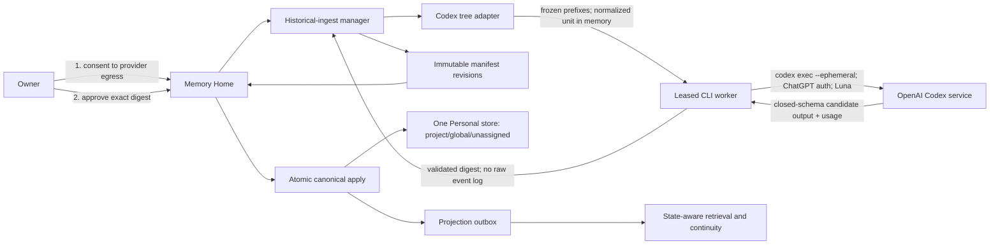

# Pulse Codex Historical Memory Ingest Pilot - Plan

## Goal Capsule

- **Objective:** Import the latest 50 complete root Codex session trees into canonical Personal Pulse memory through a subscription-only GPT-5.6-Luna extraction run, an inspectable dry-run manifest, a separate human approval, and one exact idempotent commit.
- **Authority:** The user's explicit source-egress consent and approved manifest bytes outrank convenience. Raw Codex history remains unchanged and never becomes Pulse memory; only validated structured material from the approved manifest may enter the bound Personal store.
- **Execution profile:** Deep, privacy-critical migration work across the Go daemon/store, Codex-history source adapter, subscription runner, Memory Home, a minimal current-Mac CLI, and private real-corpus acceptance.
- **Stop conditions:** Stop if the runner cannot prove ChatGPT subscription authentication, exact `gpt-5.6-luna`, the frozen 50-root snapshot, raw-content non-persistence, full manifest validation, destination identity, or exact approval binding. Stop on quota, auth, source drift, schema, projection, integrity, or receipt ambiguity; never switch model, effort, provider, store, or API path.
- **Tail ownership:** The executor owns implementation, synthetic tests, a private dry run, manifest rendering, commit/replay proof, fresh-session recall proof, simplification, code review, and verified commits. Starting real-corpus egress and applying a real manifest remain separate user-authorized moments.
- **Outcome boundary:** Completion means the owner can run this once on the current Mac, review what 50 root trees produced, approve one immutable revision, and use the resulting project/global memory in a new Codex task. It does not ingest Claude Code, ChatGPT, Claude-mem, or legacy Pulse yet, and it does not delete or consolidate old source directories.

---

## Product Contract

### Summary

Pulse gains one historical-ingest engine with a Codex source adapter. It freezes exactly 50 recent root session trees, folds every descendant agent rollout into its root, removes inherited and replayed context, and processes bounded normalized evidence through fresh `codex exec --ephemeral` invocations pinned to `gpt-5.6-luna` and the user's ChatGPT subscription. The daemon turns validated outputs into an immutable full-material manifest containing events, decisions, assertions, people, projects, relations, emotions/state, temporal validity, and continuity.

Memory Home shows the exact candidate set, hypotheses, scope, exclusions, progress, token usage, and source coverage. Review changes create a new manifest revision. A separate human action approves one digest, after which Pulse atomically applies exactly those canonical bytes to one Personal store with explicit project/global scopes, object-level provenance, batch and item receipts, replay safety, and recoverable retrieval projections.

### Problem Frame

The current product can inventory old stores and preview archives, but its archive migration path is the wrong authority for this job. It parses each JSONL file independently, uses bounded heuristic extraction, caps `SemanticDelta`, rebuilds a delta again at commit time, and cannot preserve full material, source provenance, temporal validity, hypotheses, or per-item project/global scope. A preview from that path is not the exact payload later committed.

Codex history also is not a directory of independent conversations. Root sessions can contain forked inherited history and many compaction replacements. Child-agent rollouts can dominate storage and duplicate parent context. Treating files independently would multiply old messages, lose tree provenance, spend subscription quota repeatedly, and create misleading memory.

The product needs a narrow first import that proves the reusable engine: deterministic tree selection, privacy-safe normalization, subscription-only extraction, crash-safe checkpointing, human correction, exact commit, and fresh-session retrieval. Other history sources can then implement adapters against the same manifest contract.

### Actors

- **A1. Personal memory owner:** starts source egress, reviews the dry run, corrects candidates and scopes, approves one manifest revision, and verifies fresh-session recall.
- **A2. Historical-ingest daemon:** owns job state, leases, source snapshot, normalization policy, manifest revisions, destination binding, approval validation, atomic apply, receipts, and projection recovery.
- **A3. Codex history adapter:** discovers roots and descendants, freezes file prefixes, parses canonical records, removes inherited/replayed data, and emits bounded normalized evidence without retaining transcript text.
- **A4. Subscription runner:** executes one bounded work unit through the installed Codex CLI with ChatGPT authentication and exact Luna settings, validates output, reports supported token usage, and fails closed on any provider or tool ambiguity.
- **A5. Memory Home:** is the primary review and approval surface. It renders the shared daemon model, bounded rehydrated evidence, corrections, hypotheses, scopes, freshness, progress, and receipts.
- **A6. CLI:** starts, resumes, cancels, and inspects the same daemon job. It runs leased extraction work but cannot mint the final approval.
- **A7. Installed harness adapter:** reads committed canonical memory through Pulse's existing bound recall/continuity surfaces. This pilot adds no historical-job MCP authority.
- **A8. Projection worker:** indexes committed canonical material for retrieval and reports `retrieval_ready` independently from canonical commit.

### Requirements

#### Source selection and immutable evidence

- **R1.** A pilot selects exactly the latest 50 valid root Codex sessions across active and archived session stores as of one frozen cutoff. Roots are ranked by the latest valid record timestamp owned by that root; filesystem mtime never decides recency.
- **R2.** Descendants never count toward 50. Pulse folds the complete transitive child closure into each selected root and excludes the ingest-owning root plus all descendants. A cycle or unresolved parent makes that candidate root invalid with a visible exclusion reason; Pulse selects the next valid root and fails closed if fewer than 50 remain.
- **R3.** Each selected file is frozen as a canonical path alias, captured byte length, prefix digest, root/tree identity, and parser version. Appended suffix bytes do not stale the run; truncation or mutation inside the captured prefix does.
- **R4.** Root ownership comes from the rollout filename/session identity and matching root `session_meta`. Forked or inherited records before the root boundary are excluded even when compaction re-emits them.
- **R5.** The adapter prefers canonical `response_item` records, removes mirrored event messages and compaction replacement history, deduplicates stable record/call IDs, and otherwise uses timestamp plus record kind plus canonical payload digest. Every captured prefix record is counted as included evidence, a versioned explicit exclusion, or a blocking unknown record.
- **R6.** Attachments are deduplicated by content digest while occurrence provenance is preserved. Pulse never follows attachment paths or retains attachment bodies in a manifest, report, log, receipt, or fixture.
- **R7.** Raw session files remain byte-identical. Pulse stores only source aliases, prefix fingerprints, opaque locators, counts, exclusions, and structured candidates; it does not persist a normalized transcript or model session.

#### Consent, isolation, and subscription-only model use

- **R8.** Pulse freezes and inventories the exact 50-root snapshot locally before requesting provider egress. Memory Home shows the source snapshot digest, root/descendant/work-unit counts, captured/normalized byte totals, runner contract, and model; starting extraction requires a short-lived single-use server-side authorization bound to those values and an explicit statement that normalized history will go to OpenAI through the user's Codex subscription.
- **R9.** The runner requires a requalified Codex CLI contract, ChatGPT login status, exact `gpt-5.6-luna`, low effort, `--ephemeral`, read-only sandboxing, ignored user configuration and rules, disabled web search, a proven empty model-visible tool surface, a closed output schema, and a clean staging directory. The initial qualified version is `codex-cli 0.144.6`; after egress consent, a synthetic no-history canary must prove exact model resolution before any captured evidence is sent.
- **R10.** API-key environment variables are removed from the runner environment. API-key auth, custom providers, provider/model/effort fallback, or a different resolved model fail before advancing a checkpoint.
- **R11.** Every work unit uses a fresh Codex invocation. The runner passes trusted extraction instructions as the prompt argument and bounded untrusted evidence only as the appended stdin block. It persists neither Codex rollout history nor JSONL event content. Pulse durably stages each validated structured unit result by content digest before acknowledging the worker; retries reuse accepted results instead of rerunning Luna.
- **R12.** Historical text is untrusted data, never runtime authority. The extraction prompt, schema, validators, destination, scope policy, and approval policy are trusted and versioned; model text cannot select a store, approve an item, call a tool, promote scope, or commit memory.
- **R13.** The runner processes one work unit at a time. A supported rate-limit or usage-exhaustion failure moves the job to `paused_quota` after the last fully validated checkpoint; auth, unavailable model, malformed output, and contract mismatch use distinct fail-closed states.
- **R14.** Pulse reports provider-supported input, cached-input, output, and reasoning-output tokens per completed invocation. It may show a versioned rate-card estimate, but it never invents remaining quota, reset time, API spend, or an unreported subscription percentage.

#### Full Pulse material and deterministic extraction

- **R15.** Normalized evidence includes user/assistant exchanges, child-agent results, and bounded safe tool outcomes. It excludes system/developer bootstrap, hidden reasoning, token telemetry, secret/path-like fields, and duplicated transport events.
- **R16.** Work-unit chunking is deterministic by normalized token/byte budget and stable evidence order. Large trees are extracted in chunks, then merged deterministically per root without silently resolving contradictions.
- **R17.** Every selected root reaches one terminal extraction result before `manifest_ready`; a valid root may yield zero material. A persistent failure in any root blocks the exact-50 manifest rather than quietly reducing the cohort.
- **R18.** The manifest supports events/episodes, decisions, assertions/facts, people and project entities, relations/interactions, emotion/state observations, temporal validity, and historical continuity with open/closed/historical status.
- **R19.** Every material item carries a stable candidate ID, kind, canonical fields, confidence, privacy, epistemic status, valid time, source references, extraction contract, and proposed destination scope.
- **R20.** Direct user-stated emotion or state may be `explicit`. Model-inferred emotion/state is always a visible `hypothesis` until the user confirms or rejects it. Inferred identity merges, relationship claims, and conflicting assertions follow the same review-required posture.
- **R21.** Scope is per item inside one bound Personal store. Known repository identity proposes `project:<stable-project-id>`; ambiguous material stays in a private `unassigned` review bucket. Nothing becomes global through model judgment alone.
- **R22.** Historical continuity is scoped per root and does not make every old open loop active. Only reviewed open continuity eligible under the normal recency/state policy may enter future resume packs.

#### Manifest review, approval, and exact apply

- **R23.** The Go daemon owns one versioned immutable manifest schema and job state. CLI and Home address the same job ID, revision, counts, candidate IDs, freshness, and manifest digest.
- **R24.** Memory Home can correct item value, kind, entity merge/split, project/global/unassigned scope, temporal validity, hypothesis status, continuity status, or exclusion. Every change creates a new immutable manifest revision and invalidates prior approval. Approval remains disabled until every hypothesis, conflict, inferred entity merge, unassigned scope, and unavailable-evidence item has an explicit owner disposition.
- **R25.** Home rehydrates a bounded evidence view on demand from the unchanged frozen source prefix. Raw snippets are never cached in the manifest; unavailable evidence is shown as unavailable and cannot be fabricated from model output.
- **R26.** Before final approval, Pulse compiles and persists the deterministic canonical write set and exact dedup targets. Approval binds its digest, manifest/source digests, destination store identity and generation, target object versions, signed binding, review generation, materializer/dedup/parser/scrubber/prompt/schema/model versions, policy epoch, and expiry.
- **R27.** Source-egress and final-apply authorizations are non-exportable server-side capabilities minted only by an owner-authenticated, same-origin Memory Home session with CSRF protection and explicit digest confirmation. CLI receives only job/audit IDs and cannot supply an approval token or invoke apply; this is an accidental-automation boundary, not a claim of resistance to a malicious same-UID process.
- **R28.** A Home apply action revalidates the server-side authorization, destination writer fence, captured-prefix digests, target versions, and contract/policy versions, then commits the exact precompiled write set in one short transaction. It performs no model call, new dedup search, or semantic rewrite after approval.
- **R29.** Every approved item receives a durable outcome receipt: `created`, `deduplicated` against the exact existing object ID/digest already frozen in the manifest, or a blocking error. Apply cannot discover a new semantic dedup target. No approved item may disappear, widen scope, or transform silently.
- **R30.** Canonical material, source provenance, item metadata, idempotency records, batch/item receipts, and projection outbox entries commit atomically under the approved manifest digest. A lost response replay returns the original receipt set and creates no new canonical rows.
- **R31.** Canonical commit and retrieval readiness are distinct. Home shows `committed_indexing`, `retrieval_ready`, or `indexing_failed`; projection retry never reapplies canonical memory.

#### Operations, parity, and release evidence

- **R32.** The job supports start, status, explain, cancel, resume, manifest, and usage with one leased writer and immutable checkpoints. Cancellation terminates the active subprocess, discards partial output, and preserves only fully validated units.
- **R33.** Home and CLI show the same content-free job state, progress, quota state, coverage, usage, candidate counts, manifest digest, and audit outcomes. No new historical-ingest MCP operation exists in this pilot.
- **R34.** Before real apply, Pulse creates and verifies a consistent Personal-store backup through a SQLite-supported snapshot path. It does not copy only a live main database or remove WAL/journal files.
- **R35.** The historical-apply connection verifies SQLite `>=3.51.3` or an officially fixed backport (`3.50.7` or `3.44.6`), `foreign_keys=ON`, WAL mode, `synchronous=FULL`, and bounded busy handling before mutation. The currently pinned `modernc.org/sqlite v1.48.2` embeds SQLite 3.51.3 and must stay covered by a runtime assertion.
- **R36.** The private acceptance run records only content-free evidence: cohort/tree counts, prefix and manifest digests, exclusions, usage, receipt IDs/statuses, integrity results, projection readiness, and fresh-session recall outcomes.
- **R37.** No private path, transcript, source snippet, model output, manifest, approval capability, or user-specific corpus enters Git, npm, CI artifacts, screenshots, or public test fixtures.
- **R38.** Manifests, checkpoints, staged unit outputs, source-map sidecars, temporary result files, and backups use owner-only, no-follow, atomic storage under the protected Personal data root or an owner-private ephemeral directory. Retention and cleanup are defined for success, cancel, failure, supersession, expiry, inspect/export, and destructive wipe.
- **R39.** Memory Home contextually escapes every source-, model-, manifest-, conflict-, and receipt-derived field, forbids trusted-HTML insertion and executable URLs, ships a restrictive Content Security Policy, and preserves labeled controls, focus, live status, error summaries, screen-reader semantics, and touch targets through review mutations.

### Key Flows

- **F1. Preflight and create a local ingest job**
  - **Trigger:** A1 starts `pulse history ingest codex --roots 50`.
  - **Steps:** Pulse verifies the signed Personal destination, product/SQLite health, offline Codex version/auth/config capabilities, source stores, and exclusion of the current task. The CLI creates an `snapshotting` job and opens its owner-authenticated Home page; it does not authorize egress or lease model work.
  - **Outcome:** A local job begins with one destination and cutoff, or no source/model/store state changes.

- **F2. Freeze, normalize, and authorize exact provider egress**
  - **Trigger:** F1 preflight succeeds.
  - **Steps:** A2 and A3 choose 50 valid roots, close descendant trees, capture prefix fingerprints, account for every record, remove inherited/compacted/mirrored material, deduplicate attachments, and build deterministic work-unit digests locally. Home shows the exact snapshot/runner/model disclosure; A1 may mint one server-held egress authorization bound to that snapshot.
  - **Outcome:** One immutable source snapshot and deterministic work-unit inventory exists without a stored transcript, and extraction remains blocked until exact-snapshot consent exists.

- **F3. Extract, checkpoint, pause, and resume**
  - **Trigger:** F2 egress authorization passes and A6 leases the next work unit.
  - **Steps:** A4 first runs a synthetic no-history model canary, then a fresh isolated Luna invocation for each unprocessed unit. Pulse validates terminal events and the closed-schema output, durably stages the accepted unit result, acknowledges it, and advances one atomic checkpoint. Quota stops the job; resume reuses any accepted result or runs only the still-unprocessed unit.
  - **Outcome:** All 50 roots end as validated material or the job remains visibly paused/failed with no duplicate candidate.

- **F4. Review and correct the dry-run manifest**
  - **Trigger:** The job becomes `manifest_ready`.
  - **Steps:** A5 leads with a blocking queue, then hypotheses/conflicts, then reviewed explicit material. It groups and filters by root, kind, scope, and disposition with persistent reviewed/remaining counts. A1 inspects bounded evidence and edits, confirms, rejects, merges/splits, re-scopes, or excludes items; entity changes show the affected facts/relations/scopes/provenance before confirmation.
  - **Outcome:** One reviewed immutable revision exists only after every review-required item has an explicit disposition. Every edit supersedes the earlier digest. An all-zero run ends as `nothing_to_import` with no approval action.

- **F5. Compile, approve, and apply exact bytes**
  - **Trigger:** A1 finishes review and opens the final apply review in Home.
  - **Steps:** A2 first compiles and persists the exact write set and frozen dedup targets. Home shows the manifest digest, write-set digest, destination generation, item outcomes, and blocking checks. A1 then explicitly approves that exact tuple; A2 binds a non-exportable authorization to it, snapshots the Personal store, fences the writer, rechecks source prefixes/authority/target versions, and commits the already-approved write set plus provenance, receipts, and projection outbox in one transaction.
  - **Outcome:** Canonical memory is committed once or nothing is committed. A replay returns the same receipt set.

- **F6. Project and prove continuity**
  - **Trigger:** F5 returns `committed_indexing`.
  - **Steps:** A8 materializes retrieval indexes; A2 reports readiness. A fresh Codex task queries representative committed objects under their allowed project/global scopes and records a content-free acceptance receipt.
  - **Outcome:** The owner can use the imported memory across sessions without exposing source text or activating every historical open loop.

- **F7. Cancel, stale, or fail safely**
  - **Trigger:** The user cancels, a prefix changes, auth expires, the model/schema contract fails, or storage/projection health breaks.
  - **Steps:** Pulse stops at the last validated boundary, labels the exact reason, preserves immutable checkpoints/receipts, and offers only a safe resume, fresh run, or projection retry appropriate to that state.
  - **Outcome:** No fallback, partial manifest approval, duplicate commit, or silent loss occurs.

### Acceptance Examples

- **AE1.** Given more than 50 roots plus many descendants, the snapshot contains exactly 50 roots and their complete transitive descendants; descendants never displace a newer root.
- **AE2.** Given an active file appends after cutoff, extraction reads only the captured prefix and remains valid; given mutation or truncation inside that prefix, the manifest becomes stale and cannot be approved or applied.
- **AE3.** Given a forked root with inherited older history and 100 compaction replacements, each canonical record appears once and pre-root/replacement history contributes zero evidence.
- **AE4.** Given the same attachment in a root and three children, it has one content identity and four occurrence references while no attachment body/path survives.
- **AE5.** Given the ingest-owning task spawns children while the pilot runs, that root and every descendant are excluded from selection and cannot recursively ingest the importer.
- **AE6.** Given API-key auth, an unqualified CLI, or provider-routing ambiguity, no service call occurs. Given ChatGPT auth passes but Luna entitlement is unavailable, only the post-consent synthetic canary reaches the service and no historical evidence is sent.
- **AE7.** Given Luna emits a tool-call event, malformed/extra schema field, nonterminal stream, or changed output digest, the unit fails without advancing its checkpoint.
- **AE8.** Given quota stops after 31 completed units, the job enters `paused_quota`; resume reuses any durably accepted unit result and otherwise begins at the exact still-unprocessed unit without creating a Codex history file.
- **AE9.** Given one selected root contains no durable memory, it receives a validated zero-material result and still counts toward complete coverage.
- **AE10.** Given one selected root repeatedly fails extraction, `manifest_ready` remains impossible and the report does not call the cohort an exact-50 result.
- **AE11.** Given direct user text names anger, the state candidate can be explicit; given only tone inference, the same state remains a hypothesis until A1 confirms it.
- **AE12.** Given an item maps to a known repository, it defaults to that project scope; given ambiguous mapping, it remains unassigned and never becomes global automatically.
- **AE13.** Given conflicting historical assertions, both remain visible with provenance and temporal evidence; deterministic merge does not choose one as truth.
- **AE14.** Given A1 edits an emotion, entity, time, or scope after approval, the edit creates a new digest and the old approval cannot apply it.
- **AE15.** Given a caller knows a manifest digest or audit receipt ID, no CLI or agent surface can submit an approval capability or invoke apply; only the Home action can consume the server-held authorization.
- **AE16.** Given source prefix, destination binding, parser, schema, model, prompt, scrubber, or policy changes after approval, apply rejects the receipt and requires a fresh reviewed revision.
- **AE17.** Given a crash after canonical commit but before acknowledgement, replay returns byte-equivalent batch/item receipts and creates zero additional objects or outbox entries.
- **AE18.** Given indexing fails after canonical commit, Home shows `committed/indexing_failed`; retry reaches `retrieval_ready` without a second import.
- **AE19.** Given a fresh Codex task in an allowed project, it recalls representative project and permitted global objects with their source/object IDs while unrelated project-scoped items remain absent.
- **AE20.** Given the private run completes, selected rollout prefixes and raw source files remain byte-identical and all committed structured objects are reachable through receipts or explicit dedup targets.
- **AE21.** Given one rollout path is a symlink, swapped descriptor, special file, or disallowed hard link, it is rejected before fingerprinting or egress and cannot redirect the adapter to another private file.
- **AE22.** Given model output contains HTML, script, executable URLs, bidi/control text, or markup in any candidate/receipt field, Home renders inert escaped text under the restrictive CSP and cannot execute it.
- **AE23.** Given success, cancellation, failure, supersession, expiry, export, or destructive wipe, the documented retention policy accounts for every checkpoint, staged result, manifest, source map, temp file, and backup without following symlinks.
- **AE24.** Given an unfamiliar captured record kind, the cohort cannot report terminal coverage until the adapter classifies it as included or assigns a versioned explicit exclusion.
- **AE25.** Given a real dry-run manifest, approval stays disabled until every hypothesis, conflict, inferred merge, unassigned item, and unavailable-evidence item has an explicit owner disposition; the queue always shows reviewed and remaining counts.
- **AE26.** Before real extraction, A1 records three real project-continuity questions. After the dry run, A1 can find useful candidate memory for those questions in Home or stops U6-U9 as a failed value gate; mechanical schema validity alone is not success.
- **AE27.** Given project A, project B, global, and unassigned imported controls, project A retrieval can read A plus permitted global memory, cannot read B, and never injects unassigned memory by default.

### Success Criteria

- One product command and Home flow takes the owner from a qualified 50-root snapshot to a corrected dry-run manifest without storing raw history.
- All selected roots have complete descendant closure and terminal coverage; inherited, compacted, mirrored, and attachment duplication have measured exclusions.
- Every model work unit proves ChatGPT subscription auth, exact Luna/effort/schema contract, supported usage, and resumable checkpoint identity with no API/model fallback.
- The owner can see and correct every candidate, hypothesis, temporal status, and project/global destination before approving one immutable revision.
- Apply commits exactly the approved candidate set once, returns durable batch/item receipts, survives lost responses, and separates canonical commit from recoverable indexing.
- A fresh Codex task retrieves representative imported memory under the correct scope, and the private acceptance artifacts reveal no source content or paths.

### Scope Boundaries

#### Now

- Latest 50 root Codex trees across active and archived local history.
- Complete descendant folding, fork/compaction/mirror/attachment dedupe, source prefix freezing, and raw byte-preservation proof.
- GPT-5.6-Luna low through ChatGPT-authenticated Codex CLI only, with deterministic chunking, usage receipts, quota pause/resume, and no fallback.
- Full structured Personal material, explicit project/global/unassigned scope, emotion hypotheses, temporal validity, continuity, conflicts, and provenance.
- Memory Home review/correction, digest-bound approval, atomic canonical apply, receipts, projection recovery, CLI/Home status parity, backup, and fresh-session recall proof.

#### Later

- Claude Code, ChatGPT export, Claude-mem, legacy Pulse, Krisp, Drive, and other source adapters over the same source-snapshot and manifest contracts.
- Team/Commons publication, shared-memory review, cross-person dedupe, scheduled ingestion, automatic project promotion, and multi-machine orchestration.
- Accurate remaining subscription quota if OpenAI exposes a supported contract, plus broader model requalification beyond the pinned pilot.
- Batch rollback UI, source cleanup, deletion of duplicate historical stores, and the separate import of every session beyond the first 50 roots.

#### Never or Human-Only

- Raw transcript, reasoning, secret, attachment body, or local path persistence in Pulse memory, reports, logs, receipts, Git, npm, or CI.
- API-key fallback, model/effort/provider substitution, model-selected store/scope, silent partial cohort, post-approval payload regeneration, or automatic project-to-global promotion.
- Model/MCP approval of source egress or canonical apply. Final manifest approval and global promotion remain human actions.

### Dependencies and Assumptions

- Implementation starts in a clean `codex/` worktree based on current `origin/main`; the dirty root checkout and its unrelated files are preserved. The completed consolidation-report implementation on `origin/main` is the lifecycle/presentation foundation.
- The current Mac has `codex-cli 0.144.6`, `codex login status` reports ChatGPT authentication, and `gpt-5.6-luna` is currently available. Implementation rechecks these facts at run time rather than trusting this dated plan.
- The installed CLI supports ephemeral noninteractive execution, a JSONL event stream, final-output files, closed JSON Schema output, ignored user config, and read-only sandboxing.
- The runner may send normalized source text to OpenAI only after F1 consent. Pulse storage and reports remain local, but the extraction is not described as offline or fully local.
- `modernc.org/sqlite v1.48.2` currently embeds SQLite 3.51.3. Packaged runtime assertions, backup/restore, and integrity checks remain mandatory.
- Current correction/deletion controls handle later object-level changes. Batch rollback and source cleanup are not required to complete this pilot.

### Sources and Research

- Predecessor and reusable report foundation: `origin/main:docs/plans/2026-07-21-001-feat-personal-memory-consolidation-report-plan.md`; `pulse-app/internal/consolidation/report.go`; `pulse-app/internal/consolidation/sources.go`; `pulse-app/internal/server/consolidation_report.go`; `pulse-app/cli/src/consolidation-report.js`.
- Existing archive path and its limits: `pulse-app/cli/src/cli.js`; `pulse-app/internal/server/semantic_delta.go`; `pulse-app/internal/store/semantic_delta.go`; `specs/pulse_pre_migration_review_2026_07_01.md`.
- Material and provenance contracts: `docs/PULSE_MATERIAL_GRAPH_V0.md`; `docs/PULSE_MATERIAL_GRAPH_CURRENT_STATE.md`; `specs/pulse_capsule-dedup_2026_07_04.md`; `specs/pulse_assertion-eval-gate_2026_07_04.md`; `specs/pulse_procedural-memory_2026_07_04.md`.
- Receipt and approval patterns: `pulse-app/internal/store/memory_tray.go`; migrations `041_memory_tray_receipts.sql` and `045_memory_presentation_receipts.sql`; `docs/plans/2026-07-14-001-feat-codex-team-memory-activation-plan.md`.
- Qualified Luna evidence: `docs/evals/2026-07-21-luna-extractor-gate.md`; [Codex 0.144.6 release](https://github.com/openai/codex/releases/tag/rust-v0.144.6); [Codex models](https://learn.chatgpt.com/docs/models); [Codex non-interactive mode](https://learn.chatgpt.com/docs/non-interactive-mode); [Codex authentication](https://learn.chatgpt.com/docs/auth); [Codex pricing and limits](https://learn.chatgpt.com/docs/pricing).
- Storage safety: [SQLite transactions](https://www.sqlite.org/lang_transaction.html); [SQLite WAL](https://sqlite.org/wal.html); [SQLite Online Backup API](https://www.sqlite.org/backup.html); [SQLite pragmas](https://sqlite.org/pragma.html).

---

## Planning Contract

### Key Technical Decisions

- **KTD1. Build a new historical-ingest domain beside legacy migration.** The existing consolidation report supplies authority, source classification, checkpoints, and presentation patterns, but `pulse migrate commit` and bounded `SemanticDelta` cannot be the write path. Legacy commands remain behaviorally isolated.
- **KTD2. Use one Personal store with item-level scope.** This plan supersedes the earlier project-bound-destination assumption for Personal historical memory. One bound Personal store holds project, global, and private-unassigned items; retrieval policy decides which scopes a current project may read.
- **KTD3. Keep the daemon authoritative and the subscription runner leased.** Go owns snapshot, job, manifest, approval, apply, and receipts. A thin Node CLI worker leases one normalized unit, invokes the user-authenticated Codex CLI in the user's shell context, validates the result, and submits it to the same job.
- **KTD4. Freeze prefixes, not copied transcripts.** Prefix length plus digest gives stable evidence without duplicating the corpus. Append-only history remains valid; mutation within the approved evidence boundary invalidates downstream authority.
- **KTD5. Keep the first source contract Codex-specific.** Root boundaries, child edges, fork cutoff, canonical-record precedence, exhaustive record accounting, dedupe keys, attachment identity, exclusions, and chunk order are versioned Codex parser contracts. The immutable material manifest is reusable, but no adapter registry or cross-source extension API is built until a second approved source exists.
- **KTD6. Make Codex subscription use an explicit runtime contract.** Direct `codex exec` with saved ChatGPT auth is chosen over the TypeScript SDK because the SDK's API-key environment path is ambiguous for subscription-only work. The runner pins `0.144.6` for the pilot, `gpt-5.6-luna`, low effort, ephemeral mode, ignored user config, clean cwd, disabled web search, read-only sandbox, and closed schema; a later CLI version must pass requalification fixtures.
- **KTD7. Give untrusted history no tools or authority.** The trusted prompt is a command argument; bounded evidence arrives as Codex's appended `<stdin>` block. User/project config and rules, MCPs, plugins, hooks, shell/unified execution, apps, browser/computer use, multi-agent, memories, web search, and repository context are disabled or absent. A preflight capability probe must prove the model-visible tool set is empty before private evidence is sent; event rejection remains a defense-in-depth check, not the primary barrier.
- **KTD8. Checkpoint accepted unit results, not model conversations.** Each unprocessed chunk gets a fresh ephemeral invocation. A validated structured result is durably content-addressed before worker acknowledgement; retries reuse it. Determinism is defined over accepted results and tree merge, not over stochastic re-extraction; `codex exec resume` is not used.
- **KTD9. Preserve conflicts during deterministic merge.** Stable candidate identity, source sets, and canonical sort make replay reproducible. Contradictory assertions or state hypotheses remain distinct review items; Luna cannot silently choose the winner.
- **KTD10. Use immutable generations and two server-held authorizations.** Pulse freezes the source snapshot before Home asks for provider egress; that action authorizes only its exact work-unit set. Reviewing produces immutable revisions and a precompiled write set; a second Home action authorizes only that exact write-set digest, destination generation, and expiry. Neither capability leaves the daemon, and any correction invalidates apply authority.
- **KTD11. Apply a precompiled canonical write set atomically.** Existing entity/fact/event/assertion/continuity paths remain canonical. Their store writers gain transaction-scoped internal variants so one caller-owned transaction can compose them without nested commits. Migration 053 adds historical-ingest manifests, accepted unit results, provenance/metadata overlays, non-exportable authorizations, receipts, idempotency, and projection outbox state; it does not create a second retrievable memory authority. Approval binds the compiled write-set digest, materializer/dedup versions, destination generation, and target-object versions, so apply cannot reinterpret reviewed candidates.
- **KTD12. Separate durable commit from retrieval projection.** The canonical transaction is short and deterministic. Embedding/index refresh happens from a committed outbox with generation fencing and replay-safe receipts, so projection failure cannot duplicate the import.
- **KTD13. Report supported usage, not imaginary quota.** `turn.completed.usage` is authoritative for completed work. Rate-limit errors can pause the job, but the product does not infer remaining subscription percentage or reset time from private rollout artifacts.
- **KTD14. Make review authority visible, server-side, and narrow.** Home is the only surface that mints and consumes egress/apply capabilities. CLI can create/operate the local job and read redacted audit outcomes but never receives a capability or apply route. This prevents accidental agent automation; it is not marketed as resistance to a malicious same-UID process.
- **KTD15. Snapshot and verify the store before apply.** Runtime SQLite safety checks, a supported consistent backup, a short `BEGIN IMMEDIATE` apply, retryable busy handling, `integrity_check`, `foreign_key_check`, and disposable restore rehearsal protect the canonical store. No transaction spans a model call.
- **KTD16. Validate real manifest value before building apply.** The minimal CLI worker and Home review land first, then the owner runs the real 50-root dry run. U6-U9 proceed only if the owner judges the blocking queue and a fixed non-blocking sample reviewable and confirms the manifest is worth committing.

### High-Level Technical Design

The diagram is architectural, not a prescribed internal API. Raw source bytes stay in the existing Codex files. Normalized evidence exists only inside the bounded source-to-runner work-unit exchange and the model request. The durable pre-commit artifact is the structured manifest; the durable post-commit authority is canonical Personal memory plus provenance and receipts.

### Job and Manifest Lifecycle

```mermaid
stateDiagram-v2
  [*] --> preflight
  preflight --> snapshotting
  snapshotting --> awaiting_egress_consent: exact 50 frozen locally
  awaiting_egress_consent --> extracting: owner authorizes exact snapshot
  extracting --> paused_quota: supported quota failure
  paused_quota --> extracting: owner resumes after availability
  extracting --> extraction_failed: auth/model/schema/source failure
  extracting --> manifest_ready: all 50 terminal with material
  extracting --> nothing_to_import: all 50 terminal with zero material
  manifest_ready --> manifest_ready: correction creates revision
  manifest_ready --> approval_ready: review complete; write set compiled
  approval_ready --> manifest_ready: correction invalidates write set
  approval_ready --> approved: owner approves exact tuple
  manifest_ready --> stale: captured prefix or authority changes
  approved --> applying: exact revalidation passes
  approved --> stale: bound input changes
  applying --> committed_indexing
  committed_indexing --> retrieval_ready: projections complete
  committed_indexing --> indexing_failed: projection failure
  indexing_failed --> retrieval_ready: projection retry
  extraction_failed --> extracting: same-contract safe retry
  preflight --> canceled
  awaiting_egress_consent --> canceled
  snapshotting --> canceled
  extracting --> canceled
```

`cancel` preserves only fully committed checkpoint generations. `stale` is terminal for that manifest revision. Apply replay after a lost response reads the existing receipt set rather than reentering `applying`.

### System-Wide Impact

- **Data lifecycle:** New durable pre-commit data is structured candidate material, immutable manifests, content-free checkpoints, opaque provenance, and usage. Raw or normalized transcript text remains source-only and ephemeral. After apply, manifest candidates map one-to-one to canonical objects or explicit dedup targets.
- **Store schema:** Migration 053 is Personal/Desk-applicable only and adds ingest jobs, manifests, revisions, item outcomes, approvals, source refs, scope/status/valid-time metadata, idempotency, receipts, and projection outbox state. It does not widen Team/Commons stores.
- **Retrieval:** Existing material graph, assertions, continuity, and state-aware retrieval consume canonical objects plus their new metadata. Project/global read policy remains explicit; unassigned items are not injected by default.
- **Processes:** The daemon is the long-lived authority. The Node CLI worker runs in the authenticated user shell, leases one unit, and can disappear safely. Model processes are sequential and ephemeral.
- **Privacy:** The workflow adds an external-processing boundary at OpenAI. UI and terminal must say so. Portable reports and all logs remain content-free; only owner-authenticated Home may rehydrate bounded evidence from frozen source prefixes.
- **Agent surfaces:** This pilot adds no historical-ingest MCP tools. Codex extraction is a controlled CLI subprocess, not a general agent tool; committed memory remains available through existing bound recall/continuity surfaces.
- **Packaging:** Native binaries need the migration and daemon engine; the npm package needs thin history-runner/CLI modules and synthetic fixtures. No private corpus or model output enters the tarball.
- **Operations:** Backups, checkpoint cleanup, manifest retention, projection retry, usage visibility, and crash recovery join `pulse doctor` and Memory Home. Source cleanup remains a later separately approved operation.

### Risks and Mitigations

| Risk | Impact | Mitigation |
|---|---|---|
| Fork/compaction replay multiplies inherited context | Wrong memories and wasted quota | Versioned tree fixtures, root boundary timestamps, canonical-record precedence, exclusion counters, exact cohort tests |
| Child attachment/body duplication dominates a unit | Privacy and context overflow | Digest identity, occurrence refs, no path chasing/body persistence, deterministic bounded summaries |
| Historical prompt injection steers the runner | Tool use or malformed memory | Trusted prompt plus appended stdin evidence, empty-tool capability gate, clean cwd/config/rules, no MCP/hooks/web, read-only sandbox, closed schema, event rejection, deterministic validators |
| Subscription route silently becomes API or another model | Unexpected billing and invalid benchmark | ChatGPT auth preflight, scrub provider keys, exact model/effort, ignored config, no fallback, contract receipt |
| Quota stops a long run | Incomplete pilot | Sequential bounded units, atomic checkpoints, `paused_quota`, exact-unit resume, honest supported usage |
| Large root exceeds Luna context | Lost or partial evidence | Deterministic token/byte chunking, per-chunk validation, conflict-preserving deterministic tree merge |
| Model inference becomes false fact/emotion | Corrupted personal memory | Epistemic status, hypotheses, source evidence, Home confirmation/rejection, no model global promotion |
| Approval payload changes before commit | Unreviewed memory enters canonical store | Immutable revisions, digest/version/source/destination binding, stale checks, exact stored-manifest apply |
| Crash produces partial objects or duplicates | Broken store and trust | One short transaction, unique keys, original receipt replay, crash injection around commit/ack |
| Projection failure looks like import failure | Reapply duplicates | Separate `committed_indexing`/`indexing_failed` states, outbox receipts, generation-fenced projection retry |
| Private data leaks into repo/package/tests | Privacy breach | Synthetic fixtures, content-free acceptance artifacts, secret/path scanners, tarball audit |
| Dirty local checkout contaminates implementation | Lost user work or wrong base | Fresh `codex/` worktree from `origin/main`; never reset/rebase the dirty root |

### Sequencing

1. Create a clean worktree from current `origin/main`, preserve the dirty root, and freeze contracts/fixtures before any real source scan.
2. Land the shared manifest/store schema and validation contract before invoking Luna on private data.
3. Prove root-tree selection and normalization on synthetic fork/child/compaction/attachment fixtures.
4. Add the qualified subscription runner and checkpoint manager, then prove quota/crash behavior on synthetic bounded units.
5. Render and correct the shared manifest in Home, wire the minimal current-Mac CLI worker, then run the owner-authorized real 50-root dry-run value gate.
6. Only after the owner accepts the manifest's usefulness and review burden, build exact apply, replay, projection recovery, and scoped retrieval on a synthetic store.
7. Add local doctor/package/privacy gates for the installed Mac; defer broad native, CI, staged npm, and public documentation work.
8. Let the owner approve/apply the accepted manifest once, then run restore, replay, projection, and real-work continuity proof with content-free evidence.

---

## Implementation Units

### U1. Establish the clean integration base and historical-ingest contract

- **Goal:** Freeze one implementation-ready domain contract and schema shape on top of current `origin/main` without touching the dirty root checkout.
- **Requirements:** R18-R23, R28-R31, R35; F5; AE14, AE16-AE18.
- **Files:** `docs/plans/2026-07-22-001-feat-codex-history-ingest-pilot-plan.md`; `pulse-app/internal/historicalingest/manifest.go` (new); `pulse-app/internal/historicalingest/schema/historical_ingest_v1.schema.json` (new, embedded/packageable); `pulse-app/internal/historicalingest/contract_test.go` (new); `pulse-app/internal/store/migrations/053_personal_historical_ingest.sql` (new); `pulse-app/internal/store/schema.go`; `pulse-app/internal/store/schema_test.go`; `pulse-app/cli/src/historical-ingest-schema.js` (new).
- **Approach:** Start a fresh `codex/` worktree from current `origin/main` and carry this plan into the branch. Define versioned job, source snapshot, work unit, material union, manifest revision, approval, item outcome, batch receipt, and projection state types. Publish one closed JSON Schema artifact, embed it in Go, package the same bytes for Node, and fail tests if their digests diverge. Make migration 053 applicable only to Personal/Desk store kinds. Extend existing canonical-object metadata with source refs, scope, epistemic status, and valid time rather than creating an alternate retrieval store.
- **Dependencies:** None.
- **Test scenarios:**
  1. A manifest round-trips every material kind and rejects unknown kinds, missing provenance, invalid time intervals, or an inferred state labeled explicit.
  2. Migration 053 applies to a Personal fixture, refuses a Commons fixture, is crash-retryable, and preserves immutable prior migrations.
  3. Project/global/unassigned metadata attaches to existing canonical object identities and cannot widen on decode/default.
  4. Runtime checks accept SQLite 3.51.3+ or the enumerated fixed backports and verify foreign keys, WAL, `synchronous=FULL`, and bounded busy timeout on the apply connection.
  5. Go validation, Node validation, embedded bytes, and packaged schema use one version/digest and reject unknown fields identically.
- **Verification:** `cd pulse-app && go test -race ./internal/historicalingest ./internal/store` passes with schema/version golden fixtures and no dirty-root mutation.

### U2. Build the deterministic Codex root-tree source adapter

- **Goal:** Select and normalize exactly 50 reproducible root trees without retaining raw history.
- **Requirements:** R1-R7, R15-R17; F2, F7; AE1-AE5, AE9-AE10, AE20.
- **Files:** `pulse-app/internal/historicalingest/codex_source.go` (new); `pulse-app/internal/historicalingest/codex_records.go` (new); `pulse-app/internal/historicalingest/chunker.go` (new); `pulse-app/internal/historicalingest/codex_source_test.go` (new); `pulse-app/internal/historicalingest/testdata/codex/` (new, synthetic only).
- **Approach:** Discover active/archived stores through explicit versioned roots. Open only allowlisted regular files with no-follow descriptor semantics, verify descriptor identity before and after reading, parse root/child metadata, close trees transitively, and rank root-owned timestamps at a frozen cutoff. Capture file prefixes before normalization. Encode canonical precedence, fork boundaries, mirror/compaction exclusions, stable/fallback dedupe, safe tool-result projection, attachment digest identity, exhaustive record accounting, and deterministic work-unit budgets in one Codex-specific adapter version.
- **Dependencies:** U1.
- **Test scenarios:**
  1. Synthetic active+archived fixtures yield 50 roots, complete descendants, deterministic order, and exclusion of the current root tree.
  2. Legacy string source and structured subagent source forms produce the same parent edge; a cycle or unresolved parent invalidates that candidate root with a visible exclusion, selects the next valid root, and fails closed if fewer than 50 valid roots remain.
  3. Forked inherited history, compaction replacements, mirrored events, duplicate call IDs, and repeated attachments produce expected unique/excluded counts.
  4. Append after captured length remains valid; prefix mutation/truncation stales the snapshot.
  5. Truncated JSONL, oversized record, secret/path-shaped field, unavailable attachment, symlink, descriptor swap, special file, and disallowed hard link fail safely without persisting content.
  6. Every captured-prefix record is accounted as included, versioned-excluded, or blocking-unknown; no record disappears from coverage totals.
- **Verification:** `cd pulse-app && go test -race ./internal/historicalingest -run 'Codex|Chunk|Snapshot'` passes; a fixture byte-hash harness proves all sources unchanged.

### U3. Add the subscription-only Luna runner

- **Goal:** Execute bounded extraction units through the owner's ChatGPT-authenticated Codex CLI with no API/model/tool fallback.
- **Requirements:** R8-R14; F1, F3, F7; AE6-AE8.
- **Files:** `pulse-app/cli/src/codex-subscription-runner.js` (new); `pulse-app/cli/src/codex-subscription-runner.test.js` (new); `pulse-app/cli/src/historical-ingest-protocol.js` (new); `pulse-app/cli/package.json`; `docs/evals/2026-07-21-luna-extractor-gate.md`.
- **Approach:** Offline preflight verifies CLI version/features, `codex login status`, ignored config/rules, and a clean non-repository temp cwd; it does not claim that cached metadata proves live Luna entitlement. Pin and verify feature overrides that remove shell/unified execution, apps, browser/computer use, multi-agent, memories, hooks, MCPs, and web search; stop unless a capability probe proves an empty model-visible tool set. After exact-snapshot egress consent, run one synthetic no-history canary pinned to Luna; no historical bytes may be sent unless the service resolves the exact model and contract. Then spawn sequential `codex exec` units with trusted instructions as the prompt argument, normalized evidence over appended stdin, exact Luna/effort, ephemeral mode, read-only sandbox, the shared closed schema, and owner-private temp output. Scrub API/provider environment variables. Parse stdout JSONL only in memory, require one successful terminal event, reject tool activity, independently schema-validate the final output file, submit its digest/usage, and remove temp artifacts.
- **Dependencies:** U1.
- **Test scenarios:**
  1. Offline ChatGPT auth plus a qualified CLI establishes only local readiness; after egress consent, the synthetic canary proves exact Luna resolution before any historical evidence leaves the machine.
  2. API-key auth/env, unknown model, changed CLI contract, stale login, custom provider, or attempted fallback fails before checkpoint advancement.
  3. A non-empty capability set, tool event, multiple/missing terminal events, `turn.failed`, malformed/extra output, nonzero exit, signal, and temp-write escape all fail closed.
  4. Rate limit maps only to `paused_quota`; unrelated auth/schema/model errors retain distinct reason codes.
  5. Runner logs and persisted protocol objects contain no prompt, output body, path, credential, or JSONL event content.
- **Verification:** `cd pulse-app/cli && node --test src/codex-subscription-runner.test.js` passes against fakes; one separately authorized private smoke proves exact `gpt-5.6-luna` through ChatGPT auth and records content-free evidence only.

### U4. Implement resumable extraction and deterministic manifest generation

- **Goal:** Turn all frozen work units into one reproducible immutable dry-run manifest with truthful quota/crash behavior.
- **Requirements:** R13-R24, R32, R38; F3-F4, F7; AE7-AE14, AE23.
- **Files:** `pulse-app/internal/historicalingest/manager.go` (new); `pulse-app/internal/historicalingest/checkpoint.go` (new); `pulse-app/internal/historicalingest/retention.go` (new); `pulse-app/internal/historicalingest/merge.go` (new); `pulse-app/internal/historicalingest/manager_test.go` (new); `pulse-app/internal/server/historical_ingest.go` (new); `pulse-app/internal/server/server.go`; `pulse-app/cli/src/historical-ingest-worker.js` (new); `pulse-app/cli/src/historical-ingest-worker.test.js` (new).
- **Approach:** Reuse consolidation report leases, HMAC-protected immutable generations, owner-private sidecars, cancel/resume, and freshness patterns. Every durable private artifact uses owner-only no-follow atomic storage under the bound Personal root, with explicit retention/cleanup transitions for success, cancel, failure, supersession, expiry, inspect/export, backup, and destructive wipe. The daemon leases one normalized unit at a time to the CLI worker, validates submitted source/output/contract digests, durably stores the accepted structured result by content digest, and only then acknowledges/advances the checkpoint. Retry reuses an accepted result and never pays for the same accepted unit twice. The deterministic claim covers manifest generation from the same accepted unit-result set; a fresh stochastic Luna rerun is not required to produce identical bytes. All 50 roots must reach terminal coverage before manifest generation; conflicts and hypotheses remain explicit.
- **Dependencies:** U1-U3.
- **Test scenarios:**
  1. Concurrent workers cannot lease the same unit; expired lease retry accepts one result and returns the same checkpoint identity.
  2. Crash before submit, during checkpoint write, and after committed checkpoint before acknowledgement resumes without loss or duplicate candidates.
  3. Quota after N units enters `paused_quota`, preserves N validated units, and resumes at the exact next/uncommitted unit with a fresh model invocation.
  4. Replay over the same accepted unit-result digests produces the same candidate IDs, conflicts, counts, usage aggregation, and manifest digest without a new model call.
  5. One failed root, changed prefix, parser/model/schema drift, cancel, or tampered checkpoint prevents `manifest_ready`.
  6. Success, cancel, failure, supersession, expiry, export, and wipe leave exactly the documented protected artifacts; cleanup refuses symlink/special-file substitution.
- **Verification:** `cd pulse-app && go test -race ./internal/historicalingest ./internal/server` plus `cd pulse-app/cli && node --test src/historical-ingest-worker.test.js` pass with crash/quota fixtures.

### U5. Render review, evidence, and corrections in Memory Home

- **Goal:** Let a non-technical owner understand and correct every proposed write, finish all blocking dispositions, and produce one review-complete revision before apply exists.
- **Requirements:** R23-R27, R33, R39; F4-F5; AE11-AE16, AE22, AE25.
- **Files:** `pulse-app/internal/server/memory_home.go`; `pulse-app/internal/server/home_routes.go`; `pulse-app/internal/store/memory_home.go`; `pulse-app/internal/server/historical_ingest_review.go` (new); `pulse-app/internal/server/memory_home_test.go`; `pulse-app/internal/server/home_routes_test.go`.
- **Approach:** Extend the existing server-rendered Home model rather than introduce a separate portal. Lead with two plain answers: what was read and what will be written. The review queue orders blocking unknown/unavailable evidence first, then hypotheses/conflicts/inferred merges/unassigned items, then ordinary material; filters cover root, kind, scope, and disposition with persistent reviewed/remaining counts. Cards support correction, entity merge/split, scope/time/status changes, exclusion, and bounded on-demand evidence. Merge/split preview shows every affected entity, fact, relation, scope, provenance link, and resulting candidate ID before confirmation. Review completion is disabled until all review-required items are explicitly disposed. All fields render as escaped inert text under restrictive CSP, and controls preserve focus, labels, live regions, error summaries, keyboard operation, and touch targets. The final apply action remains absent/disabled until U6 compiles a write set. Same-origin owner session, CSRF, and digest-confirmation primitives are established here for U6 to bind to the compiled tuple; they prevent accidental agent automation but do not claim malicious same-UID resistance.
- **Dependencies:** U4.
- **Test scenarios:**
  1. `preflight`, `awaiting_egress_consent`, `snapshotting`, `extracting`, `paused_quota`, `extraction_failed`, `manifest_ready`, `approval_ready`, `stale`, `approved`, `applying`, `committed_indexing`, `indexing_failed`, `retrieval_ready`, and `canceled` render with one truthful action and no raw path/content leakage; `superseded` is a manifest-revision status, not a job state.
  2. Every edit creates a new revision/digest, clears review-complete state, and invalidates any later compiled write set/approval; simultaneous edits use optimistic version checks.
  3. Explicit versus inferred state, conflict evidence, project/global/unassigned scope, zero-material roots, and unavailable source evidence are visible and correctable.
  4. Evidence rehydration reads only the approved source prefix and returns a bounded escaped view; prefix drift disables it and stales authority.
  5. A direct POST, stale CSRF/owner session, wrong destination, or missing digest confirmation cannot mark review complete or exercise the reserved apply-approval primitive.
  6. Review completion stays disabled while any hypothesis, conflict, inferred merge, unassigned item, or unavailable-evidence item lacks disposition; an all-zero run ends as `nothing_to_import` without approval/apply.
  7. HTML/script/URL/bidi/control canaries remain inert, and mutation preserves focus, live status, errors, screen-reader labels, and usable narrow/touch layout.
- **Verification:** `cd pulse-app && go test -race ./internal/store ./internal/server -run 'HistoricalIngest|MemoryHome|HomeRoutes'` passes; browser QA confirms keyboard use, narrow layout, readable cards, and no clipped/overlapping content.

### U6. Apply the approved manifest atomically and project it for retrieval

- **Goal:** Commit exactly one approved revision once, then make it retrievable without coupling indexing failure to canonical integrity.
- **Requirements:** R26-R31, R34-R35; F5-F7; AE14-AE20.
- **Files:** `pulse-app/internal/historicalingest/apply.go` (new); `pulse-app/internal/historicalingest/apply_test.go` (new); `pulse-app/internal/store/historical_ingest.go` (new); `pulse-app/internal/store/historical_ingest_test.go` (new); `pulse-app/internal/store/projection_worker.go`; `pulse-app/internal/server/historical_ingest.go`; `pulse-app/internal/retrieve/hybrid.go`; `pulse-app/internal/store/material_graph.go`; existing continuity/context readers and their scoped tests.
- **Approach:** Compile and persist the exact canonical write set and dedup targets before Home can mint final approval; bind approval to their digest, materializer/dedup versions, destination generation, and target versions. Create and verify a supported SQLite snapshot, revalidate source prefixes and the server-held authorization, then use one dedicated `synchronous=FULL` connection and one short `BEGIN IMMEDIATE` transaction. Compose transaction-scoped variants of existing domain writers while attaching scope/status/time/source metadata. Create new objects or bind only the existing dedup object ID/digest frozen in the approved write set. Store batch/item receipts, unique idempotency keys, and projection outbox rows in the same transaction. Process outbox generations independently and expose canonical/index states. Update every actual hybrid/material-graph/context/continuity reader so project retrieval admits only the current project plus permitted global items and never injects another project or `unassigned` by default.
- **Dependencies:** U1, U4-U5, U7 value gate.
- **Test scenarios:**
  1. Apply rejects expired/wrong/superseded approval, changed source prefix, write-set/materializer/dedup/destination-generation/target-version mismatch, destination/binding/policy mismatch, or changed contract version before mutation.
  2. Every approved candidate maps to one created object or allowed dedup target and one stable receipt; an unsupported/drop outcome aborts the transaction.
  3. Crash injection before transaction, mid-transaction, after commit before response, and during projection yields zero partial canonical state and stable replay receipts.
  4. Busy writer retries stay bounded; integrity/foreign-key failure blocks apply; backup restores into a disposable store and passes both checks.
  5. Projection failure reports `indexing_failed`; retry reaches `retrieval_ready` without new canonical rows.
  6. Hybrid, material-graph, context, and continuity retrieval all enforce project/global/unassigned scope; project A cannot read project B, unassigned is never injected, and closed/historical continuity does not activate.
- **Verification:** `cd pulse-app && go test -race ./internal/historicalingest ./internal/store ./internal/server` passes; the synthetic apply E2E proves exact manifest-to-receipt cardinality and byte-equivalent replay.

### U7. Wire the minimal current-Mac CLI and run the real dry-run value gate

- **Goal:** Make extraction operable on the owner's current Mac and prove that the real 50-root manifest is useful and reviewable before building canonical apply.
- **Requirements:** R8, R23, R27, R32-R33; F1-F4, F7; AE1-AE15, AE21-AE26.
- **Files:** `pulse-app/cli/src/historical-ingest.js` (new); `pulse-app/cli/src/historical-ingest.test.js` (new); `pulse-app/cli/src/cli.js`; private owner-only job/manifest data under the bound Pulse data root; no real corpus or report in the repository.
- **Approach:** Add a human-readable `pulse history ingest codex --roots 50` start/worker flow plus status, explain, resume, cancel, usage, and Home-open commands. Starting creates/freezes a local job but does not imply provider consent. Node renders the Go-owned protocol and does not define a second lifecycle. On the current Mac, A1 predeclares three real continuity/resume questions, authorizes exact-snapshot egress in Home, runs the complete dry run with quota pauses, disposes the blocking queue, and reviews a fixed non-blocking sample. U6-U9 stop if A1 cannot find useful, correctly scoped material for those questions or judges the correction burden unacceptable.
- **Dependencies:** U3-U5.
- **Test scenarios:**
  1. CLI and Home show identical job ID, state, counts, usage, revision, digest, and audit outcomes across restart/resume.
  2. CLI exposes no egress/apply token, approval route, evidence body, alternate store selector, Team route, or remote base URL.
  3. Cancellation stops the child process and preserves only accepted checkpoints; resume reuses accepted results and creates no duplicate model/source work.
  4. The private dry run reaches exact-50 terminal coverage, keeps all source prefixes unchanged, and produces no repo/package/log leak.
  5. A1 can answer the three predeclared continuity questions from the candidate manifest, records useful/not-useful plus review burden, and explicitly opens or stops the apply phase.
- **Verification:** `cd pulse-app/cli && node --test src/historical-ingest.test.js` passes; the current-Mac content-free dry-run receipt records exact cohort/manifest digests, coverage, subscription route, supported usage, source preservation, review counts, and the owner value-gate decision.

### U8. Add current-Mac doctor, privacy, and local package gates

- **Goal:** Make the accepted pilot locally installable and diagnosable on the current Mac without turning this phase into the universal-OS or public-release project.
- **Requirements:** R8-R14, R33-R39; F1, F6-F7; AE6-AE8, AE18-AE23.
- **Files:** `pulse-app/cli/src/doctor.js`; `pulse-app/cli/src/doctor.test.js`; `pulse-app/cli/src/release-gates.test.js`; `pulse-app/cli/package.json`; focused current-Mac install/help text; existing local package verification scripts only where needed.
- **Approach:** Teach doctor to distinguish local runner readiness, post-consent Luna qualification, auth/model mismatch, `paused_quota`, stale manifest, `committed_indexing`, `indexing_failed`, and `retrieval_ready`. Explain two consent gates, provider egress, raw non-persistence, one-store scope, correction, backup, receipts, resume, cancel, and no API fallback in CLI/Home copy. Add focused local packed-byte and privacy scans. Defer the universal native matrix, CI expansion, staged npm workflow, public README/onboarding rewrite, and npm publication until after the private pilot proves value.
- **Dependencies:** U1-U7.
- **Test scenarios:**
  1. Doctor gives one honest verdict for every preflight/job/projection state and never calls subscription extraction fully local or API-free processing.
  2. Local packed-byte and Git-diff scans reject transcript snippets, private paths, authorization data, corpus fingerprints, model output, and user-specific fixtures.
  3. The package installed on the current Mac reaches the same synthetic and private job state as the source checkout; real Luna qualification remains a separate post-consent gate.
  4. Existing install, full retrieval, consolidation report, Memory Home, and MCP behavior remain green without adding historical-ingest MCP surface.
- **Verification:** Focused doctor tests, the existing local package verifier, targeted regression tests, and a current-Mac installed-package smoke pass. Npm staging/publication, broad native targets, and CI redesign remain explicit follow-ups.

### U9. Apply the accepted private manifest and prove fresh-session value

- **Goal:** Apply the already accepted real dry-run revision once, prove replay/restore/scope behavior, and show useful fresh-session continuity without exporting private artifacts.
- **Requirements:** All; F1-F7; AE1-AE27.
- **Files:** Private owner-only job/manifest/receipt data under the bound Pulse data root; no private corpus, manifest, or report file is added to the repository.
- **Approach:** Reuse the U7-reviewed manifest rather than rerunning Luna. Re-run doctor and active-runtime authority checks, compile the exact canonical write set, show its outcome/destination digest in Home, and obtain separate apply approval. Snapshot the store, apply once, replay the same digest, wait for projections, restore the backup into a disposable store, and open a fresh Codex task to answer the same three predeclared continuity questions plus project/global isolation controls. Preserve only content-free acceptance evidence.
- **Dependencies:** U1-U8 and an explicit U7 owner value-gate pass.
- **Test scenarios:**
  1. Exactly 50 roots and complete descendants finish with measured exclusion/zero-material/failure coverage and unchanged captured source bytes.
  2. Usage totals equal the sum of successful terminal events; quota pauses resume without new validated-unit duplicates.
  3. Approved-candidate cardinality equals created+deduplicated receipts; replay adds zero rows; restored backup passes integrity and foreign-key checks.
  4. Fresh Codex recall answers the three predeclared real-work questions usefully, returns sampled imported objects in allowed scopes, and omits other-project/unassigned controls.
  5. Git status, npm contents, logs, screenshots, and public artifacts contain none of the private paths, text, manifest, or model output.
- **Verification:** A private content-free acceptance receipt records cohort digest, manifest digest, source-byte preservation, usage, item outcomes, replay identity, projection readiness, restore checks, and scoped recall pass/fail. The owner can inspect the full private manifest only in Memory Home.

---

## Verification Contract

| Gate | Units | Command or action | Required result |
|---|---|---|---|
| Contract and schema | U1 | `cd pulse-app && go test -race ./internal/historicalingest ./internal/store` | Material union, scope/status/time, migration applicability, SQLite runtime, and schema invariants pass |
| Codex source adapter | U2 | `cd pulse-app && go test -race ./internal/historicalingest -run 'Codex|Chunk|Snapshot'` | Exact roots/descendants, fork boundary, dedupe, prefix freshness, exclusion, and byte-preservation fixtures pass |
| Subscription runner | U3 | `cd pulse-app/cli && node --test src/codex-subscription-runner.test.js` | Auth/model/config/tool/schema/quota/temp/log failure matrix passes without API fallback |
| Manager and checkpoints | U4 | `cd pulse-app && go test -race ./internal/historicalingest ./internal/server` plus `cd pulse-app/cli && node --test src/historical-ingest-worker.test.js` | Lease, crash, quota, deterministic merge, cancel, tamper, and stale tests pass |
| Home review | U5 | Focused Go Home/server tests plus browser QA | All states, blocking dispositions, corrections, evidence, revision invalidation, reserved approval security, accessibility, and layout pass |
| Real dry-run value gate | U7 | CLI tests plus owner-authorized current-Mac run | One exact-50 job reaches a reviewable manifest, CLI/Home agree, source bytes stay unchanged, and the owner explicitly accepts utility/review burden before apply work continues |
| Exact apply and projections | U6 | Focused race tests plus synthetic exact-apply E2E | Precompiled write-set approval, atomicity, receipt cardinality, replay, backup/restore, integrity, projection retry, and scoped retrieval pass |
| Current-Mac product gate | U8 | Focused doctor, regression, packed-byte/privacy, and installed-package checks | The installed local product reports truthfully, preserves existing behavior, and packages no private material |
| Private physical pilot | U9 | Owner-authorized local run | Content-free receipt proves exact 50-tree coverage, subscription route, unchanged source, exact apply/replay, projection, restore, and fresh recall |

### Mandatory Failure Injection

- Parser: malformed/truncated JSONL, legacy/structured child metadata, cycle/orphan, fork inheritance, compaction replay, mirror duplication, attachment duplication, append, prefix mutation, and oversized unit.
- Runner: missing/stale ChatGPT auth, API-key route, wrong/unavailable model, unqualified CLI, ignored-config failure, tool event, malformed schema, signal, quota/rate limit, and temp/log leakage.
- Manager: concurrent lease, worker loss, cancel, checkpoint tear/tamper, source/contract drift, zero-material root, persistent root failure, accepted-result replay, and fresh-rerun non-equivalence.
- Approval/apply: correction after approval, stale/expired/wrong-destination receipt, prefix drift, busy database, crash before/mid/after commit, lost response, duplicate replay, integrity failure, and projection failure/retry.
- Presentation/package: every lifecycle state, narrow/keyboard UI, absent evidence, unsupported usage fields, path/secret/transcript canaries, tarball scan, and public artifact scan.

### Private Acceptance Rules

- Real extraction cannot start until the product presents the provider-egress statement and the owner approves it at that moment.
- Real apply cannot start until the complete reviewed manifest and precompiled outcome/write-set digest are visible and the owner separately approves that exact tuple.
- The private run may retain the manifest and source map only inside the protected Personal Pulse data root. It may not write them to the repo, shared Codex folders, `/tmp` after cleanup, CI, or npm artifacts.
- A content-free acceptance receipt is evidence of the run. It is not permission to publish the npm package, delete source history, or import other stores.

---

## Definition of Done

### Global Completion

- A clean branch based on current `origin/main` contains the new historical-ingest engine; the dirty root checkout and unrelated user files remain untouched.
- One frozen adapter selects exactly 50 latest root trees, closes descendants, excludes the current task, and measures every inheritance/compaction/mirror/attachment exclusion without storing raw history.
- Every model work unit runs only through qualified ChatGPT-authenticated `codex exec`, exact `gpt-5.6-luna` low, ephemeral isolation, closed schema, and no API/model/tool fallback.
- All 50 roots reach terminal coverage, and quota/crash/cancel/resume preserves only fully validated work with deterministic assembly from accepted results and supported usage accounting.
- Memory Home shows the complete candidate set, hypotheses, conflicts, scopes, temporal status, exclusions, coverage, and bounded evidence; every correction creates a new digest.
- One separate Home action approves one exact immutable manifest plus its precompiled write-set/destination tuple. Apply revalidates every authority input and commits those exact bytes once with complete item/batch receipts.
- Canonical memory, provenance, scope/status/time metadata, idempotency, receipts, and projection outbox commit atomically; replay and projection retry cannot duplicate memory.
- Consistent backup, disposable restore, integrity checks, foreign-key checks, raw-source byte preservation, and fresh-session project/global recall all pass.
- Home and CLI share one daemon-owned job/manifest model. Existing bound agent recall sees only committed canonical memory; no new historical-ingest MCP authority exists.
- Focused, race, current-Mac packed/install, privacy, and targeted regression gates pass. Private artifacts remain only in the protected Personal data root, and no abandoned alternate parser/schema/runner or debug artifact remains in the diff.

### Per-Unit Completion

- **U1** is complete when the versioned manifest/material contract and Personal-only migration are stable, tested, and based on a clean current branch.
- **U2** is complete when synthetic trees prove exact selection, descendant closure, canonical normalization, dedupe, freshness, and raw byte preservation.
- **U3** is complete when the subscription runner fails closed across auth/model/provider/tool/schema/quota cases and one authorized Luna smoke produces content-free evidence.
- **U4** is complete when all job states, leases, checkpoints, deterministic merge, quota pause/resume, cancel, and tamper recovery pass race/crash tests.
- **U5** is complete when the owner can inspect/correct every material class and scope, obtain bounded evidence, dispose every blocker, and freeze one review-complete revision without apply authority.
- **U6** is complete when Home can approve only the precompiled write-set tuple and exact apply, outcome receipts, lost-response replay, backup/restore, integrity, projection recovery, and scoped fresh retrieval pass.
- **U7** is complete when CLI/Home show one lifecycle, the exact-50 private dry run is reviewable, the owner answers the predeclared usefulness questions, and no agent surface can authorize egress or apply.
- **U8** is complete when current-Mac doctor/package/privacy gates describe and prove the installed workflow honestly without leaking private material or expanding public release scope.
- **U9** is complete when the owner-authorized private run yields a reviewed exact-50 manifest, stable apply/replay receipts, ready projections, and successful fresh-session scoped recall.

### Follow-Up Entry Criteria

Claude Code, ChatGPT, Claude-mem, and legacy Pulse adapters may begin only after U9 proves the source-adapter boundary, immutable manifest, exact apply, and receipts without Codex-specific fields leaking into canonical material. Cleanup may begin only after backup/restore, recall parity, import receipts, and separate per-source deletion approval. Team publication requires its own privacy/security contract and cannot reuse Personal ingest approval.
