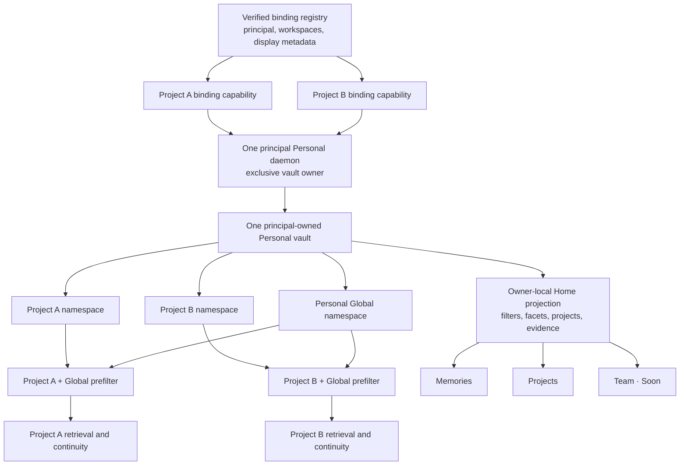
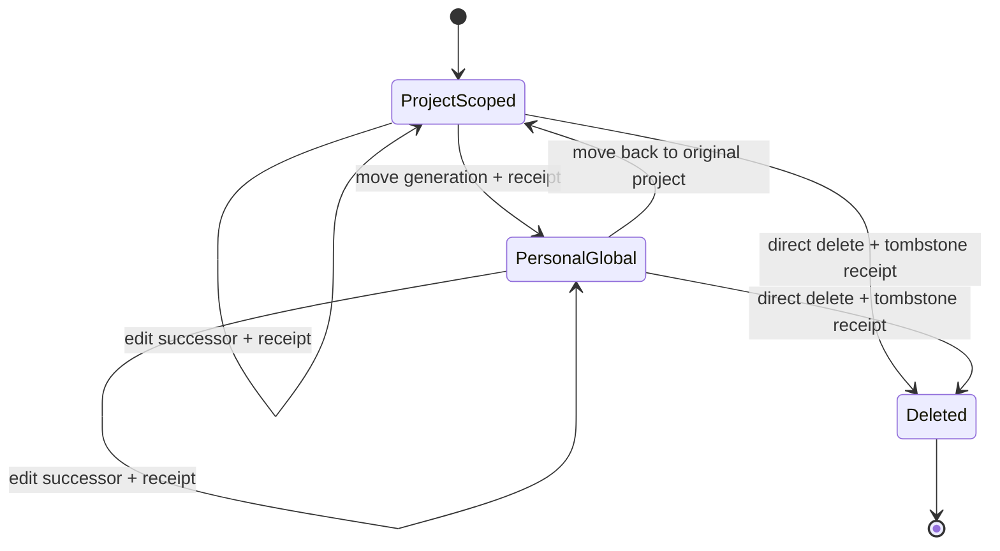

# Memories-First Personal Home and Explicit Memory Scope - Plan

## Goal Capsule

- **Objective:** Replace the current diagnostic-first Pulse Home with one calm Personal memory product: memories first, projects second, Team visibly deferred, and ordinary memory editable, movable, or deletable without an approval ceremony.
- **Product promise:** A person installs Pulse, keeps working normally, and later opens Home to see what Pulse remembers across supported harnesses and canonical-vault projects in human language. Legacy fragmented projects remain individually reachable and honestly labeled until a separate consolidation path exists.
- **Authority:** One principal-owned local Personal vault contains explicit project namespaces plus an opt-in `personal_global` namespace. Retrieval may read the current project and Personal Global; it must never read another project implicitly.
- **Execution profile:** Reconcile the existing Personal vault topology with the documented one-vault/project-namespace contract, add scope and human display metadata, extend the canonical Home read model and mutations, then recompose the existing server-rendered Go Home.
- **Stop conditions:** Do not ship a Global label that is only visual, a project or session name reconstructed from an opaque ID, a sharing badge without a real receipt/configuration source, or a cross-project query that filters only after ranking.
- **Tail owner:** This plan owns local code, migrations, compatibility behavior, tests, and real browser dogfood. It does not own Team implementation, historical chat import, public publication, installation redesign, or remote Git mutation.

---

## Product Contract

### Summary

Pulse Home becomes a memory browser rather than an infrastructure report. Its default `Memories` view puts a searchable, filterable, one-column feed directly below a compact header. `Projects` explains where Personal memory lives on this computer and which harness sessions contributed it. `Team` is an honest placeholder.

Ordinary Personal memory is already durable when it reaches Home. Home does not ask the user to approve it, wait ten seconds, or understand receipts. A memory the user dislikes can be edited, moved between its original project and Personal Global, or deleted immediately. Receipts, readiness, continuity delivery, privacy, and token evidence remain available under secondary details because they are useful proof, not the product's primary content.

### Problem Frame

The current Home answers “is the recovery machinery working?” before it answers “what does Pulse remember?” A large readiness hero, diagnostic metrics, consolidation, protected actions, Inbox, retry activity, receipts, and opaque IDs all appear before or inside the memory feed. The user sees internal repository and session identifiers instead of recognizable projects and task titles.

That hierarchy contradicts the intended product behavior: Pulse should work quietly during normal AI work and make its value visible only when the user chooses to inspect it. The installed claude-mem viewer demonstrates the useful discipline—memory appears immediately—while Pulse still needs stronger project, scope, cross-harness, deletion, and transfer semantics.

The requested Global-to-Project movement also exposes an implementation contradiction. `docs/recovery/PERSONAL_DOGFOOD.md` requires one physical Personal vault with project namespaces, but the current binding code creates a new random Personal store for every workspace. The UI cannot honestly promise a machine-wide Personal Global scope until that storage boundary is reconciled.

### Actors

- A1. **Personal user:** Works normally in Codex, Claude Code, or Cursor and occasionally inspects or corrects memory.
- A2. **Supported harness:** Produces structured memories and optional human session metadata through the existing host lifecycle.
- A3. **Principal Personal daemon:** The sole process allowed to open the canonical local Personal vault; it owns project/global scope, binding-capability routing, retrieval eligibility, immutable generations, receipts, and singleton sidecars.
- A4. **Memory Home:** An authenticated owner-local browser surface that projects A3's state without becoming a second memory authority.
- A5. **Project binding registry:** Proves which local workspaces, repositories, stores, and display metadata belong to the principal.

### Product Contract Key Decisions

- PKD1. **Memories are the default Home surface.** (session-settled: user-directed — chosen over the current continuity/readiness dashboard because the primary user question is what Pulse remembers.) Diagnostics remain secondary.
- PKD2. **Top-level navigation is `Memories`, `Projects`, and `Team · Soon`.** (session-settled: user-directed — chosen over one long report page because the three jobs have different information density and authority.)
- PKD3. **Human labels lead; technical IDs are details.** (session-settled: user-directed — chosen over repository/session/receipt hashes because those identifiers do not help the user recognize their work.) Pulse uses a harness-native title only when the harness actually supplies one.
- PKD4. **Ordinary Personal memory has no approval or grace-period UX.** (session-settled: user-directed — chosen over a Tray approval ceremony and ten-second delay because memory should work while the person works.) Presentation receipts may remain optional audit evidence.
- PKD5. **Delete is an ordinary direct action.** (session-settled: user-directed — chosen over protected-action ceremony for one memory because the user's correction model is “if I dislike it, delete it.”) Whole-vault wipe remains separately protected.
- PKD6. **Personal Global is explicit scope, not automatic cross-project search.** (session-settled: user-directed — chosen over project-only memory because the user wants reusable Personal memory shared across their projects.) Current-project retrieval may include `personal_global`; unrelated project namespaces remain excluded.
- PKD7. **One principal-owned physical Personal vault carries project namespaces.** (session-settled: user-approved by the project recovery contract — chosen over pretending that per-workspace vaults form one Global memory.) New same-principal bindings reuse the canonical Personal store; already fragmented stores are shown honestly and never silently merged.
- PKD8. **Server-rendered Go Home and canonical store authority stay.** (session-settled: user-approved — chosen over a new frontend framework or parallel dashboard because the existing surface already has authenticated sessions, CSRF, CSP, receipts, and governed mutations.)
- PKD9. **Team is a placeholder only.** (session-settled: user-directed — chosen over pulling Team backend work into the Personal recovery lane.) It performs no Team read, write, login, or publication.
- PKD10. **The compatibility migration is not a user approval wizard.** (session-settled: user-directed — chosen over another setup ceremony because Pulse should work while the person works.) Healthy schema/backfill/cutover happens automatically behind fail-closed gates. If safety cannot be proved, Pulse stays current-project-only and explains the blocker in status; it never asks the user to understand daemon topology or a “point of no return.”
- PKD11. **Sharing visibility is observational in this release.** (session-settled: user-directed — chosen because the user asked to filter what remains device-only, what is in Local Git, and what is proven remote.) Home reads existing source/publication evidence and can show `unknown`; it does not add enable/publish/push controls.

### Requirements

#### Memory-first surface

- R1. Opening Personal Home must land on `Memories`; after a compact app bar and an optional narrow health banner, the filter row and memory feed begin immediately.
- R2. At a viewport height near 710 px, the healthy default view must show the filters and at least two ordinary memory cards when two exist.
- R3. The memory query must support server-side text, project, harness, date-range, memory-scope, and sharing filters over the complete eligible result set, with stable pagination. Memory scope (`project` or `personal_global`) and sharing evidence (`device only`, proven `Local Git`, proven `Remote Git`, or `unknown`) are orthogonal filters with AND semantics. Absence/unavailability of evidence maps to `unknown`, never to `device only`. It must not filter only the current 20-card projection in the browser.
- R4. A card must lead with kind, harness, human project label, human session label or honest fallback, scope, date, and redacted summary. Object, binding, session, and receipt IDs stay inside collapsed `Technical details`.
- R5. Empty, loading, filtered-empty, degraded, stale, mutation-pending, mutation-failed, and conflict states must remain compact, specific, keyboard-operable, and non-color-only.

#### Projects and session truth

- R6. `Projects` must list every Personal binding visible in the verified owner-local registry with a human project label, owner-local folder, and whether its vault is canonical, shared, unavailable, or fragmented. Canonical-vault projects show current harness sessions and memory counts by scope. Fragmented stores are registry-metadata-only and explicitly show `sessions unavailable` and `counts unavailable`, plus the plain instruction to open Pulse from that project; Home does not open their SQLite files or mint a cross-daemon session.
- R7. Project labels come from signed owner-local workspace display metadata. Existing bindings without it may use a locally derived basename marked as fallback; repository hashes are never the primary label.
- R8. Session labels use a bounded harness-native title only when the lifecycle supplies one. Otherwise Home uses a deterministic human fallback with local capture date and time, such as `Codex · 25 Jul · 14:32`; same-minute collisions gain a stable capture-order ordinal. Pulse must not read raw prompts or private harness databases to invent a title, and the opaque session ID stays in Technical details only.

#### Personal scope and ordinary controls

- R9. Each durable Personal memory must have an explicit current scope (`project` with a stable project namespace, or `personal_global`), immutable original-project and capture provenance, and one monotonic logical-memory head. Project namespace identity must survive binding repair, port changes, and binding-generation rotation; an authority digest is evidence for a generation, not the project ID.
- R10. Retrieval and continuity assembly must prefilter to the current project namespace plus `personal_global` before lexical search, vector search, graph traversal, query expansion, ranking, counts, traces, or token calculations. Every candidate-producing path must either join the current database head or pass a database-backed eligibility revision fence before influence; another project must have zero influence.
- R11. Moving a memory between its original project and `personal_global` must advance the single logical-memory head, create one immutable successor generation, and write one durable receipt in the same principal-owned vault. It must be idempotent, compare-and-swap protected, and leave no partial copy/delete state.
- R12. Editing advances that same logical head with a correction; deleting tombstones the expected head and purges every retrieval derivative before reporting success. Edit, Move, and Delete must all carry the expected generation plus content/scope digest and fail transactionally on stale state. Delete executes from the card action without a confirmation modal, grace timer, or undo queue; none of these ordinary actions requires enhanced presence or a separate approval.
- R13. The sharing filter may show `Local Git` only from verified project-source state and `Remote Git` only from a publication receipt/configuration that proves it. `Device only` requires affirmative absence of a project source; unavailable evidence is `unknown`. This plan does not publish or push. `Team` sharing is absent from Personal filters until Team is actually connected.

#### Trust, evidence, and portability

- R14. Home must preserve the existing queryless one-shot session handoff, authenticated cookie, CSRF on mutations, strict form/query allowlists, same-origin behavior, CSP, no-store response policy, and no GET mutation. Only the trusted Pulse principal supervisor/CLI may mint an audience-bound, single-use, short-expiry Home handoff; binding capabilities can never mint, exchange into, or upgrade to Home authority. Atomic handoff consumption creates a Secure/HttpOnly/SameSite cookie bound to principal, canonical store, and verified registry/catalog epoch; replay or epoch change invalidates it.
- R15. Readiness appears as a small status control when healthy and a narrow actionable banner when degraded. Receipts, continuity, consolidation, protected wipe, privacy, and honest token evidence move to `Details` or `Settings`; none is deleted from the product.
- R16. Token evidence retains its measured/estimated/collecting/unavailable state and method. Home must never turn an estimate into a savings claim.
- R17. The implementation must use portable Go/SQLite/Node behavior and pass the existing supported Personal target matrix for macOS arm64/x64, Linux arm64/x64 GNU, and Windows arm64/x64. No UX or scope feature may depend on macOS presence APIs.
- R18. Existing per-workspace Personal vaults are never auto-merged, imported, or deleted. When more than one store exists for one principal, `Projects` shows registry metadata and `counts unavailable`; the affected memories remain under their existing authority until a separate consolidation plan. Fragmented stores cannot use Personal Global or cross-store Move, and ambiguous fragmentation blocks automatic canonical-vault reuse rather than creating a third store.
- R19. Initial finalization and every Edit successor must pass the same canonical server-side memory-content policy before the CAS transaction: structured-field/size bounds, Unicode/control handling, secret/path/raw-transcript rejection or redaction, and safe continuity serialization. Rejection creates no head, receipt, derivative, query revision, or Global-visible content.
- R20. Ordinary Delete must transactionally purge every application-level content-bearing generation, body, capsule, assertion/graph relation, FTS/vector projection, queue/outbox/job payload, and cache entry for that logical memory; only content-free receipt metadata may remain. Pulse logs must never contain memory bodies. If the temporary migration recovery backup exists, Delete appends a content-free tombstone that every restore must replay before serving. SQLite free pages/WAL, OS/filesystem snapshots, and third-party backups are named honestly as outside ordinary per-memory Delete; whole-vault wipe remains the separately protected forensic boundary.
- R21. The local threat model trusts the authenticated operating-system user and does not claim isolation from an arbitrary same-user process. Binding capabilities prevent protocol confusion and cross-binding escalation within Pulse: secrets stay outside repositories and never appear in argv, URLs, logs, or portable receipts; only verifiers are server-side; client state is private; rotation/revocation follows the signed registry epoch. Reuse existing body/query bounds, deadlines, cancellation, and one fixed per-binding concurrency cap; configurable quotas, queues, or fairness policy are deferred until shared-daemon dogfood shows a measured need.
- R22. Principal-daemon migration and compatible clean-project cutover must be automatic, resumable, and silent when healthy. No approval, timer, topology choice, model choice, port choice, or migration wizard is introduced. A blocked/fragmented installation remains safely current-project-only with one status explanation and an instruction to open Pulse from each legacy project; it never silently merges or claims Global.

### Key Flows

- F1. **Normal work becomes visible memory**
  - **Trigger:** A2 completes normal work and the existing finalization path durably stores a structured memory.
  - **Steps:** A3 assigns the trusted current project namespace, stores safe provenance and optional display metadata, and A4 later shows the memory at the top of the default feed.
  - **Outcome:** No Home visit, approval, timer, raw transcript capture, or API-billed model call is needed for durability.
  - **Covered by:** R1-R5, R7-R9, R12
- F2. **Browse and filter Personal memory**
  - **Trigger:** A1 opens Home or changes a filter.
  - **Steps:** A4 validates the query allowlist and the principal-vault Home session, asks A3 for a bounded page of all active canonical-vault objects after scope-first filtering, and renders stable cards and count/facet data. A cursor binds the normalized filter digest, catalog/eligibility high-water revision, and deterministic ordering key.
  - **Outcome:** The visible results, counts, and pagination all describe the same complete eligible set.
  - **Covered by:** R1-R5, R10, R14
- F3. **Move between project and Personal Global**
  - **Trigger:** A1 selects `Move to Personal Global` or `Move back to <original project>`.
  - **Steps:** A4 posts the object, expected generation, content/scope digest, exact target, and CSRF token; A3 resolves the original project from the principal catalog, validates the principal-vault Home capability, advances the one logical head and receipt atomically, increments the eligibility revision, and fences stale retrieval before success.
  - **Outcome:** Current-project tasks and all projects see exactly the scope the user selected; unrelated project namespaces never become visible.
  - **Covered by:** R9-R12, R14
- F4. **Delete or correct a memory**
  - **Trigger:** A1 chooses Edit or Delete on a durable card.
  - **Steps:** A4 calls the existing governed correction/delete path with expected generation and content/scope digest; A3 commits the successor or tombstone and receipt against the same logical head, increments eligibility, and fences stale retrieval projections.
  - **Outcome:** Home reflects the result immediately without an approval ceremony.
  - **Covered by:** R5, R11-R12, R14
- F5. **Inspect projects and fragmentation**
  - **Trigger:** A1 opens `Projects`.
  - **Steps:** A4 combines the verified binding catalog with canonical-vault project/session summaries. Fragmented entries use registry metadata only, return `sessions unavailable`/`counts unavailable`, and explain that Pulse must be opened from that project.
  - **Outcome:** The user recognizes folders, projects, harnesses, and canonical memory distribution; legacy split vaults stay visible without a new cross-daemon authentication lane or silent merge.
  - **Covered by:** R6-R8, R18
- F6. **Inspect evidence without dashboard clutter**
  - **Trigger:** A1 opens status, Settings, or a card's technical details.
  - **Steps:** A4 reveals current readiness, receipts, continuity, privacy, consolidation, and token method from the existing canonical projection.
  - **Outcome:** Evidence remains inspectable but no longer displaces memory.
  - **Covered by:** R4, R15-R16

### Acceptance Examples

- AE1. Given two active memories in a healthy Personal vault, when Home opens at 1440×710, then `Memories`, the filter row, and both cards are visible without scrolling; no repair hero or KPI cards precede them.
- AE2. Given memories from Codex and Claude Code across two project namespaces and Personal Global, when the user combines project, harness, date, memory-scope, and sharing filters, then every card, count, and next-page cursor matches the filtered high-water snapshot with scope/sharing AND semantics. Later captures show `New memories` without invalidating that snapshot; a mutation affecting it returns the defined refresh conflict instead of mixing states.
- AE3. Given a project named `personal-real-dogfood`, when its card renders, then that name leads and `repository_…` appears only after opening `Technical details`.
- AE4. Given a harness supplies `Fix Pulse recall`, Home shows it as the session title; given Codex supplies only an opaque session ID, Home shows `Codex · <local date> · <time>` and adds a stable ordinal only on collision, never exposing the ID as the title.
- AE5. Given one project-scoped memory, when the user moves it to Personal Global, then two already-connected project clients and fresh tasks in both projects observe the new eligibility without daemon restart, while the receipt records the logical generation and immutable original project.
- AE6. Given that Global memory, when the user moves it back, then only the stable original project namespace can influence retrieval, counts, traces, graph, continuity, or token evidence. If the original project is revoked, unavailable, or fragmented, Move Back returns a conflict and leaves the Global head active.
- AE7. Given a stale expected generation/content-scope digest or a changed catalog epoch, when Edit, Move, or Delete posts, then each operation independently returns a visible conflict and produces zero new heads, tombstones, derivative changes, or receipts.
- AE8. Given the user deletes a memory, then its head and derivatives are retired in the durable mutation and every read path is fenced from the old eligibility before success is reported, with no timer, presentation requirement, or enhanced-presence prompt.
- AE9. Given a healthy runtime, no banner appears; given a real binding or retrieval failure, a narrow banner names the failure and one next action while the available memory feed remains readable. Failures in continuity, consolidation, token, receipt, or other secondary evidence loaders degrade only those details and do not hide a readable feed.
- AE10. Given no memories or no filter matches, Home shows one compact useful empty state rather than rendering empty diagnostic sections.
- AE11. Given Team is not connected, selecting `Team · Soon` shows a static explanation and performs no Team network request or mutation.
- AE12. Given verified local project-source state but no remote receipt, sharing is `Local Git`; given a real publication receipt, it is `Remote Git`; given affirmative no source, it is `Device only`; and given unavailable evidence, it is `unknown`. No route in this plan pushes or publishes.
- AE13. Given two legacy Personal store IDs for the same principal, `Projects` marks them fragmented, shows `counts unavailable`, blocks canonical reuse/Global/Move for those entries, and does not open, merge, transfer, or globally retrieve their contents.
- AE14. Given the same fixture on supported macOS, Linux, and Windows targets, Home navigation, filters, direct controls, SQLite scope queries, and Team placeholder behave equivalently; whole-vault enhanced presence remains a separate platform capability.
- AE15. Given a project binding repair, resolver-epoch change, or port rotation, its stable project namespace and memory origin remain unchanged; given an unmappable live legacy generation, activation remains current-project-only with a visible reason. Only content-free terminal/audit rows may remain quarantined without blocking.
- AE16. Given an Edit or Move, the card retains immutable capture harness, capture session/title source, original project, and `captured_at`; only `modified_at` and mutation actor change.
- AE17. Given a valid Project A binding capability, it can call only Project A agent routes and cannot mint/replay a Home handoff, read Home-wide data, choose Project B's namespace, or mutate a Project B/Global object.
- AE18. Given an Edit containing a secret, raw transcript, local path, oversized field, unsafe control text, or invalid structured content, the canonical content policy rejects it and writes no head, receipt, derivative, query revision, or Global-visible content.
- AE19. Given hostile project/session/summary/filter text containing markup, attributes, URLs, quotes, bidirectional controls, or malformed Unicode, Home renders inert escaped text under CSP and no same-origin mutation executes.
- AE20. Given Delete succeeds, application-level inspection finds no content-bearing predecessor/current generation, projection, queue, or cache entry for that logical memory; only a content-free receipt remains, memory bodies never appear in Pulse logs, and Home states the SQLite/WAL/OS-snapshot/third-party-backup boundary.
- AE21. Given one binding reaches the fixed concurrency cap or existing body/query/deadline bound, that request is throttled/cancelled and another bound project remains responsive.
- AE22. Given a safe single-store upgrade, migration/backfill/cutover completes without a wizard or user approval; given ambiguous fragmentation or a failed safety gate, Pulse stays current-project-only, shows one actionable status explanation, and exposes no Global control.
- AE23. Given a fragmented legacy project, its card gives the plain instruction to open Pulse from that project and never reads its SQLite file or mints a cross-daemon Home session.
- AE24. Given capture and binding activity during online backfill, new commits dual-write complete fields, the pinned high-water is fully mapped, and registry drift or any live unmapped row prevents ready publication and restarts reconciliation.
- AE25. Given a retrieval paused after candidate ranking, when Move or Delete advances eligibility before response emission, the request revalidates, restarts once, and then either returns only current eligibility or a retryable conflict—never stale context, traces, counts, or token evidence.
- AE26. Given new captures arrive after page one, `Load more` continues the original high-water snapshot without livelock and a `New memories` indicator offers refresh; an Edit/Move/Delete affecting the snapshot instead triggers the defined refresh conflict.
- AE27. Given cutover is ready, the identity/schema-bound online backup and exact compatible runtime restore successfully in isolation before the first second-project/Global write; failure keeps current-project-only. A restored backup replays post-backup deletion tombstones before serving.
- AE28. Given path move, linked worktree, separate clone, copied metadata, remote change, or registry restore, namespace selection follows the explicit matrix and ambiguity blocks reuse instead of merging/splitting silently.
- AE29. Given the runtime inventory contains an unknown or store-keyed client artifact, activation fails; given the complete inventory, two bindings show no path, secret, session, lease, queue, cache, or in-memory key collision.

### Success Criteria

- A user can identify what Pulse remembers before seeing diagnostic evidence.
- A user can find a memory by project, harness, date, text, memory scope, or sharing evidence without reading an opaque ID.
- A user can edit, delete, or move an eligible memory without an approval or delay workflow.
- A clean two-project Personal setup uses one physical principal vault, keeps project namespaces isolated before ranking, and shares only `personal_global`.
- The `Projects` view makes both normal and fragmented local states understandable without importing history or opening SQLite.
- The current real Codex recovery proof—automatic extraction, durable write, fresh-task delivery, and honest token evidence—remains possible and moves into secondary evidence rather than disappearing.

### Scope Boundaries

#### Included

- Personal principal-daemon ownership/routing, existing canonical-store migration/backfill, and gated binding cutover for clean same-principal bindings.
- Explicit project and `personal_global` object scope with original-project provenance.
- Human project metadata, optional harness session titles, honest title fallbacks, indexes, filters, pagination, edit/delete/move controls, Projects view, Team placeholder, and secondary diagnostics.
- Compatibility rendering for existing bindings and visible fragmented-vault state.
- Server-rendered Home browser and cross-platform automated/real browser verification.

#### Deferred to Follow-Up Work

- Consolidating or migrating already fragmented Personal vaults.
- A richer session-title adapter if a harness later exposes a supported title API.
- Remote Git enable/disable or publication controls.
- Team Personal-to-Team promotion and Team filters.
- Onboarding, pet/reward system, Cartographer insights, and behavioral coaching.

#### Outside This Product Contract

- Historical chat import, raw transcript storage, automatic cross-project promotion, searching unrelated project namespaces, model-decided scope, Team backend work, public npm publication, push/PR creation, global Codex configuration changes, a new frontend framework, installer UX redesign, or public runtime packaging/distribution redesign.

### Sources and Research

- Personal recovery product and one-vault namespace constraint: `docs/recovery/PERSONAL_DOGFOOD.md`.
- Current strategic project-first and explicit-broadening constraints: `STRATEGY.md`.
- Current Personal binding topology: `pulse-app/cli/src/binding-admin.js` and `pulse-app/cli/src/workspace-binding.js`.
- Current Home authority and rendering: `pulse-app/internal/server/home_routes.go`, `pulse-app/internal/server/memory_home.go`, and `pulse-app/internal/store/memory_home.go`.
- Current durable correction/delete authority: `pulse-app/internal/store/memory_tray.go` and `pulse-app/internal/server/home_routes.go`.
- Current continuity/session schema: `pulse-app/internal/store/continuity.go` and `pulse-app/internal/store/migrations/023_continuity.sql`.
- Current memory/receipt schema: `pulse-app/internal/store/migrations/041_memory_tray_receipts.sql`, `pulse-app/internal/store/migrations/045_memory_presentation_receipts.sql`, and `pulse-app/internal/store/migrations/046_continuity_delivery_receipts.sql`.
- Historical Personal onboarding decisions are used only where not superseded here.
- Planning-time visual comparison: current Pulse Home versus the locally installed claude-mem 12.5.0 viewer. The comparison informed hierarchy and density, not storage or trust decisions.
- Institutional learnings search: `docs/solutions/` and `CONCEPTS.md` are absent; no prior solution artifact constrained this plan.

---

## Planning Contract

### Assumptions

- The session-settled user direction intentionally supersedes the older deferral of Personal Global memory and the recovery document's old “dashboard redesign” exclusion for this planning artifact.
- `docs/recovery/PERSONAL_DOGFOOD.md` is authoritative about one physical Personal vault with project namespaces; the current per-workspace store creation is an implementation discrepancy to correct.
- A canonical Personal store may be adopted only when the verified registry and persisted store identity agree that exactly one safe principal-owned candidate exists. The plan does not assume the currently open dogfood store wins when authority is ambiguous.
- Existing multiple Personal stores are not silently reconciled. Their visible fragmented state satisfies this plan; moving their historical objects is follow-up work.
- Harness-native session titles are optional data. The plan does not assume Codex exposes a title in its current lifecycle payload.
- Ordinary memory durability is owned by the existing immediate-finalization work already present on this branch. This plan ensures Home does not reintroduce approval or delay.
- The Home remains English-only as an outsider-facing product surface.

### Key Technical Decisions

- KTD1. **Use one principal daemon as the exclusive Personal-vault owner.** Exactly one process opens the canonical SQLite vault, runs migrations, owns vault-level consolidation/runtime sidecars, issues Home sessions, and advances eligibility revisions. Workspace-local bindings remain distinct and revocable but point to this loopback daemon with random per-binding-generation capabilities that are not derived from `store_id`. Each binding keeps a separate `client_state_dir` for turn contexts, tool leases, finalize markers, and other host-local sidecars; only the daemon receives the canonical `vault_data_dir` and vault secret. Workspace integrations are clients; no second workspace daemon may open the shared vault.
- KTD2. **Separate stable project identity, binding authority, and the logical-memory head.** A stable `project_namespace_id` survives port, resolver-epoch, and binding-generation changes; a verified mapping relates each binding generation to that namespace. One database-enforced active logical-memory head records immutable capture/original-project provenance, current scope, content/scope digest, and monotonic generation. Edit, Move, and Delete all compare-and-swap this same head and append exactly one receipt; authority digests remain evidence, never project IDs.
- KTD3. **Keep filtering and facets in the Go store projection with snapshot-bound cursors.** Strict query parsing in Home maps to typed `MemoryHomeQuery` fields; SQL applies scope and other filters before ordering/limit. The first page records a `snapshot_high_water` and a mutation/facet revision. Later captures above that high-water are excluded from the existing pagination snapshot and surface as `New memories` rather than invalidating `Load more`; Edit/Move/Delete or label/sharing changes affecting the snapshot advance its revision. The cursor binds normalized filter digest, snapshot high-water, mutation revision, and deterministic ordering key. A mismatch asks the user to refresh instead of returning duplicates or omissions. JavaScript handles pending UI states, not dataset truth.
- KTD4. **Derive the vault catalog from a verified registry snapshot.** Signed workspace metadata owns project label/path; the database stores a reconciled registry digest/epoch plus stable namespace and binding-generation mappings. Daemon startup idempotently reconciles them and fails closed on mismatch. Host lifecycle may add bounded session display metadata and immutable capture provenance. Portable receipts and MCP output omit canonical paths; the browser may reveal them only in the authenticated Projects view.
- KTD5. **Compose retrieval from exactly two Personal namespaces through a server-resolved scope context.** A project capability resolves to its stable project namespace plus `personal_global`; callers cannot submit trusted namespace IDs. Every vector, factual, chain, lexical/BM25, graph, expansion, continuity, count, trace, and token path captures the eligibility revision, consults the active head before influence, and revalidates the revision immediately before emitting output. A mismatch restarts once, then returns a retryable conflict rather than emitting a stale trace/context/token result. The principal Home capability may browse the canonical vault, but it does not broaden agent retrieval.
- KTD6. **Extend existing governed mutations under principal-vault Home authority.** Only the trusted principal supervisor/CLI can atomically exchange a single-use, audience-bound handoff secret for a short-lived Home cookie bound to principal, canonical store, and current catalog epoch; binding credentials cannot call this issuer or upgrade themselves. Home may Edit/Delete canonical-vault objects whose immutable origin maps to that principal and may Move only between Personal Global and the exact original project. Revoked/unavailable origins fail closed, and no second mutation service is introduced.
- KTD7. **Recompose, do not duplicate, Home.** `memory_home.go` remains the only Personal HTML renderer and `home_routes.go` remains the authenticated route surface. The legacy `/viewer` is not redesigned.
- KTD8. **Derive sharing labels from evidence.** Project/global scope comes from the new scope projection. `Local Git` comes from verified project-source state, `Remote Git` from existing registered publication evidence, `Device only` from affirmative no-source state, and loader/authority absence from `unknown`. Team remains absent. UI state cannot assert a destination by itself.
- KTD9. **Cut over only after an online, fail-closed migration.** First replace the canonical current-project runtime under the principal fence with a reader-floor-compatible binary that dual-writes complete scope/head fields for every new commit. Pin the verified registry epoch and a database high-water mark, transactionally add structures, then restartably backfill through that mark from authoritative lineage only. Final readiness publishes in one transaction only if the registry epoch is unchanged, every live content-bearing row is mapped to a stable project/head, and count/digest invariants hold; drift restarts reconciliation. Ambiguous live rows block activation for their store and preserve legacy current-project routing with a visible reason; only content-free terminal/audit rows may remain quarantined. Workspace bindings redirect only after every retrieval path is scope-aware. Before the irreversible first second-project or Global write, automatically verify an identity/schema-bound local recovery artifact plus an exact compatible principal-daemon runtime; otherwise stay current-project-only. After that write, recovery is roll-forward or compatible restore, schema never downgrades, and legacy readers remain fenced.
- KTD10. **Bootstrap principal authority from Pulse Personal identity, not a harness.** The existing device-local Personal principal record and signed binding-registry trust establish the stable `principal_id`; canonical adoption persists that identity in the store and requires an exact registry/store match. Binding generations prove membership through registry signatures and random capability records. Loss, ambiguity, another principal, or unprovable rotation fails closed and cannot adopt/reuse the vault. A future identity-recovery/rotation ceremony is outside this plan; no state is written to global Codex configuration.
- KTD11. **Fence principal-daemon ownership with a portable state machine.** Before any vault open or migration, the supervisor acquires the existing portable activation lock keyed by principal/store, validates an owner record containing binary/schema floor, process identity, endpoint, boot nonce, and fencing epoch, then either reuses a health-challenge-verified daemon or starts one and atomically advances the persisted epoch. Stale recovery requires both process-liveness and nonce-bound endpoint validation to fail under the lock; PID alone is never proof. The database rejects writes and singleton-sidecar work from an old epoch, so a paused daemon cannot resume authority. Platform services must provide equivalent macOS, Linux, and Windows behavior.
- KTD12. **Treat binding credentials as local protocol capabilities, not an OS sandbox.** The supported threat boundary trusts the current operating-system account; Pulse does not claim protection from arbitrary same-user malware. Capability material lives only in private Pulse state or OS credential storage, is never repository-visible or placed in argv/query/logs, and is stored server-side only as a verifier. Registry-epoch rotation/revocation, existing body/query/deadline bounds, cancellation, and one fixed concurrency cap per binding limit accidental, stale, or looping clients without introducing a quota subsystem or pretending to isolate a compromised local account.
- KTD13. **Use one content-safety and logical-deletion boundary for all memory generations.** Finalization and correction call the same canonical content-policy function before head mutation. Delete transactionally removes every application-level content-bearing generation and derivative for the logical memory, advances eligibility/query revisions, and retains only content-free receipt evidence. Memory bodies are never logged. Per-object forensic cleanup of SQLite free pages/WAL and OS or third-party snapshots is outside ordinary Delete and belongs to the separately protected whole-vault/deletion-hardening boundary.
- KTD14. **Inventory every mutable runtime artifact before cutover.** U1 must classify every filesystem path, secret, in-memory map, queue, lease, cache, worker, and sidecar as principal-vault-wide, binding-local, or rebuildable. Principal-wide state is keyed by principal/store/fencing epoch; binding-local state is keyed by binding generation in `client_state_dir`; rebuildable retrieval caches still enforce `ScopeContext` and eligibility revision. Any unknown or store-keyed client artifact blocks activation. The inventory and two-binding collision test matrix are implementation artifacts, not user settings.
- KTD15. **Assign project namespaces from signed local continuity, never repository similarity alone.** First bind creates a random stable namespace in the signed registry/catalog. Repair, port/resolver rotation, and authenticated path relocation reuse it only through verified binding history. A linked Git worktree may reuse the parent namespace only when the same local Git common-dir identity and signed registry mapping prove it; a separate clone/copy gets a new namespace even with the same remote. Copied metadata, ambiguous relocation, or registry restoration without matching signed catalog history blocks reuse. Changing a remote URL does not rename an already-proven namespace.
- KTD16. **Make the irreversible cutover recoverable without a user ceremony.** Before activation, create a private identity/schema-bound SQLite online backup, record its digest, retain the exact compatible principal-daemon runtime, and verify restore into an isolated path. The backup is never queried. While it exists, Delete appends a content-free tombstone journal that a restore must replay before the daemon becomes reachable; whole-vault wipe removes backup and journal. After one clean compatible-daemon restart plus automated catalog/scope/retrieval integrity checks, retire the migration backup. Failure at any gate leaves the product current-project-only.

### High-Level Technical Design

This sketch shows boundaries and data ownership; it is not an exact schema or function-signature prescription.

### Surface Structure

| Surface | Primary content | Secondary content | Explicitly absent |
|---|---|---|---|
| Memories | Count, search, Project/Harness/Date/Scope/Sharing filters, one-column cards | Edit, Move, Delete, technical details | Hero, KPI grid, Memory Ocean report, raw IDs |
| Projects | Human project, owner-local folder, harness sessions, counts/scopes, canonical or fragmented state | Open project, technical identity | Automatic migration or merge |
| Team | `Team · Soon` and a short boundary explanation | None | Login, remote reads, promotion, publication |
| Settings / status | Readiness, continuity, receipts, token method, privacy, consolidation, protected wipe | Repair actions | Competing memory feed |

### Secondary Evidence Ownership

| Canonical destination | Owns | Does not duplicate |
|---|---|---|
| App-bar Status | Overall binding/daemon/retrieval state, current-project-only/migration state, one immediate repair action | Memory receipts, privacy controls, detailed reports |
| Settings · Memory & privacy | Capture/privacy policy, raw-transcript/backend-call state, retention boundary, protected whole-vault wipe | Runtime health and per-card evidence |
| Settings · Diagnostics | Continuity delivery health, token method, consolidation, retry/Unassigned activity, global operational receipts | Primary memory browsing or destructive memory actions |
| Card · Technical details | Object/origin/binding/session IDs, immutable capture and current scope, per-memory mutation/delivery receipts and evidence method | Runtime-wide status or settings |

Each fact/action has one canonical destination; other surfaces use a short cross-link rather than copying the content.

### Interaction Contract

| Interaction | Desktop and narrow behavior | State/recovery/focus |
|---|---|---|
| Filters | Search and Project stay visible; `Filters <active-count>` discloses Harness, Date range, Memory scope, and Sharing. On narrow widths Search is full-width and Project/Filters form the second row. Search submits on Enter; selects/date apply explicitly with `Show results`; `Clear all` resets the normalized query. The disclosure is collapsed by default so two-card density remains possible. | Applied filters render as removable compact chips. Apply/Clear preserves the normalized query, announces result count, and focuses the feed heading; invalid values remain inline and do not clear other fields. |
| Pagination | One `Load more` control appends the next high-water snapshot page; no numbered pages or infinite scroll. New captures show a non-blocking `New memories` refresh control and do not livelock paging. | Pending disables the control; failure keeps existing cards and offers Retry; exhausted removes it. A mutation conflict preserves filters, shows `Memories changed · Refresh results`, replaces rather than appends on refresh, announces the change, and focuses the feed heading/first card. |
| Edit | Inline card editor, never a modal; bounded field plus Save and Cancel. | Validation stays inline. A stale conflict preserves the draft and offers `Reload latest`; reloading refreshes current metadata without discarding draft text, then requires an explicit Save. Success returns focus to the card summary. |
| Move | Direct card menu/button labeled exactly `Move to Personal Global` or `Move back to <original project>`; no destination picker. | Pending disables card actions. Success updates/removes the card according to active filters and focuses the updated card or next result. Conflict stays inline and announces `Reload latest`. |
| Delete | Direct `Delete` card action; no modal, timer, or undo. | Pending reads `Deleting…`. Success removes the card and focuses the next card, previous card, or feed heading in that order. Failure/conflict keeps the card, restores Delete, and announces the reason. |

### Runtime State Inventory Gate

| Ownership class | Required contents/keying | Cutover rule |
|---|---|---|
| Principal vault-wide | SQLite and migrations, vault secret, daemon owner/fencing record, catalog and query/eligibility revisions, projection workers, retrieval engine, consolidation, Home session store, temporary migration backup/tombstone journal | Owned/opened only by the principal daemon and keyed by principal/store/fencing epoch |
| Binding-local | Capability reference/verifier mapping, `client_state_dir`, capture state, turn contexts, tool leases, finalize markers, host session state, client caches | Key every artifact by binding generation; never place vault secret or another binding's state here |
| Rebuildable | Embedding/retrieval caches and derived indexes | May be principal-wide only if every read receives `ScopeContext` and revision fencing; otherwise binding-key it |
| Unknown | Any mutable path/map/queue/sidecar not classified above | Blocks ready catalog publication and binding cutover |

### Project Namespace Identity Matrix

| Event | Namespace result | Proof/failure behavior |
|---|---|---|
| First verified bind | New random namespace | Persist in signed registry and catalog together |
| Binding repair, port, resolver epoch | Reuse | Verified binding-generation history |
| Authenticated path relocation | Reuse | Signed registry transaction links old and new canonical path; ambiguity blocks |
| Linked Git worktree | Reuse parent project | Same local Git common-dir identity plus signed parent mapping; otherwise new/block |
| Separate clone, copied folder, copied metadata | New namespace | Remote/repository similarity never merges; invalid copied authority is rejected |
| Repository remote URL change | Reuse | Existing signed local namespace continuity wins |
| Registry restoration | Reuse only on exact match | Signed registry history and catalog digest/epoch must agree; missing history blocks |

### System-Wide Impact

- **Binding lifecycle:** One principal daemon becomes the exclusive canonical-vault opener. New Personal project bindings retain distinct workspace/binding generations and random capabilities while discovering the same loopback runtime. Binding creation and repair map generations to a stable project namespace; registry validation rejects ambiguous multiple-store reuse.
- **Persistent data:** A forward-only online migration adds principal/catalog identity, stable project namespaces, binding-generation mappings, immutable capture provenance, one logical-memory head, eligibility/snapshot revisions, and indexes. A dual-write, registry/high-water-pinned backfill publishes a ready catalog epoch only after checkpointed count/digest and zero-live-unmapped verification; no memory body or sealed receipt is rewritten. A temporary private migration backup/runtime/tombstone journal exists only across the cutover recovery gate.
- **Singleton ownership:** SQLite migration, consolidation manager/key, Home session issuance, registry/catalog reconciliation, runtime sidecars, and eligibility-revision advancement belong only to the principal daemon. Compatibility shims may be stateless clients but never vault openers.
- **Write lifecycle:** Finalization and Edit pass one canonical content policy. Finalization assigns current stable project scope and advances the feed high-water; Edit and Move create one successor logical head; Delete purges all content-bearing heads/history/derivatives and leaves only content-free receipt evidence. Existing-head/facet changes advance the snapshot mutation revision and every eligibility change advances eligibility; all three mutations reject a stale expected generation/content-scope digest.
- **Retrieval and continuity:** A server-resolved scope context and current active-head eligibility apply before every vector, factual, chain, lexical/BM25, graph, expansion, continuity, count, trace, and token path. No in-memory candidate may influence output after its database eligibility revision is stale.
- **Home/API:** The queryless session shape remains unchanged, but only the trusted principal supervisor/CLI may issue it. Atomic consumption creates a short-lived principal/store/catalog-bound Home cookie; binding capabilities cannot upgrade. Page navigation gains strict allowlisted query parameters, revision-bound cursors, and CSRF-protected mutations. Project agent credentials remain namespace-scoped and resource-budgeted.
- **Host parity:** All harnesses can display host/date fallback. A native title is additive, never required for memory durability.
- **Privacy/security:** Canonical folder paths stay owner-local. Session titles pass the same length/control/content scrub rules as other display metadata and never become retrieval content. Every dynamic Home value is contextually escaped. Capability material remains in private Pulse/OS credential state and is excluded from repositories, argv, URLs, logs, and receipts; the stated threat model does not claim protection from arbitrary same-user malware.
- **Legacy state:** More than one Personal store for one principal becomes a visible `fragmented` registry state with `counts unavailable`. No background migration, direct cross-store SQLite read, hidden import, Global activation, or cross-store Move occurs.
- **Operational evidence:** Existing readiness and token calculations remain canonical but move out of the primary visual hierarchy.

### Risks and Mitigations

| Risk | Mitigation |
|---|---|
| A second process opens the principal vault or starts singleton sidecars | Exclusive principal-daemon discovery/start lock plus persisted owner/fencing state; workspace integrations are clients and old workspace daemons are stopped or fenced before cutover. |
| Shared runtime paths collide project sessions or expose the vault secret | Separate principal-only `vault_data_dir`/secret from per-binding `client_state_dir`/capability; namespace all turn contexts, leases, markers, and client caches by binding generation. |
| A forgotten sidecar, cache, map, or queue remains store-keyed | Require the Runtime State Inventory and two-binding collision matrix; any unknown or store-keyed client artifact blocks cutover. |
| An old binary opens after the schema/reader floor changes | Persist a schema and reader-capability floor; reject incompatible startup before vault reads or writes and keep binding cutover disabled until every active client attests the new floor. |
| Migration and authority backfill crash or start twice | One migration owner rechecks schema under the writer lock; structural migration is transactional and the dual-write backfill is idempotent/checkpointed; any live unresolved row blocks activation and no ready catalog epoch publishes on failure. |
| Capture or binding repair races the online backfill | Upgrade to dual-write first, pin registry epoch/database high-water, and publish readiness only if the epoch is unchanged and zero live rows remain unmapped; drift restarts reconciliation. |
| Signed registry and SQLite catalog diverge after a crash | Store the verified registry digest/epoch in the catalog, reconcile idempotently at daemon start, bind Home sessions/cursors to that epoch, and fail closed on mismatch. |
| Repair, clone, worktree, relocation, or copied metadata merges/splits a project | Apply the Namespace Identity Matrix from signed local continuity; repository/remote similarity alone never merges, and ambiguous history blocks reuse. |
| Global scope leaks another project's memory | Scope-first indexes and negative-influence tests cover lexical, vector, graph, continuity, counts, traces, and token evidence before ranking. |
| An in-flight or cached candidate remains visible after Move or Delete | Advance eligibility in the mutation; every read joins the active head and revalidates immediately before emission, restarting once or returning a retryable conflict on change. |
| Active capture repeatedly invalidates pagination | Freeze each cursor at a feed high-water so later captures show `New memories`; only mutations/label/sharing changes affecting that snapshot advance its revision and require refresh. |
| Concurrent Edit, Move, and Delete create divergent active states | One database-enforced logical head, one monotonic generation, expected generation/content-scope digest, operation-digest idempotency, and unique active-head constraints serialize all three actions. |
| Existing multiple stores are mistaken for one vault | Registry validation produces `fragmented`, shows registry metadata with `counts unavailable`, never chooses or merges automatically, blocks reuse/Global/cross-store Move, and refuses to create a third store. |
| A forged query, form, or project client broadens authority | Strict allowlists, principal/store/catalog-bound Home capability, binding-scoped agent capability, CSRF, expected generation, exact target enum, server-resolved namespace, and no GET mutations. |
| A binding credential upgrades into principal-wide Home authority | Only the trusted supervisor/CLI mints single-use audience-bound Home handoffs; binding capabilities have no issuer route, replay is atomic, and epoch changes revoke the cookie. |
| A same-user process steals a local capability | State the OS-account trust boundary honestly; keep material out of repositories/argv/URLs/logs, use private/OS credential storage, store verifiers only, and rotate/revoke by binding generation. |
| An Edit persists a secret, transcript, path, or agent-directed payload | Apply the same canonical server-side content policy as finalization before CAS; rejection writes no durable or retrieval-visible artifact. |
| Dynamic project/session text executes in Home | Contextually escape every dynamic value, prohibit trusted-HTML conversion, preserve CSP, and cover stored-XSS/bidirectional/malformed-Unicode cases. |
| Delete leaves application-visible content in history or Pulse caches | Purge all application-level content-bearing generations, queues, and derivatives transactionally, keep receipts content-free, prohibit bodies in logs, and disclose SQLite/WAL/OS snapshot residue as outside ordinary Delete. |
| One project client exhausts the shared daemon | Reuse existing body/query bounds, deadlines, and cancellation plus one fixed per-binding concurrency cap; defer a quota/fairness subsystem until measured dogfood need. |
| Session/project labels leak paths or prompt content | Store bounded typed display metadata separately from memory content; reveal paths only in authenticated Projects; use fallback labels rather than scraping host databases or prompts. |
| Device/Local Git/Remote Git or Team sharing is overstated | Render only from affirmative source/publication evidence, use `unknown` on unavailable proof, and keep Team a static nonfunctional surface. |
| Simplifying Home hides a real failure | Keep status available in the app bar and show one narrow banner for an active blocker; details retain full evidence. |
| The scope migration changes current recovery behavior | Map only verified binding generations to stable namespaces, quarantine unresolved rows, keep project-only behavior until explicit Move, and rerun real same-project fresh-task acceptance before Global tests. |
| An operator attempts legacy rollback after cross-project activation | Persist the compatibility point of no return; after the first second-project or Global write, fence legacy readers and permit only roll-forward or restore into a reader-floor-compatible principal daemon. |
| Cutover fails after legacy rollback is fenced | Before the irreversible write, integrity-check an identity/schema-bound online backup and exact compatible runtime via isolated restore; keep current-project-only if unavailable, replay deletion tombstones on restore, and retire the artifact only after clean restart/integrity gates. |
| Secondary diagnostics fail and hide usable memory | Load the feed as the mandatory projection and continuity/consolidation/token/receipt evidence as typed optional sections; only authentication, catalog authority, or feed-store failure may terminate Home. |

### Sequencing

1. U1 first ships an honest current-project-only Memories-first Home checkpoint using existing authority—memory feed first, technical IDs collapsed, diagnostics secondary, no Global claim—then establishes the principal-daemon/catalog/schema foundation and verified backfill with routing still disabled.
2. U2 makes every reader and mutation scope-aware, raises the reader floor, proves no-influence and live invalidation, then performs the gated binding cutover to the principal daemon. No second project client may connect before that gate is green.
3. U3 changes information hierarchy only after the read/mutation contracts and canonical-vault Home authority are real.

---

## Implementation Units

### U1. Ship current-project Memory Home and establish the principal foundation

- **Goal:** Put visible current-project memory first immediately, then create the single-owner runtime, stable identity, schema, and fail-closed backfill foundation without yet routing a second project into the vault.
- **Covers:** R1-R2, R4-R9, R17-R22; F1, F4-F5; AE1, AE3-AE4, AE8-AE10, AE13-AE24, AE27-AE29.
- **Files:**
  - Modify `pulse-app/cli/src/binding-admin.js`
  - Modify `pulse-app/cli/src/binding-admin.test.js`
  - Modify `pulse-app/cli/src/workspace-binding.js`
  - Modify `pulse-app/cli/src/workspace-binding.test.js`
  - Modify `pulse-app/cli/src/personal-principal.js`
  - Modify `pulse-app/cli/src/personal-principal.test.js`
  - Modify `pulse-app/cli/src/local-supervisor.js`
  - Modify `pulse-app/cli/src/local-supervisor.test.js`
  - Modify `pulse-app/cli/src/platform-services.js`
  - Modify `pulse-app/cli/src/platform-services.test.js`
  - Modify `pulse-app/cli/src/host-adapter.js`
  - Modify `pulse-app/cli/src/codex-hooks.test.js`
  - Modify `pulse-app/cli/src/claude-hooks.test.js`
  - Modify `pulse-app/cli/src/cursor-hooks.test.js`
  - Add `pulse-app/internal/store/migrations/053_personal_memory_scope.sql`
  - Add `pulse-app/internal/store/personal_migration_backup.go`
  - Add `pulse-app/internal/store/personal_migration_backup_test.go`
  - Modify `pulse-app/internal/store/schema.go`
  - Modify `pulse-app/internal/store/schema_manifest_test.go`
  - Modify `pulse-app/internal/store/store.go`
  - Modify `pulse-app/internal/store/store_test.go`
  - Modify `pulse-app/internal/store/memory_tray.go`
  - Modify `pulse-app/internal/store/memory_tray_test.go`
  - Modify `pulse-app/internal/store/memory_home.go`
  - Modify `pulse-app/internal/store/memory_home_test.go`
  - Modify `pulse-app/internal/store/continuity.go`
  - Modify `pulse-app/internal/store/continuity_test.go`
  - Modify `pulse-app/internal/server/turn_finalize.go`
  - Modify `pulse-app/internal/server/turn_finalize_test.go`
  - Modify `pulse-app/internal/server/memory_home.go`
  - Modify `pulse-app/internal/server/memory_home_test.go`
  - Modify `pulse-app/internal/server/home_routes.go`
  - Modify `pulse-app/internal/server/home_routes_test.go`
  - Modify `pulse-app/internal/server/privileged_ui_security.go`
  - Modify `pulse-app/internal/server/privileged_ui_security_test.go`
  - Modify `pulse-app/internal/server/server.go`
  - Modify `pulse-app/internal/server/server_test.go`
  - Modify `pulse-app/internal/server/principal_context.go`
  - Modify `pulse-app/internal/server/principal_context_test.go`
  - Add `docs/recovery/PERSONAL_RUNTIME_STATE_INVENTORY.md`
- **Approach:**
  - Start with a reversible UI checkpoint on the current authenticated store: render existing durable memories before every diagnostic, collapse technical IDs/evidence, keep Edit/Delete direct, and show only the current project with honest existing labels/fallbacks. Do not render Projects-wide counts, Personal Global, Move, or cross-project claims. Capture real browser evidence before beginning topology work.
  - Extend verified Personal binding metadata with bounded owner-local display name/path while retaining stable workspace/repository identity.
  - Make the local supervisor discover/start exactly one principal daemon for the canonical Personal store. The daemon is the exclusive SQLite, migration, vault-sidecar, Home-session, and eligibility owner. Binding credentials are random per generation and independent of `store_id`; the principal daemon resolves them to a stable project namespace. Split canonical `vault_data_dir` from per-binding `client_state_dir` so host turn contexts, tool leases, finalize markers, and session IDs cannot collide across projects, and project clients never receive the vault secret.
  - Add stable principal/catalog identity, project namespace, binding-generation history, immutable capture provenance, optional host session display metadata, one logical-memory head, eligibility revision/journal, and required uniqueness/index constraints. Namespace identity does not change with ports or binding repair.
  - Upgrade the current-project runtime under the principal fence so every new capture/edit dual-writes complete stable namespace/head fields before the long scan begins. Pin the verified registry epoch and database high-water, then run the restartable authority backfill through that mark with count/digest checkpoints. Only explicit correction/source-object relations and durable mutation receipts may join legacy rows; content similarity never does. A standalone live object becomes generation 1, and a tombstone stays terminal. Finalize readiness in one transaction only if the registry epoch is unchanged, every live content-bearing row is mapped, at most one active head exists, no terminal row revived, and counts match. Drift restarts reconciliation; an ambiguous live row blocks activation and preserves current-project routing, while only content-free terminal/audit rows may remain `unresolved_legacy`.
  - Produce the Runtime State Inventory and Project Namespace Identity Matrix as checked implementation artifacts. Unknown/store-keyed client state, an ambiguous clone/worktree/relocation mapping, or a failed two-binding collision case blocks ready publication.
  - Before the first irreversible second-project/Global write, create and isolated-restore-test the private identity/schema-bound online backup and exact compatible runtime. Record the digest/tombstone-journal boundary automatically; retire the backup only after a clean compatible-daemon restart and automated integrity checks.
  - Keep existing workspace bindings routed to their current runtime throughout U1. Do not redirect a second project or enable Personal Global until U2 has made every read path scope-aware and raised the reader floor.
  - Keep display metadata out of portable receipts and retrieval text. Persist immutable `captured_at`, capture harness/session/title source, and original project separately from `modified_at` and mutation actor; correction and Move preserve capture labels and feed ordering.
- **Test scenarios:**
  - The current dogfood Home shows the memory feed and two cards before diagnostics, retains direct Edit/Delete and security boundaries, and exposes no Global/cross-project control or claim.
  - First Personal binding creates a canonical principal daemon/vault; a second workspace can prepare a distinct binding capability and stable namespace but cannot activate routing before the reader-floor gate.
  - Existing Pulse Personal identity plus the signed registry can adopt exactly one matching legacy store; missing, lost, rotated without proof, another-principal, or ambiguous identity cannot adopt or mutate it and writes nothing to Codex configuration.
  - Two bindings use the same principal daemon/vault identity but different `client_state_dir`, capability, turn-context, lease, marker, and session namespaces; neither client can read the vault secret or impersonate the other binding.
  - Another principal, an unsafe registry, a Team binding, multiple existing Personal store IDs, a registry/catalog epoch mismatch, or a second vault opener cannot trigger reuse.
  - Simultaneous startup yields one migration/daemon owner. Health-challenge reuse, dead-owner recovery, PID reuse, paused-old-daemon fencing, incompatible-binary rejection, and endpoint takeover behave equivalently through platform services on macOS, Linux, and Windows.
  - A crash before or during backfill restarts idempotently, publishes no ready epoch, and leaves the existing project-only runtime usable through a reader-floor-compatible binary.
  - Captures/edits committed during backfill dual-write complete fields; registry drift or a live row left unmapped makes the final publication transaction fail and reconciliation restart. Content-free terminal quarantine does not activate content.
  - Migration maps verified binding generations and deterministic logical lineage without changing memory bodies, sealed receipts, lifecycle, or recall behavior. Standalone live rows become generation 1; tombstones remain terminal; ambiguous live histories block activation, while only content-free terminal/audit ambiguity may remain `unresolved_legacy`. Rebind/port rotation preserves the namespace.
  - First bind, repair, port/resolver change, authenticated relocation, linked worktree, separate clone, copied metadata, remote change, and registry restoration follow the Namespace Identity Matrix with no repository-similarity merge.
  - Every runtime path/map/queue/lease/cache/secret/sidecar is classified; an injected unknown/store-keyed client artifact blocks cutover, and two bindings cannot collide in any binding-local category.
  - The migration recovery backup is identity/schema/digest-bound, restores only through the retained compatible runtime into isolation, replays deletion tombstones before serving, is removed by whole-vault wipe, and retires only after the defined clean-restart/integrity gate.
  - The logical-head uniqueness constraint prevents two active heads. Immutable capture provenance survives Edit/Move preparation.
  - Bounded native title is stored as display metadata; missing/unsafe title produces an honest fallback and no raw prompt/path retention.
- **Verification:** A real browser screenshot proves the current-project Memories-first checkpoint before topology cutover. Then one principal daemon exclusively owns the prepared canonical vault; ready catalog publication is checkpointed and fail-closed; existing memory remains project-only; fragmented fixtures are detected without opening their stores; schema, migration, pre-cutover activation rollback, post-cutover legacy-reader fencing, namespace-rotation, and capture-provenance invariants pass on every supported SQLite target.

### U2. Make filtering, project/global retrieval, and direct controls authoritative

- **Goal:** Provide one complete filter-ready Home projection and governed Edit/Move/Delete behavior whose scope affects every retrieval surface before ranking.
- **Depends on:** U1.
- **Covers:** R3-R5, R9-R22; F2-F4, F6; AE2, AE5-AE9, AE12, AE16-AE22, AE24-AE27.
- **Files:**
  - Modify `pulse-app/internal/store/memory_home.go`
  - Modify `pulse-app/internal/store/memory_home_test.go`
  - Modify `pulse-app/internal/store/memory_tray.go`
  - Modify `pulse-app/internal/store/memory_tray_test.go`
  - Modify `pulse-app/internal/store/memory_capsule.go`
  - Modify `pulse-app/internal/store/memory_capsule_test.go`
  - Modify `pulse-app/internal/store/continuity.go`
  - Modify `pulse-app/internal/store/continuity_test.go`
  - Modify `pulse-app/internal/retrieve/hybrid.go`
  - Modify `pulse-app/internal/retrieve/hybrid_test.go`
  - Modify `pulse-app/internal/retrieve/bm25.go`
  - Modify `pulse-app/internal/retrieve/graph_retrieve.go`
  - Modify `pulse-app/internal/retrieve/graph_retrieve_test.go`
  - Add `pulse-app/internal/retrieve/scope_eligibility_test.go`
  - Modify `pulse-app/internal/expand/local.go`
  - Add `pulse-app/internal/expand/local_scope_test.go`
  - Modify `pulse-app/internal/server/host_lifecycle_readiness.go`
  - Modify `pulse-app/internal/server/host_lifecycle_readiness_test.go`
  - Modify `pulse-app/internal/server/home_routes.go`
  - Modify `pulse-app/internal/server/home_routes_test.go`
  - Modify `pulse-app/internal/server/home_binding_verifier.go`
  - Modify `pulse-app/internal/server/viewer_session.go`
  - Modify `pulse-app/internal/server/viewer_session_test.go`
  - Modify `pulse-app/internal/server/principal_context.go`
  - Modify `pulse-app/internal/server/principal_context_test.go`
  - Modify `pulse-app/internal/server/handlers.go`
  - Modify `pulse-app/internal/server/memory.go`
  - Modify `pulse-app/internal/server/continuity_delivery.go`
  - Modify `pulse-app/internal/server/continuity_delivery_test.go`
  - Modify `pulse-app/internal/server/turn_finalize.go`
  - Modify `pulse-app/internal/server/turn_finalize_test.go`
  - Modify `pulse-app/internal/server/server.go`
  - Modify `pulse-app/cli/src/binding-admin.js`
  - Modify `pulse-app/cli/src/binding-admin.test.js`
  - Modify `pulse-app/cli/src/codex-runtime.js`
  - Modify `pulse-app/cli/src/codex-runtime.test.js`
  - Modify `pulse-app/cli/src/local-supervisor.js`
  - Modify `pulse-app/cli/src/local-supervisor.test.js`
- **Approach:**
  - Version the Home model with orthogonal typed scope/sharing filters, revision-bound cursor pagination, facets, project/session cards, scope/sharing evidence, and collapsed technical evidence. The default Home feed uses the principal capability to browse all active canonical-vault heads; fragmented entries remain read-only registry summaries. Query scope and indexes before ordering/limit.
  - Let only the trusted principal supervisor/CLI atomically mint and consume the existing queryless single-use Home handoff into a secure short-lived cookie bound to principal, canonical store, audience, and current catalog epoch. Binding capabilities have no issuer/upgrade route. Every agent request resolves its binding-generation capability to a server-owned `ScopeContext`; store/retrieval APIs reject raw caller-chosen namespaces.
  - Add one Home move endpoint accepting object ID, expected logical generation, content/scope digest, exact enum target, and CSRF. Edit and Delete gain the same stale-head contract. Each operation compare-and-swaps the one active head, writes one receipt, advances the eligibility revision, and leaves zero partial durable writes on conflict.
  - Route initial capture and Edit through one canonical content-policy function before CAS. Expand ordinary Delete to enumerate and transactionally purge every application-level content-bearing generation/projection/queue/cache location and retain only content-free receipt evidence. Prohibit memory bodies in logs and disclose SQLite/WAL/snapshot forensic residue rather than pulling whole-vault wipe into this action.
  - Extend every vector, factual, chain, lexical/BM25, graph, expansion, continuity, count, trace, and token candidate path so project requests see only their stable namespace plus `personal_global` before influence. Each request captures eligibility, joins the active head, and revalidates immediately before response emission; on mismatch it restarts once and then returns a retryable conflict. Mutation success is not returned while an old scope/head can still influence a read.
  - Split mandatory feed construction from optional continuity, consolidation, receipt, readiness-detail, and token-evidence loaders. Secondary failure produces a typed stale/unavailable detail and optional banner, not a blank Home.
  - After the reader-floor, mutation, negative-influence, live-revision, runtime-inventory, zero-live-unmapped, and isolated recovery-artifact gates pass, fence/stop old workspace vault openers, redirect clean workspace binding capabilities to the principal daemon, and activate Personal Global. Record the first second-project or Global write as the irreversible compatibility boundary: afterward only roll-forward or compatible restore is allowed and legacy readers stay fenced. Preserve protected presence only for whole-vault wipe.
  - Make compatible migration/cutover automatic and silent. If a gate fails, keep current-project routing and Global disabled, expose one status reason, and require no approval/timer/topology choice. Reuse existing body/query bounds, deadlines, and cancellation plus one fixed per-binding concurrency cap; do not add configurable quota or queue policy.
  - Derive Remote Git state from existing project-source/publication evidence and keep Team absent.
- **Test scenarios:**
  - Text/project/harness/date/scope/sharing filters and pagination produce stable complete results; invalid, duplicate, overlong, or unknown query keys fail closed. Later captures remain above the snapshot high-water and show `New memories`; Edit/Move/Delete, display metadata, or publication-evidence changes affecting the snapshot advance its mutation revision and require refresh.
  - An arbitrarily high-scoring Project B item cannot change any Project A vector, factual, chain, BM25, graph, expansion, continuity, count, trace, context-pack, or token result. Project A sees A + Global and Project B sees B + Global before influence.
  - A barrier-controlled retrieval paused immediately before emission cannot return stale output after concurrent Move/Delete; it restarts once or returns a retryable conflict.
  - Project → Global → original project produces one monotonic logical head and one receipt per transition; idempotent replay returns the same result. Two already-connected project clients observe Global and its removal without restart.
  - Stale Edit, Move, and Delete each fail on generation/content-scope digest; changed catalog epoch, wrong original project, revoked origin, fragmented/foreign store, invalid scope, or concurrent mutation causes zero partial heads, tombstones, derivative changes, or receipts.
  - A binding capability cannot mint/replay Home, enumerate another namespace, or mutate Home-wide objects. Revocation/epoch rotation invalidates it; capability material never appears in repository files, argv, URLs, logs, or receipts.
  - Unsafe/secret/path/transcript/oversized Edit content writes nothing. Successful Delete leaves no application-level content-bearing predecessor/current row, derivative, queue, or cache, while the retained receipt remains content-free, logs contain no body, and the SQLite/WAL/OS-snapshot boundary is explicit.
  - Edit and Move preserve immutable capture harness/session/title/origin/date. Delete is immediate but cannot report success until the previous head is ineligible everywhere; whole-vault wipe still requires its existing protected path.
  - Continuity, consolidation, receipt, readiness-detail, and token loader failures leave the feed readable with honest unavailable states.
  - A second clean workspace connects only after the reader-floor gate; old/incompatible daemons and ambiguous fragmented registries fail closed.
  - Missing/invalid recovery backup, incompatible retained runtime, failed isolated restore, live unmapped row, registry drift, or incomplete runtime inventory leaves routing current-project-only and exposes no Global control.
  - One binding reaching the fixed concurrency cap or an existing bound is throttled/cancelled without starving another project.
  - Sharing facets distinguish affirmative Device-only, verified Local Git, proven Remote Git, and unavailable/unknown evidence; no route in this unit publishes, pushes, or invokes Team.
- **Verification:** Store, retrieval, server, CLI, and two-live-client tests prove principal/binding authority separation, pre-influence isolation, logical-head mutation integrity, live eligibility fencing, gated principal-daemon cutover, direct controls, strict Home boundaries, and honest evidence states.

### U3. Recompose Home into Memories, Projects, and Team · Soon

- **Goal:** Deliver the simple visible product on the existing authenticated server-rendered surface.
- **Depends on:** U1, U2.
- **Covers:** R1-R8, R13-R22; F1-F6; AE1-AE4, AE9-AE23, AE26, AE28-AE29.
- **Files:**
  - Modify `pulse-app/internal/server/memory_home.go`
  - Modify `pulse-app/internal/server/memory_home_test.go`
  - Modify `pulse-app/internal/server/home_routes.go`
  - Modify `pulse-app/internal/server/home_routes_test.go`
  - Modify `pulse-app/internal/server/privileged_ui_security.go`
  - Modify `pulse-app/internal/server/privileged_ui_security_test.go`
  - Modify `pulse-app/internal/server/viewer_session_test.go`
  - Modify `pulse-app/cli/src/cli.js`
  - Modify `pulse-app/cli/src/cli.test.js`
- **Approach:**
  - Replace the long diagnostic document with a compact app bar, `Memories` default, `Projects`, a selectable local `Team · Soon` placeholder whose remote/login/publication/mutation controls are disabled, status, and Settings/details.
  - Render one 760–860 px memory column. Use 28–32 px page title, 14 px base text, 16 px card summary, 14–16 px padding, and 10–12 px gaps. At normal laptop height, filters and two cards must fit.
  - Implement the Interaction Contract exactly: compact search/project plus collapsed active-count filters, explicit `Load more` with revision refresh, inline Edit, direct exact-label Move, direct no-confirm Delete, and deterministic focus/live-region recovery.
  - Put kind/harness/project/session/scope/date above the summary; keep Edit, Move, and Delete available without exposing receipts. Scope and sharing are separate controls/labels. Technical details are collapsed.
  - Render every label, title, path, summary, filter value, and technical identifier through contextual HTML escaping only; never convert host/user metadata to trusted HTML. Preserve CSP and treat malformed Unicode/bidirectional controls as display-policy input.
  - Move readiness, continuity, token method, consolidation, privacy, receipts, retry activity, Unassigned, and protected wipe into compact secondary surfaces. Show a narrow banner only for an active blocker.
  - Render Projects from the verified canonical catalog and registry metadata, including owner-local folder and fragmented state. Fragmented entries say `sessions unavailable` and `counts unavailable`, remain read-only, and tell the user to open Pulse from that project; this plan adds no cross-daemon handoff. Team is static and makes no remote call.
  - Keep semantic landmarks, focus restoration after mutations, live status announcements, minimum touch targets, and single-column narrow layout.
- **Test scenarios:**
  - Healthy above-the-fold composition, two-card density, no diagnostic hero/KPI grid, and Memories selected by default.
  - Project/session human labels and fallbacks, hidden IDs, filtered/empty/degraded/loading/conflict states, keyboard navigation, restored focus, and non-color status.
  - Desktop/narrow filter disclosure, active chips/count, Apply/Clear semantics, date validation, Load-more pending/failure/exhausted/revision-conflict recovery, and every Edit/Move/Delete focus target.
  - Stored-XSS cases for tags, attributes, URL-like text, quotes, bidirectional controls, and malformed Unicode remain inert under contextual escaping and CSP.
  - Projects normal/shared/fragmented/unavailable states, explicit `sessions unavailable`/`counts unavailable`, disabled Global/Move on fragments, and owner-local path privacy.
  - Team placeholder has no enabled mutation, login, fetch, or publication path.
  - Existing Home cookie, queryless issue URL, CSP, no CORS, CSRF, binding revocation, and protected wipe tests remain green.
  - Real browser dogfood on the branch shows memory first and confirms Edit/Delete/Move behavior without an approval/timer step.
- **Verification:** Browser screenshots and route/store tests demonstrate the specified hierarchy, density, accessibility, security, and truthful project/scope behavior on the packed Personal runtime.

---

## Verification Contract

| Gate | Evidence |
|---|---|
| Product hierarchy | Healthy Home screenshots at desktop and narrow widths show filters plus two cards before diagnostics. |
| Data truth | Store tests cover full-dataset scope/sharing filters, facets, revision-bound cursors, immutable capture/native-fallback titles, stable project identity, and fragmented `counts unavailable` states. |
| Runtime topology | One principal daemon exclusively owns SQLite/migrations/sidecars; runtime-state inventory, second-opener, old-reader, ambiguous registry/clone/worktree, online-backfill drift, live-unmapped row, recovery-artifact restore, and premature-cutover tests fail closed. |
| Scope isolation | Negative-influence and barrier-controlled in-flight tests prove Project A, Project B, and Personal Global behavior before vector, factual, chain, lexical/BM25, graph, expansion, continuity, count, trace, context-pack, and token influence and again before response emission. |
| Mutation integrity | Edit, Project↔Global, and Delete tests share one logical CAS head and cover canonical content validation, idempotency, stale generation/digest/catalog conflicts, atomic receipts, eligibility fencing, complete application-level content purge, concurrent operations, and two already-connected clients. |
| Security | Trusted-supervisor-only Home issuance, non-upgradeable binding capabilities, atomic handoff replay protection, strict queries/forms, CSRF, contextual escaping, same-origin/CSP/no-store, binding revocation/budgets, server-resolved namespace, and no GET mutation remain enforced. |
| Simplicity | No ordinary memory path requires presentation, delay, enhanced presence, technical IDs, or knowledge of receipts. |
| Upgrade simplicity | A safe single-store migration/cutover is automatic and silent; blocked/fragmented state stays current-project-only with one status reason and no wizard or false Global claim. |
| Sharing honesty | Remote Git appears only from real evidence; Team placeholder performs no remote action. |
| Portability | Focused Go/Node tests and packed target checks cover supported macOS, Linux, and Windows target families without new platform-specific code. |
| Real dogfood | A real Codex-produced memory appears first in Home; a fresh task receives it; moving it Global changes another real bound project's eligibility; moving it back or deleting it removes that eligibility; token evidence remains honestly labeled. |

---

## Definition of Done

### Global completion

- The default Home is recognizably a memory feed, not a recovery dashboard.
- Every visible project, session, scope, sharing, and token claim has an authoritative source or an explicit fallback/unavailable label.
- New same-principal project bindings route through one exclusive principal daemon to one physical Personal vault with isolated stable namespaces.
- Runtime inventory is complete, namespace clone/worktree/relocation rules are proven, and no live unresolved legacy row can cross the activation gate.
- `personal_global` is an explicit opt-in scope and never an alias for searching all projects.
- Edit, Move, and Delete are ordinary direct actions with durable receipts and no approval/timer UX.
- Successful ordinary Delete leaves no application-level Pulse content-bearing generation, derivative, queue, or cache entry for the logical memory; memory bodies never enter logs, retained receipts are content-free, and SQLite/WAL/backup forensic boundaries are explicit.
- Projects exposes local memory distribution and fragmented legacy stores without importing or merging them.
- Team is an honest nonfunctional placeholder.
- Existing Home security and whole-vault protection remain intact.
- Binding credentials cannot mint Home authority or select namespaces; dynamic Home content is escaped and per-binding budgets preserve shared-daemon availability.
- Safe migration/cutover adds no wizard or approval; blocked fragmentation stays honestly current-project-only with instructions to open Pulse from each legacy project.
- The automatic pre-activation backup/runtime restore gate is verified and temporary recovery artifacts cannot resurrect a deleted memory without replaying tombstones.
- Real Codex capture/fresh-task recall still works and the evidence is available under secondary details.
- No historical import, Team backend, remote publication, push, global Codex configuration change, or public release occurs.

### Per-unit completion

- **U1:** The current-project Memories-first checkpoint is visibly dogfooded; principal-daemon exclusivity, complete runtime inventory, catalog/scope/head schema, online dual-write backfill, zero-live-unmapped gate, recovery artifact, immutable capture labels, namespace identity matrix, and fragmented-state detection are tested without premature cutover.
- **U2:** Principal/binding capability separation, canonical content safety, complete orthogonal filters, pre-emission revision-fenced retrieval, automatic gated cutover, transactional Project↔Global/Edit/Delete with complete logical purge, and evidence derivation are tested.
- **U3:** Memories/Projects/Team information architecture, density, accessibility, security regression, packed rendering, and real browser dogfood are proven.

### Follow-up entry criteria

- Fragmented-vault consolidation begins only with a separate non-destructive migration plan and explicit source/destination authority.
- Team work begins only after the Personal surfaces and scope model are stable.
- Remote Git controls begin only with an explicit publication contract; this plan's evidence badges do not authorize external mutation.
