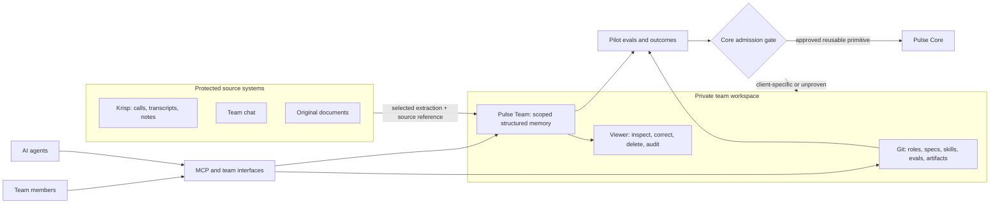

# Pulse Team Pilot — two-loop dogfood system

**Date:** 2026-07-10

**Status:** Product framing approved; written design awaiting review

**Release stage:** Internal team pilot on top of the Pulse developer preview

**Working repository name:** `pulse-team-pilot`

## 1. Decision

Build one dogfood system with two connected but separately governed loops:

1. **Pilot loop:** a real small team uses a shared Pulse-backed workspace for
   daily work. Failures, corrections, outcomes, and accepted workflows become
   evidence.
2. **Core loop:** reusable, sanitized primitives may enter Pulse Core only
   through an admission gate: evidence, approved spec, failing eval, trust
   review, implementation, and regression verification.

The pilot deployment uses three distinct stores:

- a private Git repository for versioned operating artifacts;
- a central Pulse Team service for shared structured memory;
- source systems or a protected source archive for raw recordings, full
  transcripts, and original documents.

Git is not the memory database. Pulse is not the raw archive. Raw history is
not committed to the repository.

## 2. Why this pilot exists

The current Pulse repository proves a local, state-aware memory engine for AI
agents. It does not yet prove a multi-user team product, remote team control
plane, business connectors, or a self-improving workflow product.

The pilot closes that gap using the smallest real environment that exercises
all of the important boundaries:

- multiple people;
- multiple agents and harnesses;
- shared and private context;
- one real recurring workflow;
- source-backed retrieval;
- human correction;
- deletion and revocation;
- evidence promotion from client-specific learning into reusable Core work.

The team is the first customer. The pilot is simultaneously a useful working
environment, a product proof, and a requirements generator.

## 3. Product framing

### User

A small team whose members already use AI successfully, but work across
separate chats, agents, tools, and files.

### Situation

The team has a real process that already produces acceptable results manually
or through repeated AI prompting. Context, corrections, decisions, and good
examples are fragmented across people and sessions.

### Pain

- Every agent starts with partial context.
- Team members repeat explanations and upload the same references.
- Successful corrections are not reliably reused.
- Nobody can see why a memory or rule affected an answer.
- Shared context can leak into the wrong role or project without explicit
  scope boundaries.
- A client-specific workaround can drift into Pulse Core because it is the
  easiest immediate fix.

### One-sentence value

Give a small team and its agents one governed memory layer that preserves the
right decisions, context, and proven ways of working across sessions, while
showing sources and keeping every change reversible.

### First workflow

`meeting -> evidence map -> product one-pager -> human challenge -> revision -> candidate procedure`

This workflow is the first proof inside the pilot. It is not the full product
boundary.

## 4. Chosen architecture

### 4.1 Private Git repository

The repository is the versioned operating layer. It contains:

- team map and non-sensitive role definitions;
- project and workflow boundaries;
- skills and procedures that humans can inspect;
- product briefs and specifications;
- eval cases and expected outcomes;
- decision records and accepted artifacts;
- connector manifests without credentials;
- the evidence ledger that points to redacted or synthetic fixtures.

It must not contain:

- credentials, tokens, cookies, or private keys;
- raw chats or full transcripts;
- private memory exports;
- unrestricted customer documents;
- local filesystem paths from individual machines;
- generated caches or the live Pulse database.

### 4.2 Central Pulse Team service

The central service is the shared memory layer. The internal pilot requires:

- authenticated human and agent identities;
- explicit membership in the pilot team;
- `personal`, `team`, `project`, `repo`, `agent`, and `session` scopes;
- source-backed structured capsules, assertions, events, decisions, open
  loops, corrections, and candidate procedures;
- provenance for every retrieved item;
- an audit record for writes, corrections, scope changes, and deletion;
- revocation that prevents future access immediately;
- delete/wipe behavior that removes the item from retrieval and derived
  projections;
- an explicit health/mode result so clients know whether they are connected
  to the shared service.

`team` is a planned scope for the pilot. It is not a claim about the current
public Pulse preview.

### 4.3 Protected raw sources

Calls, complete transcripts, chat exports, and original documents remain in
their source systems or in a dedicated protected archive controlled by the
team.

Pulse receives only:

- a minimal structured extraction needed for an approved job;
- a stable source reference;
- source time and actor metadata when permitted;
- privacy tier and scope;
- extraction confidence;
- a redacted summary suitable for retrieval.

The source archive and Pulse retention policies are independent. Deleting a
Pulse memory does not silently claim that the original source was deleted.
Deleting an original source must mark derived Pulse items stale or remove them
according to the pilot retention policy.

For the first pilot, Krisp is the source system for calls. Krisp keeps the
recording and full transcript; Pulse keeps the approved structured extraction
and a Krisp meeting/document reference.

### 4.4 Krisp connector boundary

The first call connector uses Krisp's hosted MCP server:

- endpoint: `https://mcp.krisp.ai/mcp`;
- transport: Streamable HTTP only;
- authentication: OAuth 2.0 Authorization Code with PKCE;
- access: each connection is limited by the authenticated Krisp workspace
  user's permissions;
- supported read path: `search_meetings` returns meeting metadata, summaries,
  key points, and action items; `get_document` can fetch the full meeting or
  transcript by its 32-character document ID;
- related tools may expose action items, activities, and upcoming meetings,
  but they do not enter Pulse until a workflow explicitly needs them.

The nucleus uses a user-selected pull through Krisp MCP. It must not sweep the
workspace or import every historical meeting.

After identity, scope, provenance, and deletion gates pass, Krisp's Webhook API
may provide automatic events when a transcript, notes, or outline is created.
The webhook receiver must:

- authenticate the request using a secret header stored outside Git;
- treat Krisp's unique event ID as an idempotency key;
- accept only configured event types;
- retain meeting ID, document ID, link, and event ID as source provenance;
- avoid persisting the full webhook payload in Pulse or application logs;
- publish only a structured candidate extraction after scope resolution;
- require review when the meeting cannot be mapped safely to a project/team
  scope;
- keep Krisp as the source of record for the recording and transcript.

Krisp-generated summaries and action items are source material, not trusted
Pulse facts by default. They pass through the same extraction, confidence,
scope, and correction rules as any other source.

## 5. Interfaces

### Required in the first vertical slice

1. **MCP client path** for two team members using separate agent sessions or
   machines.
2. **Onboarding command or guided flow** that establishes identity, role,
   project membership, allowed scopes, and the first approved workflow.
3. **Selected Krisp meeting ingest** through Krisp MCP: search for a consented
   meeting, fetch it by document ID, extract structured candidates in the host,
   and retain Krisp provenance. No background bulk capture.
4. **Viewer/admin surface** for memory inspection, source evidence, correction,
   scope change, access revocation, and deletion.
5. **Repository workflow** for specs, evals, accepted procedures, and human
   review.

### Deferred until the nucleus works

- automatic Telegram history capture;
- automatic Krisp webhook ingest;
- email, CRM, calendar, and cloud-drive connectors;
- mobile consumer application;
- self-service multi-tenant signup;
- billing and commercial license automation;
- whole-company or multi-department rollout.

Telegram can become the first conversational team interface after the MCP
nucleus proves identity, scope, provenance, and deletion.

Call recording and transcription are not Pulse implementation work in this
pilot; Krisp already owns that job.

## 6. Team and access model

### Identities

- **Human:** one accountable team member.
- **Agent:** a separately identifiable agent acting for one human or one
  approved team workflow.
- **Service:** an ingest or automation identity with the narrowest possible
  write permission.

An agent never inherits access merely because it runs on a team member's
machine. Every call carries an authenticated actor and effective scope.

### Pilot roles

- **Owner:** manages membership, roles, source connections, retention, and
  destructive team-wide operations.
- **Member:** reads and writes within assigned projects and shared team scope.
- **Reviewer:** confirms, corrects, rejects, or promotes candidate memories and
  procedures; cannot change infrastructure secrets.
- **Service:** writes only the object types and scopes required by its connector.

One person may hold both Owner and Reviewer roles in the nucleus. The roles
remain distinct in the audit model.

### Default visibility

- New host-extracted work is `personal` or `project`, never automatically
  `team`.
- Promotion to `team` requires an explicit workflow rule or human approval.
- Private material never becomes a team procedure through aggregate learning.
- Retrieval returns only objects visible to both the actor and the active
  project context.

## 7. The two loops

### 7.1 Pilot learning loop

For each real run:

1. Record the job, inputs, approved sources, expected output, and baseline.
2. Run the current workflow.
3. Capture tool results and structured retrieval traces, not hidden reasoning.
4. Collect explicit human accept, correct, or reject feedback.
5. Record outcome metrics and the smallest explanation of failure or success.
6. Propose a scoped memory, rule, eval case, or candidate procedure.
7. Re-run against the same acceptance boundary.
8. Keep the change only if it improves the result without violating trust
   gates.

Pilot learning remains inside the team workspace by default.

### 7.2 Core improvement loop

A pilot observation can enter the Core backlog when it is either:

- reproduced in at least two independent real runs; or
- a single high-severity security, privacy, deletion, corruption, or
  cross-scope failure.

Core admission then requires:

1. A sanitized evidence record with no team-private content.
2. A clear statement of the reusable primitive.
3. An approved specification and explicit non-goals.
4. A failing eval that reproduces the gap.
5. Implementation isolated from client configuration.
6. Regression verification across existing local-preview and trust gates.
7. Documentation that distinguishes shipped, preview, and planned behavior.

No pilot agent may directly modify Pulse Core based only on an observed result.

## 8. First proof sequence

The first proof happens before automatic connectors or bulk import:

1. Create the private pilot repository with no real memory content.
2. Deploy one private central team environment controlled by the pilot owner.
3. Onboard two humans and at least one separately identified agent per human.
4. Connect one pilot member to the official Krisp MCP endpoint through OAuth,
   find one selected consented meeting with `search_meetings`, and fetch its
   source document with `get_document`.
5. Ask from two separate agent sessions: "What did we decide, what remains
   open, and what should I do next?"
6. Return the same shared decisions, role-appropriate next actions, and visible
   Krisp meeting/document references.
7. Prove that a personal capsule is invisible to the other member.
8. Correct one memory and prove that the correction supersedes the old claim.
9. Delete one shared memory and prove it disappears from recall, context query,
   resume, viewer projections, and future procedure proposals.
10. Disconnect the shared service and prove clients report an explicit degraded
    state instead of silently switching to another store.
11. Run the meeting-to-offer workflow and have a human accept or reject the
    output against written criteria.
12. Re-run the workflow on a second meeting and measure whether the accepted
    corrections reduced iteration count without losing quality.

## 9. Success metrics

### Trust gates — all must pass

- Zero cross-scope retrieval in the pilot eval set.
- Every surfaced shared item has a usable source reference.
- Delete removes the item from every retrieval and projection surface under
  test.
- Revoked identities cannot read or write after revocation.
- Shared-service failure is visible; there is no silent local/remote fallback
  or dual-write.
- No raw transcript, secret, credential, or local path enters the Pulse store
  or pilot Git repository.
- Replaying the same Krisp webhook event does not create duplicate memories.

### Workflow outcomes

- Human acceptance rate of the offer artifact.
- Number of correction rounds before acceptance.
- Elapsed time from selected source to accepted artifact.
- Tokens and model cost per accepted artifact.
- Factual/source errors per run.
- Repeated correction rate: how often a previously accepted correction must be
  restated.
- Resume usefulness: whether a fresh agent session identifies the correct
  decision and next step without manual re-explanation.

Quality and trust outrank token savings. A cheaper wrong result is a failure.

## 10. Failure behavior

- **Central service unavailable:** reads and writes fail with an explicit
  shared-memory-unavailable state. Clients may continue ordinary work, but
  must not claim shared continuity and must not write to a silent substitute.
- **Authentication or scope failure:** deny the operation and identify the
  missing permission without exposing the protected object.
- **Connector/extraction failure:** quarantine the attempted ingest; publish no
  partial memory as trusted fact.
- **Krisp authorization expiry:** stop Krisp reads, retain existing Pulse
  provenance, and ask the affected user to re-authenticate. Never borrow
  another member's OAuth token.
- **Duplicate or reordered Krisp webhook:** deduplicate by event ID and source
  document ID; do not create a second memory or silently regress a newer
  reviewed extraction.
- **Conflicting claims:** preserve both sources, mark the conflict, and require
  a reviewer or a defined supersession rule. Never silently choose the latest
  text.
- **Missing source:** mark the memory unsupported or stale; do not present it as
  source-backed.
- **Deletion failure:** keep the item inaccessible, surface an incomplete-delete
  error to the Owner, and retry derived-projection cleanup. Never report
  success before all tested projections are clean.
- **Procedure regression:** revert to the last accepted version and retain the
  failed variant only as eval evidence.

## 11. Trust and deployment boundary

- The public Pulse Local Preview remains local-first and is not relabeled as a
  team product.
- The pilot is an explicit opt-in remote/shared deployment with different
  trust assumptions.
- The pilot runs in one dedicated private environment controlled by the pilot
  owner. Provider choice is deployment configuration, not product behavior.
- Network access requires authenticated encrypted transport.
- Secrets live in the deployment secret store, never in Git or memory.
- Krisp access and refresh tokens are stored per authenticated user in the
  encrypted credential store. They are never shared through the team repo or
  copied into Pulse capsules.
- Krisp is a cloud source system. Enabling the connector is explicit consent to
  read selected meeting data from Krisp; the pilot must not describe this path
  as no-egress or fully local.
- Real sensitive data is not ingested until identity, scope isolation, audit,
  source inspection, correction, deletion, and revocation pass synthetic tests.
- There is no implicit dual-write between local and remote Pulse stores.
- A future local/on-prem team deployment must preserve the same MCP and object
  contracts while changing only placement and operational ownership.

## 12. Ownership boundary

- **Pulse Core owns:** structured memory contracts, scoped retrieval,
  provenance, continuity, correction/delete semantics, and portable MCP
  behavior.
- **Pilot workspace owns:** team-specific roles, workflows, connectors, evals,
  artifacts, and operating rules.
- **Source systems own:** Krisp recordings/transcripts, original documents, and
  their native retention/access rules.
- **Human reviewers own:** promotion of personal/project learning to team rules
  and admission of sanitized primitives into the Core backlog.

The external commercial brand is a separate decision. This internal pilot may
use the working Pulse name without deciding how the packaged offer is branded.

## 13. Non-goals

- Production readiness or a public SLA.
- A universal AI operating system for every department.
- Automatic capture of every conversation.
- Bulk import of historical chats by default.
- Replacing Git, chat, document storage, CRM, or call-recording systems.
- Building a new call recorder or transcription engine; Krisp supplies both.
- Fully autonomous skill promotion or Core modification.
- Fixing a business process that has never produced a valid result manually.
- Multi-tenant billing, public signup, or enterprise compliance certification.
- Optimizing benchmark numbers before the real pilot trust gates pass.

## 14. Implementation decomposition

This design is too large for one undifferentiated implementation plan. After
written review, implementation should be decomposed in this order:

1. **Team identity, scopes, audit, and explicit remote mode.**
2. **Two-member MCP nucleus with inspect/correct/delete proof.**
3. **Selected Krisp meeting ingest through MCP with OAuth, provenance, and a
   protected raw-source boundary.**
4. **Meeting-to-offer workflow and eval ledger.**
5. **Candidate procedure review and pilot-to-Core admission workflow.**
6. **Krisp webhook ingest with idempotency and review quarantine.**
7. **Telegram interface.**
8. **Additional connectors and team expansion.**

Each increment receives its own approved spec, failing evals, implementation
plan, verification, and rollback path.

## 15. Written review checklist

The reviewer should reject this design if it:

- treats Git as the live memory database;
- stores raw team transcripts in Pulse by default;
- claims current Pulse already supports multi-user team memory;
- allows silent local/remote fallback or dual-write;
- lacks source evidence, deletion, revocation, or scope-isolation proof;
- lets a client-specific workaround enter Core without the admission gate;
- starts with automatic channel capture before the two-member nucleus works;
- optimizes cost while degrading accepted output quality.

## 16. Verified Krisp integration facts

Verified against Krisp's official documentation on 2026-07-10:

- [Krisp MCP](https://help.krisp.ai/hc/en-us/articles/25396920405148-Krisp-MCP)
- [Krisp MCP supported tools](https://help.krisp.ai/hc/en-us/articles/25416265429660-Krisp-MCP-Supported-tools)
- [Krisp MCP client integration](https://help.krisp.ai/hc/en-us/articles/25416400191004-Krisp-MCP-Integrating-your-own-MCP-client)
- [Krisp Webhook API](https://help.krisp.ai/hc/en-us/articles/24514911804316-Webhook-API)
- [Krisp recording behavior](https://help.krisp.ai/hc/en-us/articles/11734566901788-Recording-your-meetings-with-Krisp)
